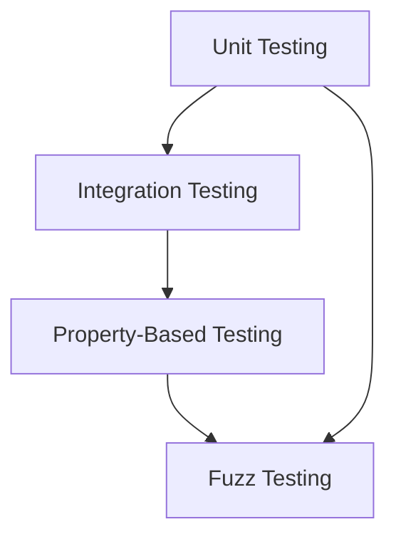

## 22.14. Best Practices in Testing Rust Applications

Testing is a critical component of software development, ensuring that applications are reliable, maintainable, and free of defects. In Rust, with its strong emphasis on safety and performance, testing becomes even more crucial. This section will delve into the best practices for testing Rust applications, covering various testing strategies, maintaining a healthy test suite, and fostering a culture of continuous improvement.

### Understanding Testing Strategies

Before diving into best practices, let's briefly summarize the key testing strategies in Rust:

1. **Unit Testing**: Focuses on testing individual components or functions in isolation. Rust's built-in test framework makes it easy to write and run unit tests.

2. **Integration Testing**: Tests the interaction between different components or modules. These tests ensure that the system works as a whole.

3. **Property-Based Testing**: Uses properties or invariants to generate test cases automatically. Libraries like `proptest` help in implementing this strategy.

4. **Fuzz Testing**: Involves feeding random data to the application to uncover unexpected behavior or crashes. `cargo-fuzz` is a popular tool for fuzz testing in Rust.

### Key Testing Strategies

#### Unit Testing

Unit testing is the foundation of any testing strategy. It involves testing individual functions or methods to ensure they work as expected. Rust provides a built-in test framework that makes writing unit tests straightforward.

```rust
#[cfg(test)]
mod tests {
    use super::*;

    #[test]
    fn test_addition() {
        assert_eq!(add(2, 3), 5);
    }

    fn add(a: i32, b: i32) -> i32 {
        a + b
    }
}
```

In this example, we define a simple `add` function and a corresponding unit test to verify its correctness. The `#[test]` attribute marks the function as a test, and `assert_eq!` is used to check the expected outcome.

#### Integration Testing

Integration tests verify that different parts of the application work together as expected. In Rust, integration tests are placed in the `tests` directory at the root of the project.

```rust
// tests/integration_test.rs
use my_crate::add;

#[test]
fn test_integration_addition() {
    assert_eq!(add(2, 3), 5);
}
```

Integration tests are compiled as separate binaries, allowing them to test the public API of your crate.

#### Property-Based Testing

Property-based testing involves defining properties that your code should satisfy and then generating test cases to verify those properties. The `proptest` crate is a popular choice for property-based testing in Rust.

```rust
use proptest::prelude::*;

fn add(a: i32, b: i32) -> i32 {
    a + b
}

proptest! {
    #[test]
    fn test_addition_commutative(a in 0..1000, b in 0..1000) {
        assert_eq!(add(a, b), add(b, a));
    }
}
```

In this example, we define a property that addition should be commutative and use `proptest` to generate test cases automatically.

#### Fuzz Testing

Fuzz testing involves providing random input to your application to uncover unexpected behavior. The `cargo-fuzz` tool is commonly used for fuzz testing in Rust.

To set up fuzz testing, first add `cargo-fuzz` to your project:

```bash
cargo install cargo-fuzz
```

Then, initialize a fuzz target:

```bash
cargo fuzz init
```

Create a fuzz target in `fuzz/fuzz_targets`:

```rust
#![no_main]
use libfuzzer_sys::fuzz_target;

fuzz_target!(|data: &[u8]| {
    // Your fuzzing logic here
});
```

Run the fuzz test:

```bash
cargo fuzz run fuzz_target_name
```

### Consistent Testing Practices

Consistency in testing practices is vital for maintaining a robust codebase. Here are some tips to ensure consistency:

- **Adopt a Testing Framework**: Use Rust's built-in test framework for unit and integration tests. For property-based testing, consider using `proptest`, and for fuzz testing, `cargo-fuzz`.

- **Establish Naming Conventions**: Use clear and descriptive names for test functions. This makes it easier to understand the purpose of each test.

- **Organize Tests Logically**: Group related tests together and use modules to organize them. This improves readability and maintainability.

- **Use Test Fixtures**: When tests require setup or teardown, use test fixtures to avoid code duplication.

### Balancing Test Coverage with Development Velocity

Achieving high test coverage is important, but it should not come at the expense of development velocity. Here are some strategies to balance the two:

- **Prioritize Critical Paths**: Focus on testing the most critical parts of your application first. This ensures that the most important functionality is covered.

- **Use Code Coverage Tools**: Tools like `tarpaulin` can help measure code coverage and identify untested areas.

- **Automate Testing**: Integrate tests into your continuous integration (CI) pipeline to ensure they run automatically with each code change.

- **Review Test Coverage Regularly**: Regularly review test coverage reports to identify gaps and prioritize additional tests.

### Maintaining a Healthy Test Suite

A healthy test suite is essential for long-term project success. Here are some tips to maintain it:

- **Refactor Tests Regularly**: As your codebase evolves, refactor tests to keep them relevant and maintainable.

- **Remove Redundant Tests**: Identify and remove tests that no longer provide value. This reduces maintenance overhead.

- **Monitor Test Performance**: Keep an eye on test execution time and optimize slow tests to improve feedback loops.

- **Document Test Cases**: Document the purpose and expected outcome of each test case. This helps new team members understand the test suite.

### Encouraging a Culture of Testing and Continuous Improvement

Fostering a culture of testing and continuous improvement is crucial for maintaining high-quality software. Here are some ways to encourage this culture:

- **Lead by Example**: Encourage team members to write tests by demonstrating the benefits of a robust test suite.

- **Provide Training and Resources**: Offer training sessions and resources on testing best practices and tools.

- **Celebrate Testing Successes**: Recognize and celebrate achievements related to testing, such as reaching a coverage milestone or catching a critical bug.

- **Encourage Experimentation**: Allow team members to experiment with new testing tools and techniques to find what works best for your project.

### Visualizing Testing Strategies

To better understand the relationship between different testing strategies, let's visualize them using a diagram.



**Diagram Description**: This diagram illustrates the progression from unit testing to integration testing, property-based testing, and fuzz testing. Each strategy builds upon the previous one, providing a comprehensive testing approach.

### Conclusion

Testing is an integral part of the software development process, and Rust provides powerful tools and frameworks to facilitate it. By adopting consistent testing practices, balancing test coverage with development velocity, and fostering a culture of continuous improvement, you can ensure the reliability and maintainability of your Rust applications. Remember, testing is not just a task but a mindset that contributes to the overall quality of your software.

### Try It Yourself

To reinforce your understanding, try modifying the code examples provided in this section. Experiment with different test cases, properties, and fuzz targets to see how they affect the outcome. This hands-on practice will deepen your understanding of testing in Rust.

## Quiz Time!



### What is the primary focus of unit testing in Rust?

- [x] Testing individual functions or methods in isolation
- [ ] Testing the interaction between different components
- [ ] Generating test cases automatically
- [ ] Providing random input to uncover unexpected behavior

> **Explanation:** Unit testing focuses on testing individual functions or methods in isolation to ensure they work as expected.

### Which Rust crate is commonly used for property-based testing?

- [ ] cargo-fuzz
- [x] proptest
- [ ] serde
- [ ] tokio

> **Explanation:** The `proptest` crate is commonly used for property-based testing in Rust.

### What is the purpose of integration testing?

- [ ] Testing individual functions in isolation
- [x] Testing the interaction between different components
- [ ] Generating random test cases
- [ ] Measuring code coverage

> **Explanation:** Integration testing verifies that different parts of the application work together as expected.

### How can you measure code coverage in Rust?

- [ ] Using cargo-fuzz
- [x] Using tarpaulin
- [ ] Using serde
- [ ] Using tokio

> **Explanation:** The `tarpaulin` tool is used to measure code coverage in Rust.

### What is a key benefit of fuzz testing?

- [ ] Testing individual functions in isolation
- [ ] Testing the interaction between components
- [ ] Generating test cases automatically
- [x] Uncovering unexpected behavior with random input

> **Explanation:** Fuzz testing involves providing random input to uncover unexpected behavior or crashes.

### How can you automate testing in Rust?

- [x] Integrate tests into your continuous integration (CI) pipeline
- [ ] Write tests manually for each code change
- [ ] Use cargo-fuzz for all tests
- [ ] Avoid using any testing framework

> **Explanation:** Automating tests by integrating them into your CI pipeline ensures they run automatically with each code change.

### What should you do to maintain a healthy test suite?

- [x] Refactor tests regularly
- [ ] Avoid removing redundant tests
- [ ] Ignore test performance
- [ ] Document test cases only when necessary

> **Explanation:** Regularly refactoring tests, removing redundant ones, monitoring performance, and documenting test cases help maintain a healthy test suite.

### Which testing strategy involves defining properties that code should satisfy?

- [ ] Unit Testing
- [ ] Integration Testing
- [x] Property-Based Testing
- [ ] Fuzz Testing

> **Explanation:** Property-based testing involves defining properties that code should satisfy and generating test cases to verify those properties.

### What is a key aspect of fostering a culture of testing?

- [x] Encouraging experimentation with new testing tools
- [ ] Avoiding training sessions on testing
- [ ] Celebrating only development milestones
- [ ] Limiting testing to critical paths

> **Explanation:** Encouraging experimentation with new testing tools and techniques fosters a culture of testing and continuous improvement.

### True or False: Consistent testing practices are not important for maintaining a robust codebase.

- [ ] True
- [x] False

> **Explanation:** Consistent testing practices are vital for maintaining a robust codebase, ensuring reliability and maintainability.



Remember, this is just the beginning. As you progress, you'll build more complex and interactive applications. Keep experimenting, stay curious, and enjoy the journey!
