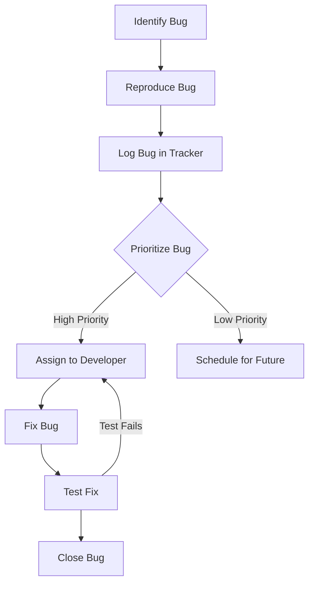

## 22.15. Regression Testing and Bug Tracking

In the world of software development, ensuring that your code remains reliable and bug-free is a continuous challenge. As we introduce new features or make changes to existing code, there's always a risk of inadvertently reintroducing previously fixed bugs. This is where **regression testing** and **bug tracking** come into play. In this section, we'll explore these concepts in depth, focusing on their application in Rust development.

### What is Regression Testing?

**Regression testing** is a type of software testing that ensures that recent code changes have not adversely affected existing functionalities. The primary goal is to catch any bugs that may have been reintroduced after modifications, ensuring that the software continues to perform as expected.

#### Importance of Regression Testing

1. **Maintaining Software Quality**: Regression testing helps maintain the quality of the software by ensuring that new changes do not break existing functionality.
2. **Cost-Effective**: Identifying and fixing bugs early in the development process is generally more cost-effective than addressing them after deployment.
3. **Confidence in Code Changes**: Developers can make changes with greater confidence, knowing that regression tests will catch any unintended side effects.
4. **Continuous Integration**: Regression tests are integral to continuous integration (CI) pipelines, ensuring that every code change is tested automatically.

### Writing Regression Tests in Rust

To effectively implement regression testing, it's crucial to write tests that capture previous bugs. Here's how you can do that in Rust:

#### Identifying and Capturing Bugs

1. **Reproduce the Bug**: The first step is to reproduce the bug in a controlled environment. This often involves writing a test case that fails due to the bug.
2. **Write a Test Case**: Once the bug is reproduced, write a test case that captures the bug. This test should fail until the bug is fixed.

```rust
#[cfg(test)]
mod tests {
    use super::*;

    #[test]
    fn test_bug_fix() {
        // Example: Assume we had a bug in a function `calculate_sum`
        let result = calculate_sum(vec![1, 2, 3]);
        assert_eq!(result, 6, "The sum should be 6");
    }
}
```

#### Integrating Regression Tests into the Test Suite

1. **Organize Tests**: Keep regression tests organized within your test suite. You might want to categorize them based on modules or features.
2. **Automate Testing**: Use Rust's built-in testing framework and tools like `cargo test` to automate the execution of regression tests.
3. **Continuous Integration**: Integrate regression tests into your CI pipeline to ensure they are run automatically with every code change.

### Bug Tracking: Tools and Practices

Effective bug tracking is essential for managing and prioritizing bugs. Here are some tools and practices to consider:

#### Tools for Bug Tracking

1. **Issue Trackers**: Tools like GitHub Issues, JIRA, and Bugzilla are popular for tracking bugs and feature requests.
2. **Tagging and Categorization**: Use tags to categorize bugs by severity, module, or type. This helps in prioritizing and managing them effectively.

#### Practices for Bug Tracking

1. **Prioritize Bugs**: Not all bugs are created equal. Prioritize them based on severity and impact on the project.
2. **Systematic Addressing**: Develop a systematic approach to addressing bugs. This might involve assigning them to specific team members or scheduling them for future sprints.
3. **Regular Reviews**: Conduct regular reviews of the bug tracker to ensure that high-priority bugs are being addressed promptly.

### Prioritizing and Addressing Reported Bugs

1. **Severity and Impact**: Evaluate the severity and impact of each bug. Critical bugs that affect core functionality should be prioritized.
2. **Reproducibility**: Focus on bugs that are easily reproducible, as they are more likely to affect users consistently.
3. **User Feedback**: Consider user feedback when prioritizing bugs. Bugs reported by multiple users should be addressed quickly.

### Visualizing the Bug Tracking Process

To better understand the bug tracking process, let's visualize it using a flowchart:



**Figure 1**: A flowchart illustrating the bug tracking process from identification to closure.

### Try It Yourself

To get hands-on experience with regression testing and bug tracking, try the following exercises:

1. **Exercise 1**: Identify a bug in an existing Rust project, reproduce it, and write a regression test to capture it.
2. **Exercise 2**: Set up a simple bug tracking system using GitHub Issues. Log a few sample bugs and practice prioritizing them.

### Knowledge Check

- What is the primary goal of regression testing?
- How can you integrate regression tests into a CI pipeline?
- What are some popular tools for bug tracking?
- How do you prioritize bugs in a project?

### Summary

Regression testing and bug tracking are crucial components of software development, especially in a language like Rust that emphasizes safety and reliability. By implementing effective regression tests and using robust bug tracking practices, you can ensure that your Rust projects remain stable and bug-free.

Remember, this is just the beginning. As you progress, you'll build more complex and reliable systems. Keep experimenting, stay curious, and enjoy the journey!

## Quiz Time!



### What is the primary goal of regression testing?

- [x] To ensure recent code changes have not adversely affected existing functionalities.
- [ ] To test new features.
- [ ] To optimize code performance.
- [ ] To refactor code.

> **Explanation:** Regression testing is focused on ensuring that recent changes do not break existing functionality.

### How can you integrate regression tests into a CI pipeline?

- [x] By automating test execution with every code change.
- [ ] By manually running tests after each deployment.
- [ ] By only testing new features.
- [ ] By using a separate testing environment.

> **Explanation:** Integrating regression tests into a CI pipeline involves automating their execution with every code change to catch issues early.

### Which of the following is a popular tool for bug tracking?

- [x] GitHub Issues
- [ ] Rust Analyzer
- [ ] Cargo
- [ ] Clippy

> **Explanation:** GitHub Issues is a popular tool for tracking bugs and feature requests.

### What should be considered when prioritizing bugs?

- [x] Severity and impact
- [ ] Code complexity
- [ ] Developer preference
- [ ] Code style

> **Explanation:** Bugs should be prioritized based on their severity and impact on the project.

### What is the first step in the bug tracking process?

- [x] Identify the bug
- [ ] Fix the bug
- [ ] Log the bug in the tracker
- [ ] Test the fix

> **Explanation:** The first step is to identify the bug before proceeding with reproduction and logging.

### What is a key benefit of regression testing?

- [x] It helps maintain software quality.
- [ ] It speeds up code compilation.
- [ ] It reduces code size.
- [ ] It simplifies code logic.

> **Explanation:** Regression testing helps maintain software quality by ensuring changes do not break existing functionality.

### How can bugs be categorized in a bug tracker?

- [x] By severity, module, or type
- [ ] By developer name
- [ ] By code length
- [ ] By code style

> **Explanation:** Categorizing bugs by severity, module, or type helps in prioritizing and managing them effectively.

### What is a common practice for addressing bugs?

- [x] Systematic addressing
- [ ] Random selection
- [ ] Ignoring minor bugs
- [ ] Focusing only on new features

> **Explanation:** Systematic addressing involves a structured approach to fixing bugs, ensuring high-priority issues are resolved first.

### What is the role of user feedback in bug tracking?

- [x] It helps prioritize bugs.
- [ ] It is not relevant.
- [ ] It complicates the process.
- [ ] It is only used for feature requests.

> **Explanation:** User feedback is valuable for prioritizing bugs, especially those reported by multiple users.

### True or False: Regression tests should only be run manually.

- [ ] True
- [x] False

> **Explanation:** Regression tests should be automated and integrated into the CI pipeline to ensure they are run consistently with every code change.


