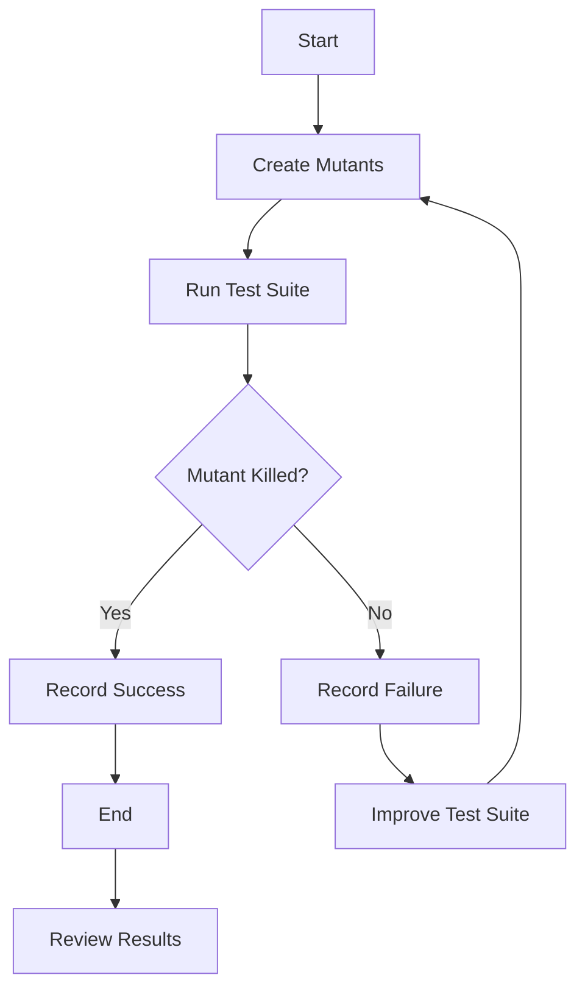

## 22.16. Mutation Testing in Rust

Mutation testing is a powerful technique used to evaluate the quality of a test suite by introducing small changes, or "mutations," to the code and checking if the tests can detect these changes. This process helps identify weaknesses in the test suite and guides improvements to ensure robust code coverage and error detection.

### What is Mutation Testing?

Mutation testing involves making small, deliberate changes to a program's source code to create "mutants." These mutants are then tested against the existing test suite. If the test suite fails to detect the changes (i.e., the tests pass despite the mutation), it indicates a potential weakness in the tests. The goal is to "kill" the mutants, meaning the tests should fail when a mutation is introduced, demonstrating that the tests are sensitive to changes in the code.

#### Key Concepts

- **Mutants**: Variations of the original code with small changes.
- **Killing a Mutant**: When a test fails due to a mutation, indicating the test suite's effectiveness.
- **Surviving Mutant**: A mutant that passes the test suite, suggesting a gap in test coverage.

### Why Use Mutation Testing?

Mutation testing provides insights into the effectiveness of your test suite beyond simple code coverage metrics. It helps ensure that tests are not only present but also meaningful and capable of catching real-world bugs. By identifying weak spots in the test suite, developers can focus on writing more comprehensive tests, ultimately leading to higher code quality and reliability.

### Mutation Testing Tools for Rust

In Rust, one of the prominent tools for mutation testing is the `mutagen` crate. `mutagen` automates the process of generating mutants and running tests against them, making it easier to integrate mutation testing into your development workflow.

#### Introducing `mutagen`

[`mutagen`](https://github.com/llogiq/mutagen) is a mutation testing framework for Rust that modifies your code to create mutants and evaluates your test suite's ability to detect these changes. It supports various mutation operators, such as changing arithmetic operators, modifying logical conditions, and altering control flow.

### Running Mutation Tests with `mutagen`

Let's walk through an example of using `mutagen` to perform mutation testing on a simple Rust project.

#### Step 1: Set Up Your Rust Project

First, ensure you have a Rust project set up with a test suite. For demonstration purposes, let's create a simple Rust project with a basic function and corresponding tests.

```rust
// src/lib.rs

pub fn add(a: i32, b: i32) -> i32 {
    a + b
}

#[cfg(test)]
mod tests {
    use super::*;

    #[test]
    fn test_add() {
        assert_eq!(add(2, 3), 5);
        assert_eq!(add(-1, 1), 0);
    }
}
```

#### Step 2: Add `mutagen` to Your Project

Add `mutagen` as a dependency in your `Cargo.toml` file.

```toml
[dev-dependencies]
mutagen = "0.1"
```

#### Step 3: Annotate Your Code

Annotate the functions you want to mutate with the `#[mutate]` attribute provided by `mutagen`.

```rust
// src/lib.rs

#[mutagen::mutate]
pub fn add(a: i32, b: i32) -> i32 {
    a + b
}
```

#### Step 4: Run Mutation Tests

Use the `cargo mutagen` command to run mutation tests. This command will generate mutants and execute your test suite against them.

```bash
cargo mutagen
```

#### Interpreting Results

After running the mutation tests, `mutagen` will provide a report indicating which mutants were killed and which survived. A high number of surviving mutants suggests that your test suite may need improvement.

### Limitations and Challenges of Mutation Testing

While mutation testing is a valuable tool, it comes with certain limitations and challenges:

- **Performance Overhead**: Mutation testing can be computationally expensive, as it involves running the test suite multiple times for each mutant.
- **False Positives/Negatives**: Some mutants may survive due to limitations in the mutation operators or the nature of the code, leading to false positives or negatives.
- **Complexity**: Interpreting mutation testing results can be complex, especially for large codebases with extensive test suites.

### Improving Test Suites with Mutation Testing

Mutation testing can guide improvements in your test suite by highlighting areas where tests are insufficient. Consider the following strategies to enhance your test suite based on mutation testing results:

- **Increase Test Coverage**: Write additional tests to cover scenarios where mutants survived.
- **Refactor Tests**: Improve existing tests to make them more robust and sensitive to code changes.
- **Review Mutation Operators**: Ensure that the mutation operators used are relevant to the code being tested.

### Visualizing Mutation Testing Workflow

To better understand the mutation testing process, let's visualize the workflow using a flowchart.



**Figure 1**: Mutation Testing Workflow

### Conclusion

Mutation testing is a powerful technique for evaluating and improving the quality of your test suite in Rust. By using tools like `mutagen`, you can identify weaknesses in your tests and make informed decisions to enhance code reliability. Remember, this is just the beginning. As you integrate mutation testing into your workflow, you'll gain deeper insights into your test suite's effectiveness and continue to improve your Rust programming skills.

### References and Further Reading

- [Mutagen GitHub Repository](https://github.com/llogiq/mutagen)
- [Rust Programming Language](https://www.rust-lang.org/)
- [Mutation Testing Concepts](https://en.wikipedia.org/wiki/Mutation_testing)

## Quiz Time!



### What is the primary goal of mutation testing?

- [x] To evaluate the effectiveness of a test suite by introducing code changes and ensuring tests detect them.
- [ ] To increase code coverage by adding more tests.
- [ ] To refactor code for better performance.
- [ ] To automate the testing process.

> **Explanation:** Mutation testing aims to assess the quality of a test suite by introducing small changes to the code and checking if the tests can detect these changes.

### Which Rust crate is commonly used for mutation testing?

- [x] mutagen
- [ ] serde
- [ ] tokio
- [ ] rayon

> **Explanation:** The `mutagen` crate is a popular tool for performing mutation testing in Rust.

### What does it mean when a mutant "survives" in mutation testing?

- [ ] The test suite successfully detects the mutation.
- [x] The test suite fails to detect the mutation.
- [ ] The mutation is irrelevant to the code.
- [ ] The mutation causes a runtime error.

> **Explanation:** A surviving mutant indicates that the test suite did not detect the mutation, suggesting a potential gap in test coverage.

### What is a potential limitation of mutation testing?

- [ ] It is easy to interpret results.
- [ ] It requires no additional tools.
- [x] It can be computationally expensive.
- [ ] It guarantees 100% test coverage.

> **Explanation:** Mutation testing can be computationally expensive because it involves running the test suite multiple times for each mutant.

### How can mutation testing guide improvements in a test suite?

- [x] By identifying areas where tests are insufficient.
- [ ] By automatically generating new tests.
- [ ] By reducing the number of tests needed.
- [ ] By optimizing code performance.

> **Explanation:** Mutation testing highlights areas where the test suite may be lacking, guiding developers to write more comprehensive tests.

### What is the purpose of the `#[mutate]` attribute in `mutagen`?

- [ ] To optimize code for performance.
- [x] To mark functions for mutation testing.
- [ ] To exclude functions from testing.
- [ ] To generate documentation.

> **Explanation:** The `#[mutate]` attribute is used to annotate functions that should be subjected to mutation testing with `mutagen`.

### What does "killing a mutant" mean in mutation testing?

- [x] The test suite fails due to the mutation.
- [ ] The mutant causes a runtime error.
- [ ] The mutant is ignored by the test suite.
- [ ] The mutant is removed from the codebase.

> **Explanation:** Killing a mutant means that the test suite detects the mutation and fails, indicating the test's effectiveness.

### What is a common challenge when interpreting mutation testing results?

- [ ] Results are always clear and straightforward.
- [x] Results can be complex, especially for large codebases.
- [ ] Results are irrelevant to test quality.
- [ ] Results automatically improve code performance.

> **Explanation:** Interpreting mutation testing results can be complex, particularly for large codebases with extensive test suites.

### Which of the following is NOT a benefit of mutation testing?

- [ ] Identifying weak spots in the test suite.
- [ ] Ensuring tests are meaningful and effective.
- [x] Automatically fixing code bugs.
- [ ] Improving code reliability.

> **Explanation:** Mutation testing does not automatically fix code bugs; it helps identify weaknesses in the test suite.

### Mutation testing is only useful for small projects.

- [ ] True
- [x] False

> **Explanation:** Mutation testing is valuable for projects of all sizes, as it helps ensure test suite effectiveness and code reliability.




