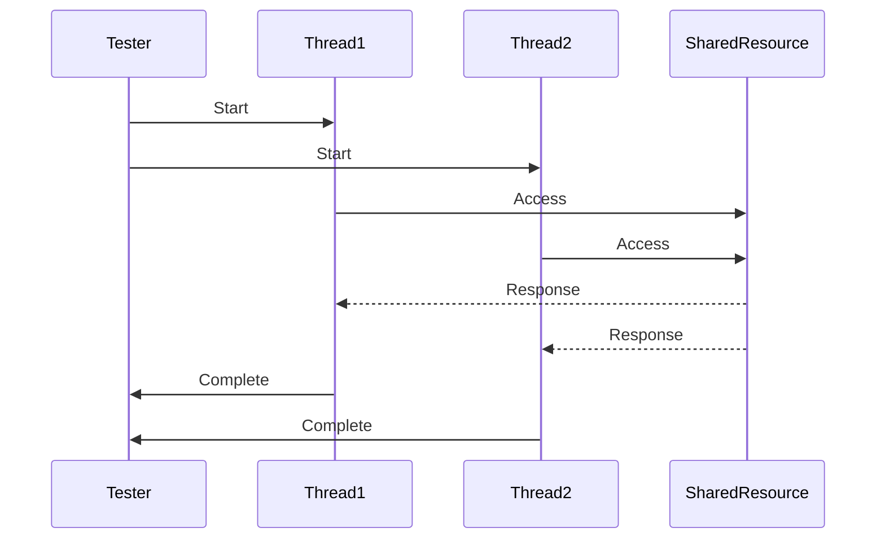

## 22.17. Testing Patterns in Concurrency

Concurrency in Rust offers powerful capabilities for building efficient and responsive applications. However, testing concurrent code presents unique challenges, such as race conditions, non-determinism, and ensuring the correctness of synchronization mechanisms. In this section, we will delve into techniques and best practices for testing concurrent Rust code, ensuring that your multi-threaded and asynchronous applications are robust and reliable.

### Understanding the Challenges of Testing Concurrent Code

Testing concurrent code is inherently more complex than testing sequential code due to the following challenges:

- **Race Conditions**: Occur when multiple threads access shared data simultaneously, leading to unpredictable behavior.
- **Non-determinism**: The order of thread execution can vary, making it difficult to reproduce bugs.
- **Deadlocks**: Arise when two or more threads are waiting indefinitely for resources held by each other.
- **Complex State Management**: Shared state must be carefully managed to avoid inconsistencies.

To effectively test concurrent code, we need strategies to simulate these scenarios and detect potential issues.

### Strategies for Testing Concurrent Code

#### 1. Simulating Concurrent Scenarios

Simulating concurrent scenarios involves creating test cases that mimic real-world usage patterns. This can be achieved by:

- **Using Multiple Threads**: Spawn multiple threads to perform operations on shared resources.
- **Introducing Delays**: Use sleep or yield functions to alter the timing of thread execution, increasing the likelihood of exposing race conditions.
- **Randomized Scheduling**: Randomly change the order of operations to test different interleavings.

#### 2. Detecting Race Conditions

Race conditions can be elusive and difficult to detect. Here are some strategies to uncover them:

- **Data Race Detection Tools**: Use tools like `loom` to model and test different thread interleavings.
- **Assertions and Invariants**: Embed assertions in your code to check for expected conditions.
- **Logging and Tracing**: Implement detailed logging to trace the sequence of operations and identify anomalies.

### Using the `loom` Crate for Concurrency Testing

The `loom` crate is a powerful tool for testing concurrent Rust code. It allows you to model and explore different thread interleavings, helping to uncover subtle concurrency bugs.

#### How `loom` Works

`loom` works by simulating the execution of threads and systematically exploring all possible interleavings. This exhaustive approach can reveal race conditions and other concurrency issues that might not surface during normal execution.

#### Example: Using `loom` to Test a Concurrent Data Structure

Let's consider a simple example of using `loom` to test a concurrent stack implementation:

```rust
use loom::thread;
use loom::sync::Arc;
use loom::sync::Mutex;

struct Stack<T> {
    data: Mutex<Vec<T>>,
}

impl<T> Stack<T> {
    fn new() -> Self {
        Stack {
            data: Mutex::new(Vec::new()),
        }
    }

    fn push(&self, value: T) {
        let mut data = self.data.lock().unwrap();
        data.push(value);
    }

    fn pop(&self) -> Option<T> {
        let mut data = self.data.lock().unwrap();
        data.pop()
    }
}

#[test]
fn test_concurrent_stack() {
    loom::model(|| {
        let stack = Arc::new(Stack::new());

        let stack1 = stack.clone();
        let t1 = thread::spawn(move || {
            stack1.push(1);
        });

        let stack2 = stack.clone();
        let t2 = thread::spawn(move || {
            stack2.push(2);
        });

        t1.join().unwrap();
        t2.join().unwrap();

        let stack3 = stack.clone();
        let t3 = thread::spawn(move || {
            assert!(stack3.pop().is_some());
        });

        t3.join().unwrap();
    });
}
```

In this example, `loom::model` is used to explore different interleavings of the `push` and `pop` operations on the stack. This helps ensure that the stack behaves correctly under concurrent access.

### Best Practices for Writing Concurrent Tests

#### 1. Ensure Determinism

- **Control Execution Order**: Use synchronization primitives like barriers or channels to control the order of operations in tests.
- **Use Mock Objects**: Replace real dependencies with mock objects to isolate the code under test and control its behavior.

#### 2. Test Synchronization Mechanisms

- **Lock Contention**: Test scenarios with high lock contention to ensure that locks are correctly implemented and do not lead to deadlocks.
- **Atomic Operations**: Verify that atomic operations are used correctly and do not introduce race conditions.

#### 3. Test Shared State Access

- **Isolation**: Ensure that tests do not share state unless explicitly testing shared state access.
- **State Validation**: Validate the state of shared resources after concurrent operations to ensure consistency.

### Encouraging Thorough Testing

Thorough testing of concurrent code is essential to ensure reliability and correctness. Here are some additional tips:

- **Automate Tests**: Use continuous integration to run tests automatically and frequently.
- **Stress Testing**: Perform stress tests with high concurrency levels to uncover performance bottlenecks and race conditions.
- **Code Reviews**: Conduct code reviews with a focus on concurrency issues to catch potential problems early.

### Visualizing Concurrency Testing

To better understand the flow of concurrent testing, let's visualize the process using a sequence diagram:



This diagram illustrates the interaction between the tester, threads, and shared resources during a concurrent test.

### References and Further Reading

- [Loom GitHub Repository](https://github.com/tokio-rs/loom)
- [Rust Concurrency](https://doc.rust-lang.org/book/ch16-00-concurrency.html)
- [Rust Testing Guide](https://doc.rust-lang.org/book/ch11-00-testing.html)

### Knowledge Check

Before we conclude, let's reinforce what we've learned with a few questions and exercises.

- **Question**: What is a race condition, and how can it affect concurrent code?
- **Exercise**: Modify the `loom` example to introduce a race condition and observe the results.
- **Question**: How does `loom` help in testing concurrent Rust code?

### Embrace the Journey

Testing concurrent code in Rust can be challenging, but with the right tools and techniques, you can ensure your applications are robust and reliable. Remember, this is just the beginning. As you continue to explore Rust's concurrency features, you'll gain deeper insights and develop more sophisticated testing strategies. Keep experimenting, stay curious, and enjoy the journey!

## Quiz Time!



### What is a race condition?

- [x] A situation where multiple threads access shared data simultaneously, leading to unpredictable behavior.
- [ ] A condition where a program runs slower than expected.
- [ ] A scenario where a program crashes due to a syntax error.
- [ ] A situation where a program runs faster than expected.

> **Explanation:** A race condition occurs when multiple threads access shared data simultaneously, leading to unpredictable behavior.

### How does the `loom` crate help in testing concurrent Rust code?

- [x] By simulating different thread interleavings to uncover concurrency issues.
- [ ] By providing a faster execution environment for concurrent code.
- [ ] By automatically fixing race conditions in the code.
- [ ] By generating documentation for concurrent code.

> **Explanation:** The `loom` crate simulates different thread interleavings to uncover concurrency issues.

### What is non-determinism in concurrent code?

- [x] The order of thread execution can vary, making it difficult to reproduce bugs.
- [ ] The code always produces the same output regardless of input.
- [ ] The code runs without any errors or warnings.
- [ ] The code is deterministic and predictable.

> **Explanation:** Non-determinism in concurrent code means the order of thread execution can vary, making it difficult to reproduce bugs.

### What is a deadlock?

- [x] A situation where two or more threads are waiting indefinitely for resources held by each other.
- [ ] A condition where a program runs slower than expected.
- [ ] A scenario where a program crashes due to a syntax error.
- [ ] A situation where a program runs faster than expected.

> **Explanation:** A deadlock occurs when two or more threads are waiting indefinitely for resources held by each other.

### Which tool can be used to model and test different thread interleavings in Rust?

- [x] `loom`
- [ ] `cargo`
- [ ] `clippy`
- [ ] `rustfmt`

> **Explanation:** The `loom` crate is used to model and test different thread interleavings in Rust.

### What is the purpose of introducing delays in concurrent tests?

- [x] To alter the timing of thread execution and increase the likelihood of exposing race conditions.
- [ ] To make the tests run faster.
- [ ] To ensure that the tests always pass.
- [ ] To reduce the complexity of the tests.

> **Explanation:** Introducing delays in concurrent tests alters the timing of thread execution, increasing the likelihood of exposing race conditions.

### What is the benefit of using mock objects in concurrent tests?

- [x] To isolate the code under test and control its behavior.
- [ ] To make the tests run faster.
- [ ] To ensure that the tests always pass.
- [ ] To reduce the complexity of the tests.

> **Explanation:** Using mock objects in concurrent tests isolates the code under test and controls its behavior.

### What is lock contention?

- [x] A scenario with high lock contention where locks are correctly implemented and do not lead to deadlocks.
- [ ] A condition where a program runs slower than expected.
- [ ] A scenario where a program crashes due to a syntax error.
- [ ] A situation where a program runs faster than expected.

> **Explanation:** Lock contention is a scenario with high lock contention where locks are correctly implemented and do not lead to deadlocks.

### What is the purpose of stress testing in concurrent code?

- [x] To uncover performance bottlenecks and race conditions.
- [ ] To make the tests run faster.
- [ ] To ensure that the tests always pass.
- [ ] To reduce the complexity of the tests.

> **Explanation:** Stress testing in concurrent code uncovers performance bottlenecks and race conditions.

### True or False: Thorough testing of concurrent code is essential to ensure reliability and correctness.

- [x] True
- [ ] False

> **Explanation:** Thorough testing of concurrent code is essential to ensure reliability and correctness.


