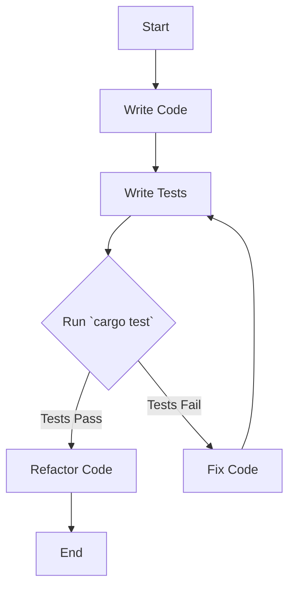

## 22.2. Unit Testing with `cargo test`

Unit testing is a critical component of software development, ensuring that individual parts of your codebase function correctly. Rust provides a powerful built-in testing framework that integrates seamlessly with its package manager, Cargo. In this section, we'll explore how to leverage `cargo test` to write and run unit tests effectively, ensuring your Rust programs are robust and reliable.

### Introduction to `cargo test`

`cargo test` is a command provided by Cargo, Rust's package manager and build system, to run tests in your Rust project. It automatically discovers and executes tests defined in your code, providing a straightforward way to verify the correctness of your functions and modules.

#### Key Features of `cargo test`

- **Automatic Test Discovery**: `cargo test` automatically finds and runs all tests in your project.
- **Integration with Rust's Build System**: Tests are compiled and run as part of the build process, ensuring they are always up-to-date with your code.
- **Support for Unit and Integration Tests**: `cargo test` supports both unit tests (testing individual components) and integration tests (testing multiple components together).

### Writing Unit Tests in Rust

Unit tests in Rust are functions annotated with the `#[test]` attribute. These functions typically assert that certain conditions hold true, using Rust's built-in assertion macros.

#### Basic Structure of a Unit Test

Here's a simple example of a unit test in Rust:

```rust
// A function to add two numbers
fn add(a: i32, b: i32) -> i32 {
    a + b
}

// A unit test for the `add` function
#[cfg(test)]
mod tests {
    use super::*;

    #[test]
    fn test_add() {
        assert_eq!(add(2, 3), 5);
    }
}
```

- **`#[cfg(test)]`**: This attribute tells the compiler to include the module only when running tests.
- **`#[test]`**: This attribute marks a function as a test function.
- **`assert_eq!`**: This macro checks that two expressions are equal. If they are not, the test fails.

### Organizing Tests in Modules and Files

In Rust, tests can be organized within the same file as the code they test or in separate files. This organization helps maintain a clean and manageable codebase.

#### Inline Tests

Inline tests are written in the same file as the code they test, typically at the bottom of the file. This approach is useful for small projects or when tests are closely related to the implementation.

#### Separate Test Modules

For larger projects, it's common to organize tests in separate modules or files. This separation helps keep the codebase organized and makes it easier to manage large numbers of tests.

```rust
// src/lib.rs
pub fn multiply(a: i32, b: i32) -> i32 {
    a * b
}

// tests/multiply_tests.rs
#[cfg(test)]
mod tests {
    use super::*;

    #[test]
    fn test_multiply() {
        assert_eq!(multiply(2, 3), 6);
    }
}
```

### Testing Functions, Methods, and Error Conditions

Rust's testing framework allows you to test various aspects of your code, including functions, methods, and error conditions.

#### Testing Functions and Methods

Testing functions and methods involves calling them with specific inputs and asserting that the outputs match expected results.

```rust
// A struct with a method
struct Calculator;

impl Calculator {
    fn subtract(a: i32, b: i32) -> i32 {
        a - b
    }
}

#[cfg(test)]
mod tests {
    use super::*;

    #[test]
    fn test_subtract() {
        assert_eq!(Calculator::subtract(5, 3), 2);
    }
}
```

#### Testing Error Conditions

Rust's `Result` and `Option` types are commonly used for error handling. You can test error conditions by asserting that a function returns an error or a specific variant of `Option`.

```rust
// A function that returns a Result
fn divide(a: i32, b: i32) -> Result<i32, &'static str> {
    if b == 0 {
        Err("division by zero")
    } else {
        Ok(a / b)
    }
}

#[cfg(test)]
mod tests {
    use super::*;

    #[test]
    fn test_divide() {
        assert_eq!(divide(10, 2), Ok(5));
        assert_eq!(divide(10, 0), Err("division by zero"));
    }
}
```

### Test Assertions, Setup, and Teardown

Rust provides several macros for making assertions in tests, as well as mechanisms for setting up and tearing down test environments.

#### Assertion Macros

- **`assert!`**: Asserts that a condition is true.
- **`assert_eq!`**: Asserts that two expressions are equal.
- **`assert_ne!`**: Asserts that two expressions are not equal.

#### Setup and Teardown

Rust's testing framework doesn't have built-in setup and teardown functions like some other languages. However, you can achieve similar functionality by using the `Drop` trait or by manually setting up and tearing down resources within your test functions.

```rust
struct TestResource;

impl TestResource {
    fn new() -> Self {
        // Setup code here
        TestResource
    }
}

impl Drop for TestResource {
    fn drop(&mut self) {
        // Teardown code here
    }
}

#[cfg(test)]
mod tests {
    use super::*;

    #[test]
    fn test_with_resource() {
        let _resource = TestResource::new();
        // Test code here
    }
}
```

### Best Practices for Effective Unit Testing in Rust

To write effective unit tests in Rust, consider the following best practices:

- **Write Tests Early**: Write tests as you develop your code to catch errors early.
- **Keep Tests Small and Focused**: Each test should focus on a single aspect of the code.
- **Use Descriptive Test Names**: Use names that describe what the test is verifying.
- **Test Edge Cases**: Include tests for edge cases and potential error conditions.
- **Run Tests Frequently**: Use `cargo test` often to ensure your code remains correct as you make changes.

### Visualizing the Testing Process

To better understand the testing process in Rust, let's visualize how `cargo test` interacts with your codebase:



**Figure 1**: The flow of writing and running tests with `cargo test`.

### Try It Yourself

To get hands-on experience with unit testing in Rust, try modifying the examples provided in this section. Experiment with different inputs and edge cases, and observe how the tests behave. This practice will help solidify your understanding of Rust's testing framework.

### References and Further Reading

- [Rust Book - Testing](https://doc.rust-lang.org/book/ch11-00-testing.html)
- [Rust Documentation - Testing](https://doc.rust-lang.org/rust-by-example/testing.html)
- [Cargo Book - Testing](https://doc.rust-lang.org/cargo/guide/tests.html)

### Knowledge Check

- What is the purpose of the `#[test]` attribute in Rust?
- How can you organize tests in a Rust project?
- What are some common assertion macros used in Rust tests?
- How can you handle setup and teardown in Rust tests?
- Why is it important to test edge cases?

### Embrace the Journey

Remember, mastering unit testing in Rust is a journey. As you continue to write and run tests, you'll gain a deeper understanding of your code and improve its quality. Keep experimenting, stay curious, and enjoy the process of building reliable software!

## Quiz Time!



### What command is used to run tests in a Rust project?

- [x] `cargo test`
- [ ] `rustc --test`
- [ ] `cargo run`
- [ ] `rust test`

> **Explanation:** `cargo test` is the command used to run tests in a Rust project.

### Which attribute is used to mark a function as a test in Rust?

- [x] `#[test]`
- [ ] `#[cfg(test)]`
- [ ] `#[testing]`
- [ ] `#[unit_test]`

> **Explanation:** The `#[test]` attribute is used to mark a function as a test in Rust.

### How can you organize tests in a Rust project?

- [x] Inline within the same file
- [x] In separate test modules
- [ ] Only in separate files
- [ ] Only inline

> **Explanation:** Tests can be organized inline within the same file or in separate test modules.

### What does the `assert_eq!` macro do?

- [x] Asserts that two expressions are equal
- [ ] Asserts that a condition is true
- [ ] Asserts that two expressions are not equal
- [ ] Asserts that a value is not `None`

> **Explanation:** The `assert_eq!` macro asserts that two expressions are equal.

### How can you handle setup and teardown in Rust tests?

- [x] Using the `Drop` trait
- [x] Manually within test functions
- [ ] Using `#[setup]` and `#[teardown]` attributes
- [ ] Automatically by the testing framework

> **Explanation:** Setup and teardown can be handled using the `Drop` trait or manually within test functions.

### Why is it important to test edge cases?

- [x] To ensure code handles all possible inputs
- [ ] To make tests run faster
- [ ] To reduce the number of tests
- [ ] To avoid writing documentation

> **Explanation:** Testing edge cases ensures that code handles all possible inputs correctly.

### What is the purpose of the `#[cfg(test)]` attribute?

- [x] To include the module only when running tests
- [ ] To mark a function as a test
- [ ] To exclude the module from tests
- [ ] To configure the test environment

> **Explanation:** The `#[cfg(test)]` attribute includes the module only when running tests.

### What is a best practice for naming test functions?

- [x] Use descriptive names
- [ ] Use short names
- [ ] Use numbers
- [ ] Use random names

> **Explanation:** Using descriptive names helps understand what the test is verifying.

### What is the benefit of running tests frequently?

- [x] To ensure code remains correct as changes are made
- [ ] To increase code complexity
- [ ] To reduce test coverage
- [ ] To avoid writing new tests

> **Explanation:** Running tests frequently ensures that code remains correct as changes are made.

### Is it possible to test error conditions in Rust?

- [x] True
- [ ] False

> **Explanation:** It is possible to test error conditions in Rust using `Result` and `Option`.


