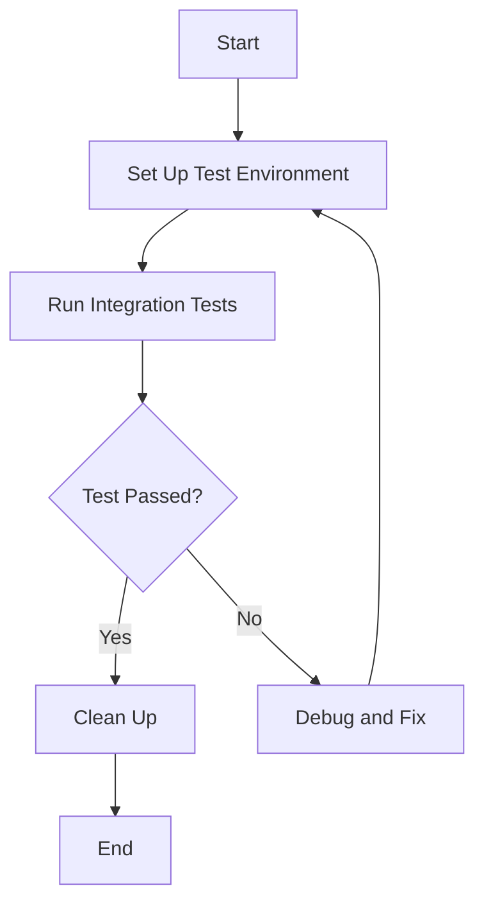

## 22.3. Integration Testing Strategies

Integration testing is a crucial aspect of software development that ensures different components of an application work together as expected. In Rust, integration testing is particularly important due to the language's emphasis on safety and concurrency. This section will guide you through the best practices and techniques for implementing integration tests in Rust, ensuring your application is robust and reliable.

### Understanding the Difference: Unit Tests vs. Integration Tests

Before diving into integration testing strategies, it's essential to understand the distinction between unit tests and integration tests:

- **Unit Tests**: Focus on testing individual components or functions in isolation. They are typically fast, as they don't involve external dependencies or complex setups. Unit tests are great for verifying the correctness of small pieces of code.

- **Integration Tests**: Aim to test the interaction between multiple components or systems. They ensure that different parts of the application work together as intended. Integration tests often involve more complex setups and can include interactions with databases, external services, or other system components.

### Organizing Integration Tests in Rust

In Rust, integration tests are organized differently from unit tests. While unit tests are usually placed within the same file as the code they test, integration tests are placed in a separate `tests/` directory at the root of your project. This separation helps maintain a clear distinction between testing individual components and testing the application as a whole.

#### Setting Up the `tests/` Directory

To set up integration tests in Rust, follow these steps:

1. **Create a `tests/` Directory**: At the root of your Rust project, create a directory named `tests`. This directory will contain all your integration test files.

2. **Add Test Files**: Inside the `tests/` directory, create separate files for different integration tests. Each file should contain one or more test functions.

3. **Use `#[test]` Attribute**: Just like unit tests, integration tests use the `#[test]` attribute to mark test functions.

Here's an example of how to organize integration tests:

```rust
// File: tests/integration_test.rs

#[cfg(test)]
mod tests {
    use super::*;

    #[test]
    fn test_integration_example() {
        // Setup code and test logic here
    }
}
```

### Writing Integration Tests for Public APIs

Integration tests in Rust often focus on testing the public APIs of your application. This approach ensures that the external behavior of your application is correct, even if the internal implementation changes.

#### Example: Testing a Simple API

Let's consider a simple example of testing a public API in Rust. Suppose we have a library that provides a function to add two numbers:

```rust
// File: src/lib.rs

pub fn add(a: i32, b: i32) -> i32 {
    a + b
}
```

We can write an integration test to verify this function:

```rust
// File: tests/addition_test.rs

extern crate my_library; // Replace with your library name

#[cfg(test)]
mod tests {
    use super::*;

    #[test]
    fn test_addition() {
        let result = my_library::add(2, 3);
        assert_eq!(result, 5);
    }
}
```

### Setting Up the Test Environment

Integration tests often require a specific environment setup, including necessary data or configurations. Proper setup ensures that tests run consistently and produce reliable results.

#### Managing Test Data

When dealing with integration tests, it's common to require specific data for testing. Here are some strategies for managing test data:

- **Use Fixtures**: Create fixtures to set up and tear down test data before and after each test. This approach ensures that tests are isolated and do not interfere with each other.

- **Mock External Services**: If your tests interact with external services, consider using mock services to simulate responses. This approach helps avoid dependencies on external systems and ensures tests are repeatable.

#### Configuring the Test Environment

Configuring the test environment is crucial for integration tests. Here are some tips:

- **Environment Variables**: Use environment variables to configure test settings, such as database connections or API endpoints. This approach allows you to easily switch between different environments (e.g., development, testing, production).

- **Setup Scripts**: Create setup scripts to initialize the test environment. These scripts can automate tasks like starting a local server or populating a database with test data.

### Managing Dependencies and External Services

Integration tests often involve dependencies on external services, such as databases or APIs. Managing these dependencies effectively is crucial for reliable testing.

#### Strategies for Managing Dependencies

- **Use Docker**: Docker can be a powerful tool for managing dependencies in integration tests. By running services like databases in Docker containers, you can ensure a consistent environment across different test runs.

- **Service Virtualization**: Consider using service virtualization tools to simulate external services. This approach allows you to test interactions with services without relying on their availability.

- **Dependency Injection**: Use dependency injection to decouple your code from specific implementations. This approach makes it easier to replace real services with mock implementations during testing.

### Importance of Integration Testing

Integration testing plays a vital role in catching issues that unit tests may miss. While unit tests focus on individual components, integration tests ensure that these components work together seamlessly. Here are some key benefits of integration testing:

- **Detecting Interface Issues**: Integration tests can uncover issues related to the interfaces between components, such as incorrect data formats or communication errors.

- **Validating System Behavior**: By testing the application as a whole, integration tests validate the overall behavior and ensure that the system meets its requirements.

- **Ensuring Consistency**: Integration tests help ensure that changes to one part of the system do not break other parts, maintaining consistency across the application.

### Code Example: Integration Test with External Service

Let's look at a more complex example involving an external service. Suppose we have a Rust application that interacts with a REST API. We'll write an integration test to verify this interaction.

```rust
// File: tests/api_integration_test.rs

extern crate my_app; // Replace with your application name

#[cfg(test)]
mod tests {
    use super::*;
    use std::env;

    #[test]
    fn test_api_interaction() {
        // Set up environment variables
        env::set_var("API_ENDPOINT", "http://localhost:8080");

        // Call the function that interacts with the API
        let response = my_app::fetch_data_from_api();

        // Assert the expected outcome
        assert!(response.is_ok());
        assert_eq!(response.unwrap(), "Expected Data");
    }
}
```

### Visualizing Integration Testing Workflow

To better understand the integration testing workflow, let's visualize the process using a flowchart. This diagram illustrates the steps involved in setting up and executing integration tests.



### Knowledge Check

Before we conclude, let's reinforce our understanding with a few questions:

- What is the primary difference between unit tests and integration tests?
- How can Docker be used in integration testing?
- Why is it important to mock external services in integration tests?

### Embrace the Journey

Remember, integration testing is a continuous journey. As your application evolves, so should your tests. Keep experimenting with different strategies, stay curious, and enjoy the process of building robust and reliable software.

### References and Further Reading

- [Rust Book: Testing](https://doc.rust-lang.org/book/ch11-00-testing.html)
- [Rust by Example: Testing](https://doc.rust-lang.org/rust-by-example/testing.html)
- [Cargo: The Rust Package Manager](https://doc.rust-lang.org/cargo/)

## Quiz Time!



### What is the primary focus of integration tests?

- [x] Testing the interaction between multiple components
- [ ] Testing individual functions in isolation
- [ ] Testing the performance of the application
- [ ] Testing the user interface

> **Explanation:** Integration tests focus on testing the interaction between multiple components to ensure they work together as expected.

### Where should integration tests be placed in a Rust project?

- [x] In the `tests/` directory at the root of the project
- [ ] In the same file as the code they test
- [ ] In a separate branch of the repository
- [ ] In a hidden directory

> **Explanation:** Integration tests in Rust are placed in the `tests/` directory at the root of the project to separate them from unit tests.

### What is a common strategy for managing dependencies in integration tests?

- [x] Using Docker to run services in containers
- [ ] Hardcoding service URLs in the code
- [ ] Ignoring dependencies during testing
- [ ] Running services on the production server

> **Explanation:** Using Docker to run services in containers ensures a consistent environment for integration tests.

### Why is it important to mock external services in integration tests?

- [x] To avoid dependencies on external systems and ensure repeatability
- [ ] To increase the complexity of the tests
- [ ] To test the production environment directly
- [ ] To reduce the number of test cases

> **Explanation:** Mocking external services helps avoid dependencies on external systems and ensures that tests are repeatable and reliable.

### What is the benefit of using environment variables in integration tests?

- [x] They allow easy configuration of test settings
- [ ] They make the code harder to read
- [ ] They increase the test execution time
- [ ] They are only useful for unit tests

> **Explanation:** Environment variables allow easy configuration of test settings, such as database connections or API endpoints.

### What is the role of fixtures in integration testing?

- [x] To set up and tear down test data before and after each test
- [ ] To increase the number of test cases
- [ ] To test the user interface
- [ ] To slow down the test execution

> **Explanation:** Fixtures are used to set up and tear down test data before and after each test, ensuring that tests are isolated and do not interfere with each other.

### How can service virtualization benefit integration testing?

- [x] By simulating external services, allowing testing without relying on their availability
- [ ] By increasing the complexity of the tests
- [ ] By reducing the number of test cases
- [ ] By testing the production environment directly

> **Explanation:** Service virtualization simulates external services, allowing integration testing without relying on their availability, which ensures tests are repeatable and reliable.

### What is the main advantage of integration testing over unit testing?

- [x] It validates the overall behavior of the system
- [ ] It is faster than unit testing
- [ ] It requires less setup
- [ ] It focuses on individual components

> **Explanation:** Integration testing validates the overall behavior of the system, ensuring that different components work together as expected.

### Is it true that integration tests can catch issues that unit tests may miss?

- [x] True
- [ ] False

> **Explanation:** Integration tests can catch issues related to the interaction between components, which unit tests may miss since they focus on individual components.

### What is a common tool used for managing dependencies in integration tests?

- [x] Docker
- [ ] Git
- [ ] Makefile
- [ ] Jenkins

> **Explanation:** Docker is commonly used to manage dependencies in integration tests by running services in containers, ensuring a consistent environment.



By following these integration testing strategies, you'll be well-equipped to ensure your Rust applications are robust and reliable. Keep exploring, testing, and refining your approach to build high-quality software.
