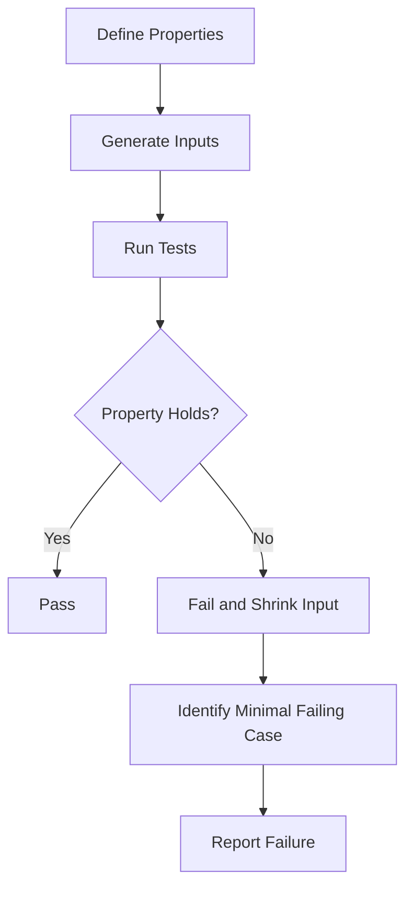

## 22.4. Property-Based Testing with `proptest`

In the realm of software testing, ensuring that your code behaves correctly across a wide range of inputs is crucial. Traditional unit tests often focus on specific cases, which can leave gaps in coverage. This is where property-based testing shines, offering a robust approach to verifying that code adheres to certain properties or invariants across diverse input data. In Rust, the `proptest` crate is a powerful tool for implementing property-based testing.

### Understanding Property-Based Testing

**Property-based testing** is a testing methodology where you define properties or invariants that your code should satisfy, rather than specific input-output pairs. The testing framework then generates a wide range of random inputs to test these properties, helping to uncover edge cases and unexpected behaviors.

#### Advantages of Property-Based Testing

- **Comprehensive Coverage**: By generating a wide range of inputs, property-based tests can explore edge cases that you might not have considered.
- **Invariant Verification**: Focuses on the properties your code should always satisfy, ensuring that these invariants hold true across all inputs.
- **Automatic Test Case Generation**: Reduces the need to manually write extensive test cases, as the framework handles input generation.
- **Bug Discovery**: Often uncovers subtle bugs that traditional unit tests might miss.

### Introducing the `proptest` Crate

The [`proptest`](https://crates.io/crates/proptest) crate is a popular choice for property-based testing in Rust. It provides a flexible and powerful API for defining properties and generating test cases. Let's explore how `proptest` facilitates property-based testing in Rust.

#### Setting Up `proptest`

To get started with `proptest`, add it to your `Cargo.toml`:

```toml
[dev-dependencies]
proptest = "1.0"
```

### Defining Properties with `proptest`

In `proptest`, you define properties using the `proptest!` macro. This macro allows you to specify the properties your code should satisfy and the range of inputs to test.

#### Example: Testing a Simple Function

Consider a simple function that reverses a string:

```rust
fn reverse_string(s: &str) -> String {
    s.chars().rev().collect()
}
```

We want to test the property that reversing a string twice should yield the original string. Here's how you can define this property using `proptest`:

```rust
use proptest::prelude::*;

proptest! {
    #[test]
    fn test_reverse_string(s in ".*") {
        let reversed = reverse_string(&s);
        let double_reversed = reverse_string(&reversed);
        prop_assert_eq!(s, double_reversed);
    }
}
```

In this example, `s in ".*"` generates arbitrary strings, and `prop_assert_eq!` checks that the double-reversed string equals the original.

### Generating Complex Input Data

Property-based testing becomes even more powerful when dealing with complex input data structures. `proptest` provides combinators to generate complex data types.

#### Example: Testing with Complex Data Structures

Suppose we have a function that processes a list of integers:

```rust
fn process_numbers(numbers: &[i32]) -> i32 {
    numbers.iter().sum()
}
```

We want to test the property that the sum of a list of numbers is always greater than or equal to each individual number. Here's how you can define this property:

```rust
use proptest::collection::vec;

proptest! {
    #[test]
    fn test_process_numbers(numbers in vec(-1000..1000, 0..100)) {
        let sum = process_numbers(&numbers);
        for &number in &numbers {
            prop_assert!(sum >= number);
        }
    }
}
```

In this example, `vec(-1000..1000, 0..100)` generates vectors of integers with values between -1000 and 1000, and lengths between 0 and 100.

### Strategies for Complex Input Data

When dealing with complex input data, it's essential to define strategies that accurately represent the range of possible inputs. `proptest` offers a variety of combinators to help you build these strategies.

#### Using Combinators

- **`vec`**: Generates vectors of arbitrary length and element type.
- **`option`**: Generates `Option` values, allowing for optional data.
- **`tuple`**: Generates tuples of arbitrary types.
- **`prop_oneof`**: Combines multiple strategies, choosing one at random.

### Uncovering Edge Cases and Unexpected Behaviors

One of the significant benefits of property-based testing is its ability to uncover edge cases and unexpected behaviors. By generating a wide range of inputs, `proptest` can reveal issues that might not be apparent with traditional unit tests.

#### Example: Discovering Edge Cases

Consider a function that calculates the factorial of a number:

```rust
fn factorial(n: u32) -> u32 {
    (1..=n).product()
}
```

We want to test the property that the factorial of a number is always greater than or equal to the number itself. Here's how you can define this property:

```rust
proptest! {
    #[test]
    fn test_factorial(n in 0u32..10) {
        let result = factorial(n);
        prop_assert!(result >= n);
    }
}
```

By running this test, you might discover that the factorial function fails for large values of `n` due to integer overflow, prompting you to handle such cases appropriately.

### Combining Property-Based Tests with Traditional Unit Tests

While property-based testing is powerful, it should complement, not replace, traditional unit tests. Unit tests are excellent for verifying specific scenarios and edge cases, while property-based tests ensure broader coverage.

#### Best Practices

- **Use Unit Tests for Specific Cases**: Write unit tests for known edge cases and specific scenarios.
- **Use Property-Based Tests for General Properties**: Define properties that should hold true across a wide range of inputs.
- **Combine Both Approaches**: Leverage the strengths of both testing methodologies to achieve comprehensive test coverage.

### Visualizing the Testing Process

To better understand the flow of property-based testing, let's visualize the process using a flowchart.



**Diagram Description**: This flowchart illustrates the property-based testing process. It starts with defining properties, generating inputs, running tests, and checking if the property holds. If a test fails, the input is shrunk to identify the minimal failing case, which is then reported.

### Encouraging Experimentation

To fully grasp the power of property-based testing, try experimenting with the code examples provided. Modify the properties, input ranges, and test cases to see how `proptest` handles different scenarios.

#### Try It Yourself

- **Modify Input Ranges**: Change the input ranges in the examples to explore different edge cases.
- **Define New Properties**: Create new properties for functions in your codebase and test them with `proptest`.
- **Experiment with Complex Data**: Use `proptest` to generate complex data structures and test their properties.

### References and Further Reading

- [Proptest Documentation](https://docs.rs/proptest)
- [Rust Testing Book](https://doc.rust-lang.org/book/ch11-00-testing.html)
- [Property-Based Testing in Rust](https://blog.logrocket.com/property-based-testing-in-rust/)

### Knowledge Check

To reinforce your understanding of property-based testing with `proptest`, consider the following questions and exercises.

## Quiz Time!



### What is the primary advantage of property-based testing?

- [x] It generates a wide range of inputs to test properties.
- [ ] It focuses on specific input-output pairs.
- [ ] It replaces the need for unit tests.
- [ ] It only tests edge cases.

> **Explanation:** Property-based testing generates a wide range of inputs to test properties, ensuring comprehensive coverage.

### How does `proptest` help in property-based testing?

- [x] It provides a flexible API for defining properties and generating test cases.
- [ ] It only supports unit testing.
- [ ] It is used for performance testing.
- [ ] It is a debugging tool.

> **Explanation:** `proptest` provides a flexible API for defining properties and generating test cases, facilitating property-based testing in Rust.

### Which combinator in `proptest` is used to generate vectors?

- [x] `vec`
- [ ] `option`
- [ ] `tuple`
- [ ] `prop_oneof`

> **Explanation:** The `vec` combinator in `proptest` is used to generate vectors of arbitrary length and element type.

### What should you do if a property-based test fails?

- [x] Identify the minimal failing case using input shrinking.
- [ ] Ignore the failure and move on.
- [ ] Rewrite the test case.
- [ ] Increase the input range.

> **Explanation:** If a property-based test fails, you should identify the minimal failing case using input shrinking to understand the issue better.

### Can property-based tests replace traditional unit tests?

- [ ] Yes, they can replace unit tests entirely.
- [x] No, they should complement unit tests.
- [ ] Yes, but only for simple functions.
- [ ] No, they are used for performance testing.

> **Explanation:** Property-based tests should complement, not replace, traditional unit tests, as both have their strengths.

### What is the purpose of the `prop_assert_eq!` macro in `proptest`?

- [x] To assert that two values are equal in a property-based test.
- [ ] To generate random inputs.
- [ ] To define a new property.
- [ ] To handle errors in tests.

> **Explanation:** The `prop_assert_eq!` macro is used to assert that two values are equal in a property-based test.

### Which of the following is a strategy for generating complex input data in `proptest`?

- [x] Using combinators like `vec`, `option`, and `tuple`.
- [ ] Writing extensive manual test cases.
- [ ] Using only primitive data types.
- [ ] Ignoring complex data structures.

> **Explanation:** Using combinators like `vec`, `option`, and `tuple` is a strategy for generating complex input data in `proptest`.

### What is the role of input shrinking in property-based testing?

- [x] To identify the minimal failing case when a test fails.
- [ ] To increase the input size for better coverage.
- [ ] To generate random inputs.
- [ ] To replace unit tests.

> **Explanation:** Input shrinking helps identify the minimal failing case when a property-based test fails, aiding in debugging.

### True or False: Property-based testing is only useful for simple functions.

- [ ] True
- [x] False

> **Explanation:** False. Property-based testing is useful for both simple and complex functions, as it helps uncover edge cases and unexpected behaviors.

### What is the main focus of property-based testing?

- [x] Verifying that code adheres to certain properties or invariants.
- [ ] Testing specific input-output pairs.
- [ ] Measuring code performance.
- [ ] Debugging code errors.

> **Explanation:** The main focus of property-based testing is verifying that code adheres to certain properties or invariants across a wide range of inputs.



### Embrace the Journey

Remember, property-based testing is a powerful tool in your testing arsenal. As you continue to explore and experiment with `proptest`, you'll gain a deeper understanding of your code's behavior across diverse inputs. Keep experimenting, stay curious, and enjoy the journey of making your Rust code more robust and reliable!
