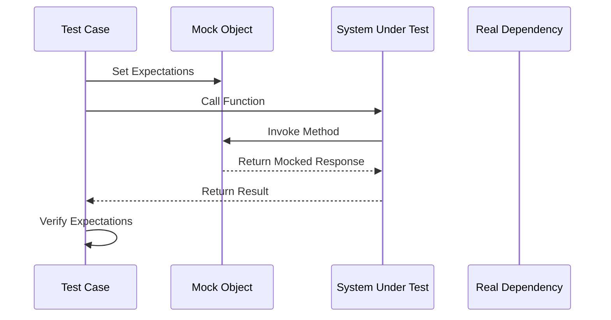

## 22.5. Mocks and Stubs with `mockall` and `double`

In the realm of software testing, **mocks** and **stubs** play a crucial role in isolating the unit under test, allowing developers to focus on the behavior of a specific component without interference from external dependencies. This section delves into the use of mocks and stubs in Rust, particularly through the `mockall` and `double` crates, which are instrumental in overcoming the challenges posed by Rust's static type system.

### Understanding Mocks and Stubs

**Mocks** are objects that simulate the behavior of real objects. They are used to verify interactions between objects and ensure that the system behaves as expected. Mocks can be programmed with expectations, which are then verified during the test execution.

**Stubs**, on the other hand, are simpler. They provide predefined responses to method calls, allowing the test to proceed without executing the actual code. Stubs are typically used when the behavior of the dependency is not the focus of the test.

#### Why Use Mocks and Stubs?

- **Isolation**: Mocks and stubs help isolate the unit under test, ensuring that tests are not affected by external systems or components.
- **Control**: They provide control over the behavior of dependencies, allowing for testing of edge cases and error conditions.
- **Performance**: By avoiding calls to real systems, tests can run faster and more reliably.

### Challenges in Mocking with Rust

Rust's static type system and ownership model present unique challenges when it comes to mocking. Unlike dynamic languages, where objects can be easily replaced or modified, Rust requires more explicit handling of types and lifetimes. This is where libraries like `mockall` and `double` come into play, providing the necessary tools to create mocks and stubs in a type-safe manner.

### Introducing `mockall` and `double`

#### `mockall` Crate

The `mockall` crate is a powerful tool for creating mocks in Rust. It allows you to generate mock implementations for traits, enabling you to specify expectations and verify interactions.

- **Key Features**:
  - Automatically generates mock implementations for traits.
  - Supports expectations and verification.
  - Allows for mocking of methods with complex signatures.

#### `double` Crate

The `double` crate provides a lightweight approach to mocking in Rust. It focuses on simplicity and ease of use, making it ideal for smaller projects or simpler mocking needs.

- **Key Features**:
  - Simple API for creating mocks and stubs.
  - Focuses on ease of use and minimal setup.
  - Suitable for projects where full-featured mocking is not required.

### Mocking Traits, Functions, and Methods

Let's explore how to use `mockall` and `double` to mock traits, functions, and methods in Rust.

#### Mocking with `mockall`

To demonstrate the use of `mockall`, let's consider a simple example where we have a trait `Database` with a method `get_user`.

```rust
use mockall::{automock, predicate::*};

// Define a trait for demonstration
#[automock]
trait Database {
    fn get_user(&self, user_id: u32) -> Option<String>;
}

// Function that uses the trait
fn fetch_user_name(db: &dyn Database, user_id: u32) -> String {
    db.get_user(user_id).unwrap_or_else(|| "Unknown".to_string())
}

#[cfg(test)]
mod tests {
    use super::*;

    #[test]
    fn test_fetch_user_name() {
        // Create a mock object
        let mut mock_db = MockDatabase::new();
        
        // Set expectations
        mock_db.expect_get_user()
            .with(predicate::eq(1))
            .times(1)
            .returning(|_| Some("Alice".to_string()));
        
        // Call the function under test
        let user_name = fetch_user_name(&mock_db, 1);
        
        // Verify the result
        assert_eq!(user_name, "Alice");
    }
}
```

**Explanation**:
- We define a trait `Database` and use the `#[automock]` attribute to generate a mock implementation.
- In the test, we create a `MockDatabase` object and set expectations using `expect_get_user`.
- The `fetch_user_name` function is tested with the mock, and the result is verified.

#### Mocking with `double`

The `double` crate provides a more straightforward approach. Here's how you can use it:

```rust
use double::Mock;

// Define a trait for demonstration
trait Database {
    fn get_user(&self, user_id: u32) -> Option<String>;
}

// Function that uses the trait
fn fetch_user_name(db: &dyn Database, user_id: u32) -> String {
    db.get_user(user_id).unwrap_or_else(|| "Unknown".to_string())
}

#[cfg(test)]
mod tests {
    use super::*;
    use double::Mock;

    #[test]
    fn test_fetch_user_name() {
        // Create a mock object
        let mut mock_db = Mock::new();
        
        // Define the behavior of the mock
        mock_db.when().get_user(1).then_return(Some("Alice".to_string()));
        
        // Call the function under test
        let user_name = fetch_user_name(&mock_db, 1);
        
        // Verify the result
        assert_eq!(user_name, "Alice");
    }
}
```

**Explanation**:
- We define a trait `Database` and create a mock using `Mock::new`.
- The behavior of the mock is defined using `when().then_return()`.
- The `fetch_user_name` function is tested with the mock, and the result is verified.

### Best Practices for Using Mocks

- **Use Mocks Sparingly**: Overuse of mocks can lead to brittle tests that are tightly coupled to implementation details.
- **Focus on Behavior**: Mocks should be used to verify behavior, not implementation.
- **Keep Tests Simple**: Avoid complex setups and focus on the specific behavior being tested.
- **Document Expectations**: Clearly document the expectations set on mocks to improve test readability.

### Limitations and Alternatives

While mocks are powerful, they are not always the best choice. Consider the following limitations:

- **Complexity**: Mocks can add complexity to tests, especially when dealing with intricate interactions.
- **Coupling**: Tests can become tightly coupled to the implementation, making refactoring difficult.
- **False Positives**: Mocks can lead to false positives if not used carefully, as they simulate behavior rather than executing real code.

#### When to Use Alternatives

- **Integration Testing**: For testing interactions between components, consider integration tests that use real implementations.
- **Stubs**: Use stubs when the behavior of the dependency is not the focus of the test.
- **Fakes**: Consider using fakes, which are simpler implementations of dependencies, for more realistic testing.

### Visualizing Mocking in Rust

To better understand the flow of mocking in Rust, let's visualize the process using a sequence diagram.



**Diagram Explanation**:
- The test case sets expectations on the mock object.
- The system under test (SUT) calls the function, which interacts with the mock.
- The mock returns a predefined response, and the test verifies the result.

### Try It Yourself

Experiment with the examples provided by modifying the behavior of the mocks. Try adding new methods to the `Database` trait and mock them using `mockall` and `double`. Observe how changes in expectations affect the test outcomes.

### References and Links

- [`mockall` crate on crates.io](https://crates.io/crates/mockall)
- [`double` crate on crates.io](https://crates.io/crates/double)
- [Rust Testing Book](https://doc.rust-lang.org/book/ch11-00-testing.html)

### Knowledge Check

- What are the primary differences between mocks and stubs?
- How does Rust's static type system affect mocking?
- What are some best practices for using mocks in tests?

### Embrace the Journey

Remember, mastering mocks and stubs is just one step in your Rust testing journey. As you continue to explore and experiment, you'll gain deeper insights into how to effectively isolate and test your code. Keep experimenting, stay curious, and enjoy the process!

## Quiz Time!



### What is the primary purpose of using mocks in testing?

- [x] To simulate the behavior of real objects and verify interactions.
- [ ] To replace real objects with simpler implementations.
- [ ] To improve the performance of tests.
- [ ] To ensure that tests are not affected by external systems.

> **Explanation:** Mocks are used to simulate the behavior of real objects and verify interactions between components.

### Which Rust crate is known for providing a lightweight approach to mocking?

- [ ] mockall
- [x] double
- [ ] serde
- [ ] tokio

> **Explanation:** The `double` crate provides a lightweight approach to mocking in Rust.

### What is a key feature of the `mockall` crate?

- [x] Automatically generates mock implementations for traits.
- [ ] Provides a simple API for creating mocks and stubs.
- [ ] Focuses on ease of use and minimal setup.
- [ ] Suitable for projects where full-featured mocking is not required.

> **Explanation:** The `mockall` crate automatically generates mock implementations for traits, making it powerful for complex mocking needs.

### What is a potential limitation of using mocks in tests?

- [x] Tests can become tightly coupled to the implementation.
- [ ] Mocks are difficult to set up and use.
- [ ] Mocks cannot simulate complex interactions.
- [ ] Mocks are not suitable for unit testing.

> **Explanation:** Mocks can lead to tests that are tightly coupled to the implementation, making refactoring difficult.

### When should you consider using stubs instead of mocks?

- [x] When the behavior of the dependency is not the focus of the test.
- [ ] When you need to verify interactions between components.
- [ ] When you want to simulate complex behavior.
- [ ] When you need to test performance.

> **Explanation:** Stubs are used when the behavior of the dependency is not the focus of the test, providing predefined responses.

### What is a best practice for using mocks in tests?

- [x] Use mocks sparingly to avoid brittle tests.
- [ ] Use mocks for all dependencies to ensure isolation.
- [ ] Focus on implementation details when using mocks.
- [ ] Avoid documenting expectations to keep tests simple.

> **Explanation:** Using mocks sparingly helps avoid brittle tests that are tightly coupled to implementation details.

### What is a common challenge when mocking in Rust?

- [x] Rust's static type system and ownership model.
- [ ] Lack of libraries for mocking.
- [ ] Difficulty in setting up test environments.
- [ ] Limited support for mocking in Rust.

> **Explanation:** Rust's static type system and ownership model present unique challenges when it comes to mocking.

### Which crate would you use for a project that requires full-featured mocking?

- [x] mockall
- [ ] double
- [ ] serde
- [ ] tokio

> **Explanation:** The `mockall` crate is suitable for projects that require full-featured mocking capabilities.

### True or False: Mocks should be used to verify implementation details.

- [ ] True
- [x] False

> **Explanation:** Mocks should be used to verify behavior, not implementation details.

### What is the benefit of using mocks in testing?

- [x] They provide control over the behavior of dependencies.
- [ ] They simplify the codebase by removing dependencies.
- [ ] They eliminate the need for integration tests.
- [ ] They ensure that tests are always fast.

> **Explanation:** Mocks provide control over the behavior of dependencies, allowing for testing of edge cases and error conditions.


