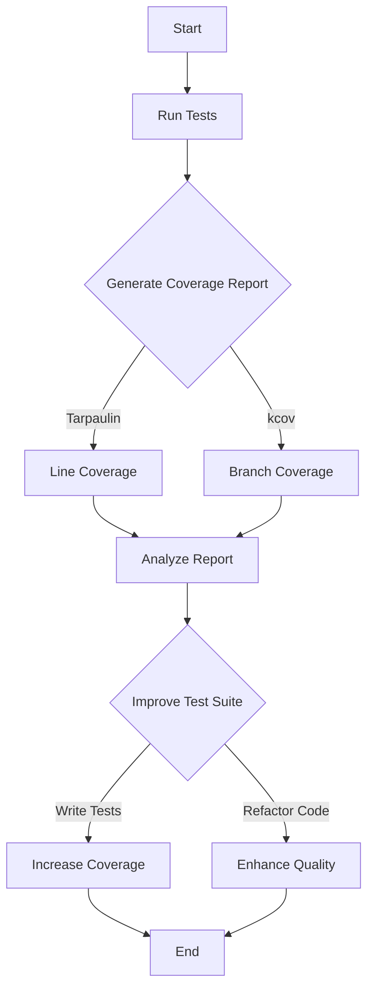

## 22.7. Code Coverage Analysis

**Description**: Utilizing code coverage tools in Rust to measure how much of the codebase is exercised by tests and identify untested areas.

### Understanding Code Coverage

Code coverage is a metric used to determine the extent to which the source code of a program is executed when a particular test suite runs. It provides insights into which parts of the code are being tested and which are not, helping developers identify untested areas that might contain bugs or require additional testing.

#### Importance of Code Coverage

- **Quality Assurance**: High code coverage can indicate a well-tested codebase, reducing the likelihood of bugs.
- **Test Suite Effectiveness**: It helps in assessing the effectiveness of the test suite and guides improvements.
- **Code Maintenance**: By identifying untested code, developers can focus on writing tests for critical paths, ensuring robust code maintenance.
- **Risk Management**: Coverage analysis helps in managing risk by highlighting areas that might be prone to errors.

### Tools for Measuring Code Coverage in Rust

Rust, being a systems programming language, has several tools designed to measure code coverage. Two popular tools are `Tarpaulin` and `kcov`.

#### Tarpaulin

[Tarpaulin](https://crates.io/crates/cargo-tarpaulin) is a code coverage reporting tool for Rust projects. It is designed to work with projects that use Cargo, Rust's package manager and build system.

- **Features**: 
  - Supports line and branch coverage.
  - Integrates with CI/CD pipelines.
  - Provides detailed coverage reports.

#### kcov

[kcov](https://github.com/SimonKagstrom/kcov) is another tool that can be used for code coverage analysis in Rust. It works by running the binary and collecting coverage data.

- **Features**:
  - Supports multiple languages, including Rust.
  - Generates HTML reports for easy visualization.
  - Can be integrated with CI tools.

### Setting Up and Running Coverage Analysis

#### Using Tarpaulin

1. **Installation**: Install Tarpaulin using Cargo, Rust's package manager.

   ```bash
   cargo install cargo-tarpaulin
   ```

2. **Running Tarpaulin**: Execute Tarpaulin to generate a coverage report.

   ```bash
   cargo tarpaulin
   ```

   This command will run your tests and produce a coverage report.

3. **Advanced Options**: Tarpaulin offers several options to customize the coverage analysis.

   ```bash
   cargo tarpaulin --out Html
   ```

   This command generates an HTML report, which can be more readable and easier to analyze.

#### Using kcov

1. **Installation**: Install kcov from the source or using package managers available for your operating system.

2. **Running kcov**: Use kcov to run your Rust binary and collect coverage data.

   ```bash
   kcov --include-pattern=src/ target/cov target/debug/my_project
   ```

   Replace `my_project` with the name of your binary. This command will generate a coverage report in the `target/cov` directory.

### Interpreting Coverage Reports

Coverage reports provide a detailed view of which lines and branches of code were executed during testing. Here's how to interpret these reports:

- **Line Coverage**: Indicates the percentage of lines executed. Aim for high line coverage to ensure most of your code is tested.
- **Branch Coverage**: Measures the percentage of branches (e.g., if-else conditions) that were executed. High branch coverage ensures that different code paths are tested.
- **Missed Lines/Branches**: Identify lines or branches that were not executed and consider writing tests to cover them.

### Improving Test Suites Based on Coverage Findings

1. **Identify Critical Areas**: Focus on untested critical areas that could impact the application's functionality.
2. **Write Additional Tests**: Develop tests for uncovered code paths, especially those that handle edge cases or complex logic.
3. **Refactor Code**: Simplify complex code to make it easier to test and understand.
4. **Continuous Integration**: Integrate coverage analysis into your CI/CD pipeline to ensure ongoing code quality.

### Limitations of Coverage Metrics

While code coverage is a valuable metric, it has limitations:

- **False Sense of Security**: High coverage does not guarantee the absence of bugs. It only indicates that the code was executed, not that it was tested correctly.
- **Quality Over Quantity**: Focus on the quality of tests rather than just achieving high coverage numbers.
- **Complexity**: Coverage tools might struggle with complex codebases or certain language features.

### Encouraging Thoughtful Use of Coverage Analysis

- **Balance**: Use coverage analysis as one of many tools to ensure code quality. Combine it with other testing strategies like property-based testing and fuzz testing.
- **Contextual Understanding**: Understand the context of your project and prioritize testing efforts accordingly.
- **Iterative Improvement**: Continuously improve your test suite based on coverage findings and other quality metrics.

### Visualizing Code Coverage

To better understand the flow of coverage analysis, let's visualize the process using a Mermaid.js flowchart:



This flowchart illustrates the process of running tests, generating coverage reports, analyzing them, and improving the test suite based on findings.

### Try It Yourself

To get hands-on experience with code coverage analysis, try the following:

- **Modify Code**: Add new functions or modify existing ones in your Rust project.
- **Run Coverage Tools**: Use Tarpaulin or kcov to analyze the coverage of your modified code.
- **Write Tests**: Develop tests for any uncovered code paths.
- **Re-run Coverage Tools**: Check if the coverage has improved after adding tests.

### References and Links

- [Tarpaulin on crates.io](https://crates.io/crates/cargo-tarpaulin)
- [kcov GitHub Repository](https://github.com/SimonKagstrom/kcov)
- [Rust Testing Documentation](https://doc.rust-lang.org/book/ch11-00-testing.html)

### Knowledge Check

- **What is code coverage and why is it important?**
- **How can Tarpaulin be installed and used in a Rust project?**
- **What are the differences between line coverage and branch coverage?**
- **Why should coverage metrics be used thoughtfully?**

### Embrace the Journey

Remember, code coverage analysis is just one part of the testing and quality assurance process. As you continue to develop your Rust projects, keep exploring new tools and techniques to enhance code quality. Stay curious, keep experimenting, and enjoy the journey of becoming a more proficient Rust developer!

## Quiz Time!



### What is the primary purpose of code coverage analysis?

- [x] To measure how much of the codebase is exercised by tests
- [ ] To identify syntax errors in the code
- [ ] To optimize the performance of the code
- [ ] To refactor the code for better readability

> **Explanation:** Code coverage analysis measures how much of the codebase is exercised by tests, helping identify untested areas.

### Which tool is specifically designed for Rust code coverage analysis?

- [x] Tarpaulin
- [ ] JUnit
- [ ] Mocha
- [ ] PyTest

> **Explanation:** Tarpaulin is a tool specifically designed for Rust code coverage analysis.

### What does branch coverage measure?

- [x] The percentage of branches (e.g., if-else conditions) that were executed
- [ ] The number of lines of code executed
- [ ] The number of functions tested
- [ ] The number of modules covered

> **Explanation:** Branch coverage measures the percentage of branches (e.g., if-else conditions) that were executed during testing.

### What command is used to install Tarpaulin?

- [x] cargo install cargo-tarpaulin
- [ ] cargo add tarpaulin
- [ ] cargo run tarpaulin
- [ ] cargo build tarpaulin

> **Explanation:** The command `cargo install cargo-tarpaulin` is used to install Tarpaulin.

### Which of the following is a limitation of code coverage metrics?

- [x] High coverage does not guarantee the absence of bugs
- [ ] It provides a detailed view of code execution
- [ ] It helps in identifying untested code paths
- [ ] It integrates with CI/CD pipelines

> **Explanation:** High coverage does not guarantee the absence of bugs; it only indicates that the code was executed.

### How can code coverage analysis be integrated into a CI/CD pipeline?

- [x] By running coverage tools as part of the build process
- [ ] By manually checking code for errors
- [ ] By writing additional documentation
- [ ] By optimizing code for performance

> **Explanation:** Code coverage analysis can be integrated into a CI/CD pipeline by running coverage tools as part of the build process.

### What is the benefit of generating an HTML report with Tarpaulin?

- [x] It provides a more readable and easier-to-analyze report
- [ ] It reduces the size of the coverage data
- [ ] It automatically fixes uncovered code paths
- [ ] It improves the performance of the tests

> **Explanation:** Generating an HTML report with Tarpaulin provides a more readable and easier-to-analyze report.

### What should be the focus when improving test suites based on coverage findings?

- [x] Writing tests for uncovered code paths
- [ ] Increasing the number of tests without regard to coverage
- [ ] Reducing the complexity of the code
- [ ] Removing tests that cover simple code

> **Explanation:** The focus should be on writing tests for uncovered code paths to ensure comprehensive testing.

### Which tool can be used to generate HTML reports for code coverage?

- [x] kcov
- [ ] JUnit
- [ ] Mocha
- [ ] PyTest

> **Explanation:** kcov can be used to generate HTML reports for code coverage.

### True or False: Code coverage analysis is the only metric needed to ensure code quality.

- [ ] True
- [x] False

> **Explanation:** False. Code coverage analysis is one of many metrics used to ensure code quality, and it should be combined with other testing strategies.


