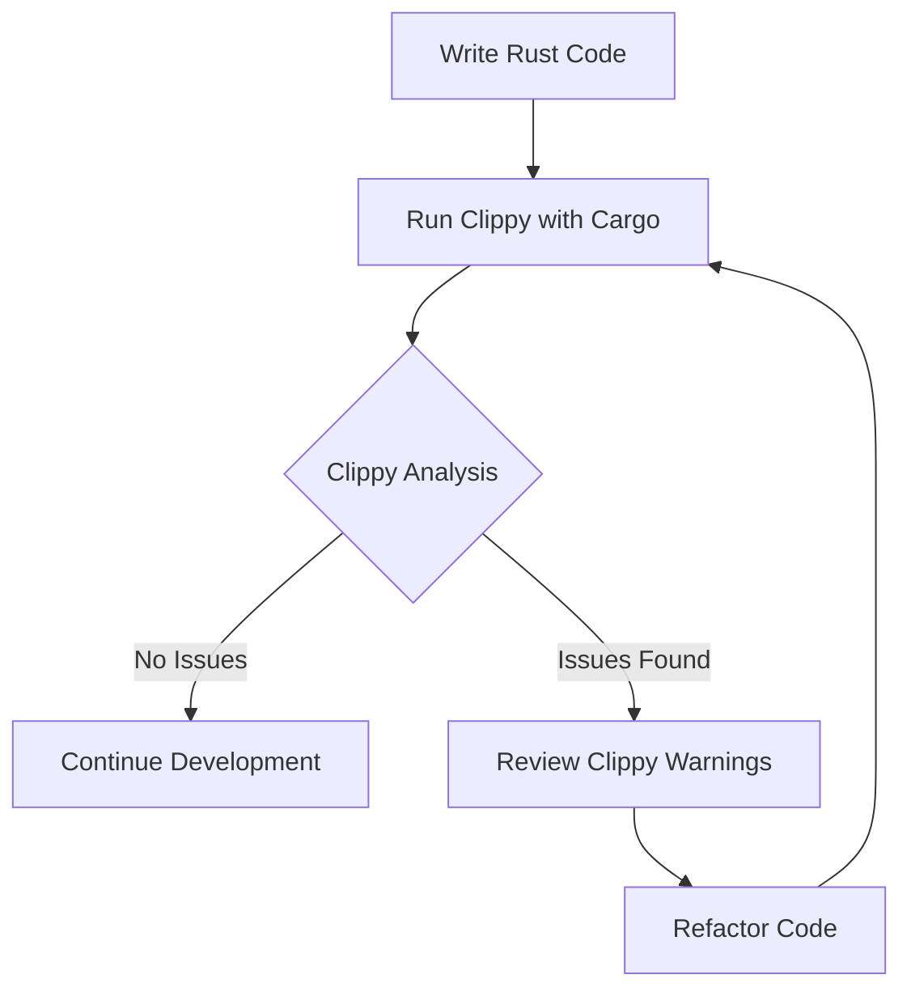

## 22.8. Static Code Analysis with Clippy

In the world of software development, maintaining high code quality is crucial for building robust and efficient applications. For Rust developers, Clippy serves as an invaluable tool in this endeavor. Clippy is a linter for Rust that provides static code analysis to catch potential issues and code smells before they manifest at runtime. By integrating Clippy into your development workflow, you can ensure cleaner, more idiomatic Rust code.

### Introduction to Clippy

Clippy is a collection of lints to catch common mistakes and improve your Rust code. It is part of the Rust toolchain and can be easily integrated into your development process. Clippy's primary role is to analyze your code statically and provide feedback on potential improvements, ranging from performance optimizations to stylistic suggestions.

#### What is a Linter?

A linter is a tool that analyzes source code to flag programming errors, bugs, stylistic errors, and suspicious constructs. Linters help developers adhere to coding standards and best practices, ultimately leading to more maintainable and error-free code.

### Common Lints Detected by Clippy

Clippy provides a wide range of lints that can help you identify various issues in your code. Here are some common categories of lints that Clippy can detect:

1. **Correctness Lints**: These lints catch code that is likely to be incorrect or lead to bugs.
   - Example: Detecting the use of `unwrap()` on `Option` or `Result` types without proper error handling.

2. **Performance Lints**: These lints suggest optimizations to improve the performance of your code.
   - Example: Identifying unnecessary allocations or suggesting the use of more efficient data structures.

3. **Style Lints**: These lints enforce Rust's idiomatic style and best practices.
   - Example: Recommending the use of `if let` instead of `match` when matching a single pattern.

4. **Complexity Lints**: These lints highlight overly complex code that could be simplified.
   - Example: Suggesting the use of iterator methods instead of manual loops.

5. **Pedantic Lints**: These are more subjective lints that enforce stricter coding standards.
   - Example: Warning about the use of wildcard imports.

### Running Clippy

Running Clippy is straightforward and can be done using Cargo, Rust's package manager and build system. To run Clippy on your project, use the following command:

```bash
cargo clippy
```

This command will analyze your code and display any warnings or suggestions provided by Clippy. It's important to regularly run Clippy during development to catch issues early.

#### Interpreting Clippy's Warnings

When Clippy identifies an issue, it provides a detailed message explaining the problem and often suggests a solution. Here's an example of a Clippy warning:

```
warning: called `unwrap()` on `Option` value. Consider using `if let` or `match` to handle the `None` case
 --> src/main.rs:10:5
  |
10|     let value = some_option.unwrap();
  |                 ^^^^^^^^^^^^^^^^^^^^
  |
  = note: `#[warn(clippy::unwrap_used)]` on by default
```

In this example, Clippy warns about the use of `unwrap()` on an `Option` type, suggesting that you handle the `None` case explicitly.

### Configuring Clippy

Clippy is highly configurable, allowing you to tailor its behavior to suit your project's needs. You can enable or disable specific lints, set lint levels, and even create custom lint configurations.

#### Allowing or Denying Specific Lints

You can control which lints Clippy checks by using attributes in your code. For example, to allow a specific lint, use the `#[allow(lint_name)]` attribute:

```rust
#[allow(clippy::unwrap_used)]
fn main() {
    let some_option = Some(42);
    let value = some_option.unwrap(); // This will not trigger a warning
}
```

To deny a lint, use the `#[deny(lint_name)]` attribute:

```rust
#[deny(clippy::unwrap_used)]
fn main() {
    let some_option = Some(42);
    let value = some_option.unwrap(); // This will trigger a compilation error
}
```

#### Customizing Clippy's Behavior

You can customize Clippy's behavior by creating a `clippy.toml` configuration file in your project's root directory. This file allows you to specify lint levels and other settings globally for your project.

Example `clippy.toml`:

```toml
# Set the level for all lints to "warn"
warn = true

# Disable a specific lint
unnecessary_cast = false

# Enable a pedantic lint
pedantic = true
```

### Benefits of Regular Clippy Use

Regular use of Clippy can lead to significant improvements in code quality. By catching potential issues early, you can avoid bugs and ensure that your code adheres to Rust's idiomatic practices. Clippy also helps in maintaining consistency across your codebase, making it easier for team members to collaborate.

### Code Example: Improving Code with Clippy

Let's explore a code example to see how Clippy can help improve code quality:

```rust
fn main() {
    let numbers = vec![1, 2, 3, 4, 5];
    let mut sum = 0;

    // Manual loop to calculate the sum
    for i in 0..numbers.len() {
        sum += numbers[i];
    }

    println!("Sum: {}", sum);
}
```

Running Clippy on this code might produce the following warning:

```
warning: it is more idiomatic to loop over `&numbers` instead of using an index
 --> src/main.rs:5:5
  |
5 | /     for i in 0..numbers.len() {
6 | |         sum += numbers[i];
7 | |     }
  | |_____^
  |
  = note: `#[warn(clippy::needless_range_loop)]` on by default
```

Clippy suggests using an iterator instead of a manual loop. Here's the improved version:

```rust
fn main() {
    let numbers = vec![1, 2, 3, 4, 5];
    let sum: i32 = numbers.iter().sum();

    println!("Sum: {}", sum);
}
```

### Try It Yourself

To get hands-on experience with Clippy, try modifying the code examples above. Experiment with enabling and disabling different lints, and observe how Clippy's feedback changes. This practice will help you become more familiar with Clippy's capabilities and how it can enhance your Rust development workflow.

### Visualizing Clippy's Workflow

To better understand how Clippy fits into the Rust development process, let's visualize its workflow using a Mermaid.js diagram:



**Diagram Description**: This flowchart illustrates the iterative process of writing Rust code, running Clippy to analyze it, reviewing any warnings, refactoring the code, and repeating the process until no issues are found.

### References and Links

- [Clippy GitHub Repository](https://github.com/rust-lang/rust-clippy)
- [Rust Documentation](https://doc.rust-lang.org/)
- [Cargo Book](https://doc.rust-lang.org/cargo/)

### Knowledge Check

To reinforce your understanding of Clippy and its role in static code analysis, consider the following questions:

1. What is the primary purpose of Clippy in Rust development?
2. How can you run Clippy on a Rust project?
3. What are some common categories of lints that Clippy can detect?
4. How can you configure Clippy to allow or deny specific lints?
5. Why is regular use of Clippy beneficial for maintaining code quality?

### Embrace the Journey

Remember, using Clippy is just one step in your journey to mastering Rust. As you continue to develop your skills, you'll find that tools like Clippy become invaluable allies in writing clean, efficient, and idiomatic code. Keep experimenting, stay curious, and enjoy the process of becoming a more proficient Rust developer!

## Quiz Time!



### What is the primary role of Clippy in Rust development?

- [x] To perform static code analysis and catch potential issues
- [ ] To compile Rust code into machine code
- [ ] To manage Rust project dependencies
- [ ] To provide a graphical user interface for Rust development

> **Explanation:** Clippy is a linter tool used for static code analysis to catch potential issues and improve code quality.

### Which command is used to run Clippy on a Rust project?

- [ ] rustc clippy
- [x] cargo clippy
- [ ] clippy run
- [ ] rust-lint

> **Explanation:** The `cargo clippy` command is used to run Clippy on a Rust project.

### What type of lints does Clippy provide?

- [x] Correctness, Performance, Style, Complexity, Pedantic
- [ ] Compilation, Linking, Execution, Debugging
- [ ] Syntax, Semantics, Pragmatics, Phonetics
- [ ] Input, Output, Processing, Storage

> **Explanation:** Clippy provides lints in categories such as Correctness, Performance, Style, Complexity, and Pedantic.

### How can you allow a specific lint in your Rust code?

- [ ] By using the `#[deny(lint_name)]` attribute
- [x] By using the `#[allow(lint_name)]` attribute
- [ ] By using the `#[ignore(lint_name)]` attribute
- [ ] By using the `#[warn(lint_name)]` attribute

> **Explanation:** The `#[allow(lint_name)]` attribute is used to allow a specific lint in Rust code.

### What file can you create to customize Clippy's behavior globally for your project?

- [ ] clippy.json
- [ ] clippy.yaml
- [x] clippy.toml
- [ ] clippy.ini

> **Explanation:** The `clippy.toml` file can be created to customize Clippy's behavior globally for a project.

### Which of the following is a benefit of using Clippy regularly?

- [x] Improved code quality and adherence to Rust's idiomatic practices
- [ ] Faster compilation times
- [ ] Automatic code deployment
- [ ] Enhanced graphical user interface

> **Explanation:** Regular use of Clippy improves code quality and ensures adherence to Rust's idiomatic practices.

### What does Clippy suggest when it detects a manual loop that can be replaced with an iterator?

- [ ] Use a different programming language
- [x] Use iterator methods instead of manual loops
- [ ] Remove the loop entirely
- [ ] Increase the loop's complexity

> **Explanation:** Clippy suggests using iterator methods instead of manual loops for more idiomatic Rust code.

### How can you deny a specific lint in your Rust code?

- [x] By using the `#[deny(lint_name)]` attribute
- [ ] By using the `#[allow(lint_name)]` attribute
- [ ] By using the `#[ignore(lint_name)]` attribute
- [ ] By using the `#[warn(lint_name)]` attribute

> **Explanation:** The `#[deny(lint_name)]` attribute is used to deny a specific lint in Rust code.

### What is the purpose of the `clippy.toml` file?

- [x] To customize Clippy's behavior and lint levels for a project
- [ ] To compile Rust code into machine code
- [ ] To manage Rust project dependencies
- [ ] To provide a graphical user interface for Rust development

> **Explanation:** The `clippy.toml` file is used to customize Clippy's behavior and lint levels for a project.

### True or False: Clippy can only detect syntax errors in Rust code.

- [ ] True
- [x] False

> **Explanation:** False. Clippy detects a wide range of issues, including correctness, performance, style, and complexity, not just syntax errors.


