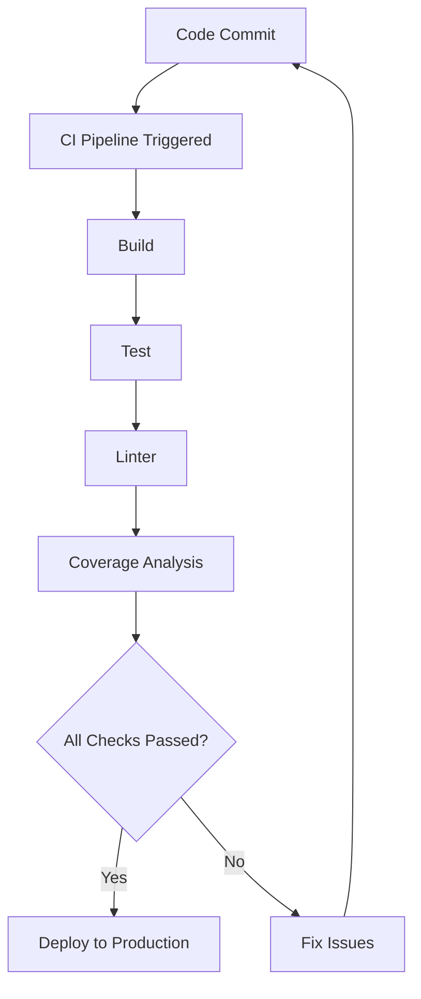

## 22.9. Continuous Integration and Deployment

In the fast-paced world of software development, ensuring that your code is always in a deployable state is crucial. Continuous Integration (CI) and Continuous Deployment (CD) are practices that help automate the testing and deployment processes, making it easier to maintain high-quality code and deliver updates quickly. In this section, we'll explore how to implement CI/CD in Rust projects, leveraging tools like GitHub Actions, Travis CI, and GitLab CI.

### Understanding CI/CD

**Continuous Integration (CI)** is a development practice where developers integrate code into a shared repository frequently, ideally several times a day. Each integration is verified by an automated build and tests, allowing teams to detect problems early.

**Continuous Deployment (CD)** extends CI by automatically deploying code changes to a production environment after passing the CI pipeline. This practice ensures that software can be released to users quickly and reliably.

#### Benefits of CI/CD

- **Early Detection of Errors**: Automated tests run with each code change, catching bugs early in the development cycle.
- **Faster Release Cycles**: Automating the build, test, and deployment processes reduces the time to market for new features.
- **Improved Collaboration**: CI/CD encourages frequent code integration, improving collaboration among team members.
- **Consistent Quality**: Automated testing ensures that code quality is maintained across all changes.

### Setting Up CI Pipelines

To set up a CI pipeline for a Rust project, you can use various CI services. Let's explore how to configure CI pipelines using GitHub Actions, Travis CI, and GitLab CI.

#### GitHub Actions

GitHub Actions is a powerful CI/CD tool integrated directly into GitHub. It allows you to automate workflows for your Rust projects.

**Example: Configuring a CI Pipeline with GitHub Actions**

Create a `.github/workflows/ci.yml` file in your repository:

```yaml
name: Rust CI

on:
  push:
    branches:
      - main
  pull_request:
    branches:
      - main

jobs:
  build:
    runs-on: ubuntu-latest

    steps:
    - uses: actions/checkout@v2

    - name: Set up Rust
      uses: actions-rs/toolchain@v1
      with:
        toolchain: stable
        override: true

    - name: Build
      run: cargo build --verbose

    - name: Run tests
      run: cargo test --verbose

    - name: Run linter
      run: cargo clippy -- -D warnings

    - name: Run coverage
      run: cargo tarpaulin --out Xml

    - name: Upload coverage to Codecov
      uses: codecov/codecov-action@v2
      with:
        file: ./coverage.xml
```

**Explanation:**

- **Triggering Events**: The workflow triggers on pushes and pull requests to the `main` branch.
- **Jobs**: The `build` job runs on the latest Ubuntu environment.
- **Steps**: The steps include checking out the code, setting up Rust, building the project, running tests, linting with Clippy, generating coverage reports with Tarpaulin, and uploading coverage to Codecov.

#### Travis CI

Travis CI is another popular CI service that supports Rust projects. Here's how you can set it up:

**Example: Configuring a CI Pipeline with Travis CI**

Create a `.travis.yml` file in your repository:

```yaml
language: rust
rust:
  - stable
  - beta
  - nightly

matrix:
  allow_failures:
    - rust: nightly

script:
  - cargo build --verbose
  - cargo test --verbose
  - cargo clippy -- -D warnings
  - cargo tarpaulin --out Xml

after_success:
  - bash <(curl -s https://codecov.io/bash)
```

**Explanation:**

- **Rust Versions**: The pipeline tests against stable, beta, and nightly Rust versions.
- **Allow Failures**: Failures in the nightly build are allowed, as nightly builds can be unstable.
- **Script**: The script section runs the build, tests, linter, and coverage analysis.
- **After Success**: Coverage results are uploaded to Codecov.

#### GitLab CI

GitLab CI is integrated into GitLab and provides robust CI/CD capabilities.

**Example: Configuring a CI Pipeline with GitLab CI**

Create a `.gitlab-ci.yml` file in your repository:

```yaml
stages:
  - build
  - test
  - lint
  - coverage

build:
  stage: build
  image: rust:latest
  script:
    - cargo build --verbose

test:
  stage: test
  image: rust:latest
  script:
    - cargo test --verbose

lint:
  stage: lint
  image: rust:latest
  script:
    - cargo clippy -- -D warnings

coverage:
  stage: coverage
  image: rust:latest
  script:
    - cargo tarpaulin --out Xml
  artifacts:
    paths:
      - coverage.xml
  after_script:
    - bash <(curl -s https://codecov.io/bash)
```

**Explanation:**

- **Stages**: The pipeline is divided into build, test, lint, and coverage stages.
- **Images**: Each stage uses the latest Rust Docker image.
- **Artifacts**: Coverage reports are stored as artifacts and uploaded to Codecov.

### Automating Deployment Processes

Automating deployment processes involves versioning, artifact publishing, and deploying to production environments. Let's explore how to achieve this in Rust projects.

#### Versioning and Artifact Publishing

Versioning is crucial for tracking changes and ensuring compatibility. In Rust, you can automate versioning and artifact publishing using tools like `cargo-release`.

**Example: Automating Versioning with `cargo-release`**

Add `cargo-release` to your project:

```toml
[dependencies]
cargo-release = "0.16"
```

Configure `release.toml`:

```toml
[release]
tag = true
push = true
```

Run the release command:

```bash
cargo release
```

**Explanation:**

- **Configuration**: The `release.toml` file configures the release process, enabling tagging and pushing changes.
- **Release Command**: The `cargo release` command automates version bumping, tagging, and pushing to the repository.

#### Deploying to Production

Deploying Rust applications can involve various strategies, such as deploying to cloud platforms or containerizing applications with Docker.

**Example: Deploying a Rust Application with Docker**

Create a `Dockerfile` for your Rust application:

```dockerfile
FROM rust:latest as builder
WORKDIR /usr/src/myapp
COPY . .
RUN cargo install --path .

FROM debian:buster-slim
COPY --from=builder /usr/local/cargo/bin/myapp /usr/local/bin/myapp
CMD ["myapp"]
```

Build and run the Docker container:

```bash
docker build -t myapp .
docker run -p 8080:8080 myapp
```

**Explanation:**

- **Multi-Stage Build**: The Dockerfile uses a multi-stage build to compile the Rust application and copy the binary to a slim Debian image.
- **Running the Container**: The application is run inside a Docker container, exposing port 8080.

### Best Practices for CI/CD Pipelines

Maintaining reliable and efficient CI/CD pipelines requires following best practices:

- **Keep Pipelines Simple**: Avoid complex scripts and configurations. Use tools and services that integrate well with your workflow.
- **Run Tests in Parallel**: Speed up the CI process by running tests in parallel when possible.
- **Monitor Pipeline Performance**: Regularly review pipeline performance and optimize slow steps.
- **Secure Secrets**: Use environment variables or secret management tools to handle sensitive information.
- **Regularly Update Dependencies**: Keep dependencies up to date to avoid security vulnerabilities and compatibility issues.
- **Use Caching**: Cache dependencies and build artifacts to reduce build times.

### Visualizing CI/CD Workflow

To better understand the CI/CD workflow, let's visualize a typical pipeline using a flowchart.



**Description**: This flowchart illustrates a typical CI/CD workflow, starting from a code commit, triggering the CI pipeline, and progressing through build, test, lint, and coverage analysis stages. If all checks pass, the code is deployed to production; otherwise, issues are fixed, and the cycle repeats.

### Knowledge Check

Before we conclude, let's reinforce what we've learned with some questions and exercises.

1. **What are the key benefits of implementing CI/CD in Rust projects?**
2. **How can you configure a CI pipeline using GitHub Actions for a Rust project?**
3. **What are some best practices for maintaining efficient CI/CD pipelines?**

### Embrace the Journey

Remember, implementing CI/CD is a journey that requires continuous improvement and adaptation. As you progress, you'll discover new tools and techniques to enhance your workflows. Keep experimenting, stay curious, and enjoy the journey!

## Quiz Time!



### What is the primary goal of Continuous Integration (CI)?

- [x] To integrate code into a shared repository frequently and verify it with automated builds and tests.
- [ ] To deploy code changes to production automatically.
- [ ] To manage versioning and artifact publishing.
- [ ] To run manual tests on code changes.

> **Explanation:** Continuous Integration focuses on integrating code changes frequently and verifying them with automated builds and tests.

### Which CI service is integrated directly into GitHub?

- [x] GitHub Actions
- [ ] Travis CI
- [ ] GitLab CI
- [ ] Jenkins

> **Explanation:** GitHub Actions is integrated directly into GitHub, providing CI/CD capabilities.

### What is the purpose of the `cargo clippy` command in a CI pipeline?

- [x] To run a linter and catch common mistakes and improve code quality.
- [ ] To build the Rust project.
- [ ] To run tests.
- [ ] To generate coverage reports.

> **Explanation:** `cargo clippy` is a linter that helps catch common mistakes and improve code quality.

### What is a best practice for handling sensitive information in CI/CD pipelines?

- [x] Use environment variables or secret management tools.
- [ ] Hardcode secrets in the CI configuration files.
- [ ] Share secrets openly among team members.
- [ ] Store secrets in plain text files.

> **Explanation:** Using environment variables or secret management tools is a best practice for handling sensitive information securely.

### Which of the following is a benefit of using Docker for deploying Rust applications?

- [x] Consistent environment across different deployment stages.
- [ ] Increased build times.
- [ ] Manual dependency management.
- [ ] Reduced application performance.

> **Explanation:** Docker provides a consistent environment across different deployment stages, ensuring that applications run the same way in development, testing, and production.

### What does the `cargo release` command automate in Rust projects?

- [x] Version bumping, tagging, and pushing changes to the repository.
- [ ] Running tests and generating coverage reports.
- [ ] Building the Rust project.
- [ ] Running a linter.

> **Explanation:** `cargo release` automates version bumping, tagging, and pushing changes to the repository.

### What is the purpose of the `allow_failures` configuration in Travis CI?

- [x] To allow certain builds to fail without affecting the overall build status.
- [ ] To prevent any build failures.
- [ ] To run tests in parallel.
- [ ] To deploy code changes automatically.

> **Explanation:** `allow_failures` allows certain builds, such as those using nightly Rust, to fail without affecting the overall build status.

### Which command is used to build a Docker image for a Rust application?

- [x] `docker build`
- [ ] `cargo build`
- [ ] `docker run`
- [ ] `cargo install`

> **Explanation:** `docker build` is used to build a Docker image for a Rust application.

### What is the main advantage of running tests in parallel in a CI pipeline?

- [x] To speed up the CI process.
- [ ] To ensure tests run sequentially.
- [ ] To increase the complexity of the CI pipeline.
- [ ] To reduce the number of tests.

> **Explanation:** Running tests in parallel speeds up the CI process, reducing the time it takes to get feedback on code changes.

### True or False: Continuous Deployment (CD) automatically deploys code changes to production after passing the CI pipeline.

- [x] True
- [ ] False

> **Explanation:** Continuous Deployment automatically deploys code changes to production after they pass the CI pipeline, ensuring quick and reliable releases.



By implementing CI/CD in your Rust projects, you can streamline your development process, improve code quality, and deliver features faster. Keep exploring and refining your workflows to make the most of these powerful practices.
