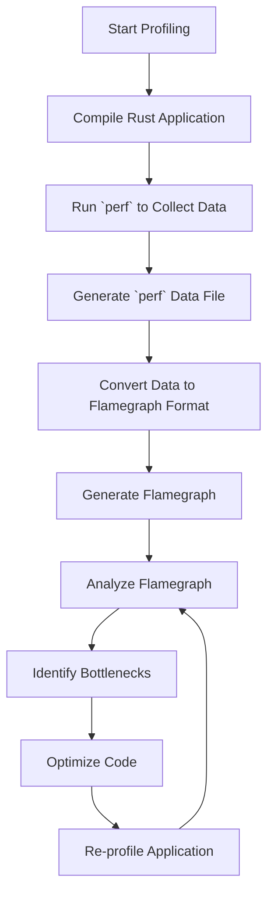

## 23.1. Profiling Tools and Techniques (`perf`, Flamegraph)

In the realm of software development, performance optimization is a critical aspect that can significantly impact the efficiency and responsiveness of applications. Profiling is a powerful technique used to analyze the performance characteristics of a program, identify bottlenecks, and guide optimization efforts. In this section, we will delve into the world of profiling tools, focusing on `perf` and Flamegraph, and how they can be effectively used with Rust applications.

### Introduction to Profiling

Profiling is the process of measuring the space (memory) and time complexity of a program, identifying sections of code that consume the most resources, and understanding the program's runtime behavior. Profiling tools help developers pinpoint performance bottlenecks, such as functions or loops that take the most time to execute, and provide insights into how to optimize them.

#### Why Profiling Matters

- **Identify Bottlenecks**: Profiling helps in identifying the parts of the code that are the most resource-intensive.
- **Guide Optimization**: By knowing where the bottlenecks are, developers can focus their optimization efforts on the most critical parts of the code.
- **Improve Efficiency**: Optimizing the identified bottlenecks can lead to significant improvements in the application's performance.
- **Resource Management**: Profiling aids in better management of system resources, ensuring that applications run smoothly and efficiently.

### Profiling Tools for Rust

Rust, being a systems programming language, is often used in performance-critical applications. Profiling tools like `perf` and Flamegraph are invaluable in analyzing Rust applications' performance.

#### `perf`

`perf` is a powerful performance analysis tool for Linux systems. It provides a wide range of performance monitoring capabilities, including CPU performance counters, tracepoints, and dynamic probes. `perf` can be used to collect performance data and analyze it to identify performance bottlenecks in Rust applications.

##### Using `perf` with Rust

1. **Install `perf`**: Ensure that `perf` is installed on your system. On most Linux distributions, it can be installed via the package manager.

   ```bash
   sudo apt-get install linux-tools-common linux-tools-generic linux-tools-$(uname -r)
   ```

2. **Compile Rust Application with Debug Symbols**: To get meaningful profiling data, compile your Rust application with debug symbols.

   ```bash
   cargo build --release
   ```

3. **Run `perf` to Collect Data**: Use `perf` to record performance data while running your Rust application.

   ```bash
   perf record -g ./target/release/your_application
   ```

   The `-g` option enables call graph (stack trace) recording.

4. **Analyze the Collected Data**: Use `perf report` to analyze the collected data.

   ```bash
   perf report
   ```

   This command will display a report of the performance data, showing which functions consumed the most CPU time.

#### Flamegraph

Flamegraph is a visualization tool that helps in understanding the performance characteristics of an application by generating flame graphs. Flame graphs are a graphical representation of profiled software, where the x-axis represents stack traces and the y-axis represents the time spent in each function.

##### Generating Flame Graphs

1. **Install Flamegraph**: Install the Flamegraph tool from its GitHub repository.

   ```bash
   git clone https://github.com/brendangregg/Flamegraph.git
   ```

2. **Generate a `perf` Data File**: Use `perf` to generate a data file with stack traces.

   ```bash
   perf record -F 99 -a -g -- ./target/release/your_application
   ```

   The `-F 99` option sets the sampling frequency to 99 Hz.

3. **Convert `perf` Data to Flamegraph Format**: Use `perf script` to convert the `perf` data into a format suitable for Flamegraph.

   ```bash
   perf script > out.perf
   ```

4. **Generate the Flamegraph**: Use the `stackcollapse-perf.pl` and `flamegraph.pl` scripts to generate the flame graph.

   ```bash
   ./Flamegraph/stackcollapse-perf.pl out.perf > out.folded
   ./Flamegraph/flamegraph.pl out.folded > flamegraph.svg
   ```

5. **View the Flamegraph**: Open the `flamegraph.svg` file in a web browser to view the flame graph.

   

   The flame graph provides a visual representation of the application's performance, with wider blocks indicating functions that consume more CPU time.

### Sampling vs. Instrumentation Profiling

Profiling can be broadly categorized into two types: sampling and instrumentation.

#### Sampling Profiling

- **Definition**: Sampling profiling involves periodically checking the state of the program to gather statistical data about its execution.
- **Advantages**: Low overhead, suitable for long-running applications.
- **Disadvantages**: May miss short-lived functions or events.

#### Instrumentation Profiling

- **Definition**: Instrumentation profiling involves inserting code into the program to record detailed information about its execution.
- **Advantages**: Provides detailed information, including exact execution times.
- **Disadvantages**: Higher overhead, can affect the program's performance.

### Best Practices for Profiling and Optimization

- **Profile Before Optimizing**: Always profile your application before attempting any optimizations to ensure that you are focusing on the right areas.
- **Use Release Builds**: Profile release builds of your application to get accurate performance data.
- **Iterate**: Profiling and optimization should be an iterative process. Profile, optimize, and then profile again to measure the impact of your changes.
- **Focus on Hotspots**: Concentrate your optimization efforts on the parts of the code that consume the most resources.
- **Consider Trade-offs**: Optimization often involves trade-offs, such as increased complexity or reduced readability. Consider these trade-offs carefully before making changes.

### Code Example: Profiling a Rust Application

Let's consider a simple Rust application that calculates the Fibonacci sequence. We'll use `perf` and Flamegraph to profile its performance.

```rust
fn fibonacci(n: u64) -> u64 {
    match n {
        0 => 0,
        1 => 1,
        _ => fibonacci(n - 1) + fibonacci(n - 2),
    }
}

fn main() {
    let n = 40;
    println!("Fibonacci({}) = {}", n, fibonacci(n));
}
```

#### Steps to Profile

1. **Compile the Application**: Compile the application with debug symbols.

   ```bash
   cargo build --release
   ```

2. **Run `perf`**: Use `perf` to collect performance data.

   ```bash
   perf record -g ./target/release/fibonacci
   ```

3. **Generate Flamegraph**: Follow the steps outlined earlier to generate a flame graph.

4. **Analyze the Results**: Use the flame graph to identify the bottleneck in the `fibonacci` function and consider optimizing it using a more efficient algorithm, such as dynamic programming.

### Try It Yourself

Experiment with the provided code example by modifying the `fibonacci` function to use an iterative approach instead of recursion. Profile the modified application to observe the performance improvements.

### Visualizing Profiling Data

To better understand the profiling process, let's visualize the workflow using a Mermaid.js diagram.



### References and Further Reading

- [Linux `perf` Wiki](https://perf.wiki.kernel.org/index.php/Main_Page)
- [Flamegraph GitHub Repository](https://github.com/brendangregg/Flamegraph)
- [Rust Performance Book](https://nnethercote.github.io/perf-book/)

### Knowledge Check

To reinforce your understanding of profiling tools and techniques, consider the following questions and exercises.

## Quiz Time!



### What is the primary purpose of profiling in software development?

- [x] To identify performance bottlenecks and guide optimization efforts
- [ ] To increase the complexity of the code
- [ ] To reduce the size of the application
- [ ] To improve the aesthetics of the code

> **Explanation:** Profiling is used to identify performance bottlenecks and guide optimization efforts, improving the efficiency and responsiveness of applications.

### Which tool is used to generate flame graphs for Rust applications?

- [ ] `cargo`
- [ ] `rustc`
- [x] Flamegraph
- [ ] `gdb`

> **Explanation:** Flamegraph is a tool used to generate flame graphs, which are visual representations of profiled software.

### What is the difference between sampling and instrumentation profiling?

- [x] Sampling profiling periodically checks the program state, while instrumentation profiling inserts code to record execution details.
- [ ] Sampling profiling records execution details, while instrumentation profiling periodically checks the program state.
- [ ] Both are the same.
- [ ] Neither is used in Rust.

> **Explanation:** Sampling profiling periodically checks the program state, while instrumentation profiling inserts code to record detailed execution information.

### What is the advantage of using sampling profiling?

- [x] Low overhead
- [ ] High overhead
- [ ] Detailed information
- [ ] No information

> **Explanation:** Sampling profiling has low overhead, making it suitable for long-running applications.

### Which command is used to record performance data with `perf`?

- [ ] `perf analyze`
- [x] `perf record`
- [ ] `perf compile`
- [ ] `perf optimize`

> **Explanation:** The `perf record` command is used to collect performance data.

### What is the significance of the `-g` option in the `perf record` command?

- [x] It enables call graph (stack trace) recording.
- [ ] It increases the sampling frequency.
- [ ] It reduces the sampling frequency.
- [ ] It disables call graph recording.

> **Explanation:** The `-g` option in the `perf record` command enables call graph (stack trace) recording.

### What should you do before optimizing your Rust application?

- [x] Profile the application to identify bottlenecks.
- [ ] Optimize without profiling.
- [ ] Increase the application's complexity.
- [ ] Reduce the application's functionality.

> **Explanation:** Profiling the application before optimizing helps identify bottlenecks and focus optimization efforts on the right areas.

### What is the purpose of the `stackcollapse-perf.pl` script in the Flamegraph workflow?

- [x] To convert `perf` data into a format suitable for Flamegraph
- [ ] To compile the Rust application
- [ ] To run the Rust application
- [ ] To analyze the Rust application

> **Explanation:** The `stackcollapse-perf.pl` script converts `perf` data into a format suitable for generating flame graphs.

### What is a key benefit of using flame graphs?

- [x] They provide a visual representation of the application's performance.
- [ ] They increase the application's size.
- [ ] They reduce the application's complexity.
- [ ] They improve the application's aesthetics.

> **Explanation:** Flame graphs provide a visual representation of the application's performance, helping identify bottlenecks.

### True or False: Profiling should be an iterative process.

- [x] True
- [ ] False

> **Explanation:** Profiling and optimization should be an iterative process, where you profile, optimize, and then profile again to measure the impact of changes.



Remember, this is just the beginning of your journey into performance optimization with Rust. As you progress, you'll gain deeper insights into your applications' behavior and learn how to make them more efficient. Keep experimenting, stay curious, and enjoy the journey!
