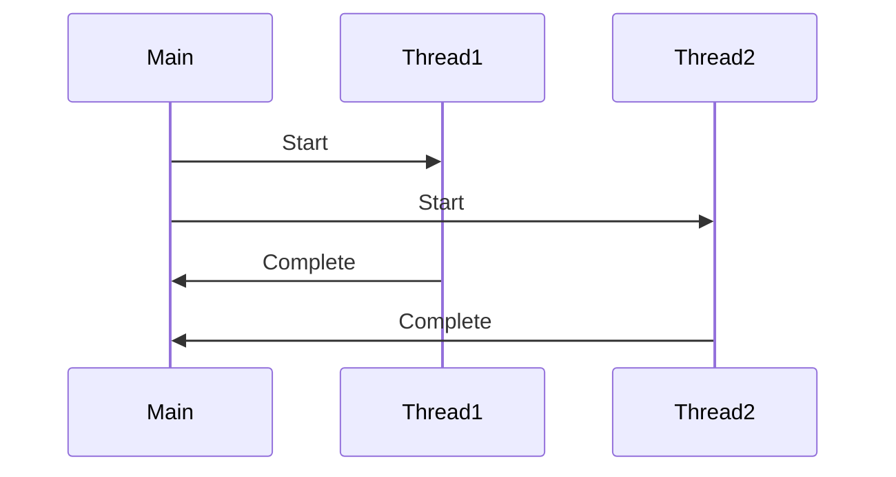

## 23.10. Performance Considerations in Concurrency

Concurrency in Rust is a powerful tool that, when used correctly, can significantly enhance the performance of applications. However, it also introduces complexities that can lead to performance degradation if not managed properly. In this section, we will delve into the performance considerations necessary for building efficient concurrent applications in Rust. We will explore thread management, synchronization overhead, lock-free data structures, async programming, and techniques for measuring and optimizing concurrency performance.

### Understanding Concurrency Overhead

Concurrency introduces overhead due to the need for managing multiple threads and synchronizing access to shared resources. This overhead can negate the performance benefits of concurrency if not handled carefully.

#### Thread Management

Managing threads involves creating, scheduling, and destroying threads, which can be resource-intensive. Rust provides the `std::thread` module for thread management, but it's crucial to understand the costs associated with thread creation and context switching.

```rust
use std::thread;

fn main() {
    let handles: Vec<_> = (0..10).map(|i| {
        thread::spawn(move || {
            println!("Thread {} is running", i);
        })
    }).collect();

    for handle in handles {
        handle.join().unwrap();
    }
}
```

In the example above, we spawn ten threads, each printing a message. While this is a simple demonstration, in real-world scenarios, excessive thread creation can lead to significant overhead. Consider using thread pools to manage threads efficiently.

#### Synchronization Overhead

Synchronization is necessary to ensure data consistency across threads, but it can introduce contention and degrade performance. Rust offers several synchronization primitives, such as `Mutex`, `RwLock`, and `Condvar`, each with its own performance characteristics.

```rust
use std::sync::{Arc, Mutex};
use std::thread;

fn main() {
    let counter = Arc::new(Mutex::new(0));
    let mut handles = vec![];

    for _ in 0..10 {
        let counter = Arc::clone(&counter);
        let handle = thread::spawn(move || {
            let mut num = counter.lock().unwrap();
            *num += 1;
        });
        handles.push(handle);
    }

    for handle in handles {
        handle.join().unwrap();
    }

    println!("Result: {}", *counter.lock().unwrap());
}
```

In this example, a `Mutex` is used to protect access to a shared counter. While `Mutex` ensures safe access, it can become a bottleneck if many threads attempt to lock it simultaneously. To minimize contention, consider using lock-free data structures or atomic operations.

### Minimizing Contention and Avoiding Deadlocks

Contention occurs when multiple threads compete for the same resource, leading to performance bottlenecks. Deadlocks, on the other hand, occur when two or more threads are waiting indefinitely for resources held by each other.

#### Strategies to Minimize Contention

1. **Reduce Lock Scope**: Limit the duration for which locks are held to minimize contention.
2. **Use Read-Write Locks**: Use `RwLock` when reads are more frequent than writes, allowing multiple readers simultaneously.
3. **Partition Data**: Divide data into smaller, independent chunks to reduce contention.

#### Avoiding Deadlocks

Deadlocks can be avoided by following these strategies:

1. **Lock Ordering**: Always acquire locks in a consistent order across threads.
2. **Timeouts**: Use timeouts when acquiring locks to prevent indefinite waiting.
3. **Deadlock Detection**: Implement mechanisms to detect and recover from deadlocks.

### Lock-Free Data Structures and Atomic Operations

Lock-free data structures and atomic operations can help reduce synchronization overhead by allowing concurrent access without locks.

#### Atomic Operations

Rust provides atomic types in the `std::sync::atomic` module, which can be used for lock-free programming.

```rust
use std::sync::atomic::{AtomicUsize, Ordering};
use std::thread;

fn main() {
    let counter = AtomicUsize::new(0);
    let mut handles = vec![];

    for _ in 0..10 {
        let counter = &counter;
        let handle = thread::spawn(move || {
            counter.fetch_add(1, Ordering::SeqCst);
        });
        handles.push(handle);
    }

    for handle in handles {
        handle.join().unwrap();
    }

    println!("Result: {}", counter.load(Ordering::SeqCst));
}
```

In this example, `AtomicUsize` is used to increment a counter without locks. Atomic operations are generally faster than locks but require careful handling of memory ordering.

#### Lock-Free Data Structures

Lock-free data structures, such as concurrent queues and stacks, allow multiple threads to operate on them without locks. Libraries like `crossbeam` provide lock-free data structures for Rust.

### Leveraging Async Programming

Async programming in Rust allows handling concurrency efficiently by using non-blocking operations. The `async`/`await` syntax in Rust makes it easier to write asynchronous code.

```rust
use tokio::time::{sleep, Duration};

#[tokio::main]
async fn main() {
    let task1 = tokio::spawn(async {
        sleep(Duration::from_secs(1)).await;
        println!("Task 1 completed");
    });

    let task2 = tokio::spawn(async {
        sleep(Duration::from_secs(2)).await;
        println!("Task 2 completed");
    });

    task1.await.unwrap();
    task2.await.unwrap();
}
```

In this example, two tasks are executed concurrently using `tokio::spawn`. Async programming is particularly useful for I/O-bound tasks, where threads can be freed up while waiting for I/O operations to complete.

### Measuring Concurrency Performance

To optimize concurrency performance, it's essential to measure and identify bottlenecks. Tools like `perf`, `Flamegraph`, and `cargo-flamegraph` can help profile Rust applications.

#### Identifying Issues

1. **Profile Your Application**: Use profiling tools to identify hot spots and bottlenecks.
2. **Analyze Lock Contention**: Check for excessive lock contention and optimize lock usage.
3. **Monitor Thread Usage**: Ensure that threads are utilized efficiently and not idling.

### Try It Yourself

Experiment with the code examples provided by modifying the number of threads or tasks. Observe how changes affect performance and identify potential bottlenecks.

### Visualizing Concurrency

To better understand concurrency, let's visualize a simple thread interaction using a sequence diagram.



This diagram illustrates the interaction between the main thread and two worker threads. Understanding such interactions can help in designing efficient concurrent systems.

### Key Takeaways

- **Minimize Overhead**: Use thread pools and async programming to reduce thread management overhead.
- **Avoid Contention**: Use lock-free data structures and atomic operations to minimize contention.
- **Prevent Deadlocks**: Follow best practices to avoid deadlocks, such as consistent lock ordering.
- **Measure and Optimize**: Regularly profile your application to identify and address performance bottlenecks.

### Embrace the Journey

Concurrency in Rust offers immense potential for performance gains, but it requires careful consideration and management. Remember, this is just the beginning. As you continue to explore Rust's concurrency model, you'll discover more advanced techniques and optimizations. Keep experimenting, stay curious, and enjoy the journey!

## Quiz Time!



### What is a common overhead associated with concurrency in Rust?

- [x] Thread management
- [ ] Memory allocation
- [ ] File I/O
- [ ] Network latency

> **Explanation:** Thread management involves creating, scheduling, and destroying threads, which can introduce significant overhead in concurrent applications.

### Which Rust module provides atomic types for lock-free programming?

- [x] `std::sync::atomic`
- [ ] `std::thread`
- [ ] `std::sync::Mutex`
- [ ] `std::collections`

> **Explanation:** The `std::sync::atomic` module provides atomic types that can be used for lock-free programming in Rust.

### What is a strategy to minimize contention in concurrent Rust applications?

- [x] Reduce lock scope
- [ ] Increase thread count
- [ ] Use more locks
- [ ] Avoid using atomic operations

> **Explanation:** Reducing the scope of locks minimizes the duration for which locks are held, thereby reducing contention.

### How can deadlocks be avoided in Rust?

- [x] Lock ordering
- [ ] Increasing thread priority
- [ ] Using more threads
- [ ] Ignoring lock contention

> **Explanation:** Consistent lock ordering across threads can help avoid deadlocks by preventing circular wait conditions.

### What is the benefit of using async programming in Rust?

- [x] Efficient handling of I/O-bound tasks
- [ ] Faster CPU-bound computations
- [ ] Reduced memory usage
- [ ] Simplified error handling

> **Explanation:** Async programming allows for efficient handling of I/O-bound tasks by freeing up threads while waiting for I/O operations to complete.

### Which tool can be used to profile Rust applications?

- [x] `cargo-flamegraph`
- [ ] `cargo-test`
- [ ] `cargo-build`
- [ ] `cargo-run`

> **Explanation:** `cargo-flamegraph` is a tool that can be used to profile Rust applications and visualize performance bottlenecks.

### What is a lock-free data structure?

- [x] A data structure that allows concurrent access without locks
- [ ] A data structure that uses minimal locks
- [ ] A data structure that is not thread-safe
- [ ] A data structure that requires exclusive locks

> **Explanation:** Lock-free data structures allow multiple threads to operate on them concurrently without the need for locks.

### What is the purpose of using `RwLock` in Rust?

- [x] To allow multiple readers or one writer at a time
- [ ] To prevent any access to shared data
- [ ] To allow only one reader at a time
- [ ] To increase the number of threads

> **Explanation:** `RwLock` allows multiple readers or one writer at a time, making it suitable for scenarios where reads are more frequent than writes.

### How can you measure concurrency performance in Rust?

- [x] By profiling the application
- [ ] By increasing the number of threads
- [ ] By reducing the number of locks
- [ ] By using more atomic operations

> **Explanation:** Profiling the application helps identify performance bottlenecks and measure concurrency performance.

### True or False: Deadlocks can be completely avoided by using atomic operations.

- [ ] True
- [x] False

> **Explanation:** While atomic operations can reduce the need for locks, they do not inherently prevent deadlocks, which are caused by circular wait conditions.


