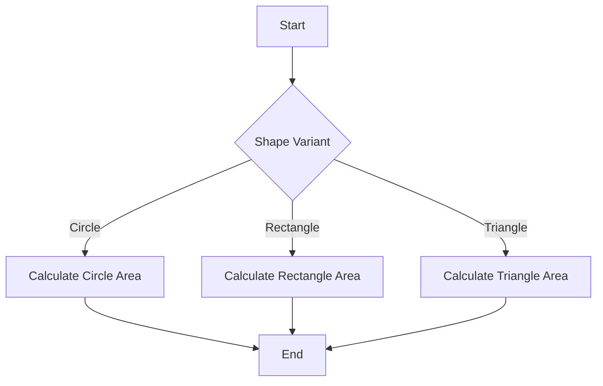

## 23.11. Optimizing Pattern Matching

Pattern matching is a powerful feature in Rust that allows developers to destructure and inspect data in a concise and expressive manner. However, writing efficient pattern matching code requires an understanding of how Rust compiles these patterns and the impact of different constructs on performance. In this section, we will explore techniques for optimizing pattern matching in Rust, focusing on compiler optimizations, ordering of match arms, use of guards, and alternatives like `if let` and `while let`.

### Understanding Rust's Pattern Matching Compilation

Rust's pattern matching is compiled into a series of conditional checks and jumps, which the compiler optimizes for performance. The Rust compiler uses a decision tree approach to evaluate patterns, which involves the following steps:

1. **Pattern Decomposition**: The compiler breaks down complex patterns into simpler components.
2. **Decision Tree Construction**: A decision tree is built to determine the order of checks needed to match a pattern.
3. **Optimization**: The compiler applies various optimizations to minimize the number of checks and jumps.

Understanding this process is crucial for writing efficient pattern matching code. Let's dive deeper into each step.

#### Pattern Decomposition

When you write a match expression, the Rust compiler decomposes the patterns into simpler components. For example, consider the following code:

```rust
enum Shape {
    Circle(f64),
    Rectangle(f64, f64),
    Triangle(f64, f64, f64),
}

fn area(shape: Shape) -> f64 {
    match shape {
        Shape::Circle(radius) => std::f64::consts::PI * radius * radius,
        Shape::Rectangle(width, height) => width * height,
        Shape::Triangle(a, b, c) => {
            let s = (a + b + c) / 2.0;
            (s * (s - a) * (s - b) * (s - c)).sqrt()
        }
    }
}
```

In this example, the compiler decomposes the `Shape` enum into its variants and the associated data. This decomposition allows the compiler to generate efficient code for each pattern.

#### Decision Tree Construction

The compiler constructs a decision tree to evaluate the patterns. This tree represents the sequence of checks needed to match a pattern. The goal is to minimize the depth of the tree, which reduces the number of checks and jumps.

#### Optimization

The Rust compiler applies several optimizations to the decision tree, such as:

- **Common Subexpression Elimination**: Reusing the results of common subexpressions to avoid redundant calculations.
- **Jump Table Generation**: Creating a jump table for patterns with a large number of variants, allowing for constant-time dispatch.

### Guidelines for Ordering Match Arms

The order of match arms can significantly impact performance. Here are some guidelines for ordering match arms efficiently:

1. **Place Common Cases First**: If certain patterns are more common, place them at the top of the match expression. This reduces the number of checks for common cases.

2. **Use Specific Patterns Before General Ones**: Specific patterns should precede general patterns to avoid unnecessary checks. For example, match specific enum variants before using a wildcard pattern (`_`).

3. **Avoid Overlapping Patterns**: Overlapping patterns can lead to redundant checks. Ensure that patterns are mutually exclusive when possible.

### Using Guards in Pattern Matching

Guards are additional conditions that can be used in pattern matching to refine the match. While guards can increase the expressiveness of patterns, they can also impact performance if not used judiciously.

#### Impact of Guards on Performance

Guards introduce additional checks in the decision tree, which can increase the complexity of the match expression. To mitigate this, consider the following:

- **Use Guards Sparingly**: Only use guards when necessary to avoid unnecessary checks.
- **Optimize Guard Conditions**: Ensure that guard conditions are efficient and do not involve expensive computations.

#### Example of Guards in Pattern Matching

```rust
fn classify_number(n: i32) -> &'static str {
    match n {
        x if x < 0 => "negative",
        0 => "zero",
        x if x > 0 => "positive",
        _ => "unknown",
    }
}
```

In this example, guards are used to classify numbers as negative, zero, or positive. The guard conditions are simple and efficient, minimizing their impact on performance.

### When to Use `if let` or `while let`

For simpler patterns, `if let` and `while let` can be more efficient alternatives to full match expressions. These constructs are useful when you only need to match a single pattern.

#### Using `if let`

`if let` is ideal for cases where you want to match a single pattern and perform an action if the match is successful. Here's an example:

```rust
fn print_circle_area(shape: Shape) {
    if let Shape::Circle(radius) = shape {
        println!("Circle area: {}", std::f64::consts::PI * radius * radius);
    }
}
```

In this example, `if let` is used to match the `Circle` variant and calculate its area. This approach is more concise and efficient than a full match expression.

#### Using `while let`

`while let` is useful for iterating over a collection and matching a single pattern. Here's an example:

```rust
fn print_circle_areas(shapes: Vec<Shape>) {
    let mut iter = shapes.into_iter();
    while let Some(Shape::Circle(radius)) = iter.next() {
        println!("Circle area: {}", std::f64::consts::PI * radius * radius);
    }
}
```

In this example, `while let` is used to iterate over a vector of shapes and print the area of each circle. This approach is efficient and easy to read.

### Encouraging Clear and Concise Pattern Matching

Clear and concise pattern matching is essential for both readability and performance. Here are some tips for writing clear pattern matching code:

1. **Use Descriptive Variable Names**: Use meaningful variable names in patterns to improve readability.

2. **Avoid Deep Nesting**: Deeply nested patterns can be difficult to read and understand. Flatten patterns when possible.

3. **Leverage Enums and Structs**: Use enums and structs to represent complex data structures, making pattern matching more intuitive.

4. **Document Complex Patterns**: Add comments to explain complex patterns and their purpose.

### Visualizing Pattern Matching Optimization

To better understand how pattern matching optimization works, let's visualize the decision tree for a simple match expression using Mermaid.js:



**Diagram Description**: This diagram represents the decision tree for matching a `Shape` enum. The tree branches based on the variant of the shape, with each branch leading to the calculation of the area for that shape.

### References and Further Reading

- [Rust Language Reference](https://doc.rust-lang.org/reference/)
- [Rust by Example: Pattern Matching](https://doc.rust-lang.org/rust-by-example/flow_control/match.html)
- [The Rust Programming Language Book](https://doc.rust-lang.org/book/)

### Knowledge Check

- What is the impact of guards on pattern matching performance?
- How does the order of match arms affect efficiency?
- When should you use `if let` or `while let` instead of a full match expression?

### Embrace the Journey

Remember, optimizing pattern matching is just one aspect of writing efficient Rust code. As you continue to explore Rust's features and capabilities, you'll discover new ways to improve your code's performance and readability. Keep experimenting, stay curious, and enjoy the journey!

## Quiz Time!



### What is the primary purpose of pattern decomposition in Rust's compiler?

- [x] To break down complex patterns into simpler components for efficient matching.
- [ ] To eliminate the need for pattern matching altogether.
- [ ] To increase the complexity of the decision tree.
- [ ] To convert patterns into a different programming language.

> **Explanation:** Pattern decomposition helps the compiler break down complex patterns into simpler components, allowing for more efficient matching.

### How does the order of match arms affect performance?

- [x] Placing common cases first reduces the number of checks.
- [ ] The order of match arms has no impact on performance.
- [ ] Placing common cases last improves performance.
- [ ] The order only affects readability, not performance.

> **Explanation:** Placing common cases first reduces the number of checks needed, improving performance.

### What is a potential downside of using guards in pattern matching?

- [x] They introduce additional checks, which can impact performance.
- [ ] They make the code more readable.
- [ ] They eliminate the need for pattern matching.
- [ ] They simplify the decision tree.

> **Explanation:** Guards introduce additional checks, which can increase the complexity of the decision tree and impact performance.

### When is it appropriate to use `if let`?

- [x] When you need to match a single pattern and perform an action if successful.
- [ ] When you have multiple patterns to match.
- [ ] When you want to avoid pattern matching altogether.
- [ ] When you need to iterate over a collection.

> **Explanation:** `if let` is ideal for matching a single pattern and performing an action if the match is successful.

### Which of the following is a benefit of clear and concise pattern matching?

- [x] Improved readability and performance.
- [ ] Increased complexity of the code.
- [ ] Reduced code efficiency.
- [ ] Elimination of pattern matching.

> **Explanation:** Clear and concise pattern matching improves both readability and performance.

### What is the role of a decision tree in pattern matching?

- [x] To represent the sequence of checks needed to match a pattern.
- [ ] To eliminate the need for pattern matching.
- [ ] To increase the complexity of the code.
- [ ] To convert patterns into a different programming language.

> **Explanation:** A decision tree represents the sequence of checks needed to match a pattern, optimizing the matching process.

### How can you optimize guard conditions in pattern matching?

- [x] Ensure they are efficient and do not involve expensive computations.
- [ ] Use guards for every pattern.
- [ ] Avoid using guards altogether.
- [ ] Make guard conditions as complex as possible.

> **Explanation:** Optimizing guard conditions involves ensuring they are efficient and do not involve expensive computations.

### What is a common optimization applied by the Rust compiler in pattern matching?

- [x] Jump table generation for patterns with many variants.
- [ ] Eliminating the need for pattern matching.
- [ ] Increasing the complexity of the decision tree.
- [ ] Converting patterns into a different programming language.

> **Explanation:** The Rust compiler generates jump tables for patterns with many variants, allowing for constant-time dispatch.

### Why is it important to avoid deep nesting in pattern matching?

- [x] Deeply nested patterns can be difficult to read and understand.
- [ ] Deep nesting improves performance.
- [ ] Deep nesting eliminates the need for pattern matching.
- [ ] Deep nesting simplifies the decision tree.

> **Explanation:** Deeply nested patterns can be difficult to read and understand, so it's important to avoid them when possible.

### True or False: Using `while let` is beneficial for iterating over a collection and matching a single pattern.

- [x] True
- [ ] False

> **Explanation:** `while let` is useful for iterating over a collection and matching a single pattern, making it efficient and easy to read.


