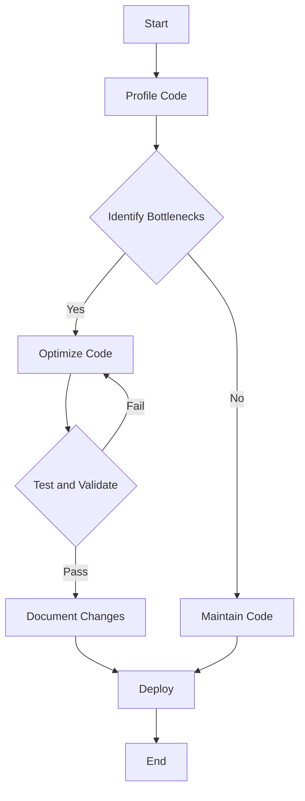

## 23.12. Best Practices for High-Performance Rust Code

In the world of systems programming, Rust stands out for its unique combination of performance and safety. However, achieving optimal performance in Rust requires a deep understanding of its features and best practices. In this section, we will explore key techniques for writing high-performance Rust code, emphasizing the importance of profiling, balancing optimization with maintainability, and the judicious use of unsafe code.

### Profiling and Measuring Performance

Before diving into optimization, it's crucial to identify the parts of your code that need improvement. Profiling is the process of measuring where your program spends its time and how it uses resources. Rust offers several tools for profiling:

- **`perf`**: A powerful Linux tool for performance analysis. It provides insights into CPU usage, cache misses, and more.
- **Flamegraph**: Visualizes stack traces to help identify performance bottlenecks. It can be used in conjunction with `perf`.
- **`cargo bench`**: A built-in Rust tool for benchmarking. It allows you to write performance tests and measure execution time.

#### Example: Using `perf` and Flamegraph

```bash
# Record performance data
perf record -F 99 --call-graph dwarf ./target/release/my_program

# Generate a flamegraph
perf script | flamegraph.pl > flamegraph.svg
```

> **Tip**: Always profile your code before optimizing. This ensures you focus on the most impactful areas.

### Balancing Optimization with Maintainability

While performance is important, it should not come at the cost of code readability and maintainability. Here are some guidelines to balance these aspects:

- **Start with Clear and Idiomatic Code**: Write code that is easy to understand and follows Rust's idioms. This makes future optimizations easier.
- **Optimize Only When Necessary**: Avoid premature optimization. Focus on areas identified by profiling.
- **Document Optimizations**: Clearly document any non-obvious optimizations to help future maintainers understand your code.

### Memory Management and Ownership

Rust's ownership model is a powerful tool for managing memory efficiently. Here are some best practices:

- **Minimize Heap Allocations**: Use stack allocation whenever possible. For example, prefer arrays over vectors when the size is known at compile time.
- **Use `Rc` and `Arc` Sparingly**: Reference counting can introduce overhead. Use `Rc` (Reference Counted) and `Arc` (Atomic Reference Counted) only when necessary.
- **Leverage Borrowing**: Borrowing allows you to use data without taking ownership, reducing unnecessary copies.

#### Example: Efficient Use of `Rc` and `Arc`

```rust
use std::rc::Rc;
use std::sync::Arc;

fn main() {
    // Use Rc for single-threaded reference counting
    let rc_example = Rc::new(5);
    let rc_clone = Rc::clone(&rc_example);

    // Use Arc for multi-threaded reference counting
    let arc_example = Arc::new(5);
    let arc_clone = Arc::clone(&arc_example);
}
```

> **Key Point**: Understand when to use stack vs. heap allocation and the implications of each choice.

### Concurrency and Parallelism

Rust's concurrency model is designed to be safe and efficient. Here are some tips for high-performance concurrent code:

- **Use Channels for Communication**: Rust's channels provide a safe way to communicate between threads.
- **Avoid Blocking Operations**: Use non-blocking I/O and asynchronous programming to keep threads responsive.
- **Leverage `Rayon` for Data Parallelism**: The `Rayon` library makes it easy to parallelize data processing tasks.

#### Example: Parallel Iteration with `Rayon`

```rust
use rayon::prelude::*;

fn main() {
    let numbers: Vec<i32> = (1..1000).collect();
    let sum: i32 = numbers.par_iter().sum();
    println!("Sum: {}", sum);
}
```

> **Try It Yourself**: Modify the range in the example above and observe how `Rayon` handles larger datasets.

### Judicious Use of Unsafe Code

Rust's `unsafe` keyword allows you to bypass some of its safety checks, but it should be used with caution. Here are some guidelines:

- **Limit Unsafe Code to Small, Well-Defined Areas**: Keep unsafe code isolated and well-documented.
- **Use Unsafe Code for Performance-Critical Sections**: Only use unsafe code when it provides a clear performance benefit.
- **Review Unsafe Code Thoroughly**: Ensure that unsafe code is reviewed and tested rigorously.

#### Example: Using Unsafe Code

```rust
fn main() {
    let mut num = 5;
    let r1 = &num as *const i32;
    let r2 = &mut num as *mut i32;

    unsafe {
        println!("r1 is: {}", *r1);
        *r2 = 10;
        println!("r2 is: {}", *r2);
    }
}
```

> **Caution**: Unsafe code can lead to undefined behavior if not used correctly. Always ensure safety invariants are maintained.

### Continuous Learning and Staying Updated

Rust is a rapidly evolving language with frequent updates and improvements. To write high-performance Rust code, it's important to stay informed about the latest developments:

- **Follow Rust RFCs**: Rust's Request for Comments (RFC) process outlines proposed changes and new features.
- **Engage with the Community**: Participate in forums, attend Rust conferences, and contribute to open-source projects.
- **Experiment with New Features**: Try out new language features and libraries to see how they can improve your code.

### Summary and Key Takeaways

- **Profile Before Optimizing**: Use tools like `perf` and Flamegraph to identify bottlenecks.
- **Balance Performance with Maintainability**: Write clear, idiomatic code and optimize only when necessary.
- **Leverage Rust's Ownership Model**: Use stack allocation, borrowing, and reference counting judiciously.
- **Embrace Safe Concurrency**: Use channels and libraries like `Rayon` for efficient parallelism.
- **Use Unsafe Code Sparingly**: Isolate and document unsafe code, and ensure it provides a clear benefit.
- **Stay Informed**: Keep up with Rust's evolution and engage with the community.

### Visualizing Rust's Performance Optimization Workflow



> **Diagram Explanation**: This flowchart illustrates the process of optimizing Rust code. Start by profiling, identify bottlenecks, optimize, test, document, and deploy.

### References and Further Reading

- [Rust Performance Book](https://nnethercote.github.io/perf-book/)
- [Flamegraph GitHub Repository](https://github.com/brendangregg/Flamegraph)
- [Rayon: Data Parallelism in Rust](https://docs.rs/rayon/latest/rayon/)

## Quiz Time!



### What is the first step in optimizing Rust code for performance?

- [x] Profiling the code to identify bottlenecks
- [ ] Writing unsafe code
- [ ] Refactoring for readability
- [ ] Using `Rc` and `Arc` extensively

> **Explanation:** Profiling helps identify the parts of the code that need optimization.

### Which tool is used to visualize stack traces in Rust?

- [ ] `cargo bench`
- [x] Flamegraph
- [ ] `perf`
- [ ] `cargo test`

> **Explanation:** Flamegraph is used to visualize stack traces and identify performance bottlenecks.

### What is the primary benefit of using Rust's ownership model?

- [x] Efficient memory management
- [ ] Simplified syntax
- [ ] Increased code verbosity
- [ ] Automatic garbage collection

> **Explanation:** Rust's ownership model ensures efficient memory management without a garbage collector.

### When should unsafe code be used in Rust?

- [x] Only when it provides a clear performance benefit
- [ ] To simplify code
- [ ] Whenever possible
- [ ] To avoid using the borrow checker

> **Explanation:** Unsafe code should be used sparingly and only when it offers a performance advantage.

### What is the purpose of the `Rayon` library in Rust?

- [ ] To manage memory allocation
- [x] To enable data parallelism
- [ ] To simplify error handling
- [ ] To provide a GUI framework

> **Explanation:** `Rayon` is used for data parallelism, making it easy to parallelize data processing tasks.

### How can you minimize heap allocations in Rust?

- [x] Use stack allocation whenever possible
- [ ] Use `Rc` and `Arc` for all data
- [ ] Avoid using arrays
- [ ] Use global variables

> **Explanation:** Stack allocation is more efficient than heap allocation and should be used when possible.

### What is a key consideration when using `Rc` and `Arc`?

- [x] They introduce overhead due to reference counting
- [ ] They are faster than stack allocation
- [ ] They automatically manage lifetimes
- [ ] They are only for single-threaded applications

> **Explanation:** `Rc` and `Arc` introduce overhead due to reference counting, so they should be used judiciously.

### What should you do after optimizing code?

- [x] Test and validate the changes
- [ ] Delete the original code
- [ ] Ignore the changes
- [ ] Immediately deploy to production

> **Explanation:** Testing and validating ensure that optimizations do not introduce bugs or regressions.

### Why is it important to stay updated with Rust's developments?

- [x] To leverage new features and improvements
- [ ] To rewrite all code frequently
- [ ] To avoid using stable features
- [ ] To ensure backward compatibility

> **Explanation:** Staying updated allows you to take advantage of new features and improvements in Rust.

### True or False: Unsafe code in Rust should be used extensively for better performance.

- [ ] True
- [x] False

> **Explanation:** Unsafe code should be used sparingly and only when it provides a clear performance benefit.



Remember, this is just the beginning of your journey to mastering high-performance Rust code. Keep experimenting, stay curious, and enjoy the process of continuous learning and improvement!
