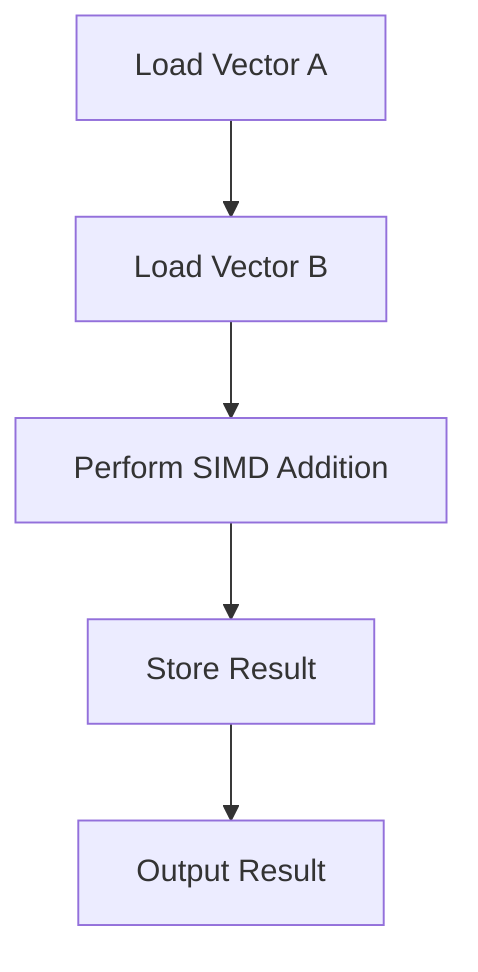

## 23.13. Writing SIMD Code in Rust

In the realm of high-performance computing, Single Instruction Multiple Data (SIMD) is a powerful technique that allows a single instruction to process multiple data points simultaneously. This capability is particularly useful in applications that require heavy mathematical computations, such as graphics processing, scientific simulations, and data analysis. In this section, we will explore how to write SIMD code in Rust, leveraging the `std::arch` module and the `packed_simd` crate to achieve significant performance improvements.

### Understanding SIMD

**SIMD** stands for Single Instruction Multiple Data, a parallel computing architecture that allows a single instruction to be applied to multiple data points simultaneously. This is achieved by using vectorized operations, where data is packed into vectors, and operations are performed on these vectors in parallel. The primary benefit of SIMD is its ability to significantly speed up data processing tasks by taking advantage of the parallelism inherent in modern CPU architectures.

#### Benefits of SIMD

- **Performance**: SIMD can dramatically increase the throughput of data processing tasks by executing operations on multiple data points simultaneously.
- **Efficiency**: By reducing the number of instructions needed to process data, SIMD can lead to more efficient use of CPU resources.
- **Scalability**: SIMD operations can be scaled across multiple cores, further enhancing performance in multi-core systems.

### Writing SIMD Code in Rust

Rust provides several ways to write SIMD code, primarily through the `std::arch` module and the `packed_simd` crate. These tools allow developers to access SIMD instructions directly and perform vectorized operations efficiently.

#### Using `std::arch` Module

The `std::arch` module in Rust provides access to platform-specific SIMD instructions. This module is part of the standard library and allows developers to write SIMD code that is optimized for specific CPU architectures.

```rust
use std::arch::x86_64::*;

fn add_vectors(a: &[f32; 4], b: &[f32; 4]) -> [f32; 4] {
    unsafe {
        let a_vec = _mm_loadu_ps(a.as_ptr());
        let b_vec = _mm_loadu_ps(b.as_ptr());
        let result_vec = _mm_add_ps(a_vec, b_vec);
        let mut result = [0.0; 4];
        _mm_storeu_ps(result.as_mut_ptr(), result_vec);
        result
    }
}

fn main() {
    let a = [1.0, 2.0, 3.0, 4.0];
    let b = [5.0, 6.0, 7.0, 8.0];
    let result = add_vectors(&a, &b);
    println!("{:?}", result);
}
```

**Explanation**: In this example, we use the `std::arch::x86_64` module to perform SIMD addition on two vectors of `f32` values. The `_mm_loadu_ps` function loads the data into SIMD registers, `_mm_add_ps` performs the addition, and `_mm_storeu_ps` stores the result back into an array.

#### Using `packed_simd` Crate

The `packed_simd` crate provides a more ergonomic and cross-platform way to write SIMD code in Rust. It abstracts away some of the platform-specific details, allowing developers to focus on the logic of their SIMD operations.

```rust
use packed_simd::f32x4;

fn add_vectors(a: f32x4, b: f32x4) -> f32x4 {
    a + b
}

fn main() {
    let a = f32x4::new(1.0, 2.0, 3.0, 4.0);
    let b = f32x4::new(5.0, 6.0, 7.0, 8.0);
    let result = add_vectors(a, b);
    println!("{:?}", result);
}
```

**Explanation**: Here, we use the `packed_simd` crate to perform the same vector addition as before. The `f32x4` type represents a vector of four `f32` values, and the `+` operator is overloaded to perform SIMD addition.

### Considerations for Cross-Platform Compatibility

When writing SIMD code, it's important to consider cross-platform compatibility. Different CPU architectures support different sets of SIMD instructions, so code that works on one platform may not work on another. The `packed_simd` crate helps mitigate this issue by providing a consistent API across platforms, but developers should still be aware of the specific capabilities of their target architectures.

### Debugging and Verifying SIMD Code

Debugging SIMD code can be challenging due to its parallel nature. Here are some tips for ensuring correctness:

- **Unit Testing**: Write unit tests for your SIMD functions to verify their correctness.
- **Assertions**: Use assertions to check the validity of your SIMD operations.
- **Debug Builds**: Compile your code in debug mode to catch potential issues early.
- **Performance Profiling**: Use profiling tools to measure the performance of your SIMD code and identify bottlenecks.

### Try It Yourself

To get hands-on experience with SIMD in Rust, try modifying the code examples provided above. Experiment with different vector sizes, data types, and operations to see how they affect performance. You can also explore the `packed_simd` crate documentation for more advanced features and capabilities.

### Visualizing SIMD Operations

To better understand how SIMD operations work, let's visualize the process of vector addition using a simple flowchart.



**Description**: This flowchart illustrates the steps involved in performing SIMD addition on two vectors. The process begins with loading the vectors into SIMD registers, performing the addition, storing the result, and finally outputting the result.

### External Resources

For further reading on SIMD in Rust, consider the following resources:

- [Rust `std::arch` Module Documentation](https://doc.rust-lang.org/std/arch/)
- [Packed SIMD Crate](https://github.com/rust-lang/packed_simd)

### Key Takeaways

- SIMD allows for parallel processing of data, leading to significant performance improvements.
- Rust provides tools like the `std::arch` module and the `packed_simd` crate for writing SIMD code.
- Consider cross-platform compatibility when writing SIMD code.
- Debugging SIMD code requires careful testing and profiling to ensure correctness and performance.

## Quiz Time!



### What does SIMD stand for?

- [x] Single Instruction Multiple Data
- [ ] Single Instruction Multiple Devices
- [ ] Simultaneous Instruction Multiple Data
- [ ] Single Instruction Multiple Directions

> **Explanation:** SIMD stands for Single Instruction Multiple Data, which refers to a parallel computing architecture that allows a single instruction to be applied to multiple data points simultaneously.

### Which Rust module provides access to platform-specific SIMD instructions?

- [x] std::arch
- [ ] std::simd
- [ ] packed_simd
- [ ] std::parallel

> **Explanation:** The `std::arch` module in Rust provides access to platform-specific SIMD instructions.

### What is the primary benefit of using SIMD?

- [x] Increased performance through parallel data processing
- [ ] Reduced memory usage
- [ ] Improved code readability
- [ ] Enhanced security

> **Explanation:** The primary benefit of SIMD is increased performance through parallel data processing, as it allows a single instruction to operate on multiple data points simultaneously.

### Which crate provides a more ergonomic way to write SIMD code in Rust?

- [x] packed_simd
- [ ] serde
- [ ] rayon
- [ ] tokio

> **Explanation:** The `packed_simd` crate provides a more ergonomic and cross-platform way to write SIMD code in Rust.

### What is a common challenge when writing SIMD code?

- [x] Cross-platform compatibility
- [ ] Memory allocation
- [ ] Code readability
- [ ] Error handling

> **Explanation:** A common challenge when writing SIMD code is ensuring cross-platform compatibility, as different CPU architectures support different sets of SIMD instructions.

### How can you verify the correctness of SIMD code?

- [x] Write unit tests
- [ ] Use global variables
- [ ] Avoid assertions
- [ ] Disable debug builds

> **Explanation:** Writing unit tests is an effective way to verify the correctness of SIMD code by checking that the output matches expected results.

### What is the purpose of the `_mm_add_ps` function in the `std::arch` example?

- [x] To perform SIMD addition on two vectors
- [ ] To load data into SIMD registers
- [ ] To store the result of SIMD operations
- [ ] To initialize SIMD registers

> **Explanation:** The `_mm_add_ps` function is used to perform SIMD addition on two vectors of `f32` values.

### What type does the `packed_simd` crate use to represent a vector of four `f32` values?

- [x] f32x4
- [ ] f32vec
- [ ] float4
- [ ] vec4

> **Explanation:** The `packed_simd` crate uses the `f32x4` type to represent a vector of four `f32` values.

### True or False: SIMD operations can be scaled across multiple cores.

- [x] True
- [ ] False

> **Explanation:** True. SIMD operations can be scaled across multiple cores, further enhancing performance in multi-core systems.

### Which of the following is NOT a benefit of SIMD?

- [ ] Performance
- [ ] Efficiency
- [ ] Scalability
- [x] Security

> **Explanation:** Security is not a direct benefit of SIMD. SIMD primarily offers benefits in terms of performance, efficiency, and scalability.



Remember, this is just the beginning. As you progress, you'll build more complex and interactive applications using SIMD in Rust. Keep experimenting, stay curious, and enjoy the journey!
