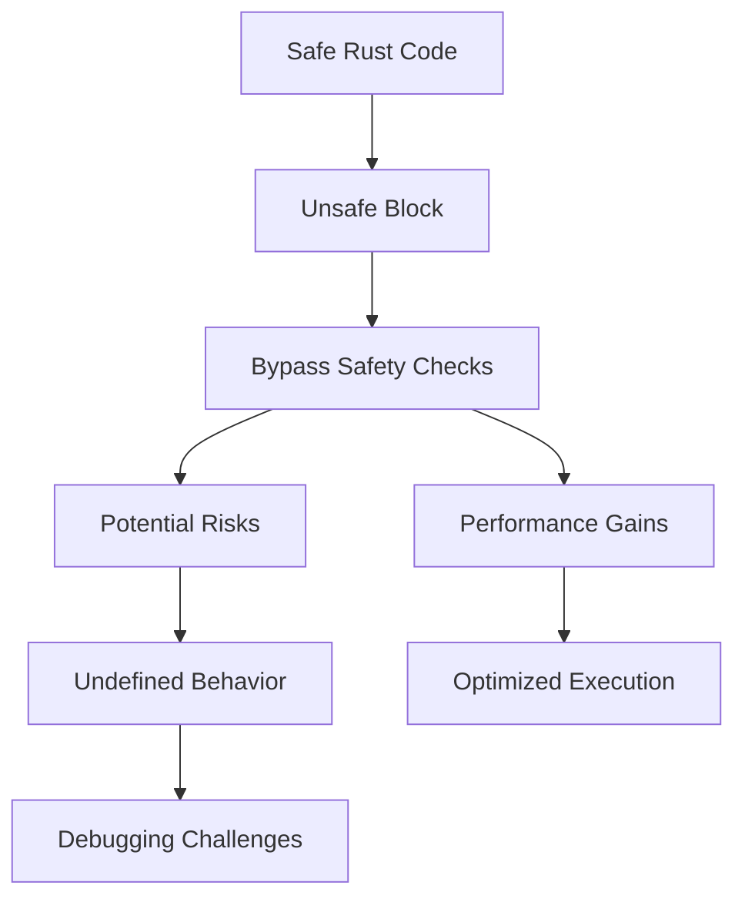

## 23.14. Using Unsafe Code for Performance

Rust is renowned for its memory safety and concurrency guarantees, achieved through its strict ownership model and borrow checker. However, there are situations where these safety checks can introduce performance overhead. In such cases, Rust provides an escape hatch: unsafe code. This section explores the trade-offs, scenarios, and best practices for using unsafe Rust code to optimize performance.

### Understanding Unsafe Code

Unsafe code in Rust allows you to perform operations that the compiler cannot guarantee to be safe. This includes:

- Dereferencing raw pointers.
- Calling unsafe functions or methods.
- Accessing or modifying mutable static variables.
- Implementing unsafe traits.
- Using union types.

While these operations can lead to performance improvements, they also bypass Rust's safety guarantees, potentially leading to undefined behavior if not handled correctly.

### Trade-offs of Using Unsafe Code

Using unsafe code involves a trade-off between performance and safety:

- **Performance Gains**: Unsafe code can eliminate runtime checks and enable low-level optimizations, leading to faster execution.
- **Safety Risks**: Bypassing safety checks can introduce bugs that are difficult to detect and debug, such as data races, memory leaks, and buffer overflows.

### Scenarios for Using Unsafe Code

Unsafe code is typically used in scenarios where performance is critical, and the overhead of safety checks is unacceptable. Common scenarios include:

- **Low-Level Memory Manipulation**: Directly manipulating memory for performance-critical applications, such as game engines or real-time systems.
- **Interfacing with C Libraries**: When interfacing with C libraries through Foreign Function Interface (FFI), unsafe code is often necessary to handle raw pointers and C-style data structures.
- **Optimizing Hot Paths**: In performance-critical sections of code, such as inner loops or frequently called functions, unsafe code can reduce overhead.
- **Implementing Data Structures**: Custom data structures that require precise control over memory layout and access patterns.

### Guidelines for Writing Unsafe Code

When writing unsafe code, it's crucial to follow guidelines to minimize risks:

1. **Limit Scope**: Encapsulate unsafe code in small, well-defined sections. Use safe abstractions to expose functionality to the rest of the program.
2. **Document Assumptions**: Clearly document the assumptions and invariants that the unsafe code relies on. This aids in understanding and maintaining the code.
3. **Use Safe Wrappers**: Provide safe wrappers around unsafe code to ensure that it is used correctly. This can prevent misuse by other parts of the program.
4. **Leverage Rust's Type System**: Use Rust's type system to enforce invariants and constraints, reducing the likelihood of errors.
5. **Test Thoroughly**: Write comprehensive tests to cover edge cases and potential failure points. Use property-based testing to explore a wide range of inputs.

### Best Practices for Auditing and Testing Unsafe Code

Auditing and testing are critical to ensuring the correctness of unsafe code:

- **Code Reviews**: Conduct thorough code reviews with a focus on unsafe sections. Involve multiple reviewers to catch potential issues.
- **Static Analysis Tools**: Use tools like Clippy and Miri to analyze unsafe code for common pitfalls and undefined behavior.
- **Fuzz Testing**: Employ fuzz testing to explore unexpected inputs and edge cases that might trigger bugs in unsafe code.
- **Continuous Integration**: Integrate tests into a continuous integration pipeline to catch regressions early.

### Example: Using Unsafe Code for Performance

Let's explore an example where unsafe code is used to optimize a performance-critical operation.

```rust
fn sum_slice(slice: &[i32]) -> i32 {
    let mut sum = 0;
    // Use unsafe code to iterate over the slice without bounds checking
    unsafe {
        for i in 0..slice.len() {
            sum += *slice.get_unchecked(i);
        }
    }
    sum
}

fn main() {
    let numbers = vec![1, 2, 3, 4, 5];
    let total = sum_slice(&numbers);
    println!("Total sum: {}", total);
}
```

In this example, we use `get_unchecked` to access elements of the slice without bounds checking, which can improve performance in tight loops. However, this is only safe if we can guarantee that the index will always be within bounds.

### Visualizing Unsafe Code Usage

To better understand how unsafe code interacts with Rust's safety guarantees, let's visualize the process:



**Diagram Description**: This flowchart illustrates the transition from safe Rust code to an unsafe block, highlighting the bypassing of safety checks, potential risks, and performance gains.

### Encouraging Safe Practices

While unsafe code can be a powerful tool for performance optimization, it's essential to use it judiciously. Remember:

- **Prioritize Safety**: Always prioritize safety and correctness over performance. Only use unsafe code when necessary and justified.
- **Encapsulate and Abstract**: Encapsulate unsafe code within safe abstractions to minimize exposure and potential misuse.
- **Stay Informed**: Keep up-to-date with Rust's evolving best practices and community guidelines for using unsafe code.

### Try It Yourself

Experiment with the provided code example by modifying the slice and observing the behavior. Try introducing an out-of-bounds index to see how the program behaves. Remember to revert changes to maintain safety.

### Conclusion

Using unsafe code in Rust can lead to significant performance improvements, but it comes with inherent risks. By following best practices and guidelines, you can harness the power of unsafe code while minimizing potential pitfalls. Remember, this is just the beginning. As you progress, you'll build more complex and efficient Rust applications. Keep experimenting, stay curious, and enjoy the journey!

## Quiz Time!



### What is the primary purpose of using unsafe code in Rust?

- [x] To achieve performance gains by bypassing safety checks
- [ ] To make code more readable
- [ ] To enforce stricter safety guarantees
- [ ] To simplify error handling

> **Explanation:** Unsafe code is used to bypass Rust's safety checks for performance gains.

### Which of the following operations can be performed in unsafe Rust code?

- [x] Dereferencing raw pointers
- [x] Accessing mutable static variables
- [ ] Using pattern matching
- [ ] Implementing safe traits

> **Explanation:** Unsafe code allows operations like dereferencing raw pointers and accessing mutable static variables.

### What is a key risk associated with using unsafe code?

- [x] Undefined behavior
- [ ] Increased compile time
- [ ] More verbose syntax
- [ ] Reduced code readability

> **Explanation:** Unsafe code can lead to undefined behavior if not handled correctly.

### When should unsafe code be used?

- [x] In performance-critical sections where safety checks introduce overhead
- [ ] In all parts of a Rust program
- [ ] Only in test code
- [ ] To replace all safe code

> **Explanation:** Unsafe code should be used in performance-critical sections where safety checks are a bottleneck.

### What is a recommended practice when writing unsafe code?

- [x] Encapsulate it in small, well-defined sections
- [ ] Use it extensively throughout the codebase
- [ ] Avoid documenting assumptions
- [ ] Ignore testing

> **Explanation:** Encapsulating unsafe code in small sections helps minimize risks.

### Which tool can be used to analyze unsafe code for common pitfalls?

- [x] Clippy
- [ ] Cargo
- [ ] Rustfmt
- [ ] Rustdoc

> **Explanation:** Clippy is a tool that can analyze unsafe code for common pitfalls.

### What is the role of safe wrappers around unsafe code?

- [x] To ensure correct usage and prevent misuse
- [ ] To make code more complex
- [ ] To increase performance
- [ ] To reduce compile time

> **Explanation:** Safe wrappers ensure that unsafe code is used correctly and prevent misuse.

### What should be prioritized when using unsafe code?

- [x] Safety and correctness
- [ ] Performance at all costs
- [ ] Reducing code size
- [ ] Simplifying syntax

> **Explanation:** Safety and correctness should always be prioritized over performance.

### How can unsafe code be tested effectively?

- [x] Through comprehensive tests and fuzz testing
- [ ] By skipping tests
- [ ] By using only unit tests
- [ ] By relying on manual testing

> **Explanation:** Comprehensive tests and fuzz testing are effective for testing unsafe code.

### True or False: Unsafe code should be used extensively in all Rust programs.

- [ ] True
- [x] False

> **Explanation:** Unsafe code should be used judiciously and only when necessary.


