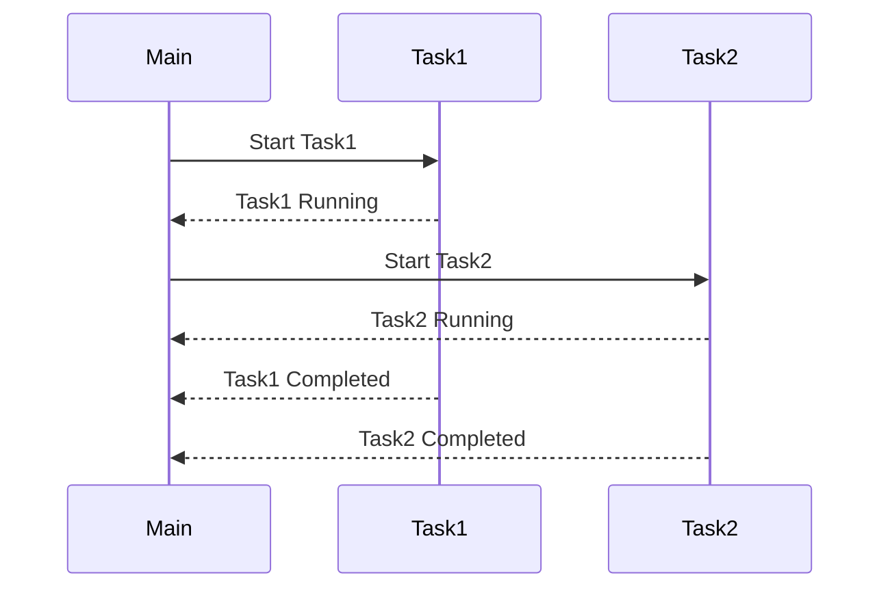

## 23.15. Latency Optimization Techniques

In the world of systems programming, latency is a critical factor that can make or break the performance of an application. Rust, with its focus on safety and concurrency, provides a robust platform for building high-performance applications. In this section, we will explore various techniques to optimize latency in Rust applications, which is crucial for real-time systems and user-facing services.

### Understanding Latency

Latency refers to the delay between a request and the corresponding response. In computing, it can be caused by various factors such as I/O operations, lock contention, and inefficient algorithms. Reducing latency is essential for applications that require real-time processing or need to provide a seamless user experience.

#### Factors Contributing to Latency

1. **I/O Operations**: Disk and network I/O are common sources of latency. Accessing data from a disk or over a network can introduce significant delays.
2. **Lock Contention**: In concurrent applications, multiple threads may compete for the same resources, leading to delays.
3. **Inefficient Algorithms**: Poorly designed algorithms can increase processing time, contributing to higher latency.
4. **Garbage Collection**: Although Rust does not use garbage collection, understanding its impact in other languages can help appreciate Rust's approach to memory management.
5. **System Overhead**: Context switching and other system-level operations can add to latency.

### Strategies for Reducing Latency

#### Asynchronous Programming

Asynchronous programming is a powerful technique for improving responsiveness in applications. By allowing tasks to run concurrently without blocking the main thread, you can significantly reduce latency.

- **Use `async`/`await`**: Rust's `async`/`await` syntax makes it easier to write asynchronous code. It allows you to perform non-blocking operations, such as network requests, without freezing the main thread.

```rust
use tokio::time::{sleep, Duration};

async fn fetch_data() {
    // Simulate a network request
    sleep(Duration::from_secs(2)).await;
    println!("Data fetched");
}

#[tokio::main]
async fn main() {
    fetch_data().await;
    println!("Continuing execution");
}
```

- **Leverage Futures and Streams**: Futures represent values that may not be available yet, while streams allow you to work with sequences of asynchronous values.

#### Efficient Data Structures and Algorithms

Choosing the right data structures and algorithms is crucial for quick processing and low latency.

- **Use HashMaps and Vectors**: These are generally faster for lookups and insertions compared to other data structures like linked lists.
- **Optimize Algorithms**: Ensure that your algorithms are efficient in terms of time complexity. For example, prefer `O(log n)` operations over `O(n^2)` when possible.

#### Measuring and Identifying Latency

To effectively reduce latency, you need to measure it and identify the sources of delay.

- **Use Flame Graphs**: Flame graphs are a visualization of profiled software, allowing you to see where your application spends most of its time. Tools like `flamegraph` can help you generate these visualizations.

```bash
# Generate a flame graph
cargo install flamegraph
cargo flamegraph
```

- **Profiling Tools**: Use tools like `perf` and `cargo-profiler` to analyze the performance of your Rust applications.

#### Predictable Performance

Predictability is as important as raw performance. An application that performs consistently is often preferable to one that is fast but erratic.

- **Avoid Blocking Operations**: Ensure that your code does not block the main thread unnecessarily.
- **Minimize Lock Contention**: Use lock-free data structures or fine-grained locking to reduce contention.

### Rust-Specific Features for Latency Optimization

Rust offers unique features that can be leveraged for latency optimization:

- **Ownership and Borrowing**: These features ensure memory safety without the overhead of garbage collection, reducing latency.
- **Fearless Concurrency**: Rust's concurrency model allows you to write safe concurrent code, minimizing the risk of data races and deadlocks.
- **Zero-Cost Abstractions**: Rust's abstractions do not incur runtime overhead, allowing you to write high-level code without sacrificing performance.

### Try It Yourself

Experiment with the following code to understand the impact of asynchronous programming on latency:

1. Modify the `fetch_data` function to simulate different network delays.
2. Add additional asynchronous tasks and observe how they execute concurrently.
3. Use `cargo flamegraph` to visualize the execution of your program.

### Visualizing Latency Optimization

Below is a diagram illustrating the flow of an asynchronous Rust application:



**Diagram Description**: This sequence diagram shows how tasks can run concurrently in an asynchronous Rust application, reducing overall latency.

### Further Reading

- [Rust Async Book](https://rust-lang.github.io/async-book/)
- [Flamegraph GitHub Repository](https://github.com/flamegraph-rs/flamegraph)
- [Tokio: An Asynchronous Runtime for Rust](https://tokio.rs/)

### Key Takeaways

- Latency is a critical factor in application performance, especially for real-time systems.
- Asynchronous programming and efficient data structures are key strategies for reducing latency.
- Measuring latency with tools like flame graphs is essential for identifying bottlenecks.
- Rust's unique features, such as ownership and fearless concurrency, provide a strong foundation for building low-latency applications.

Remember, this is just the beginning. As you progress, you'll discover more techniques and tools to optimize latency in your Rust applications. Keep experimenting, stay curious, and enjoy the journey!

## Quiz Time!



### What is latency in the context of computing?

- [x] The delay between a request and the corresponding response
- [ ] The amount of memory used by an application
- [ ] The number of concurrent users an application can handle
- [ ] The speed at which data is processed

> **Explanation:** Latency refers to the delay between a request and the corresponding response in computing.

### Which of the following is a common source of latency?

- [x] I/O operations
- [ ] Memory allocation
- [ ] CPU usage
- [ ] Compilation time

> **Explanation:** I/O operations, such as disk and network access, are common sources of latency.

### How does asynchronous programming help reduce latency?

- [x] By allowing tasks to run concurrently without blocking the main thread
- [ ] By increasing the number of threads
- [ ] By reducing memory usage
- [ ] By simplifying code

> **Explanation:** Asynchronous programming allows tasks to run concurrently, reducing the need to block the main thread and thus reducing latency.

### What is the purpose of using flame graphs?

- [x] To visualize where an application spends most of its time
- [ ] To measure memory usage
- [ ] To optimize code compilation
- [ ] To manage dependencies

> **Explanation:** Flame graphs are used to visualize where an application spends most of its time, helping identify performance bottlenecks.

### Which Rust feature helps ensure memory safety without garbage collection?

- [x] Ownership and Borrowing
- [ ] Garbage Collection
- [ ] Dynamic Typing
- [ ] Reflection

> **Explanation:** Rust's ownership and borrowing system ensures memory safety without the need for garbage collection.

### What is a key benefit of using efficient data structures?

- [x] Quick processing and low latency
- [ ] Reduced code complexity
- [ ] Increased code readability
- [ ] Simplified debugging

> **Explanation:** Efficient data structures enable quick processing, which helps reduce latency.

### What does the `async`/`await` syntax in Rust facilitate?

- [x] Writing asynchronous code
- [ ] Memory allocation
- [ ] Error handling
- [ ] Code compilation

> **Explanation:** The `async`/`await` syntax in Rust facilitates writing asynchronous code.

### What is a zero-cost abstraction in Rust?

- [x] An abstraction that does not incur runtime overhead
- [ ] An abstraction that simplifies code
- [ ] An abstraction that reduces memory usage
- [ ] An abstraction that increases code readability

> **Explanation:** A zero-cost abstraction in Rust is one that does not incur runtime overhead, allowing high-level code to be written without sacrificing performance.

### What is the impact of lock contention on latency?

- [x] It increases latency due to competition for resources
- [ ] It decreases latency by optimizing resource usage
- [ ] It has no impact on latency
- [ ] It simplifies concurrency management

> **Explanation:** Lock contention increases latency as multiple threads compete for the same resources.

### True or False: Predictable performance is as important as raw performance.

- [x] True
- [ ] False

> **Explanation:** Predictable performance is crucial as it ensures consistent application behavior, which is often more desirable than raw performance alone.


