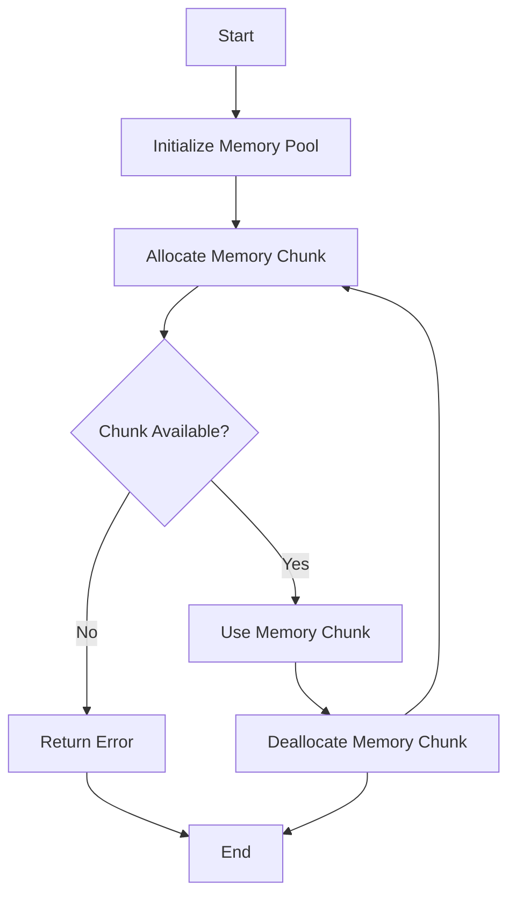

## 23.16. The Memory Pool Pattern

In the realm of systems programming, efficient memory management is crucial for achieving high performance and reducing overhead. The Memory Pool Pattern is a technique used to manage memory allocations efficiently by pre-allocating a block of memory and dividing it into smaller chunks that can be reused. This pattern helps in reducing fragmentation and allocation overhead, making it particularly useful in performance-critical applications.

### Understanding the Memory Pool Pattern

**Memory pooling** is a technique where a fixed amount of memory is allocated upfront and divided into smaller blocks or "pools." These blocks are then reused for memory allocations, which reduces the need for frequent allocations and deallocations from the heap. This approach can significantly improve performance, especially in environments where memory allocation and deallocation are frequent and costly.

#### Benefits of Memory Pooling

1. **Reduced Fragmentation**: By reusing memory blocks, memory pools help in minimizing fragmentation, which can occur when memory is allocated and deallocated in varying sizes.
2. **Improved Performance**: Memory pools reduce the overhead associated with frequent memory allocations and deallocations, leading to faster execution times.
3. **Predictable Memory Usage**: Since memory is allocated upfront, the memory usage becomes more predictable, which is beneficial for real-time systems.
4. **Simplified Memory Management**: Memory pools can simplify memory management by providing a centralized mechanism for handling allocations and deallocations.

### Implementing a Simple Memory Pool in Rust

Let's explore how to implement a basic memory pool in Rust. We'll create a simple memory pool that allocates a fixed-size block of memory and divides it into smaller chunks for reuse.

```rust
use std::cell::RefCell;
use std::collections::VecDeque;
use std::rc::Rc;

// Define a struct for the memory pool
struct MemoryPool {
    pool: RefCell<VecDeque<Rc<[u8]>>>,
    chunk_size: usize,
}

impl MemoryPool {
    // Create a new memory pool with a specified number of chunks
    fn new(num_chunks: usize, chunk_size: usize) -> Self {
        let mut pool = VecDeque::with_capacity(num_chunks);
        for _ in 0..num_chunks {
            pool.push_back(Rc::new(vec![0u8; chunk_size]));
        }
        MemoryPool {
            pool: RefCell::new(pool),
            chunk_size,
        }
    }

    // Allocate a chunk from the pool
    fn allocate(&self) -> Option<Rc<[u8]>> {
        self.pool.borrow_mut().pop_front()
    }

    // Deallocate a chunk back to the pool
    fn deallocate(&self, chunk: Rc<[u8]>) {
        if Rc::strong_count(&chunk) == 1 {
            self.pool.borrow_mut().push_back(chunk);
        }
    }
}

fn main() {
    // Create a memory pool with 10 chunks of 256 bytes each
    let pool = MemoryPool::new(10, 256);

    // Allocate a chunk from the pool
    if let Some(chunk) = pool.allocate() {
        println!("Allocated a chunk of size: {}", chunk.len());

        // Use the chunk for some operations...

        // Deallocate the chunk back to the pool
        pool.deallocate(chunk);
    } else {
        println!("No available chunks in the pool.");
    }
}
```

#### Key Points in the Code

- **Memory Pool Initialization**: We initialize the memory pool with a specified number of chunks, each of a fixed size.
- **Allocation and Deallocation**: The `allocate` method retrieves a chunk from the pool, while the `deallocate` method returns it to the pool.
- **Reference Counting**: We use `Rc` (Reference Counted) to manage the ownership of memory chunks, ensuring that they are only returned to the pool when no longer in use.

### When to Use Memory Pools

Memory pools are particularly useful in scenarios where:

- **Frequent Allocations and Deallocations**: Applications that frequently allocate and deallocate memory can benefit from the reduced overhead of memory pools.
- **Real-Time Systems**: Systems that require predictable memory usage and performance can leverage memory pools to achieve these goals.
- **Embedded Systems**: In memory-constrained environments, memory pools can help manage limited resources more effectively.

### Potential Drawbacks

While memory pools offer several advantages, there are potential drawbacks to consider:

- **Memory Overhead**: Pre-allocating memory can lead to unused memory if the pool size is not accurately estimated.
- **Complexity**: Implementing and managing memory pools can add complexity to the codebase.
- **Thread Safety**: In multi-threaded environments, additional mechanisms are needed to ensure thread safety when accessing the memory pool.

### Thread Safety and Lifetime Management

In Rust, ensuring thread safety and proper lifetime management is crucial when implementing memory pools. Here are some considerations:

- **Thread Safety**: Use synchronization primitives like `Mutex` or `RwLock` to protect access to the memory pool in multi-threaded applications.
- **Lifetime Management**: Ensure that memory chunks are only deallocated when they are no longer in use. Rust's ownership model and reference counting can help manage lifetimes effectively.

### Existing Crates for Memory Pooling

Rust's ecosystem offers several crates that provide memory pooling facilities, making it easier to implement and manage memory pools:

- **[`typed-arena`](https://crates.io/crates/typed-arena)**: A crate that provides a fast, efficient memory pool for allocating objects of a single type.
- **[`slab`](https://crates.io/crates/slab)**: A crate that offers a pre-allocated slab of memory for efficient allocation and deallocation.

These crates abstract much of the complexity involved in implementing memory pools, allowing developers to focus on their application's logic.

### Visualizing Memory Pool Operations

To better understand how memory pools operate, let's visualize the process of allocating and deallocating memory chunks using a flowchart.



**Diagram Description**: This flowchart illustrates the process of initializing a memory pool, allocating a memory chunk, using it, and deallocating it back to the pool. If no chunks are available, an error is returned.

### Try It Yourself

Experiment with the memory pool implementation by modifying the code:

- **Change the Chunk Size**: Adjust the size of each memory chunk and observe the impact on performance.
- **Increase the Number of Chunks**: Increase the number of chunks in the pool to see how it affects memory usage.
- **Implement Thread Safety**: Add synchronization primitives to make the memory pool thread-safe.

### Summary

The Memory Pool Pattern is a powerful technique for optimizing memory management in Rust applications. By pre-allocating memory and reusing it, memory pools can reduce fragmentation, improve performance, and provide predictable memory usage. While there are potential drawbacks, such as memory overhead and complexity, the benefits often outweigh these concerns in performance-critical applications. By leveraging existing crates like `typed-arena`, developers can implement memory pools more easily and focus on building efficient, high-performance applications.

### References and Further Reading

- [Rust Programming Language](https://www.rust-lang.org/)
- [Typed Arena Crate Documentation](https://docs.rs/typed-arena/)
- [Slab Crate Documentation](https://docs.rs/slab/)

## Quiz Time!



### What is the primary benefit of using a memory pool?

- [x] Reducing fragmentation and allocation overhead
- [ ] Increasing memory usage
- [ ] Simplifying code logic
- [ ] Enhancing security

> **Explanation:** Memory pools reduce fragmentation and allocation overhead by reusing pre-allocated memory blocks.

### In the provided Rust code example, what is the purpose of `Rc`?

- [x] To manage ownership and ensure memory is only deallocated when no longer in use
- [ ] To increase performance
- [ ] To simplify syntax
- [ ] To enhance security

> **Explanation:** `Rc` (Reference Counted) is used to manage ownership and ensure that memory is only deallocated when no longer in use.

### Which crate is mentioned as providing memory pooling facilities in Rust?

- [x] `typed-arena`
- [ ] `serde`
- [ ] `tokio`
- [ ] `hyper`

> **Explanation:** The `typed-arena` crate provides memory pooling facilities in Rust.

### What is a potential drawback of using memory pools?

- [x] Memory overhead due to pre-allocation
- [ ] Increased fragmentation
- [ ] Reduced performance
- [ ] Simplified memory management

> **Explanation:** Memory pools can lead to memory overhead due to pre-allocation if the pool size is not accurately estimated.

### How can thread safety be ensured when using memory pools in Rust?

- [x] By using synchronization primitives like `Mutex` or `RwLock`
- [ ] By using `Rc`
- [ ] By increasing the number of chunks
- [ ] By reducing the chunk size

> **Explanation:** Synchronization primitives like `Mutex` or `RwLock` can be used to ensure thread safety when accessing memory pools in multi-threaded applications.

### What is the main purpose of the `allocate` method in the memory pool implementation?

- [x] To retrieve a memory chunk from the pool
- [ ] To deallocate a memory chunk
- [ ] To initialize the memory pool
- [ ] To increase the pool size

> **Explanation:** The `allocate` method retrieves a memory chunk from the pool for use.

### What does the `deallocate` method do in the memory pool implementation?

- [x] Returns a memory chunk back to the pool
- [ ] Allocates a new memory chunk
- [ ] Increases the pool size
- [ ] Reduces memory usage

> **Explanation:** The `deallocate` method returns a memory chunk back to the pool for reuse.

### Which of the following is NOT a benefit of memory pooling?

- [ ] Reduced fragmentation
- [ ] Improved performance
- [ ] Predictable memory usage
- [x] Increased complexity

> **Explanation:** Increased complexity is a potential drawback, not a benefit, of memory pooling.

### True or False: Memory pools are only useful in embedded systems.

- [ ] True
- [x] False

> **Explanation:** Memory pools are useful in various scenarios, including real-time systems and applications with frequent memory allocations and deallocations, not just embedded systems.

### Which synchronization primitive can be used to protect access to a memory pool in a multi-threaded application?

- [x] `Mutex`
- [ ] `Rc`
- [ ] `VecDeque`
- [ ] `RefCell`

> **Explanation:** `Mutex` is a synchronization primitive that can be used to protect access to a memory pool in a multi-threaded application.



Remember, mastering memory management is a journey. Keep experimenting with different patterns and techniques, and enjoy the process of building efficient Rust applications!
