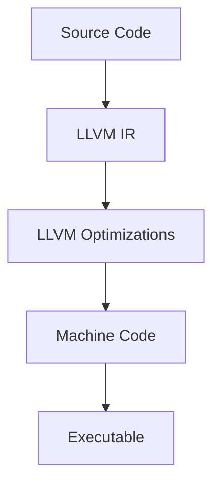

## 23.2. Optimizing Code for the LLVM Backend

In this section, we delve into the intricacies of optimizing Rust code for the LLVM backend. Rust, known for its safety and concurrency features, relies on LLVM (Low-Level Virtual Machine) as its backend compiler. This powerful toolchain allows Rust developers to produce highly optimized binaries. By understanding how LLVM works and how to write code that takes advantage of its capabilities, you can significantly enhance the performance of your Rust applications.

### Understanding LLVM and Its Role in Rust

LLVM is a collection of modular and reusable compiler and toolchain technologies. It serves as the backend for the Rust compiler, transforming Rust code into machine code. LLVM's optimization capabilities are one of its standout features, enabling it to perform a wide range of optimizations at various stages of the compilation process.

#### Key Features of LLVM

- **Intermediate Representation (IR):** LLVM uses a language-independent intermediate representation, which allows it to perform optimizations that are not tied to any specific programming language.
- **Modular Design:** LLVM's modular architecture enables developers to use only the components they need, making it highly adaptable.
- **Cross-Platform Support:** LLVM supports a wide range of hardware architectures, making it suitable for cross-platform development.

### How Rust Utilizes LLVM

Rust leverages LLVM to perform several critical tasks:

- **Code Generation:** Rust code is first compiled into LLVM IR, which is then optimized and converted into machine code.
- **Optimization:** LLVM performs various optimizations on the IR, such as inlining, loop unrolling, and dead code elimination.
- **Linking:** LLVM handles the linking process, combining multiple object files into a single executable.

### Writing Code for Optimal LLVM Performance

To harness the full potential of LLVM's optimization capabilities, it's essential to write Rust code that is conducive to optimization. Here are some strategies to consider:

#### Avoiding Unnecessary Abstractions

While Rust's abstractions are powerful, they can sometimes hinder LLVM's ability to optimize code. Consider the following guidelines:

- **Minimize Dynamic Dispatch:** Use static dispatch whenever possible. Dynamic dispatch, while flexible, can introduce overhead that may prevent certain optimizations.
- **Limit Indirection:** Excessive use of pointers and references can obscure data flow, making it harder for LLVM to optimize.
- **Simplify Control Flow:** Complex control flow can impede optimizations like inlining and loop unrolling.

#### Example: Simplifying Control Flow

```rust
// Complex control flow with dynamic dispatch
trait Operation {
    fn execute(&self, x: i32) -> i32;
}

struct Add;
impl Operation for Add {
    fn execute(&self, x: i32) -> i32 {
        x + 1
    }
}

fn perform_operation(op: &dyn Operation, value: i32) -> i32 {
    op.execute(value)
}

// Simplified control flow with static dispatch
fn add_one(x: i32) -> i32 {
    x + 1
}

fn perform_static_operation(value: i32) -> i32 {
    add_one(value)
}
```

In the above example, the second approach using static dispatch is more amenable to LLVM optimizations.

### Compiler Flags and Optimization Levels

Rust provides several compiler flags that control optimization levels, allowing you to balance between compilation time and runtime performance.

#### Common Optimization Levels

- **`-O0`:** No optimization. This level is useful for debugging as it preserves the original structure of the code.
- **`-O1`:** Basic optimizations that improve performance without significantly increasing compilation time.
- **`-O2`:** More aggressive optimizations that can improve performance but may increase compilation time.
- **`-O3`:** Maximum optimization, including aggressive inlining and vectorization. This level may increase both compilation time and binary size.
- **`-Os`:** Optimize for size, reducing the binary size while maintaining reasonable performance.
- **`-Oz`:** Further size optimization, potentially at the cost of performance.

#### Using Compiler Flags in Rust

To specify optimization levels in Rust, use the `--release` flag for release builds, which defaults to `-O3`. You can customize this in your `Cargo.toml` file:

```toml
[profile.release]
opt-level = 3
```

### Link Time Optimization (LTO)

Link Time Optimization (LTO) is a powerful technique that allows LLVM to perform optimizations across module boundaries during the linking phase. This can lead to significant performance improvements.

#### Enabling LTO in Rust

To enable LTO in Rust, add the following to your `Cargo.toml`:

```toml
[profile.release]
lto = true
```

LTO can be particularly beneficial for large projects with multiple modules, as it allows LLVM to optimize the entire program as a whole.

### Visualizing the Optimization Process

To better understand how LLVM optimizes Rust code, let's visualize the process using a flowchart:



**Caption:** The flowchart illustrates the stages of the LLVM optimization process, from source code to executable.

### Practical Tips for LLVM Optimization

- **Profile Your Code:** Use profiling tools to identify performance bottlenecks and focus optimization efforts where they will have the most impact.
- **Benchmark Changes:** Always benchmark your code before and after applying optimizations to ensure they have the desired effect.
- **Use Inline Functions:** Mark small functions as `#[inline]` to suggest inlining, which can reduce function call overhead.
- **Avoid Premature Optimization:** Focus on writing clear and maintainable code first, then optimize based on profiling data.

### Knowledge Check

Before we move on, let's test your understanding of LLVM optimizations with a few questions:

1. What is the primary role of LLVM in the Rust compilation process?
2. How can dynamic dispatch affect LLVM's ability to optimize code?
3. What are the benefits of enabling Link Time Optimization (LTO)?

### Embrace the Journey

Optimizing Rust code for the LLVM backend is a journey that requires a deep understanding of both Rust and LLVM. Remember, this is just the beginning. As you continue to explore and experiment, you'll discover new ways to enhance the performance of your Rust applications. Keep learning, stay curious, and enjoy the process!

### Further Reading

For more information on LLVM and Rust optimization techniques, consider exploring the following resources:

- [LLVM Project Documentation](https://llvm.org/docs/)
- [Rust Performance Book](https://nnethercote.github.io/perf-book/)
- [Rust Compiler Flags](https://doc.rust-lang.org/rustc/command-line-arguments.html)

## Quiz Time!



### What is the primary role of LLVM in the Rust compilation process?

- [x] Transforming Rust code into machine code
- [ ] Managing memory allocation
- [ ] Handling network requests
- [ ] Providing a graphical user interface

> **Explanation:** LLVM is responsible for transforming Rust code into machine code through its backend compilation process.

### How can dynamic dispatch affect LLVM's ability to optimize code?

- [x] It introduces overhead that may prevent certain optimizations
- [ ] It simplifies the control flow
- [ ] It enhances inlining opportunities
- [ ] It reduces binary size

> **Explanation:** Dynamic dispatch introduces runtime overhead, which can hinder LLVM's ability to perform certain optimizations.

### What are the benefits of enabling Link Time Optimization (LTO)?

- [x] It allows optimizations across module boundaries
- [ ] It reduces compilation time
- [ ] It simplifies code readability
- [ ] It enhances error handling

> **Explanation:** LTO enables optimizations across module boundaries, leading to potential performance improvements.

### Which optimization level is used by default in Rust release builds?

- [x] `-O3`
- [ ] `-O0`
- [ ] `-O1`
- [ ] `-Os`

> **Explanation:** Rust release builds default to `-O3`, which includes maximum optimization.

### What is a common pitfall of premature optimization?

- [x] It can lead to complex and hard-to-maintain code
- [ ] It always improves performance
- [ ] It simplifies debugging
- [ ] It reduces binary size

> **Explanation:** Premature optimization can result in complex code that is difficult to maintain and may not provide significant performance benefits.

### How can you suggest inlining a function in Rust?

- [x] Use the `#[inline]` attribute
- [ ] Use the `#[no_mangle]` attribute
- [ ] Use the `#[derive]` attribute
- [ ] Use the `#[test]` attribute

> **Explanation:** The `#[inline]` attribute suggests to the compiler that a function should be inlined.

### What is the purpose of LLVM's Intermediate Representation (IR)?

- [x] To perform language-independent optimizations
- [ ] To manage memory allocation
- [ ] To handle network requests
- [ ] To provide a graphical user interface

> **Explanation:** LLVM's IR allows for language-independent optimizations, making it a powerful tool for various programming languages.

### Which compiler flag optimizes for binary size?

- [x] `-Os`
- [ ] `-O0`
- [ ] `-O1`
- [ ] `-O3`

> **Explanation:** The `-Os` flag optimizes for binary size, reducing the executable size while maintaining reasonable performance.

### What is a benefit of using static dispatch over dynamic dispatch?

- [x] It reduces runtime overhead
- [ ] It increases flexibility
- [ ] It simplifies code readability
- [ ] It enhances error handling

> **Explanation:** Static dispatch reduces runtime overhead by resolving function calls at compile time.

### True or False: LLVM's modular design allows developers to use only the components they need.

- [x] True
- [ ] False

> **Explanation:** LLVM's modular design is one of its key features, allowing developers to use only the components they need for their specific use case.


