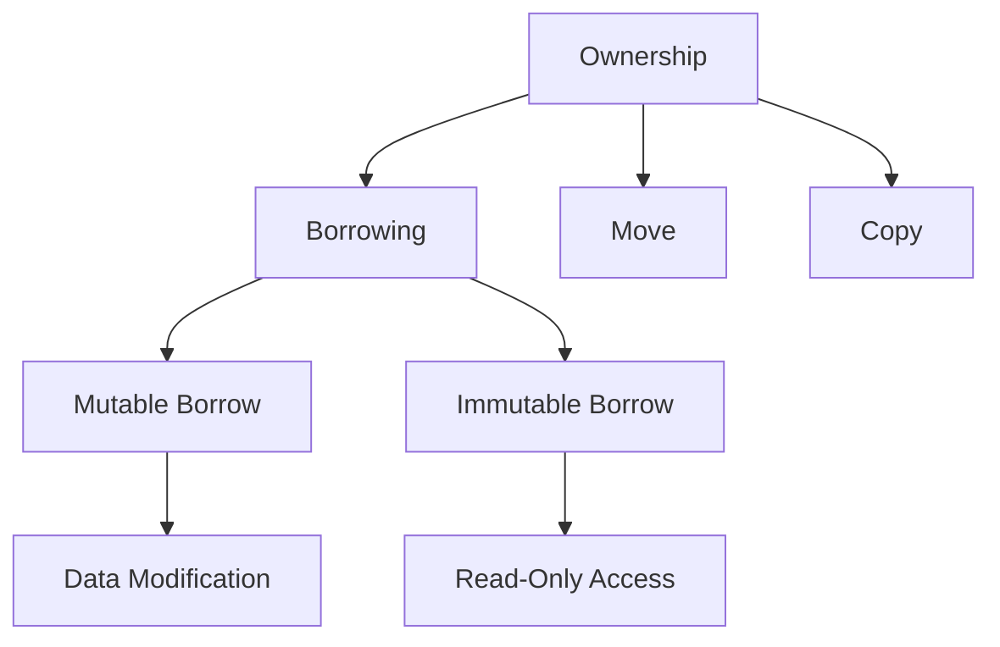

## 23.3. Reducing Memory Usage

In the world of systems programming, efficient memory usage is paramount. Rust, with its unique ownership model and focus on safety, offers several tools and techniques to help developers minimize memory consumption. This section delves into strategies for reducing memory usage in Rust applications, which is crucial for performance optimization and resource-constrained environments.

### The Impact of Memory Usage on Performance

Memory usage directly affects the performance of an application. High memory consumption can lead to increased latency, reduced throughput, and even system crashes in extreme cases. Efficient memory management ensures that applications run smoothly, especially in environments with limited resources, such as embedded systems or mobile devices.

### Techniques for Reducing Memory Footprint

#### 1. Choosing the Right Data Structures

Selecting appropriate data structures is a fundamental step in optimizing memory usage. Rust provides a variety of data structures, each with its own memory and performance characteristics.

- **Vectors (`Vec<T>`)**: Use vectors for dynamic arrays. They are heap-allocated and can grow or shrink as needed. However, be mindful of their capacity and reserve space when possible to avoid frequent reallocations.

```rust
let mut numbers: Vec<i32> = Vec::with_capacity(100); // Pre-allocate space for 100 elements
numbers.push(1);
numbers.push(2);
```

- **Slices (`&[T]`)**: Use slices for fixed-size views into arrays or vectors. They are lightweight and do not own the data they reference.

```rust
let array = [1, 2, 3, 4, 5];
let slice: &[i32] = &array[1..4]; // Slice of the array
```

- **HashMaps and BTreeMaps**: Choose `HashMap` for fast lookup and insertion, and `BTreeMap` for ordered data. Consider the trade-offs between speed and memory usage.

#### 2. Using Smart Pointers Wisely

Smart pointers like `Box`, `Rc`, and `Arc` provide heap allocation and reference counting, which can help manage memory efficiently.

- **`Box<T>`**: Use `Box` for heap allocation of single values. It is useful for large data structures or when you need a fixed-size allocation.

```rust
let boxed_value = Box::new(10);
```

- **`Rc<T>` and `Arc<T>`**: Use `Rc` for single-threaded reference counting and `Arc` for multi-threaded scenarios. They allow multiple ownership of data, but be cautious of reference cycles that can lead to memory leaks.

```rust
use std::rc::Rc;

let rc_value = Rc::new(5);
let rc_clone = Rc::clone(&rc_value);
```

#### 3. Leveraging Enums and Pattern Matching

Enums in Rust are powerful tools for reducing memory usage by representing data in a compact form. Use pattern matching to handle different enum variants efficiently.

```rust
enum Message {
    Quit,
    Move { x: i32, y: i32 },
    Write(String),
}

fn process_message(msg: Message) {
    match msg {
        Message::Quit => println!("Quit"),
        Message::Move { x, y } => println!("Move to ({}, {})", x, y),
        Message::Write(text) => println!("Write: {}", text),
    }
}
```

#### 4. Avoiding Memory Leaks

Memory leaks occur when memory is allocated but not properly deallocated. Rust's ownership model helps prevent leaks, but developers must still be vigilant.

- **Avoid Reference Cycles**: Use `Weak<T>` to break cycles in `Rc` or `Arc` graphs.

```rust
use std::rc::{Rc, Weak};

struct Node {
    value: i32,
    parent: Option<Weak<Node>>,
}

let parent = Rc::new(Node { value: 5, parent: None });
let child = Rc::new(Node { value: 10, parent: Some(Rc::downgrade(&parent)) });
```

- **Use `Drop` Trait**: Implement the `Drop` trait for custom cleanup logic when an object goes out of scope.

```rust
struct Resource;

impl Drop for Resource {
    fn drop(&mut self) {
        println!("Resource is being dropped");
    }
}
```

### Efficient Memory Layout with `#[repr(C)]`

The `#[repr(C)]` attribute ensures that Rust structs have a predictable memory layout, compatible with C. This can be useful for reducing padding and aligning data structures efficiently.

```rust
#[repr(C)]
struct Point {
    x: f64,
    y: f64,
}
```

### Tools for Monitoring and Analyzing Memory Usage

Several tools can help monitor and analyze memory usage in Rust applications:

- **Valgrind**: A powerful tool for detecting memory leaks and profiling memory usage.
- **Heaptrack**: A tool for tracking memory allocations and identifying memory leaks.
- **Rust's Built-in Profiling Tools**: Use `cargo` commands like `cargo bench` and `cargo test` to profile and test your code.

### Visualizing Memory Management in Rust

To better understand how Rust manages memory, let's visualize the ownership and borrowing model:



**Caption**: This diagram illustrates Rust's ownership model, highlighting the relationships between ownership, borrowing, and data access.

### Try It Yourself

Experiment with the following code to see how different data structures and smart pointers affect memory usage. Try modifying the code to use different data structures and observe the impact on memory consumption.

```rust
fn main() {
    let numbers: Vec<i32> = vec![1, 2, 3, 4, 5];
    let boxed_numbers = Box::new(numbers);
    let rc_numbers = Rc::new(boxed_numbers);

    println!("Length: {}", rc_numbers.len());
}
```

### Knowledge Check

- **Question**: What are the benefits of using `Box<T>` for memory management?
- **Challenge**: Modify the code to use `Arc<T>` instead of `Rc<T>` and explain the difference.

### Summary

Reducing memory usage in Rust involves selecting appropriate data structures, leveraging smart pointers, avoiding memory leaks, and using tools for monitoring memory consumption. By understanding and applying these techniques, developers can create efficient and performant Rust applications.

### Embrace the Journey

Remember, optimizing memory usage is an ongoing process. As you continue to develop in Rust, keep exploring new techniques and tools to enhance your application's performance. Stay curious and enjoy the journey of mastering Rust's memory management capabilities!

## Quiz Time!



### What is the primary benefit of using `Box<T>` in Rust?

- [x] It allows heap allocation of single values.
- [ ] It provides reference counting for multi-threaded scenarios.
- [ ] It is used for fixed-size stack allocation.
- [ ] It enables pattern matching on enums.

> **Explanation:** `Box<T>` is used for heap allocation of single values, which is useful for large data structures or when a fixed-size allocation is needed.

### How can you prevent memory leaks when using `Rc<T>`?

- [x] Use `Weak<T>` to break reference cycles.
- [ ] Use `Arc<T>` instead of `Rc<T>`.
- [ ] Implement the `Drop` trait.
- [ ] Use `Box<T>` for heap allocation.

> **Explanation:** `Weak<T>` is used to break reference cycles in `Rc<T>` graphs, preventing memory leaks.

### What is the purpose of the `#[repr(C)]` attribute?

- [x] It ensures a predictable memory layout compatible with C.
- [ ] It provides automatic memory deallocation.
- [ ] It enables pattern matching on enums.
- [ ] It allows heap allocation of single values.

> **Explanation:** `#[repr(C)]` ensures that Rust structs have a predictable memory layout, compatible with C, which can reduce padding and align data structures efficiently.

### Which tool can be used to detect memory leaks in Rust applications?

- [x] Valgrind
- [ ] Cargo
- [ ] Rustfmt
- [ ] Clippy

> **Explanation:** Valgrind is a powerful tool for detecting memory leaks and profiling memory usage in Rust applications.

### What is a key advantage of using slices (`&[T]`) in Rust?

- [x] They provide a fixed-size view into arrays or vectors.
- [ ] They allow heap allocation of single values.
- [ ] They provide reference counting for multi-threaded scenarios.
- [ ] They enable pattern matching on enums.

> **Explanation:** Slices provide a fixed-size view into arrays or vectors, making them lightweight and efficient for accessing data.

### How does Rust's ownership model help prevent memory leaks?

- [x] By ensuring that each piece of data has a single owner.
- [ ] By providing automatic garbage collection.
- [ ] By allowing multiple mutable references.
- [ ] By using reference counting for all data.

> **Explanation:** Rust's ownership model ensures that each piece of data has a single owner, which helps prevent memory leaks by automatically deallocating memory when the owner goes out of scope.

### What is the difference between `Rc<T>` and `Arc<T>`?

- [x] `Rc<T>` is for single-threaded scenarios, while `Arc<T>` is for multi-threaded scenarios.
- [ ] `Rc<T>` provides heap allocation, while `Arc<T>` provides stack allocation.
- [ ] `Rc<T>` is used for pattern matching, while `Arc<T>` is used for enums.
- [ ] `Rc<T>` is for multi-threaded scenarios, while `Arc<T>` is for single-threaded scenarios.

> **Explanation:** `Rc<T>` is used for single-threaded reference counting, while `Arc<T>` is used for multi-threaded scenarios.

### Which of the following is a technique for reducing memory usage in Rust?

- [x] Choosing appropriate data structures.
- [ ] Using global variables.
- [ ] Avoiding the use of enums.
- [ ] Disabling the borrow checker.

> **Explanation:** Choosing appropriate data structures is a fundamental technique for reducing memory usage in Rust applications.

### What is the role of the `Drop` trait in Rust?

- [x] It allows custom cleanup logic when an object goes out of scope.
- [ ] It provides automatic memory allocation.
- [ ] It enables pattern matching on enums.
- [ ] It allows heap allocation of single values.

> **Explanation:** The `Drop` trait allows developers to implement custom cleanup logic when an object goes out of scope, which can help manage resources efficiently.

### True or False: Rust's ownership model eliminates the need for garbage collection.

- [x] True
- [ ] False

> **Explanation:** True. Rust's ownership model eliminates the need for garbage collection by ensuring that memory is automatically deallocated when the owner goes out of scope.


