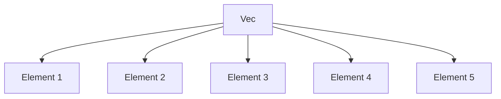

## 23.4. Efficient Data Structures and Algorithms

In the world of systems programming, the choice of data structures and algorithms can significantly impact the performance and efficiency of your applications. Rust, with its focus on safety and concurrency, provides a rich set of tools and libraries to help developers implement efficient solutions. In this section, we will explore the importance of selecting the right data structures, delve into some of the most efficient data structures available in Rust, and discuss how algorithmic complexity affects performance. We will also highlight some crates that offer specialized data structures and encourage profiling and testing to select the best options for your use case.

### The Importance of Choosing the Right Data Structures

Choosing the right data structure is crucial for optimizing performance. The right data structure can reduce the complexity of your algorithms, improve memory usage, and enhance the overall efficiency of your application. In Rust, the choice of data structure is often influenced by the ownership model, which ensures memory safety without a garbage collector. This model requires careful consideration of how data is stored, accessed, and modified.

#### Key Considerations

- **Access Patterns**: Consider how frequently data will be accessed, modified, or iterated over. For instance, if you need fast random access, a `Vec` might be more appropriate than a `LinkedList`.
- **Memory Usage**: Some data structures are more memory-efficient than others. For example, a `BTreeMap` might use more memory than a `HashMap` due to its tree structure.
- **Concurrency**: If your application is concurrent, you may need data structures that support safe concurrent access, such as those provided by the `crossbeam` crate.

### Efficient Data Structures in Rust

Rust's standard library provides several efficient data structures that are optimized for different use cases. Let's explore some of these data structures and understand their strengths and weaknesses.

#### `Vec`

The `Vec` (vector) is one of the most commonly used data structures in Rust. It is a growable array type that provides fast random access and efficient iteration.

```rust
fn main() {
    let mut numbers = vec![1, 2, 3, 4, 5];
    numbers.push(6);
    println!("{:?}", numbers);
}
```

- **Strengths**: Fast random access, efficient iteration, and dynamic resizing.
- **Weaknesses**: Insertion and deletion can be slow if not at the end of the vector.

#### `HashMap`

The `HashMap` is a hash table implementation that provides fast key-value lookups.

```rust
use std::collections::HashMap;

fn main() {
    let mut scores = HashMap::new();
    scores.insert("Alice", 10);
    scores.insert("Bob", 20);
    println!("{:?}", scores);
}
```

- **Strengths**: Fast average-time complexity for insertions, deletions, and lookups.
- **Weaknesses**: Unordered, and performance can degrade with poor hash functions.

#### `BTreeMap`

The `BTreeMap` is a map based on a B-tree, which maintains keys in sorted order.

```rust
use std::collections::BTreeMap;

fn main() {
    let mut scores = BTreeMap::new();
    scores.insert("Alice", 10);
    scores.insert("Bob", 20);
    println!("{:?}", scores);
}
```

- **Strengths**: Maintains order, efficient range queries.
- **Weaknesses**: Slower than `HashMap` for individual insertions and lookups.

### Algorithmic Complexity and Performance

Understanding algorithmic complexity is essential for selecting the right data structures and algorithms. Complexity is often expressed using Big O notation, which describes how the runtime or space requirements of an algorithm grow with the size of the input.

#### Common Complexities

- **O(1)**: Constant time. The operation's time does not depend on the size of the input.
- **O(log n)**: Logarithmic time. Common in balanced tree operations.
- **O(n)**: Linear time. The operation's time grows linearly with the input size.
- **O(n log n)**: Log-linear time. Common in efficient sorting algorithms.
- **O(n^2)**: Quadratic time. Often found in simple sorting algorithms like bubble sort.

### Specialized Data Structures in Rust

While the standard library provides a solid foundation, there are crates that offer specialized data structures for more advanced use cases.

#### `indexmap`

The `indexmap` crate provides an ordered map and set based on a hash table.

```rust
use indexmap::IndexMap;

fn main() {
    let mut map = IndexMap::new();
    map.insert("Alice", 10);
    map.insert("Bob", 20);
    println!("{:?}", map);
}
```

- **Strengths**: Maintains insertion order, fast lookups.
- **Use Cases**: When order of insertion is important.

#### `rayon`

The `rayon` crate provides data parallelism for Rust, allowing you to perform operations on collections in parallel.

```rust
use rayon::prelude::*;

fn main() {
    let numbers: Vec<i32> = (1..100).collect();
    let sum: i32 = numbers.par_iter().sum();
    println!("Sum: {}", sum);
}
```

- **Strengths**: Easy parallelism, improved performance on multi-core systems.
- **Use Cases**: When you need to perform operations on large collections concurrently.

### Profiling and Testing

To ensure that you are using the most efficient data structures and algorithms, it is crucial to profile and test your code. Rust provides several tools and techniques for this purpose.

#### Profiling Tools

- **`cargo bench`**: A built-in tool for benchmarking Rust code.
- **`perf`**: A powerful Linux tool for performance analysis.
- **`flamegraph`**: A visualization tool for profiling data.

#### Testing Strategies

- **Unit Tests**: Test individual components for correctness.
- **Integration Tests**: Test how different components work together.
- **Benchmark Tests**: Measure the performance of specific functions or algorithms.

### Try It Yourself

Experiment with the following code examples to see how different data structures perform. Try modifying the size of the data or the operations performed to observe the impact on performance.

```rust
fn main() {
    let mut vec = vec![1, 2, 3, 4, 5];
    vec.push(6);
    println!("{:?}", vec);

    let mut map = HashMap::new();
    map.insert("Alice", 10);
    map.insert("Bob", 20);
    println!("{:?}", map);

    let numbers: Vec<i32> = (1..100).collect();
    let sum: i32 = numbers.par_iter().sum();
    println!("Sum: {}", sum);
}
```

### Visualizing Data Structures

To better understand how these data structures work, let's visualize a few of them using Mermaid.js diagrams.

#### Visualizing a `Vec`



*Caption: A simple visualization of a `Vec` containing five elements.*

#### Visualizing a `HashMap`

```mermaid
graph TD;
    A[HashMap] --> B{Key: "Alice", Value: 10};
    A --> C{Key: "Bob", Value: 20};
```

*Caption: A visualization of a `HashMap` with two key-value pairs.*

### Key Takeaways

- Choosing the right data structure is crucial for optimizing performance.
- Rust's standard library provides efficient data structures like `Vec`, `HashMap`, and `BTreeMap`.
- Understanding algorithmic complexity helps in selecting the right algorithms and data structures.
- Specialized crates like `indexmap` and `rayon` offer additional functionality for specific use cases.
- Profiling and testing are essential to ensure optimal performance.

### Embrace the Journey

Remember, this is just the beginning. As you progress, you'll discover more advanced data structures and algorithms that can further enhance your Rust applications. Keep experimenting, stay curious, and enjoy the journey!

## Quiz Time!



### What is the primary benefit of using a `Vec` in Rust?

- [x] Fast random access and efficient iteration
- [ ] Maintains insertion order
- [ ] Provides fast key-value lookups
- [ ] Supports concurrent access

> **Explanation:** A `Vec` provides fast random access and efficient iteration, making it suitable for scenarios where these features are required.

### Which data structure maintains keys in sorted order?

- [ ] Vec
- [ ] HashMap
- [x] BTreeMap
- [ ] IndexMap

> **Explanation:** A `BTreeMap` maintains keys in sorted order, which is useful for range queries and ordered iteration.

### What is the average-time complexity for lookups in a `HashMap`?

- [ ] O(n)
- [ ] O(log n)
- [x] O(1)
- [ ] O(n^2)

> **Explanation:** A `HashMap` provides average-time complexity of O(1) for lookups, insertions, and deletions.

### Which crate provides data parallelism for Rust?

- [ ] indexmap
- [x] rayon
- [ ] serde
- [ ] tokio

> **Explanation:** The `rayon` crate provides data parallelism, allowing operations on collections to be performed in parallel.

### What is the primary use case for the `indexmap` crate?

- [ ] Fast random access
- [x] Maintaining insertion order
- [ ] Concurrent access
- [ ] Memory efficiency

> **Explanation:** The `indexmap` crate is used when maintaining the insertion order of elements is important.

### Which profiling tool is built into Rust for benchmarking?

- [x] cargo bench
- [ ] perf
- [ ] flamegraph
- [ ] gprof

> **Explanation:** `cargo bench` is a built-in tool in Rust for benchmarking code.

### What is the complexity of a binary search algorithm?

- [ ] O(n)
- [x] O(log n)
- [ ] O(1)
- [ ] O(n^2)

> **Explanation:** A binary search algorithm has a complexity of O(log n), making it efficient for searching in sorted arrays.

### Which data structure is unordered and can degrade in performance with poor hash functions?

- [ ] Vec
- [x] HashMap
- [ ] BTreeMap
- [ ] IndexMap

> **Explanation:** A `HashMap` is unordered and its performance can degrade with poor hash functions.

### What is the main advantage of using `BTreeMap` over `HashMap`?

- [ ] Faster lookups
- [x] Maintains order
- [ ] Less memory usage
- [ ] Concurrent access

> **Explanation:** The main advantage of using `BTreeMap` is that it maintains the order of keys, which is useful for ordered iteration and range queries.

### True or False: Profiling and testing are not necessary when selecting data structures.

- [ ] True
- [x] False

> **Explanation:** Profiling and testing are essential to ensure that the chosen data structures and algorithms provide optimal performance for your specific use case.


