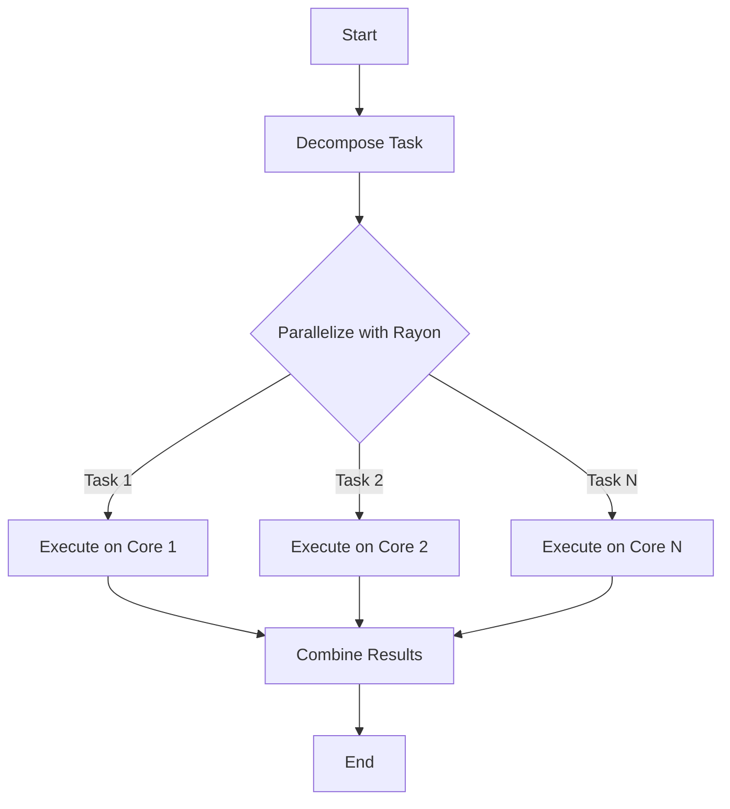

## 23.5. Parallel Processing and Load Distribution

In the realm of modern computing, leveraging the full potential of multi-core systems is crucial for achieving high performance. Rust, with its emphasis on safety and concurrency, provides robust tools for parallel processing and load distribution. This section delves into the benefits of parallel processing, demonstrates how to use the `rayon` crate for data parallelism, and explores strategies for designing scalable applications. We will also discuss synchronization, load balancing, and methods to measure and ensure effective parallelization.

### Benefits of Parallel Processing

Parallel processing involves dividing a task into smaller sub-tasks that can be executed simultaneously on multiple processors. This approach can significantly reduce execution time and improve the efficiency of applications. Here are some key benefits:

- **Increased Throughput**: By processing multiple tasks concurrently, applications can handle more work in the same amount of time.
- **Reduced Latency**: Tasks can be completed faster as they are processed in parallel rather than sequentially.
- **Scalability**: Applications designed with parallel processing in mind can scale effectively with the addition of more cores.
- **Resource Utilization**: Maximizes the use of available CPU resources, leading to better performance.

### Using `rayon` for Data Parallelism

The `rayon` crate is a popular choice for data parallelism in Rust. It provides a simple and efficient way to parallelize operations on collections. Let's explore how to use `rayon` to enhance performance.

#### Getting Started with `rayon`

To use `rayon`, add it to your `Cargo.toml`:

```toml
[dependencies]
rayon = "1.5"
```

#### Example: Parallel Iteration

Consider a scenario where we need to perform a computation on a large vector. Using `rayon`, we can parallelize this operation:

```rust
use rayon::prelude::*;

fn main() {
    let numbers: Vec<i32> = (1..1000000).collect();
    
    // Parallel iteration using rayon
    let sum: i32 = numbers.par_iter().map(|&x| x * 2).sum();
    
    println!("Sum: {}", sum);
}
```

**Explanation**: In this example, `par_iter()` is used to create a parallel iterator over the vector. The `map` operation is applied in parallel, and the results are summed up efficiently.

#### Try It Yourself

Experiment with different operations, such as filtering or reducing, to see how `rayon` handles various parallel tasks. Modify the vector size and observe the performance impact.

### Designing Scalable Applications

To design applications that scale with more cores, consider the following strategies:

- **Decompose Tasks**: Break down tasks into smaller, independent units that can be processed concurrently.
- **Avoid Shared State**: Minimize shared state to reduce the need for synchronization, which can become a bottleneck.
- **Use Efficient Data Structures**: Choose data structures that support concurrent access and modification.

#### Example: Parallel Matrix Multiplication

Matrix multiplication is a classic example of a task that can benefit from parallel processing. Here's how you can implement it using `rayon`:

```rust
use rayon::prelude::*;

fn parallel_matrix_multiply(a: &Vec<Vec<i32>>, b: &Vec<Vec<i32>>) -> Vec<Vec<i32>> {
    let n = a.len();
    let m = b[0].len();
    let p = b.len();

    let mut result = vec![vec![0; m]; n];

    result.par_iter_mut().enumerate().for_each(|(i, row)| {
        for j in 0..m {
            row[j] = (0..p).map(|k| a[i][k] * b[k][j]).sum();
        }
    });

    result
}

fn main() {
    let a = vec![vec![1, 2], vec![3, 4]];
    let b = vec![vec![5, 6], vec![7, 8]];

    let result = parallel_matrix_multiply(&a, &b);
    println!("{:?}", result);
}
```

**Explanation**: This example demonstrates parallel matrix multiplication using `rayon`. Each row of the result matrix is computed in parallel, leveraging multiple cores for improved performance.

### Synchronization and Load Balancing Considerations

While parallel processing offers significant benefits, it also introduces challenges related to synchronization and load balancing.

#### Synchronization

Synchronization is necessary when multiple threads need to access shared resources. Rust provides several synchronization primitives, such as `Mutex` and `RwLock`, to ensure safe concurrent access.

- **Mutex**: Ensures mutual exclusion, allowing only one thread to access a resource at a time.
- **RwLock**: Allows multiple readers or one writer, providing more flexibility than `Mutex`.

#### Load Balancing

Effective load balancing ensures that all processors are utilized efficiently. Here are some strategies:

- **Dynamic Scheduling**: Assign tasks to threads dynamically based on their availability.
- **Work Stealing**: Threads can "steal" tasks from others to balance the load.

### Measuring and Ensuring Effective Parallelization

To ensure that parallelization is effective, it's important to measure performance and identify bottlenecks. Here are some techniques:

- **Profiling**: Use profiling tools to analyze the performance of your application and identify areas for improvement.
- **Benchmarking**: Compare the performance of parallel and sequential implementations to quantify the benefits of parallelization.
- **A/B Testing**: Experiment with different parallelization strategies to find the most effective approach.

### Visualizing Parallel Processing

To better understand the flow of parallel processing, let's visualize the process using a flowchart.



**Description**: This flowchart illustrates the process of decomposing a task, parallelizing it using `rayon`, executing tasks on multiple cores, and combining the results.

### Conclusion

Parallel processing and load distribution are powerful techniques for enhancing the performance of Rust applications on multi-core systems. By leveraging the `rayon` crate and following best practices for synchronization and load balancing, you can design scalable applications that make efficient use of available resources. Remember to measure and optimize your parallelization strategies to achieve the best results.

### Key Takeaways

- Parallel processing can significantly improve application performance by utilizing multiple cores.
- The `rayon` crate provides a simple and efficient way to implement data parallelism in Rust.
- Designing scalable applications involves decomposing tasks, minimizing shared state, and using efficient data structures.
- Synchronization and load balancing are crucial considerations for effective parallel processing.
- Measuring and optimizing parallelization strategies is essential for achieving optimal performance.

## Quiz Time!



### What is the primary benefit of parallel processing?

- [x] Increased throughput
- [ ] Reduced code complexity
- [ ] Improved readability
- [ ] Enhanced security

> **Explanation:** Parallel processing increases throughput by allowing multiple tasks to be executed simultaneously.

### Which Rust crate is commonly used for data parallelism?

- [x] Rayon
- [ ] Tokio
- [ ] Serde
- [ ] Diesel

> **Explanation:** The `rayon` crate is widely used for data parallelism in Rust.

### What is a key strategy for designing scalable applications?

- [x] Decompose tasks into smaller units
- [ ] Use global variables
- [ ] Avoid using threads
- [ ] Minimize function calls

> **Explanation:** Decomposing tasks into smaller, independent units allows them to be processed concurrently, enhancing scalability.

### Which synchronization primitive allows multiple readers or one writer?

- [x] RwLock
- [ ] Mutex
- [ ] Arc
- [ ] Cell

> **Explanation:** `RwLock` allows multiple readers or one writer, providing more flexibility than `Mutex`.

### What is work stealing in the context of load balancing?

- [x] Threads "steal" tasks from others to balance the load
- [ ] Tasks are duplicated across threads
- [ ] Threads are prioritized based on task size
- [ ] Tasks are executed sequentially

> **Explanation:** Work stealing involves threads taking tasks from others to ensure balanced load distribution.

### What is a common method for measuring the effectiveness of parallelization?

- [x] Profiling
- [ ] Debugging
- [ ] Code linting
- [ ] Static analysis

> **Explanation:** Profiling is used to analyze performance and identify bottlenecks in parallelized applications.

### Which of the following is NOT a benefit of parallel processing?

- [ ] Increased throughput
- [ ] Reduced latency
- [x] Simplified code structure
- [ ] Scalability

> **Explanation:** While parallel processing offers many benefits, it often increases code complexity rather than simplifying it.

### What is the purpose of dynamic scheduling in parallel processing?

- [x] Assign tasks to threads based on availability
- [ ] Execute tasks in a fixed order
- [ ] Prioritize tasks based on size
- [ ] Ensure tasks are executed sequentially

> **Explanation:** Dynamic scheduling assigns tasks to threads based on their availability, ensuring efficient resource utilization.

### Which tool is commonly used for profiling Rust applications?

- [x] Flamegraph
- [ ] Cargo
- [ ] Clippy
- [ ] Rustfmt

> **Explanation:** Flamegraph is a tool used for profiling and visualizing performance bottlenecks in Rust applications.

### True or False: Synchronization is unnecessary in parallel processing.

- [ ] True
- [x] False

> **Explanation:** Synchronization is necessary to ensure safe concurrent access to shared resources in parallel processing.



Remember, this is just the beginning. As you progress, you'll build more complex and efficient parallel processing systems. Keep experimenting, stay curious, and enjoy the journey!
