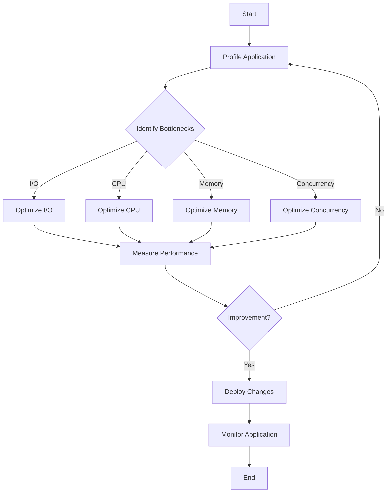

## 23.6. Dealing with Bottlenecks

In the world of software development, performance bottlenecks can significantly hinder the efficiency and responsiveness of applications. Rust, with its focus on safety and performance, provides developers with powerful tools to identify and resolve these bottlenecks. In this section, we will explore common sources of bottlenecks, discuss tools and techniques for pinpointing them, and provide strategies for addressing specific types of bottlenecks. We'll also emphasize the importance of measuring performance before and after optimizations and encourage iterative improvement and monitoring.

### Understanding Bottlenecks

A bottleneck occurs when a particular part of a program limits the overall performance, causing delays and inefficiencies. Common sources of bottlenecks include:

- **I/O Operations**: Disk and network I/O can be slow, leading to delays.
- **CPU-bound Operations**: Intensive computations that monopolize CPU resources.
- **Memory Access**: Inefficient memory access patterns can slow down applications.
- **Concurrency Issues**: Poorly managed concurrency can lead to contention and deadlocks.

### Identifying Bottlenecks

Before addressing bottlenecks, we must first identify them. Rust offers several tools and techniques for this purpose:

#### Profiling Tools

Profiling tools help us understand where our program spends most of its time. Some popular tools for Rust include:

- **`perf`**: A powerful Linux profiling tool that can analyze CPU usage, cache misses, and more.
- **Flamegraph**: Visualizes stack traces to show where time is spent in the application.
- **`cargo-flamegraph`**: A Rust-specific tool that integrates with Flamegraph for easy profiling.

#### Code Example: Using `perf` and Flamegraph

```rust
fn main() {
    let mut sum = 0;
    for i in 0..1_000_000 {
        sum += i;
    }
    println!("Sum: {}", sum);
}
```

To profile this code, compile it with optimizations and run `perf`:

```bash
cargo build --release
perf record --call-graph=dwarf ./target/release/my_program
perf script | flamegraph > flamegraph.svg
```

Open `flamegraph.svg` in a browser to visualize the bottlenecks.

#### Analyzing Bottlenecks

Once identified, analyze the bottlenecks to understand their nature. Are they due to I/O, CPU, or memory? This understanding will guide the optimization strategy.

### Strategies for Addressing Bottlenecks

#### I/O Bottlenecks

I/O operations are often slow and can be optimized by:

- **Asynchronous I/O**: Use Rust's `async`/`await` to perform non-blocking I/O.
- **Batching**: Group multiple I/O operations to reduce overhead.
- **Caching**: Store frequently accessed data in memory to avoid repeated I/O.

#### Code Example: Asynchronous I/O with Tokio

```rust
use tokio::fs::File;
use tokio::io::{self, AsyncReadExt};

#[tokio::main]
async fn main() -> io::Result<()> {
    let mut file = File::open("data.txt").await?;
    let mut contents = vec![];
    file.read_to_end(&mut contents).await?;
    println!("File contents: {:?}", contents);
    Ok(())
}
```

#### CPU-bound Bottlenecks

For CPU-bound operations, consider:

- **Parallelism**: Use multiple threads to distribute the workload.
- **Algorithm Optimization**: Choose more efficient algorithms.
- **SIMD**: Utilize Single Instruction, Multiple Data (SIMD) for data parallelism.

#### Code Example: Parallelism with Rayon

```rust
use rayon::prelude::*;

fn main() {
    let numbers: Vec<i32> = (0..1_000_000).collect();
    let sum: i32 = numbers.par_iter().sum();
    println!("Sum: {}", sum);
}
```

#### Memory Access Bottlenecks

Optimize memory access by:

- **Data Locality**: Arrange data to minimize cache misses.
- **Efficient Data Structures**: Use data structures that suit the access patterns.

#### Concurrency Bottlenecks

Address concurrency issues by:

- **Lock-free Data Structures**: Use atomic operations to avoid locks.
- **Fine-grained Locking**: Minimize contention by locking only necessary data.

### Measuring Performance

Always measure performance before and after optimizations to ensure improvements. Use benchmarks to quantify the impact of changes.

#### Code Example: Benchmarking with Criterion

```rust
use criterion::{black_box, criterion_group, criterion_main, Criterion};

fn fibonacci(n: u64) -> u64 {
    match n {
        0 => 0,
        1 => 1,
        _ => fibonacci(n - 1) + fibonacci(n - 2),
    }
}

fn criterion_benchmark(c: &mut Criterion) {
    c.bench_function("fibonacci 20", |b| b.iter(|| fibonacci(black_box(20))));
}

criterion_group!(benches, criterion_benchmark);
criterion_main!(benches);
```

### Iterative Improvement and Monitoring

Optimization is an iterative process. Continuously monitor performance and refine optimizations. Use logging and monitoring tools to track application behavior in production.

### Visualizing Bottlenecks

Visual tools can help understand bottlenecks better. Here's a simple flowchart to illustrate the process of identifying and resolving bottlenecks:



### Conclusion

Dealing with bottlenecks in Rust applications requires a systematic approach to identify, analyze, and optimize performance issues. By leveraging Rust's powerful tools and techniques, we can enhance the efficiency and responsiveness of our applications. Remember, optimization is an ongoing process, and continuous monitoring and refinement are key to maintaining optimal performance.

## Quiz Time!



### What is a common source of bottlenecks in applications?

- [x] I/O Operations
- [ ] Variable Naming
- [ ] Code Comments
- [ ] Syntax Errors

> **Explanation:** I/O operations are often slow and can cause performance bottlenecks.

### Which tool can be used to visualize stack traces in Rust applications?

- [x] Flamegraph
- [ ] Cargo
- [ ] Clippy
- [ ] Rustdoc

> **Explanation:** Flamegraph visualizes stack traces to show where time is spent in the application.

### What is a strategy for optimizing CPU-bound operations?

- [x] Parallelism
- [ ] Increasing Code Comments
- [ ] Using More Variables
- [ ] Adding More Functions

> **Explanation:** Parallelism can distribute the workload across multiple threads, optimizing CPU-bound operations.

### How can memory access bottlenecks be optimized?

- [x] Data Locality
- [ ] Increasing Code Size
- [ ] Using More Loops
- [ ] Adding More Functions

> **Explanation:** Arranging data to minimize cache misses improves data locality and optimizes memory access.

### What should be done before and after optimizations?

- [x] Measure Performance
- [ ] Increase Code Comments
- [ ] Add More Variables
- [ ] Use More Functions

> **Explanation:** Measuring performance before and after optimizations ensures that changes have a positive impact.

### Which Rust feature is used for non-blocking I/O?

- [x] `async`/`await`
- [ ] `match`
- [ ] `loop`
- [ ] `if`

> **Explanation:** Rust's `async`/`await` feature is used for non-blocking I/O operations.

### What is a benefit of using lock-free data structures?

- [x] Avoiding Locks
- [ ] Increasing Code Size
- [ ] Using More Variables
- [ ] Adding More Functions

> **Explanation:** Lock-free data structures use atomic operations to avoid locks, reducing contention.

### What is the purpose of benchmarking?

- [x] Quantifying the impact of changes
- [ ] Increasing Code Comments
- [ ] Using More Variables
- [ ] Adding More Functions

> **Explanation:** Benchmarking helps quantify the impact of changes on performance.

### What is an iterative process in optimization?

- [x] Continuous Monitoring and Refinement
- [ ] Increasing Code Comments
- [ ] Using More Variables
- [ ] Adding More Functions

> **Explanation:** Optimization is an iterative process that involves continuous monitoring and refinement.

### True or False: Optimization is a one-time process.

- [ ] True
- [x] False

> **Explanation:** Optimization is not a one-time process; it requires ongoing monitoring and refinement.



Remember, this is just the beginning. As you progress, you'll build more complex and efficient Rust applications. Keep experimenting, stay curious, and enjoy the journey!
