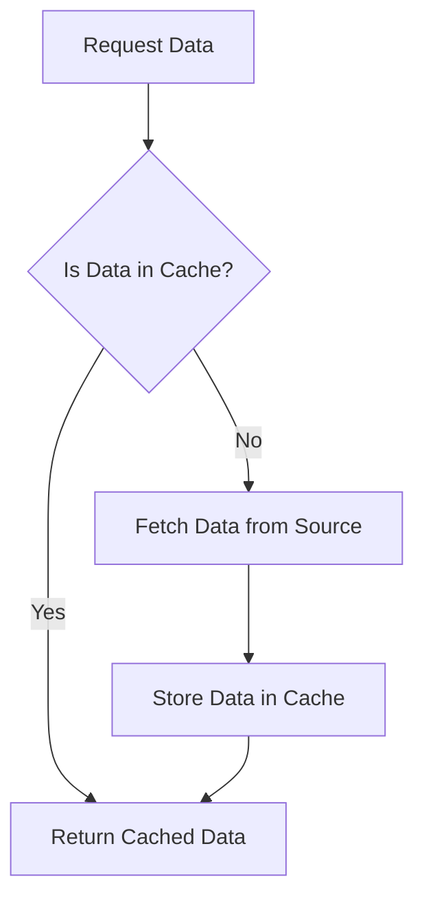

## 23.7. Caching Strategies

In the world of software development, performance optimization is a critical aspect that can significantly impact the user experience and resource efficiency of applications. One of the most effective techniques for enhancing performance is caching. In this section, we will delve into caching strategies in Rust, exploring how they can be implemented to improve application performance by avoiding redundant computations or I/O operations.

### Understanding Caching and Its Benefits

Caching is a technique used to store copies of data in a temporary storage location, known as a cache, so that future requests for that data can be served faster. The primary goal of caching is to reduce the time and resources required to access data by storing frequently accessed data closer to the application.

**Benefits of Caching:**

1. **Improved Performance:** By reducing the need to recompute or fetch data from slower storage systems, caching can significantly speed up application response times.
2. **Reduced Load on Backend Systems:** Caching can decrease the number of requests to backend systems, reducing their load and improving overall system scalability.
3. **Cost Efficiency:** By minimizing the need for expensive computations or data retrieval operations, caching can lead to cost savings in terms of computational resources and bandwidth.

### In-Memory Caching with Data Structures

In-memory caching involves storing data in the application's memory, allowing for extremely fast access times. In Rust, one of the most common data structures used for in-memory caching is the `HashMap`.

#### Using `HashMap` for Caching

A `HashMap` is a collection that stores key-value pairs and provides efficient data retrieval. It is ideal for caching scenarios where you need to quickly look up data based on a key.

```rust
use std::collections::HashMap;

fn main() {
    // Create a new HashMap to act as a cache
    let mut cache: HashMap<String, String> = HashMap::new();

    // Insert some data into the cache
    cache.insert("key1".to_string(), "value1".to_string());
    cache.insert("key2".to_string(), "value2".to_string());

    // Retrieve data from the cache
    if let Some(value) = cache.get("key1") {
        println!("Cached value for 'key1': {}", value);
    } else {
        println!("Value for 'key1' not found in cache.");
    }
}
```

**Key Points:**

- **Fast Access:** `HashMap` provides average constant time complexity for insertions and lookups, making it suitable for caching.
- **Flexibility:** You can store any type of data as long as it implements the `Eq` and `Hash` traits for keys.

### Implementing Memoization in Rust

Memoization is a specific caching technique used to store the results of expensive function calls and return the cached result when the same inputs occur again. This can be particularly useful in recursive algorithms or functions with expensive computations.

#### Memoization Example

Let's consider a simple example of memoizing a Fibonacci function:

```rust
use std::collections::HashMap;

fn fibonacci(n: u32, cache: &mut HashMap<u32, u32>) -> u32 {
    if n <= 1 {
        return n;
    }
    if let Some(&result) = cache.get(&n) {
        return result;
    }
    let result = fibonacci(n - 1, cache) + fibonacci(n - 2, cache);
    cache.insert(n, result);
    result
}

fn main() {
    let mut cache = HashMap::new();
    let result = fibonacci(10, &mut cache);
    println!("Fibonacci(10) = {}", result);
}
```

**Explanation:**

- **Recursive Function:** The `fibonacci` function calculates the Fibonacci number for a given `n`.
- **Cache Usage:** A `HashMap` is used to store previously computed Fibonacci numbers, reducing redundant calculations.

### Cache Invalidation and Coherence

One of the challenges with caching is ensuring that the cached data remains consistent with the source data. This is where cache invalidation comes into play. Cache invalidation is the process of removing or updating stale data in the cache to maintain coherence with the source data.

**Considerations for Cache Invalidation:**

1. **Time-Based Expiration:** Set a time-to-live (TTL) for cache entries, after which they are automatically invalidated.
2. **Event-Based Invalidation:** Invalidate cache entries based on specific events, such as data updates or deletions.
3. **Manual Invalidation:** Provide mechanisms for manually invalidating cache entries when necessary.

### External Caching Systems

While in-memory caching is suitable for many scenarios, there are cases where an external caching system is more appropriate. External caching systems, such as Redis, provide persistent and distributed caching capabilities.

#### Using Redis for Caching

Redis is an in-memory data structure store that can be used as a cache. It offers features like persistence, replication, and clustering, making it suitable for large-scale applications.

To use Redis in Rust, you can use the `redis` crate. Here's a simple example:

```rust
use redis::{Commands, Connection, RedisResult};

fn connect_to_redis() -> RedisResult<Connection> {
    let client = redis::Client::open("redis://127.0.0.1/")?;
    client.get_connection()
}

fn main() -> RedisResult<()> {
    let mut conn = connect_to_redis()?;

    // Set a value in Redis
    let _: () = conn.set("key1", "value1")?;

    // Get a value from Redis
    let value: String = conn.get("key1")?;
    println!("Cached value for 'key1': {}", value);

    Ok(())
}
```

**Key Points:**

- **Persistence:** Redis can persist data to disk, ensuring that cached data is not lost on server restarts.
- **Scalability:** Redis supports clustering, allowing you to scale your cache across multiple nodes.

### Visualizing Caching Strategies

To better understand the flow of caching strategies, let's visualize the process using a flowchart.



**Diagram Explanation:**

- **Request Data:** The process begins with a request for data.
- **Cache Check:** The system checks if the data is already in the cache.
- **Return Cached Data:** If the data is in the cache, it is returned immediately.
- **Fetch from Source:** If the data is not in the cache, it is fetched from the source.
- **Store in Cache:** The fetched data is stored in the cache for future requests.

### Knowledge Check

To reinforce your understanding of caching strategies in Rust, consider the following questions:

1. What are the primary benefits of implementing caching in an application?
2. How does a `HashMap` facilitate in-memory caching in Rust?
3. What is memoization, and how can it be implemented in Rust?
4. Why is cache invalidation important, and what are some common strategies for invalidating cache entries?
5. When might it be appropriate to use an external caching system like Redis?

### Embrace the Journey

Remember, caching is a powerful tool in your performance optimization toolkit. As you continue to explore and implement caching strategies, you'll find new ways to enhance the efficiency and responsiveness of your Rust applications. Keep experimenting, stay curious, and enjoy the journey!

### References and Links

- [Rust HashMap Documentation](https://doc.rust-lang.org/std/collections/struct.HashMap.html)
- [Redis Official Website](https://redis.io/)
- [Redis Crate on crates.io](https://crates.io/crates/redis)

## Quiz Time!



### What is the primary goal of caching?

- [x] To reduce the time and resources required to access data
- [ ] To increase the complexity of data retrieval
- [ ] To store data permanently
- [ ] To replace databases

> **Explanation:** Caching aims to reduce the time and resources required to access data by storing frequently accessed data closer to the application.


### Which data structure is commonly used for in-memory caching in Rust?

- [x] HashMap
- [ ] Vec
- [ ] LinkedList
- [ ] BinaryTree

> **Explanation:** `HashMap` is commonly used for in-memory caching in Rust due to its efficient key-value storage and retrieval capabilities.


### What is memoization?

- [x] A caching technique to store the results of expensive function calls
- [ ] A method to increase memory usage
- [ ] A way to permanently store data
- [ ] A technique to reduce code complexity

> **Explanation:** Memoization is a caching technique used to store the results of expensive function calls and return the cached result when the same inputs occur again.


### Why is cache invalidation important?

- [x] To ensure cached data remains consistent with the source data
- [ ] To increase the size of the cache
- [ ] To decrease the performance of the application
- [ ] To permanently store data

> **Explanation:** Cache invalidation is important to ensure that cached data remains consistent with the source data, preventing stale or incorrect data from being used.


### Which of the following is a common strategy for cache invalidation?

- [x] Time-Based Expiration
- [ ] Increasing Cache Size
- [ ] Decreasing Cache Size
- [ ] Permanent Storage

> **Explanation:** Time-Based Expiration is a common strategy for cache invalidation, where cache entries are automatically invalidated after a set time-to-live (TTL).


### When might it be appropriate to use an external caching system like Redis?

- [x] When you need persistent and distributed caching capabilities
- [ ] When you want to increase memory usage
- [ ] When you need to decrease application performance
- [ ] When you want to permanently store data

> **Explanation:** An external caching system like Redis is appropriate when you need persistent and distributed caching capabilities, especially for large-scale applications.


### What is a key benefit of using Redis for caching?

- [x] Persistence and scalability
- [ ] Increased complexity
- [ ] Decreased performance
- [ ] Permanent data storage

> **Explanation:** Redis offers persistence and scalability, making it suitable for caching in large-scale applications.


### How does a `HashMap` provide efficient data retrieval?

- [x] By storing key-value pairs with average constant time complexity
- [ ] By increasing the complexity of data retrieval
- [ ] By storing data permanently
- [ ] By replacing databases

> **Explanation:** `HashMap` provides efficient data retrieval by storing key-value pairs with average constant time complexity for insertions and lookups.


### What is the role of cache coherence?

- [x] To ensure that cached data is consistent with the source data
- [ ] To increase the size of the cache
- [ ] To decrease the performance of the application
- [ ] To permanently store data

> **Explanation:** Cache coherence ensures that cached data is consistent with the source data, preventing stale or incorrect data from being used.


### True or False: Caching can lead to cost savings in terms of computational resources and bandwidth.

- [x] True
- [ ] False

> **Explanation:** Caching can lead to cost savings by minimizing the need for expensive computations or data retrieval operations, reducing computational resources and bandwidth usage.


