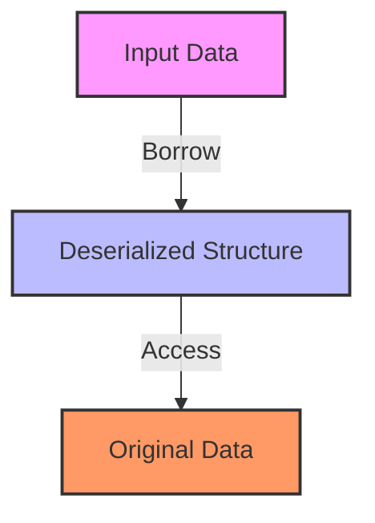

## 23.8. Zero-Copy Serialization with Serde

In the realm of systems programming, performance is often a critical concern. Rust, with its emphasis on safety and speed, provides powerful tools to optimize performance, one of which is zero-copy serialization. This technique is particularly useful when dealing with large datasets or performance-critical applications. In this section, we will explore how zero-copy serialization with Serde can be leveraged to enhance performance by minimizing unnecessary data copying during serialization and deserialization processes.

### Understanding Zero-Copy Serialization

Zero-copy serialization is a technique that reduces or eliminates the need to copy data during serialization or deserialization. By avoiding data duplication, we can significantly enhance the performance of applications, especially those that handle large volumes of data. This is achieved by directly accessing the data in its original form, rather than creating intermediate copies.

#### Key Benefits of Zero-Copy Serialization

- **Performance Improvement**: By reducing data copying, zero-copy serialization can lead to faster data processing and lower memory usage.
- **Reduced Latency**: Applications can achieve lower latency by minimizing the overhead associated with data copying.
- **Memory Efficiency**: Less memory is consumed as data is not duplicated unnecessarily.

### Serde and Zero-Copy Deserialization

Serde is a powerful serialization framework in Rust that supports zero-copy deserialization. It allows developers to deserialize data directly into Rust data structures without copying the data, using borrowed references. This is particularly useful when working with large datasets or when performance is a critical concern.

#### How Serde Supports Zero-Copy Deserialization

Serde achieves zero-copy deserialization through the use of lifetimes and borrowed data. By leveraging Rust's ownership model, Serde can deserialize data into structures that borrow from the input data, avoiding unnecessary allocations and copies.

#### Example: Using `serde` and `serde_bytes`

Let's explore how we can use Serde to perform zero-copy deserialization with an example. We'll use the `serde_bytes` crate, which provides efficient serialization and deserialization of byte slices.

```rust
use serde::{Deserialize, Serialize};
use serde_bytes::ByteBuf;

#[derive(Serialize, Deserialize, Debug)]
struct Data<'a> {
    #[serde(borrow)]
    name: &'a str,
    #[serde(with = "serde_bytes")]
    data: ByteBuf,
}

fn main() {
    let json_data = r#"{
        "name": "example",
        "data": [104, 101, 108, 108, 111]
    }"#;

    // Deserialize JSON data into the Data struct
    let deserialized: Data = serde_json::from_str(json_data).unwrap();

    println!("Name: {}", deserialized.name);
    println!("Data: {:?}", deserialized.data);
}
```

In this example, the `Data` struct contains a borrowed string slice `name` and a `ByteBuf` for the `data` field. The `serde_bytes` crate is used to handle the byte slice efficiently. The `#[serde(borrow)]` attribute indicates that the `name` field should be deserialized as a borrowed reference, enabling zero-copy deserialization.

### Scenarios Benefiting from Zero-Copy Serialization

Zero-copy serialization is particularly beneficial in scenarios where performance and memory efficiency are critical. Some common use cases include:

- **Network Applications**: Applications that handle large volumes of network data can benefit from reduced latency and improved throughput.
- **Data Processing Pipelines**: Systems that process large datasets, such as ETL (Extract, Transform, Load) pipelines, can achieve significant performance gains.
- **Embedded Systems**: Memory-constrained environments can leverage zero-copy serialization to optimize resource usage.

### Handling Lifetimes in Zero-Copy Serialization

One of the challenges of zero-copy serialization is managing lifetimes correctly. Since zero-copy deserialization involves borrowing data, it's crucial to ensure that the borrowed data outlives the deserialized structure. Rust's borrow checker helps enforce these constraints, but developers must be mindful of lifetime annotations.

#### Example: Correctly Handling Lifetimes

```rust
use serde::{Deserialize, Serialize};

#[derive(Serialize, Deserialize, Debug)]
struct Message<'a> {
    #[serde(borrow)]
    content: &'a str,
}

fn process_message<'a>(data: &'a str) -> Message<'a> {
    serde_json::from_str(data).unwrap()
}

fn main() {
    let json_data = r#"{ "content": "Hello, world!" }"#;
    let message = process_message(json_data);

    println!("Message content: {}", message.content);
}
```

In this example, the `Message` struct borrows the `content` field from the input data. The `process_message` function ensures that the lifetime of the borrowed data is correctly handled, allowing the `Message` struct to safely reference the input data.

### Limitations of Zero-Copy Serialization

While zero-copy serialization offers significant performance benefits, it also comes with certain limitations:

- **Complexity**: Managing lifetimes and borrowed data can add complexity to the codebase.
- **Limited Use Cases**: Not all data formats or scenarios are suitable for zero-copy serialization. It's essential to evaluate whether the benefits outweigh the complexity in each case.
- **Data Mutability**: Zero-copy deserialization typically involves immutable data, which may not be suitable for all applications.

### Visualizing Zero-Copy Serialization

To better understand the concept of zero-copy serialization, let's visualize the process using a diagram.



**Diagram Description**: This diagram illustrates the zero-copy deserialization process. The input data is borrowed directly by the deserialized structure, allowing access to the original data without copying.

### Best Practices for Zero-Copy Serialization

- **Evaluate Use Cases**: Assess whether zero-copy serialization is appropriate for your application, considering the complexity and potential benefits.
- **Manage Lifetimes Carefully**: Ensure that borrowed data outlives the deserialized structures to avoid runtime errors.
- **Use Appropriate Crates**: Leverage crates like `serde_bytes` to handle byte slices efficiently.
- **Test Thoroughly**: Validate the performance improvements and correctness of your implementation through rigorous testing.

### Conclusion

Zero-copy serialization with Serde is a powerful technique for optimizing performance in Rust applications. By minimizing data copying, developers can achieve significant gains in speed and memory efficiency. However, it's essential to carefully manage lifetimes and evaluate the suitability of zero-copy serialization for each use case. As you continue your journey with Rust, consider exploring zero-copy serialization to unlock new levels of performance in your applications.

Remember, this is just the beginning. As you progress, you'll discover more advanced techniques and patterns to further enhance your Rust programming skills. Keep experimenting, stay curious, and enjoy the journey!

## Quiz Time!



### What is the primary benefit of zero-copy serialization?

- [x] Reduces data copying, improving performance
- [ ] Increases data security
- [ ] Simplifies code structure
- [ ] Enhances data integrity

> **Explanation:** Zero-copy serialization reduces data copying, leading to improved performance and lower memory usage.

### Which Rust crate is commonly used for zero-copy serialization of byte slices?

- [ ] serde_json
- [x] serde_bytes
- [ ] serde_yaml
- [ ] serde_xml

> **Explanation:** The `serde_bytes` crate is used for efficient serialization and deserialization of byte slices.

### What attribute is used in Serde to indicate a field should be deserialized as a borrowed reference?

- [ ] #[serde(with)]
- [x] #[serde(borrow)]
- [ ] #[serde(skip)]
- [ ] #[serde(rename)]

> **Explanation:** The `#[serde(borrow)]` attribute is used to indicate that a field should be deserialized as a borrowed reference.

### In zero-copy serialization, what must be carefully managed to avoid runtime errors?

- [ ] Data types
- [x] Lifetimes
- [ ] Memory allocation
- [ ] Error handling

> **Explanation:** Lifetimes must be carefully managed to ensure that borrowed data outlives the deserialized structures.

### Which of the following is a limitation of zero-copy serialization?

- [x] Complexity in managing lifetimes
- [ ] Increased memory usage
- [ ] Reduced performance
- [ ] Limited data format support

> **Explanation:** Zero-copy serialization can add complexity to the codebase due to the need to manage lifetimes and borrowed data.

### What is the role of the `serde_bytes` crate in zero-copy serialization?

- [x] It provides efficient serialization and deserialization of byte slices.
- [ ] It simplifies JSON parsing.
- [ ] It enhances data security.
- [ ] It manages memory allocation.

> **Explanation:** The `serde_bytes` crate is used for efficient serialization and deserialization of byte slices, supporting zero-copy operations.

### Which of the following scenarios can benefit from zero-copy serialization?

- [x] Network applications
- [x] Data processing pipelines
- [ ] Small-scale applications
- [ ] Static websites

> **Explanation:** Network applications and data processing pipelines can benefit from zero-copy serialization due to reduced latency and improved throughput.

### What is a potential downside of zero-copy serialization?

- [ ] Increased data security
- [ ] Simplified code structure
- [x] Complexity in code management
- [ ] Enhanced data integrity

> **Explanation:** Zero-copy serialization can add complexity to the code due to the need to manage lifetimes and borrowed data.

### True or False: Zero-copy serialization always results in mutable data.

- [ ] True
- [x] False

> **Explanation:** Zero-copy serialization typically involves immutable data, as it often relies on borrowing data directly.

### What should developers do to ensure the correctness of zero-copy serialization implementations?

- [x] Test thoroughly
- [ ] Avoid using lifetimes
- [ ] Use only mutable data
- [ ] Ignore performance metrics

> **Explanation:** Developers should test thoroughly to validate the performance improvements and correctness of zero-copy serialization implementations.


