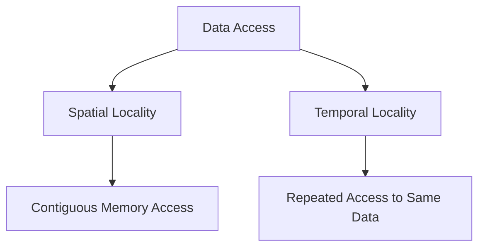

## 23.9. Optimizing for Cache Locality

In the world of high-performance computing, optimizing for cache locality is a crucial technique that can significantly enhance the performance of your Rust programs. By understanding how data is accessed and stored in memory, you can design data structures and algorithms that take full advantage of CPU cache hierarchies. This section will guide you through the concepts of cache locality, data layout strategies, and practical examples to improve your Rust applications.

### Understanding Cache Locality

Cache locality refers to the use of data that is stored close together in memory, which can be accessed quickly by the CPU. There are two main types of cache locality:

- **Spatial Locality**: This occurs when data elements that are close together in memory are accessed sequentially. For example, iterating over an array benefits from spatial locality because the elements are stored contiguously.

- **Temporal Locality**: This occurs when the same data elements are accessed repeatedly over a short period. For example, accessing the same variable multiple times in a loop benefits from temporal locality.

**Why Cache Locality Matters**

Cache locality is important because accessing data from the CPU cache is significantly faster than accessing it from main memory. By optimizing for cache locality, you can reduce cache misses, leading to faster data retrieval and improved overall performance.

### Data Layout Strategies for Improved Cache Locality

To optimize for cache locality, consider the following data layout strategies:

#### 1. Contiguous Memory Allocation

Allocate memory contiguously to improve spatial locality. This is particularly important for arrays and vectors. In Rust, using `Vec<T>` ensures that elements are stored in contiguous memory.

```rust
fn sum_array(arr: &[i32]) -> i32 {
    let mut sum = 0;
    for &value in arr {
        sum += value;
    }
    sum
}

fn main() {
    let numbers = vec![1, 2, 3, 4, 5];
    println!("Sum: {}", sum_array(&numbers));
}
```

**Explanation**: In the example above, the `Vec<i32>` ensures that the integers are stored contiguously, allowing the CPU to efficiently prefetch data into the cache.

#### 2. Struct of Arrays (SoA) vs. Array of Structs (AoS)

Choose the appropriate data layout based on access patterns. The Struct of Arrays (SoA) layout can improve cache performance when accessing individual fields across multiple objects.

```rust
struct PointAoS {
    x: f32,
    y: f32,
    z: f32,
}

struct PointsSoA {
    x: Vec<f32>,
    y: Vec<f32>,
    z: Vec<f32>,
}

fn process_points_aos(points: &[PointAoS]) {
    for point in points {
        // Accessing x, y, z for each point
    }
}

fn process_points_soa(points: &PointsSoA) {
    for i in 0..points.x.len() {
        // Accessing x[i], y[i], z[i]
    }
}
```

**Explanation**: In the `PointsSoA` structure, each coordinate is stored in a separate vector, which can be beneficial if you frequently access all `x` coordinates together, as it improves spatial locality.

#### 3. Data Alignment and Padding

Ensure that data is properly aligned to avoid performance penalties. Rust automatically aligns data structures, but you can use `#[repr(C)]` to control alignment when interfacing with C code.

```rust
#[repr(C)]
struct AlignedData {
    a: u8,
    b: u32,
}

fn main() {
    let data = AlignedData { a: 1, b: 2 };
    println!("Aligned data: a = {}, b = {}", data.a, data.b);
}
```

**Explanation**: The `#[repr(C)]` attribute ensures that the `AlignedData` struct is laid out in memory as it would be in C, which can be important for FFI and cache alignment.

### Avoiding Pitfalls: Pointer Chasing and Fragmented Memory Access

#### Pointer Chasing

Pointer chasing occurs when accessing data through a series of pointers, which can lead to cache misses due to non-contiguous memory access. To minimize pointer chasing, prefer data structures that store elements contiguously, such as arrays or vectors.

```rust
struct Node {
    value: i32,
    next: Option<Box<Node>>,
}

fn traverse_list(node: &Option<Box<Node>>) {
    let mut current = node;
    while let Some(ref n) = current {
        println!("{}", n.value);
        current = &n.next;
    }
}
```

**Explanation**: In the linked list example, each node is allocated separately, leading to potential cache misses as the CPU fetches data from different memory locations.

#### Fragmented Memory Access

Fragmented memory access occurs when data is scattered across memory, leading to inefficient cache usage. To avoid this, use data structures that minimize fragmentation, such as `Vec<T>` or `Box<[T]>`.

### Profiling Cache Effects

Profiling tools can help you observe cache effects and identify performance bottlenecks. Tools like `perf` and `cachegrind` can provide insights into cache usage and help you optimize your code.

**Steps to Profile Cache Usage**:

1. **Compile with Debug Information**: Use the `--release` flag for optimized builds and `-g` for debug information.
2. **Run Profiling Tools**: Use tools like `perf` or `cachegrind` to analyze cache performance.
3. **Analyze Results**: Look for cache misses and identify areas for improvement.

### Try It Yourself

Experiment with the following code examples to see the effects of cache locality:

1. Modify the `sum_array` function to use a linked list instead of a vector. Observe the performance difference.
2. Compare the performance of `process_points_aos` and `process_points_soa` with a large dataset.
3. Use profiling tools to measure cache performance before and after optimizing your code.

### Visualizing Cache Locality

To better understand cache locality, consider the following diagram that illustrates the difference between spatial and temporal locality:



**Description**: This diagram shows how spatial locality involves accessing contiguous memory locations, while temporal locality involves repeated access to the same data.

### Key Takeaways

- **Cache locality** is crucial for performance optimization in Rust.
- **Spatial and temporal locality** can be improved through contiguous memory allocation and appropriate data layouts.
- **Avoid pointer chasing** and fragmented memory access to reduce cache misses.
- **Profiling tools** can help identify cache performance bottlenecks.

### Embrace the Journey

Remember, optimizing for cache locality is an ongoing process. As you gain experience, you'll develop an intuition for designing data structures and algorithms that take full advantage of CPU caches. Keep experimenting, stay curious, and enjoy the journey of performance optimization in Rust!

## Quiz Time!



### What is cache locality?

- [x] The use of data that is stored close together in memory for faster access.
- [ ] The process of storing data in the cloud.
- [ ] The method of accessing data from disk storage.
- [ ] The practice of using global variables in a program.

> **Explanation:** Cache locality refers to accessing data that is stored close together in memory, which allows for faster retrieval by the CPU.

### Which type of locality involves accessing contiguous memory locations?

- [x] Spatial Locality
- [ ] Temporal Locality
- [ ] Logical Locality
- [ ] Physical Locality

> **Explanation:** Spatial locality involves accessing data that is stored in contiguous memory locations, which improves cache performance.

### What is a common pitfall that can lead to cache misses?

- [x] Pointer Chasing
- [ ] Using Arrays
- [ ] Contiguous Memory Allocation
- [ ] Using `Vec<T>`

> **Explanation:** Pointer chasing involves accessing data through a series of pointers, which can lead to cache misses due to non-contiguous memory access.

### How can you improve spatial locality in Rust?

- [x] Use contiguous memory allocation, such as `Vec<T>`.
- [ ] Use linked lists for data storage.
- [ ] Store data in separate memory locations.
- [ ] Use global variables.

> **Explanation:** Using contiguous memory allocation, such as `Vec<T>`, ensures that data is stored in contiguous memory locations, improving spatial locality.

### What tool can be used to profile cache performance?

- [x] `perf`
- [ ] `cargo`
- [ ] `rustc`
- [ ] `git`

> **Explanation:** `perf` is a profiling tool that can be used to analyze cache performance and identify bottlenecks.

### Which data layout can improve cache performance when accessing individual fields across multiple objects?

- [x] Struct of Arrays (SoA)
- [ ] Array of Structs (AoS)
- [ ] Linked List
- [ ] HashMap

> **Explanation:** The Struct of Arrays (SoA) layout can improve cache performance when accessing individual fields across multiple objects, as it improves spatial locality.

### What is the benefit of using `#[repr(C)]` in Rust?

- [x] It ensures data is laid out in memory as it would be in C, which can be important for FFI and cache alignment.
- [ ] It automatically optimizes code for cache locality.
- [ ] It increases the speed of the Rust compiler.
- [ ] It provides better error messages.

> **Explanation:** `#[repr(C)]` ensures that data is laid out in memory as it would be in C, which can be important for FFI and cache alignment.

### What is temporal locality?

- [x] Repeated access to the same data over a short period.
- [ ] Accessing data stored in contiguous memory locations.
- [ ] Accessing data from disk storage.
- [ ] Using global variables in a program.

> **Explanation:** Temporal locality refers to repeated access to the same data over a short period, which can improve cache performance.

### What is a potential downside of fragmented memory access?

- [x] Inefficient cache usage
- [ ] Faster data retrieval
- [ ] Improved spatial locality
- [ ] Reduced memory usage

> **Explanation:** Fragmented memory access can lead to inefficient cache usage, as data is scattered across memory, leading to cache misses.

### True or False: Profiling tools can help identify cache performance bottlenecks.

- [x] True
- [ ] False

> **Explanation:** Profiling tools can provide insights into cache usage and help identify performance bottlenecks, allowing for optimization.


