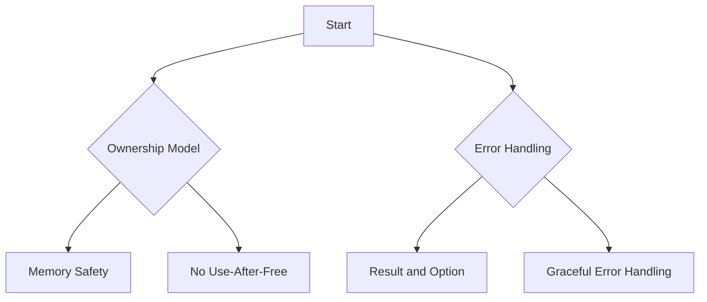

## 24.1. Secure Coding Practices in Rust

In today's digital landscape, security is paramount. As developers, we must ensure that our software is robust against threats and vulnerabilities. Rust, with its unique features, offers a compelling environment for writing secure code. This section delves into secure coding practices in Rust, highlighting principles, guidelines, and Rust's inherent advantages in promoting security.

### The Importance of Security in Software Development

Security is a critical aspect of software development. With increasing cyber threats, ensuring the safety and integrity of software systems is more important than ever. Secure coding practices help prevent vulnerabilities that could be exploited by attackers, leading to data breaches, unauthorized access, and other security incidents.

### General Secure Coding Practices

Let's explore some general secure coding practices that are applicable across programming languages, including Rust:

#### Input Validation

- **Validate All Inputs**: Ensure that all inputs are validated against expected formats and ranges. This prevents injection attacks and other vulnerabilities.
- **Sanitize User Inputs**: Remove or escape any potentially harmful characters from user inputs to prevent injection attacks.

#### Principle of Least Privilege

- **Minimize Permissions**: Grant only the necessary permissions required for a task. This limits the potential damage if a component is compromised.
- **Use Role-Based Access Control (RBAC)**: Implement RBAC to manage permissions effectively and ensure that users have access only to what they need.

#### Secure Error Handling

- **Avoid Exposing Sensitive Information**: Error messages should not reveal sensitive information about the system or its configuration.
- **Use `Result` and `Option`**: Rust's `Result` and `Option` types provide a robust way to handle errors without exposing system details.

#### Regular Code Reviews and Security Training

- **Conduct Code Reviews**: Regular code reviews help identify potential security issues early in the development process.
- **Invest in Security Training**: Continuous security training for developers ensures they are aware of the latest threats and best practices.

### Rust's Features Promoting Security

Rust's design inherently promotes secure coding practices. Let's explore how Rust's features contribute to security:

#### Ownership and Borrowing

Rust's ownership model ensures memory safety without a garbage collector. This prevents common vulnerabilities such as buffer overflows and use-after-free errors.

```rust
fn main() {
    let data = String::from("Secure Rust");
    let borrowed_data = &data; // Borrowing data
    println!("{}", borrowed_data);
    // Ownership ensures data is not used after it's freed
}
```

#### Type Safety

Rust's strong type system prevents many errors at compile time, reducing runtime vulnerabilities.

```rust
fn add_numbers(a: i32, b: i32) -> i32 {
    a + b
}

fn main() {
    let result = add_numbers(5, 10);
    println!("Result: {}", result);
}
```

#### Pattern Matching

Pattern matching in Rust allows for exhaustive handling of cases, reducing the likelihood of unhandled scenarios.

```rust
enum ConnectionState {
    Connected,
    Disconnected,
    Connecting,
}

fn handle_connection(state: ConnectionState) {
    match state {
        ConnectionState::Connected => println!("Connected"),
        ConnectionState::Disconnected => println!("Disconnected"),
        ConnectionState::Connecting => println!("Connecting"),
    }
}
```

### Handling Errors Securely

Error handling is crucial in maintaining security. Rust provides robust mechanisms to handle errors gracefully.

#### Using `Result` and `Option`

Rust's `Result` and `Option` types enforce handling of potential errors and absent values, preventing unexpected crashes.

```rust
fn divide(numerator: f64, denominator: f64) -> Result<f64, String> {
    if denominator == 0.0 {
        Err(String::from("Cannot divide by zero"))
    } else {
        Ok(numerator / denominator)
    }
}

fn main() {
    match divide(10.0, 2.0) {
        Ok(result) => println!("Result: {}", result),
        Err(e) => println!("Error: {}", e),
    }
}
```

#### Avoiding Panics

Avoid using `panic!` in production code as it can lead to abrupt program termination. Instead, handle errors gracefully using `Result` and `Option`.

### Avoiding Exposing Sensitive Information

Ensure that sensitive information is not exposed through logs, error messages, or other outputs.

- **Redact Sensitive Data**: Use placeholders or redactions for sensitive data in logs.
- **Secure Logging**: Implement secure logging practices to prevent unauthorized access to log files.

### Encouraging Regular Code Reviews and Security Training

Regular code reviews and continuous security training are essential for maintaining secure codebases.

- **Peer Reviews**: Encourage peer reviews to catch potential security issues early.
- **Security Workshops**: Organize workshops and training sessions to keep the team updated on the latest security practices.

### Visualizing Rust's Security Features

To better understand how Rust's features contribute to security, let's visualize the ownership model and error handling flow.



**Figure 1**: Visualizing Rust's Ownership Model and Error Handling Flow

### Try It Yourself

Experiment with the code examples provided. Try modifying the `divide` function to handle different types of errors, such as invalid input types or out-of-range values. Observe how Rust's type system and error handling mechanisms help maintain security.

### References and Further Reading

- [Rust Programming Language Documentation](https://doc.rust-lang.org/)
- [OWASP Secure Coding Practices](https://owasp.org/www-project-secure-coding-practices-quick-reference-guide/)
- [The Rust Book](https://doc.rust-lang.org/book/)

### Knowledge Check

- What are the key features of Rust that promote secure coding?
- How does Rust's ownership model contribute to memory safety?
- Why is it important to avoid exposing sensitive information in error messages?

### Embrace the Journey

Remember, secure coding is a continuous journey. As you progress, you'll encounter new challenges and opportunities to enhance your skills. Keep experimenting, stay curious, and enjoy the journey of writing secure and robust Rust code!

## Quiz Time!



### What is a key feature of Rust that promotes memory safety?

- [x] Ownership model
- [ ] Garbage collection
- [ ] Dynamic typing
- [ ] Manual memory management

> **Explanation:** Rust's ownership model ensures memory safety without the need for a garbage collector.

### Which Rust feature helps prevent buffer overflow vulnerabilities?

- [x] Ownership and borrowing
- [ ] Dynamic memory allocation
- [ ] Manual memory management
- [ ] Global variables

> **Explanation:** Ownership and borrowing in Rust prevent buffer overflows by ensuring safe memory access.

### How does Rust handle errors without exposing sensitive information?

- [x] Using `Result` and `Option` types
- [ ] Using `panic!`
- [ ] Logging all errors
- [ ] Ignoring errors

> **Explanation:** Rust uses `Result` and `Option` types to handle errors gracefully without exposing sensitive information.

### What is the principle of least privilege?

- [x] Granting only necessary permissions
- [ ] Allowing all permissions by default
- [ ] Disabling all permissions
- [ ] Granting maximum permissions

> **Explanation:** The principle of least privilege involves granting only the permissions necessary for a task.

### Why is regular code review important in secure coding?

- [x] It helps identify potential security issues early
- [ ] It slows down development
- [ ] It is only necessary for large projects
- [ ] It is optional

> **Explanation:** Regular code reviews help identify and address potential security issues early in the development process.

### What should be avoided in production code to maintain security?

- [x] Using `panic!`
- [ ] Using `Result`
- [ ] Using `Option`
- [ ] Using `match`

> **Explanation:** Using `panic!` in production code can lead to abrupt program termination and should be avoided.

### How can sensitive information be protected in logs?

- [x] Redacting sensitive data
- [ ] Logging everything
- [ ] Disabling logging
- [ ] Using plain text logs

> **Explanation:** Redacting sensitive data in logs helps protect sensitive information from unauthorized access.

### What is a benefit of using Rust's type system?

- [x] Prevents many errors at compile time
- [ ] Allows dynamic typing
- [ ] Requires manual memory management
- [ ] Encourages global variables

> **Explanation:** Rust's strong type system prevents many errors at compile time, enhancing security.

### Which Rust feature allows for exhaustive handling of cases?

- [x] Pattern matching
- [ ] Dynamic typing
- [ ] Global variables
- [ ] Manual memory management

> **Explanation:** Pattern matching in Rust allows for exhaustive handling of cases, reducing unhandled scenarios.

### True or False: Rust's ownership model eliminates the need for a garbage collector.

- [x] True
- [ ] False

> **Explanation:** Rust's ownership model ensures memory safety without the need for a garbage collector.


