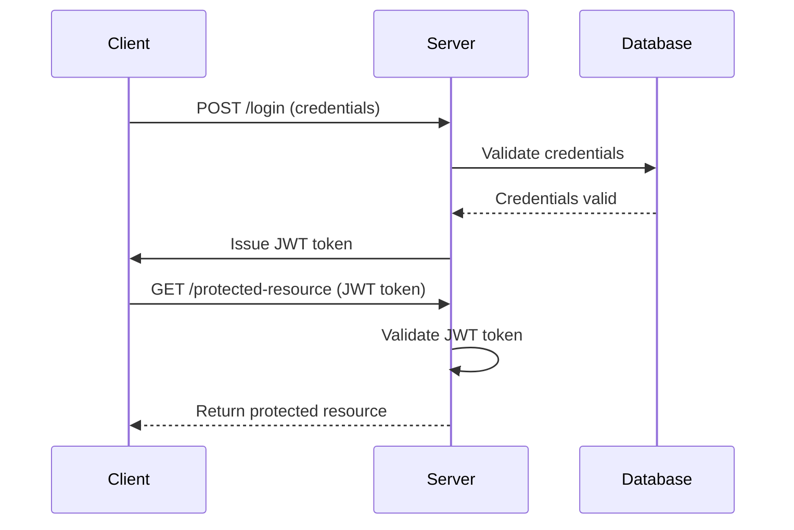

## 24.11. Patterns for Building Secure APIs

In today's interconnected world, APIs serve as the backbone of communication between different software systems. Ensuring the security of these APIs is paramount to protect sensitive data and maintain the integrity of the systems they connect. In this section, we will explore various design patterns and best practices for building secure APIs in Rust, focusing on authentication, authorization, input validation, and compliance with security standards like OAuth2 and OpenID Connect.

### Importance of Secure API Design

Secure API design is crucial for several reasons:

- **Data Protection**: APIs often handle sensitive data, such as personal information and financial details. Secure design helps protect this data from unauthorized access and breaches.
- **System Integrity**: A secure API ensures that only authorized users and systems can interact with it, maintaining the integrity of the connected systems.
- **Compliance**: Many industries have regulatory requirements for data protection and privacy. Secure API design helps ensure compliance with these regulations.
- **Reputation**: Security breaches can damage an organization's reputation. Secure APIs help build trust with users and partners.

### Key Patterns for Secure API Design

Let's delve into some key patterns and practices for secure API design in Rust.

#### 1. Token-Based Authentication

Token-based authentication is a widely used pattern for securing APIs. It involves issuing a token to a client after successful authentication, which the client then uses to access protected resources.

**Implementation in Rust:**

Using a Rust web framework like Actix-Web, we can implement token-based authentication as follows:

```rust
use actix_web::{web, App, HttpServer, HttpRequest, HttpResponse, Result};
use jsonwebtoken::{encode, Header, EncodingKey};
use serde::{Serialize, Deserialize};

#[derive(Debug, Serialize, Deserialize)]
struct Claims {
    sub: String,
    exp: usize,
}

async fn login(req: HttpRequest) -> Result<HttpResponse> {
    // Validate user credentials (e.g., from a database)
    let user_id = "user123"; // Example user ID

    // Create JWT claims
    let claims = Claims {
        sub: user_id.to_owned(),
        exp: 10000000000, // Example expiration time
    };

    // Encode the claims into a JWT
    let token = encode(&Header::default(), &claims, &EncodingKey::from_secret("secret".as_ref())).unwrap();

    Ok(HttpResponse::Ok().body(token))
}

#[actix_web::main]
async fn main() -> std::io::Result<()> {
    HttpServer::new(|| {
        App::new()
            .route("/login", web::post().to(login))
    })
    .bind("127.0.0.1:8080")?
    .run()
    .await
}
```

**Key Points:**

- **JWT (JSON Web Tokens)** are commonly used for token-based authentication. They are compact, URL-safe, and can carry claims about the user.
- **Security Consideration**: Always use a strong secret key for signing tokens and consider using HTTPS to protect tokens in transit.

#### 2. Rate Limiting

Rate limiting is a pattern used to control the number of requests a client can make to an API within a given timeframe. This helps prevent abuse and ensures fair usage.

**Implementation in Rust:**

Using the `actix-web` framework, we can implement rate limiting with middleware:

```rust
use actix_web::{web, App, HttpServer, HttpRequest, HttpResponse, Result, middleware};
use actix_service::Service;
use std::time::{Duration, Instant};
use std::collections::HashMap;
use std::sync::{Arc, Mutex};

struct RateLimiter {
    requests: Arc<Mutex<HashMap<String, Instant>>>,
}

impl RateLimiter {
    fn new() -> Self {
        RateLimiter {
            requests: Arc::new(Mutex::new(HashMap::new())),
        }
    }

    fn check_rate_limit(&self, ip: &str) -> bool {
        let mut requests = self.requests.lock().unwrap();
        let now = Instant::now();

        if let Some(last_request) = requests.get(ip) {
            if now.duration_since(*last_request) < Duration::from_secs(1) {
                return false;
            }
        }

        requests.insert(ip.to_string(), now);
        true
    }
}

async fn index(req: HttpRequest, rate_limiter: web::Data<RateLimiter>) -> Result<HttpResponse> {
    let ip = req.peer_addr().unwrap().ip().to_string();

    if !rate_limiter.check_rate_limit(&ip) {
        return Ok(HttpResponse::TooManyRequests().finish());
    }

    Ok(HttpResponse::Ok().body("Welcome!"))
}

#[actix_web::main]
async fn main() -> std::io::Result<()> {
    let rate_limiter = web::Data::new(RateLimiter::new());

    HttpServer::new(move || {
        App::new()
            .app_data(rate_limiter.clone())
            .wrap(middleware::Logger::default())
            .route("/", web::get().to(index))
    })
    .bind("127.0.0.1:8080")?
    .run()
    .await
}
```

**Key Points:**

- **Rate Limiting Strategies**: Common strategies include fixed window, sliding window, and token bucket.
- **Security Consideration**: Rate limiting can help mitigate denial-of-service (DoS) attacks.

#### 3. API Versioning

API versioning is a pattern that allows you to manage changes to your API without breaking existing clients. It involves maintaining multiple versions of your API simultaneously.

**Implementation in Rust:**

Using Actix-Web, we can implement API versioning by defining routes for different versions:

```rust
use actix_web::{web, App, HttpServer, HttpResponse, Result};

async fn v1_index() -> Result<HttpResponse> {
    Ok(HttpResponse::Ok().body("API v1"))
}

async fn v2_index() -> Result<HttpResponse> {
    Ok(HttpResponse::Ok().body("API v2"))
}

#[actix_web::main]
async fn main() -> std::io::Result<()> {
    HttpServer::new(|| {
        App::new()
            .service(
                web::scope("/api/v1")
                    .route("/", web::get().to(v1_index))
            )
            .service(
                web::scope("/api/v2")
                    .route("/", web::get().to(v2_index))
            )
    })
    .bind("127.0.0.1:8080")?
    .run()
    .await
}
```

**Key Points:**

- **Versioning Strategies**: Common strategies include URI versioning, header versioning, and query parameter versioning.
- **Security Consideration**: Ensure that deprecated versions are properly secured or removed to prevent vulnerabilities.

### Best Practices for Secure API Design

#### Session Management

- **Use Secure Cookies**: For session management, use secure cookies with the `HttpOnly` and `Secure` flags to prevent access from JavaScript and ensure they are only sent over HTTPS.
- **Session Expiry**: Implement session expiry to limit the duration of a session and reduce the risk of session hijacking.

#### Data Protection

- **Encryption**: Use encryption to protect sensitive data both in transit and at rest. TLS (Transport Layer Security) is essential for securing data in transit.
- **Data Minimization**: Only collect and store the data necessary for your application to function. This reduces the risk of data breaches.

#### Compliance with Standards

- **OAuth2**: OAuth2 is a widely used standard for authorization. It allows third-party applications to access user data without exposing credentials.
- **OpenID Connect**: OpenID Connect is an identity layer on top of OAuth2, providing authentication and identity verification.

**Implementation in Rust:**

Using the `oauth2` crate, we can implement OAuth2 in a Rust application:

```rust
use oauth2::{
    AuthorizationCode, AuthUrl, ClientId, ClientSecret, CsrfToken, RedirectUrl, Scope, TokenResponse, TokenUrl,
    basic::BasicClient,
};
use url::Url;

fn main() {
    let client = BasicClient::new(
        ClientId::new("client_id".to_string()),
        Some(ClientSecret::new("client_secret".to_string())),
        AuthUrl::new("https://auth.example.com/authorize".to_string()).unwrap(),
        Some(TokenUrl::new("https://auth.example.com/token".to_string()).unwrap())
    )
    .set_redirect_uri(RedirectUrl::new("https://client.example.com/callback".to_string()).unwrap());

    let (auth_url, csrf_token) = client
        .authorize_url(CsrfToken::new_random)
        .add_scope(Scope::new("read".to_string()))
        .url();

    println!("Browse to: {}", auth_url);
    println!("CSRF token: {}", csrf_token.secret());
}
```

**Key Points:**

- **OAuth2 Flows**: Common flows include authorization code, implicit, and client credentials.
- **Security Consideration**: Always validate tokens and handle errors gracefully.

### Visualizing Secure API Design Patterns

To better understand the flow of secure API design patterns, let's visualize the process of token-based authentication using a sequence diagram.



**Diagram Explanation:**

- The client sends credentials to the server for authentication.
- The server validates the credentials against the database.
- Upon successful validation, the server issues a JWT token to the client.
- The client uses the JWT token to access protected resources.
- The server validates the JWT token before granting access.

### Knowledge Check

- **Question**: What is the primary purpose of token-based authentication?
- **Answer**: To authenticate users and provide access to protected resources without repeatedly sending credentials.

- **Question**: Why is rate limiting important for API security?
- **Answer**: It helps prevent abuse and ensures fair usage by controlling the number of requests a client can make.

- **Question**: What is a common strategy for API versioning?
- **Answer**: URI versioning, where different versions of the API are accessed via different URIs.

### Embrace the Journey

Remember, building secure APIs is an ongoing process. As you continue to develop and maintain your APIs, stay informed about the latest security practices and standards. Keep experimenting, stay curious, and enjoy the journey of creating secure and robust APIs in Rust!

## Quiz Time!



### What is the primary purpose of token-based authentication?

- [x] To authenticate users and provide access to protected resources without repeatedly sending credentials.
- [ ] To encrypt data in transit.
- [ ] To limit the number of API requests.
- [ ] To manage API versions.

> **Explanation:** Token-based authentication allows users to authenticate once and use a token for subsequent requests, enhancing security and efficiency.

### Why is rate limiting important for API security?

- [x] It helps prevent abuse and ensures fair usage by controlling the number of requests a client can make.
- [ ] It encrypts data in transit.
- [ ] It manages API versions.
- [ ] It provides user authentication.

> **Explanation:** Rate limiting controls the frequency of requests, preventing abuse and ensuring fair usage.

### What is a common strategy for API versioning?

- [x] URI versioning, where different versions of the API are accessed via different URIs.
- [ ] Token-based versioning.
- [ ] Rate limiting.
- [ ] Session management.

> **Explanation:** URI versioning involves using different URIs for different API versions, allowing clients to access specific versions.

### Which of the following is a widely used standard for authorization?

- [x] OAuth2
- [ ] JWT
- [ ] TLS
- [ ] HTTP

> **Explanation:** OAuth2 is a widely used standard for authorization, allowing third-party applications to access user data securely.

### What is the purpose of using secure cookies?

- [x] To prevent access from JavaScript and ensure they are only sent over HTTPS.
- [ ] To encrypt data at rest.
- [ ] To manage API versions.
- [ ] To limit the number of API requests.

> **Explanation:** Secure cookies have the `HttpOnly` and `Secure` flags to prevent JavaScript access and ensure transmission over HTTPS.

### What is the role of the `csrf_token` in OAuth2?

- [x] To prevent cross-site request forgery attacks.
- [ ] To encrypt data in transit.
- [ ] To manage API versions.
- [ ] To limit the number of API requests.

> **Explanation:** The `csrf_token` is used to prevent cross-site request forgery attacks by ensuring the request is from a legitimate source.

### What is the benefit of using JWT for token-based authentication?

- [x] They are compact, URL-safe, and can carry claims about the user.
- [ ] They encrypt data at rest.
- [ ] They manage API versions.
- [ ] They limit the number of API requests.

> **Explanation:** JWTs are compact and URL-safe, making them ideal for carrying user claims in token-based authentication.

### What is the primary purpose of session expiry?

- [x] To limit the duration of a session and reduce the risk of session hijacking.
- [ ] To encrypt data in transit.
- [ ] To manage API versions.
- [ ] To limit the number of API requests.

> **Explanation:** Session expiry limits the session duration, reducing the risk of session hijacking by ensuring sessions are not indefinitely valid.

### Which of the following is a common OAuth2 flow?

- [x] Authorization code
- [ ] JWT
- [ ] TLS
- [ ] HTTP

> **Explanation:** The authorization code flow is a common OAuth2 flow used for secure authorization.

### True or False: OpenID Connect is an identity layer on top of OAuth2.

- [x] True
- [ ] False

> **Explanation:** OpenID Connect is indeed an identity layer on top of OAuth2, providing authentication and identity verification.


