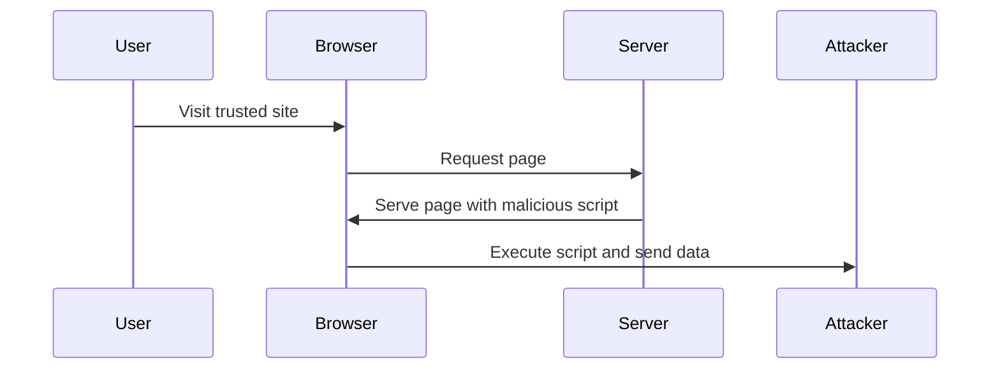
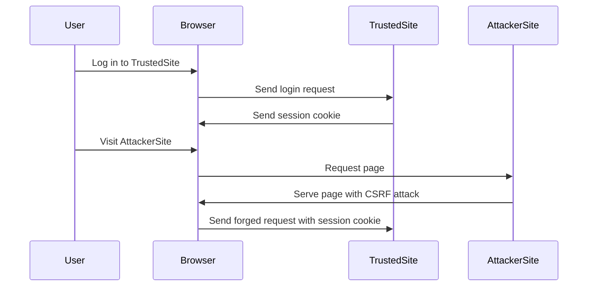

## 24.12. Dealing with XSS and CSRF in Web Applications

Web security is a critical aspect of developing robust and reliable applications. In this section, we will delve into two common web vulnerabilities: Cross-Site Scripting (XSS) and Cross-Site Request Forgery (CSRF). We will explore how these attacks work, strategies to mitigate them, and how to implement these strategies using Rust web frameworks like Actix-web and Rocket.

### Understanding XSS and CSRF Attacks

#### What is Cross-Site Scripting (XSS)?

Cross-Site Scripting (XSS) is a type of security vulnerability that allows attackers to inject malicious scripts into web pages viewed by other users. These scripts can steal cookies, session tokens, or other sensitive information, and even perform actions on behalf of the user.

**Types of XSS:**

1. **Stored XSS**: The malicious script is stored on the server (e.g., in a database) and served to users.
2. **Reflected XSS**: The script is reflected off a web server, such as in an error message or search result.
3. **DOM-based XSS**: The vulnerability exists in the client-side code rather than the server-side code.

#### What is Cross-Site Request Forgery (CSRF)?

Cross-Site Request Forgery (CSRF) is an attack that tricks a user into executing unwanted actions on a web application in which they are authenticated. By exploiting the trust that a site has in the user's browser, attackers can perform actions like changing account details or making unauthorized transactions.

### Mitigating XSS Attacks

To protect against XSS attacks, consider the following strategies:

#### 1. Output Encoding

Ensure that any data rendered in the browser is properly encoded. This prevents malicious scripts from being executed.

**Example in Rust using Actix-web:**

```rust
use actix_web::{web, App, HttpResponse, HttpServer, Responder};
use actix_web::http::header::ContentType;
use actix_web::web::Bytes;

async fn index() -> impl Responder {
    let user_input = "<script>alert('XSS');</script>";
    let encoded_input = htmlescape::encode_minimal(user_input);
    HttpResponse::Ok()
        .content_type(ContentType::html())
        .body(encoded_input)
}

#[actix_web::main]
async fn main() -> std::io::Result<()> {
    HttpServer::new(|| App::new().route("/", web::get().to(index)))
        .bind("127.0.0.1:8080")?
        .run()
        .await
}
```

In this example, we use the `htmlescape` crate to encode user input before rendering it in the browser.

#### 2. Content Security Policy (CSP)

Implement CSP headers to restrict the sources from which content can be loaded. This can prevent the execution of malicious scripts.

**Example CSP Header:**

```rust
use actix_web::{web, App, HttpResponse, HttpServer, Responder};
use actix_web::http::header::{ContentType, HeaderValue};

async fn index() -> impl Responder {
    HttpResponse::Ok()
        .content_type(ContentType::html())
        .insert_header(("Content-Security-Policy", HeaderValue::from_static("default-src 'self'")))
        .body("<h1>Hello, world!</h1>")
}

#[actix_web::main]
async fn main() -> std::io::Result<()> {
    HttpServer::new(|| App::new().route("/", web::get().to(index)))
        .bind("127.0.0.1:8080")?
        .run()
        .await
}
```

#### 3. Secure Default Settings and Validation

Ensure that your application uses secure defaults and validates all inputs. This includes setting secure HTTP headers and validating user inputs on both client and server sides.

### Mitigating CSRF Attacks

To protect against CSRF attacks, consider the following strategies:

#### 1. CSRF Tokens

Use CSRF tokens to ensure that requests are coming from authenticated users. These tokens should be unique and unpredictable.

**Example in Rust using Rocket:**

```rust
#[macro_use] extern crate rocket;

use rocket::http::{Cookie, Cookies};
use rocket::request::{Form, FromForm};
use rocket::response::Redirect;

#[derive(FromForm)]
struct FormInput {
    csrf_token: String,
    data: String,
}

#[post("/submit", data = "<form_input>")]
fn submit(mut cookies: Cookies, form_input: Form<FormInput>) -> Redirect {
    let csrf_token = cookies.get_private("csrf_token").map(|c| c.value().to_string());
    if csrf_token == Some(form_input.csrf_token.clone()) {
        // Process the form data
        Redirect::to("/")
    } else {
        // CSRF token mismatch
        Redirect::to("/error")
    }
}

#[get("/form")]
fn form(mut cookies: Cookies) -> String {
    let csrf_token = "random_generated_token"; // Generate a secure random token
    cookies.add_private(Cookie::new("csrf_token", csrf_token.to_string()));
    format!(r#"
        <form action="/submit" method="post">
            <input type="hidden" name="csrf_token" value="{}">
            <input type="text" name="data">
            <input type="submit" value="Submit">
        </form>
    "#, csrf_token)
}

#[launch]
fn rocket() -> _ {
    rocket::build().mount("/", routes![form, submit])
}
```

In this example, a CSRF token is generated and stored in a cookie. The form includes this token, and it is verified upon submission.

#### 2. SameSite Cookies

Set the `SameSite` attribute on cookies to `Strict` or `Lax` to prevent them from being sent along with cross-site requests.

**Example:**

```rust
use actix_web::{web, App, HttpResponse, HttpServer, Responder};
use actix_web::cookie::{Cookie, SameSite};

async fn index() -> impl Responder {
    let cookie = Cookie::build("session_id", "some_value")
        .same_site(SameSite::Strict)
        .finish();
    HttpResponse::Ok()
        .cookie(cookie)
        .body("Hello, world!")
}

#[actix_web::main]
async fn main() -> std::io::Result<()> {
    HttpServer::new(|| App::new().route("/", web::get().to(index)))
        .bind("127.0.0.1:8080")?
        .run()
        .await
}
```

### Importance of Secure Default Settings and Validation

Secure default settings and validation are crucial in preventing XSS and CSRF attacks. Always validate user inputs and use secure defaults for configurations. This includes setting secure HTTP headers, using strong encryption for sensitive data, and ensuring that your application is up-to-date with the latest security patches.

### Tools and Libraries for Preventing Vulnerabilities

Several tools and libraries can assist in preventing XSS and CSRF vulnerabilities in Rust web applications:

- **[Actix-web](https://actix.rs/)**: A powerful, pragmatic, and extremely fast web framework for Rust.
- **[Rocket](https://rocket.rs/)**: A web framework for Rust that makes it simple to write fast, secure web applications.
- **[htmlescape](https://crates.io/crates/htmlescape)**: A crate for escaping HTML entities.
- **[csrf-token](https://crates.io/crates/csrf-token)**: A crate for generating and validating CSRF tokens.

### Visualizing XSS and CSRF Attacks

To better understand how XSS and CSRF attacks work, let's visualize these processes using Mermaid.js diagrams.

#### XSS Attack Flow



**Description**: This diagram illustrates a typical XSS attack flow where a user visits a trusted site, which unknowingly serves a page containing a malicious script. The browser executes the script, sending sensitive data to the attacker.

#### CSRF Attack Flow



**Description**: This diagram shows a CSRF attack flow where a user logs into a trusted site and receives a session cookie. Later, the user visits an attacker site, which serves a page that sends a forged request to the trusted site using the session cookie.

### Knowledge Check

- **Question**: What is the primary difference between XSS and CSRF attacks?
- **Answer**: XSS involves injecting malicious scripts into web pages, while CSRF tricks a user into executing unwanted actions on a web application.

- **Question**: How can output encoding help prevent XSS attacks?
- **Answer**: Output encoding ensures that any data rendered in the browser is properly encoded, preventing malicious scripts from being executed.

- **Question**: What is the purpose of a CSRF token?
- **Answer**: A CSRF token is used to ensure that requests are coming from authenticated users, preventing unauthorized actions.

### Embrace the Journey

Remember, securing your web applications is an ongoing process. As you continue to develop and refine your applications, keep security at the forefront of your design and implementation decisions. Stay informed about the latest security threats and best practices, and don't hesitate to leverage the tools and frameworks available to you. Keep experimenting, stay curious, and enjoy the journey of building secure and robust web applications!

## Quiz Time!



### What is the primary goal of XSS attacks?

- [x] To inject malicious scripts into web pages
- [ ] To steal user passwords directly
- [ ] To perform SQL injections
- [ ] To manipulate server-side code

> **Explanation:** XSS attacks aim to inject malicious scripts into web pages viewed by other users.

### Which of the following is NOT a type of XSS?

- [ ] Stored XSS
- [ ] Reflected XSS
- [ ] DOM-based XSS
- [x] SQL-based XSS

> **Explanation:** SQL-based XSS is not a recognized type of XSS attack.

### What is the purpose of a CSRF token?

- [x] To ensure requests are coming from authenticated users
- [ ] To encrypt user data
- [ ] To validate user input
- [ ] To prevent SQL injections

> **Explanation:** CSRF tokens are used to verify that requests are made by authenticated users, preventing unauthorized actions.

### How does the SameSite cookie attribute help prevent CSRF attacks?

- [x] It restricts cookies from being sent with cross-site requests
- [ ] It encrypts cookies
- [ ] It validates user input
- [ ] It prevents XSS attacks

> **Explanation:** The SameSite attribute restricts cookies from being sent with cross-site requests, mitigating CSRF attacks.

### Which Rust crate is used for HTML escaping in the provided examples?

- [x] htmlescape
- [ ] rocket
- [ ] actix-web
- [ ] csrf-token

> **Explanation:** The `htmlescape` crate is used for HTML escaping in the examples.

### What is the main difference between XSS and CSRF attacks?

- [x] XSS injects scripts, CSRF tricks users into actions
- [ ] XSS steals cookies, CSRF steals passwords
- [ ] XSS is server-side, CSRF is client-side
- [ ] XSS uses SQL, CSRF uses HTML

> **Explanation:** XSS injects scripts into web pages, while CSRF tricks users into performing actions on authenticated sites.

### Which header is used to implement Content Security Policy (CSP)?

- [x] Content-Security-Policy
- [ ] X-Content-Type-Options
- [ ] X-Frame-Options
- [ ] Strict-Transport-Security

> **Explanation:** The `Content-Security-Policy` header is used to implement CSP.

### What is a common method to generate CSRF tokens in Rust?

- [x] Using the csrf-token crate
- [ ] Using the rocket crate
- [ ] Using the actix-web crate
- [ ] Using the htmlescape crate

> **Explanation:** The `csrf-token` crate is commonly used to generate CSRF tokens in Rust.

### How can output encoding prevent XSS attacks?

- [x] By ensuring data is properly encoded before rendering
- [ ] By encrypting user data
- [ ] By validating user input
- [ ] By preventing SQL injections

> **Explanation:** Output encoding ensures data is properly encoded before rendering, preventing XSS attacks.

### True or False: Setting the SameSite attribute to Strict can help prevent CSRF attacks.

- [x] True
- [ ] False

> **Explanation:** Setting the SameSite attribute to Strict helps prevent CSRF attacks by restricting cookies from being sent with cross-site requests.


