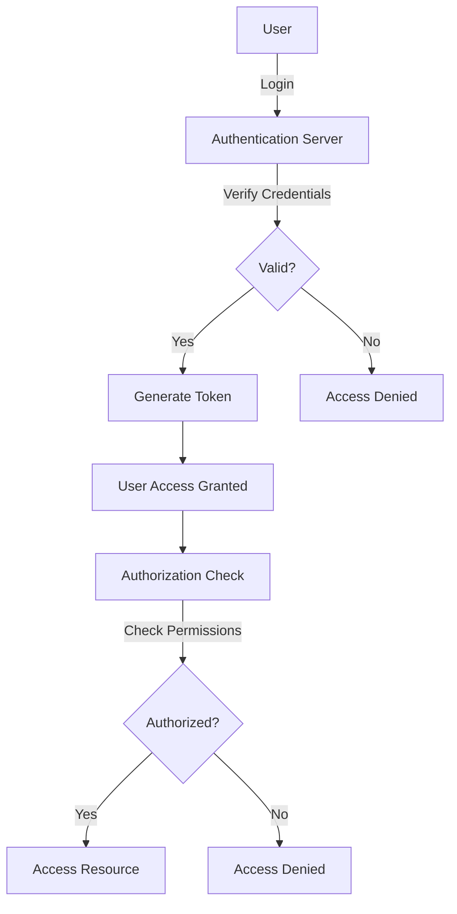

## 24.13. Authentication and Authorization in Rust Applications

In today's digital landscape, ensuring secure access to applications is paramount. Authentication and authorization are two critical components that help achieve this goal. In this section, we will delve into these concepts, explore various methods of implementing them in Rust, and provide best practices to ensure robust security.

### Understanding Authentication and Authorization

**Authentication** is the process of verifying the identity of a user or system. It answers the question, "Who are you?" Common methods include password-based authentication, multi-factor authentication (MFA), and OAuth.

**Authorization**, on the other hand, determines what an authenticated user is allowed to do. It answers the question, "What can you do?" This involves managing permissions and access controls.

### Principles of Authentication

1. **Password-Based Authentication**: The most common form of authentication where users provide a username and password. It's crucial to store passwords securely using hashing algorithms like Argon2.

2. **Multi-Factor Authentication (MFA)**: Enhances security by requiring additional verification methods, such as a one-time password (OTP) sent to a user's phone.

3. **OAuth**: An open standard for access delegation, commonly used for token-based authentication. It allows users to grant third-party access to their resources without sharing credentials.

### Implementing Authentication in Rust

#### Password-Based Authentication

To implement password-based authentication in Rust, we can use the `argon2` crate for secure password hashing.

```rust
use argon2::{self, Config};

fn hash_password(password: &str) -> Result<String, argon2::Error> {
    let salt = b"randomsalt"; // In practice, use a unique salt for each password
    let config = Config::default();
    argon2::hash_encoded(password.as_bytes(), salt, &config)
}

fn verify_password(hash: &str, password: &str) -> Result<bool, argon2::Error> {
    argon2::verify_encoded(hash, password.as_bytes())
}

fn main() {
    let password = "securepassword";
    let hash = hash_password(password).expect("Failed to hash password");
    let is_valid = verify_password(&hash, password).expect("Failed to verify password");

    println!("Password is valid: {}", is_valid);
}
```

**Key Points**:
- Always use a unique salt for each password.
- Store only the hashed password and salt in the database.

#### Multi-Factor Authentication (MFA)

MFA can be implemented by integrating with external services like Twilio or using libraries that support OTP generation.

```rust
use totp_lite::{totp_custom, Sha1};

fn generate_otp(secret: &str, time: u64) -> String {
    totp_custom::<Sha1>(secret.as_bytes(), time, 30, 6)
}

fn main() {
    let secret = "supersecret";
    let time = 1625247600; // Current Unix time
    let otp = generate_otp(secret, time);

    println!("Generated OTP: {}", otp);
}
```

**Key Points**:
- Use a secure channel to deliver OTPs.
- Ensure time synchronization between client and server.

#### OAuth

OAuth can be implemented using the `oauth2` crate, which provides a comprehensive framework for handling OAuth flows.

```rust
use oauth2::basic::BasicClient;
use oauth2::{AuthUrl, ClientId, ClientSecret, TokenUrl};

fn create_oauth_client() -> BasicClient {
    BasicClient::new(
        ClientId::new("client_id".to_string()),
        Some(ClientSecret::new("client_secret".to_string())),
        AuthUrl::new("https://provider.com/auth".to_string()).unwrap(),
        Some(TokenUrl::new("https://provider.com/token".to_string()).unwrap()),
    )
}

fn main() {
    let client = create_oauth_client();
    // Further implementation for OAuth flow
}
```

**Key Points**:
- Securely store client credentials.
- Use HTTPS for all OAuth communication.

### Principles of Authorization

1. **Role-Based Access Control (RBAC)**: Assigns permissions to roles rather than individual users. Users are then assigned roles.

2. **Attribute-Based Access Control (ABAC)**: Uses attributes (e.g., user, resource, environment) to determine access.

3. **Access Control Lists (ACLs)**: Lists permissions attached to an object, specifying which users or system processes can access the object.

### Implementing Authorization in Rust

#### Role-Based Access Control (RBAC)

RBAC can be implemented using enums to define roles and a simple function to check permissions.

```rust
#[derive(Debug, PartialEq)]
enum Role {
    Admin,
    User,
    Guest,
}

fn has_permission(role: &Role, action: &str) -> bool {
    match role {
        Role::Admin => true,
        Role::User => action != "delete",
        Role::Guest => action == "read",
    }
}

fn main() {
    let role = Role::User;
    let action = "delete";

    if has_permission(&role, action) {
        println!("Permission granted for action: {}", action);
    } else {
        println!("Permission denied for action: {}", action);
    }
}
```

**Key Points**:
- Define clear roles and permissions.
- Regularly review and update roles as needed.

### Best Practices for Secure Authentication and Authorization

1. **Password Storage**: Always hash passwords with a strong algorithm like Argon2. Never store plain text passwords.

2. **Session Management**: Use secure cookies and consider session expiration to prevent unauthorized access.

3. **Permissions**: Implement the principle of least privilege, granting users only the permissions they need.

4. **Audit and Logging**: Keep detailed logs of authentication and authorization events for auditing purposes.

5. **Use Libraries**: Leverage libraries like `jsonwebtoken` for handling JSON Web Tokens (JWTs) securely.

### Using Libraries for Secure Authentication

#### JSON Web Tokens (JWT)

JWTs are a compact, URL-safe means of representing claims to be transferred between two parties. The `jsonwebtoken` crate can be used to create and verify JWTs.

```rust
use jsonwebtoken::{encode, decode, Header, Validation, EncodingKey, DecodingKey};
use serde::{Serialize, Deserialize};

#[derive(Debug, Serialize, Deserialize)]
struct Claims {
    sub: String,
    exp: usize,
}

fn create_jwt() -> String {
    let my_claims = Claims { sub: "user_id".to_string(), exp: 10000000000 };
    encode(&Header::default(), &my_claims, &EncodingKey::from_secret("secret".as_ref())).unwrap()
}

fn verify_jwt(token: &str) -> bool {
    decode::<Claims>(token, &DecodingKey::from_secret("secret".as_ref()), &Validation::default()).is_ok()
}

fn main() {
    let token = create_jwt();
    let is_valid = verify_jwt(&token);

    println!("JWT is valid: {}", is_valid);
}
```

**Key Points**:
- Use strong secrets for signing tokens.
- Validate tokens on every request.

### Visualizing Authentication and Authorization Flow



**Diagram Explanation**: This flowchart illustrates the authentication and authorization process. The user logs in, and their credentials are verified. If valid, a token is generated, granting access. The authorization check then determines if the user can access specific resources.

### Try It Yourself

Experiment with the provided code examples by:
- Modifying the password hashing function to use different salts.
- Implementing a simple web server that uses JWTs for authentication.
- Creating additional roles and permissions in the RBAC example.

### References and Further Reading

- [Argon2 Crate Documentation](https://crates.io/crates/argon2)
- [jsonwebtoken Crate Documentation](https://crates.io/crates/jsonwebtoken)
- [OAuth2 Crate Documentation](https://crates.io/crates/oauth2)
- [TOTP Lite Crate Documentation](https://crates.io/crates/totp-lite)

### Knowledge Check

- What are the differences between authentication and authorization?
- How does multi-factor authentication enhance security?
- Why is it important to hash passwords before storing them?
- What are the benefits of using JWTs for authentication?

### Embrace the Journey

Remember, implementing secure authentication and authorization is an ongoing process. As you continue to develop your Rust applications, keep security at the forefront. Stay curious, experiment with different methods, and enjoy the journey of building secure applications!

## Quiz Time!



### What is the primary purpose of authentication?

- [x] To verify the identity of a user or system
- [ ] To determine what resources a user can access
- [ ] To encrypt user data
- [ ] To manage user sessions

> **Explanation:** Authentication is the process of verifying the identity of a user or system.

### Which crate is commonly used for password hashing in Rust?

- [x] argon2
- [ ] jsonwebtoken
- [ ] oauth2
- [ ] totp-lite

> **Explanation:** The `argon2` crate is used for secure password hashing in Rust.

### What does MFA stand for?

- [x] Multi-Factor Authentication
- [ ] Multi-Factor Authorization
- [ ] Multi-Form Authentication
- [ ] Multi-Form Authorization

> **Explanation:** MFA stands for Multi-Factor Authentication, which enhances security by requiring additional verification methods.

### What is the role of OAuth in authentication?

- [x] To allow users to grant third-party access to their resources without sharing credentials
- [ ] To hash passwords
- [ ] To generate one-time passwords
- [ ] To manage user sessions

> **Explanation:** OAuth is an open standard for access delegation, allowing users to grant third-party access to their resources without sharing credentials.

### Which of the following is a best practice for password storage?

- [x] Hash passwords with a strong algorithm like Argon2
- [ ] Store passwords in plain text
- [ ] Use a simple encryption method
- [ ] Store passwords in a database without hashing

> **Explanation:** Hashing passwords with a strong algorithm like Argon2 is a best practice for secure password storage.

### What is the purpose of a JWT?

- [x] To represent claims to be transferred between two parties
- [ ] To hash passwords
- [ ] To generate one-time passwords
- [ ] To manage user sessions

> **Explanation:** JWTs are a compact, URL-safe means of representing claims to be transferred between two parties.

### In RBAC, what is assigned to users?

- [x] Roles
- [ ] Permissions
- [ ] Tokens
- [ ] Sessions

> **Explanation:** In Role-Based Access Control (RBAC), roles are assigned to users, and permissions are assigned to roles.

### What is a key benefit of using HTTPS for OAuth communication?

- [x] It ensures secure transmission of data
- [ ] It speeds up data transmission
- [ ] It simplifies OAuth implementation
- [ ] It reduces server load

> **Explanation:** Using HTTPS ensures secure transmission of data, which is crucial for OAuth communication.

### Which of the following is a method of authorization?

- [x] Role-Based Access Control (RBAC)
- [ ] Password-Based Authentication
- [ ] Multi-Factor Authentication
- [ ] OAuth

> **Explanation:** Role-Based Access Control (RBAC) is a method of authorization, determining what an authenticated user is allowed to do.

### True or False: Authorization determines what a user can do after they have been authenticated.

- [x] True
- [ ] False

> **Explanation:** Authorization determines what an authenticated user is allowed to do, such as accessing specific resources or performing certain actions.




