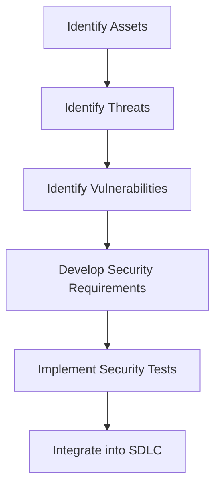

## 24.14. Threat Modeling and Security Testing

In the ever-evolving landscape of software development, security remains a paramount concern. As Rust developers, we have the advantage of a language designed with safety in mind, but this does not absolve us from the responsibility of ensuring our applications are secure. Threat modeling and security testing are critical components of a robust security strategy. In this section, we will delve into these concepts, exploring how they can be effectively applied to Rust applications.

### What is Threat Modeling?

Threat modeling is a structured approach to identifying and evaluating potential security threats to an application. It involves understanding the system, identifying valuable assets, recognizing potential threats, and determining vulnerabilities that could be exploited. The ultimate goal is to develop strategies to mitigate these threats, ensuring the security and integrity of the application.

#### Benefits of Threat Modeling

- **Proactive Security**: By identifying threats early in the development process, we can address potential vulnerabilities before they become actual security issues.
- **Cost-Effective**: Fixing security issues during the design phase is significantly cheaper than addressing them post-deployment.
- **Improved Understanding**: Threat modeling provides a deeper understanding of the system architecture and potential attack vectors.
- **Enhanced Communication**: It fosters better communication among team members, ensuring everyone is aware of security concerns and mitigation strategies.

### Identifying Assets, Threats, and Vulnerabilities

To effectively model threats, we must first identify the key components of our system:

#### Identifying Assets

Assets are the valuable components of your system that need protection. These can include:

- **Data**: Sensitive information such as user credentials, personal data, and financial information.
- **Services**: Critical services that your application provides, which could be disrupted by an attack.
- **Infrastructure**: The underlying hardware and software infrastructure that supports your application.

#### Identifying Threats

Threats are potential adverse actions that could compromise your assets. Common threats include:

- **Unauthorized Access**: Attempts to gain access to restricted areas or data.
- **Data Breaches**: Exfiltration of sensitive data.
- **Denial of Service (DoS)**: Attacks aimed at disrupting service availability.
- **Code Injection**: Malicious code execution through vulnerabilities.

#### Identifying Vulnerabilities

Vulnerabilities are weaknesses in your system that could be exploited by threats. These can arise from:

- **Code Flaws**: Bugs or errors in the code that can be exploited.
- **Configuration Issues**: Misconfigured systems that expose vulnerabilities.
- **Lack of Security Controls**: Absence of necessary security measures such as encryption or authentication.

### Frameworks and Methodologies for Threat Modeling

Several frameworks and methodologies can guide the threat modeling process. Here are a few widely recognized ones:

#### STRIDE

STRIDE is a threat modeling framework developed by Microsoft. It categorizes threats into six types:

- **Spoofing**: Impersonating a user or system.
- **Tampering**: Modifying data or code.
- **Repudiation**: Denying actions or transactions.
- **Information Disclosure**: Exposing sensitive information.
- **Denial of Service**: Disrupting service availability.
- **Elevation of Privilege**: Gaining unauthorized access to higher privileges.

#### PASTA

PASTA (Process for Attack Simulation and Threat Analysis) is a risk-centric threat modeling methodology. It involves seven stages:

1. **Define Objectives**: Understand the business objectives and security goals.
2. **Define the Technical Scope**: Identify the technical environment and boundaries.
3. **Application Decomposition**: Break down the application into components and data flows.
4. **Threat Analysis**: Identify potential threats and attack vectors.
5. **Vulnerability Analysis**: Assess vulnerabilities in the system.
6. **Attack Modeling**: Simulate potential attacks and their impact.
7. **Risk Analysis and Management**: Evaluate risks and develop mitigation strategies.

#### LINDDUN

LINDDUN is a privacy threat modeling framework focusing on data privacy concerns. It categorizes threats into:

- **Linkability**
- **Identifiability**
- **Non-repudiation**
- **Detectability**
- **Disclosure of information**
- **Unawareness**
- **Non-compliance**

### Translating Threat Models into Security Requirements and Tests

Once threats and vulnerabilities are identified, the next step is to translate these into actionable security requirements and tests.

#### Developing Security Requirements

Security requirements are specific measures that need to be implemented to mitigate identified threats. These can include:

- **Authentication and Authorization**: Ensuring only authorized users can access certain data or functions.
- **Data Encryption**: Protecting sensitive data both at rest and in transit.
- **Input Validation**: Preventing code injection by validating user inputs.
- **Logging and Monitoring**: Keeping track of system activities to detect and respond to suspicious behavior.

#### Implementing Security Tests

Security tests are designed to verify that the security requirements are effectively implemented. These can include:

- **Penetration Testing**: Simulating attacks to identify vulnerabilities.
- **Static Code Analysis**: Analyzing code for security flaws without executing it.
- **Dynamic Analysis**: Testing the application in a runtime environment to identify vulnerabilities.
- **Fuzz Testing**: Providing invalid or unexpected inputs to the application to find security issues.

### Integrating Threat Modeling into the Development Lifecycle

To maximize its effectiveness, threat modeling should be integrated into the software development lifecycle (SDLC). Here’s how:

#### Early Integration

Incorporate threat modeling during the design phase to identify potential security issues before they are built into the system.

#### Continuous Updates

Regularly update threat models to reflect changes in the system architecture, new features, or emerging threats.

#### Cross-Functional Collaboration

Encourage collaboration between developers, security experts, and stakeholders to ensure a comprehensive understanding of security requirements.

#### Automation

Leverage tools and automation to streamline the threat modeling process and integrate it into CI/CD pipelines.

### Code Example: Basic Threat Modeling in Rust

Let's explore a simple Rust application and how we can apply basic threat modeling concepts.

```rust
// A simple Rust web server using the Hyper library
use hyper::{Body, Request, Response, Server};
use hyper::service::{make_service_fn, service_fn};
use std::convert::Infallible;

// Function to handle incoming requests
async fn handle_request(_req: Request<Body>) -> Result<Response<Body>, Infallible> {
    // Respond with a simple "Hello, World!" message
    Ok(Response::new(Body::from("Hello, World!")))
}

#[tokio::main]
async fn main() {
    // Define the server address
    let addr = ([127, 0, 0, 1], 3000).into();

    // Create a service to handle requests
    let make_svc = make_service_fn(|_conn| {
        async { Ok::<_, Infallible>(service_fn(handle_request)) }
    });

    // Create and run the server
    let server = Server::bind(&addr).serve(make_svc);

    println!("Listening on http://{}", addr);

    // Run the server until it is stopped
    if let Err(e) = server.await {
        eprintln!("server error: {}", e);
    }
}
```

#### Threat Modeling for the Example

1. **Assets**: The server and the data it processes.
2. **Threats**: Unauthorized access, DoS attacks, data tampering.
3. **Vulnerabilities**: Lack of authentication, potential for input manipulation.

#### Security Requirements

- Implement authentication to ensure only authorized users can access the server.
- Rate limit requests to mitigate DoS attacks.
- Validate and sanitize inputs to prevent data tampering.

### Visualizing Threat Modeling

Below is a simple flowchart illustrating the threat modeling process:



### References and Further Reading

- [OWASP Threat Modeling](https://owasp.org/www-community/Threat_Modeling)
- [Microsoft STRIDE](https://docs.microsoft.com/en-us/azure/security/fundamentals/threat-modeling-tool)
- [PASTA Methodology](https://www.threatmodelingbook.com/)
- [LINDDUN Privacy Threat Modeling](https://linddun.org/)

### Knowledge Check

- What are the key components of threat modeling?
- How can threat models be translated into security requirements?
- Why is it important to integrate threat modeling into the development lifecycle?

### Embrace the Journey

Remember, threat modeling and security testing are ongoing processes. As you continue to develop and refine your Rust applications, keep security at the forefront of your efforts. Stay curious, keep learning, and enjoy the journey of building secure and robust applications.

## Quiz Time!



### What is the primary goal of threat modeling?

- [x] To identify and mitigate potential security threats
- [ ] To increase application performance
- [ ] To improve user interface design
- [ ] To enhance application scalability

> **Explanation:** The primary goal of threat modeling is to identify and mitigate potential security threats to an application.

### Which framework categorizes threats into Spoofing, Tampering, Repudiation, Information Disclosure, Denial of Service, and Elevation of Privilege?

- [x] STRIDE
- [ ] PASTA
- [ ] LINDDUN
- [ ] OWASP

> **Explanation:** STRIDE is a framework that categorizes threats into Spoofing, Tampering, Repudiation, Information Disclosure, Denial of Service, and Elevation of Privilege.

### What is a key benefit of integrating threat modeling early in the development lifecycle?

- [x] It allows for early identification and mitigation of security issues
- [ ] It reduces the need for documentation
- [ ] It simplifies code refactoring
- [ ] It eliminates the need for testing

> **Explanation:** Integrating threat modeling early in the development lifecycle allows for early identification and mitigation of security issues, which is more cost-effective.

### Which of the following is NOT a component of threat modeling?

- [ ] Identifying assets
- [ ] Identifying threats
- [ ] Identifying vulnerabilities
- [x] Identifying user preferences

> **Explanation:** Identifying user preferences is not a component of threat modeling. Threat modeling focuses on assets, threats, and vulnerabilities.

### What is the purpose of security testing?

- [x] To verify that security requirements are effectively implemented
- [ ] To improve application aesthetics
- [ ] To enhance application speed
- [ ] To simplify user interactions

> **Explanation:** The purpose of security testing is to verify that security requirements are effectively implemented in the application.

### Which of the following is a common threat to applications?

- [x] Unauthorized access
- [ ] Improved user experience
- [ ] Increased application speed
- [ ] Enhanced graphics

> **Explanation:** Unauthorized access is a common threat to applications, as it can lead to data breaches and other security issues.

### What is a vulnerability in the context of threat modeling?

- [x] A weakness that could be exploited by threats
- [ ] A new feature request
- [ ] A user interface improvement
- [ ] A performance enhancement

> **Explanation:** A vulnerability is a weakness in the system that could be exploited by threats.

### Which methodology involves seven stages including Define Objectives, Define the Technical Scope, and Application Decomposition?

- [ ] STRIDE
- [x] PASTA
- [ ] LINDDUN
- [ ] OWASP

> **Explanation:** PASTA (Process for Attack Simulation and Threat Analysis) involves seven stages including Define Objectives, Define the Technical Scope, and Application Decomposition.

### True or False: Threat modeling should be a one-time activity during the development process.

- [ ] True
- [x] False

> **Explanation:** False. Threat modeling should be an ongoing process, regularly updated to reflect changes in the system and emerging threats.

### What is the role of automation in threat modeling?

- [x] To streamline the process and integrate it into CI/CD pipelines
- [ ] To replace human decision-making
- [ ] To eliminate the need for security testing
- [ ] To enhance application aesthetics

> **Explanation:** Automation in threat modeling is used to streamline the process and integrate it into CI/CD pipelines, making it more efficient and consistent.


