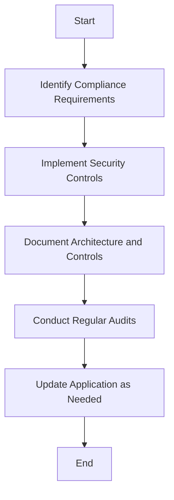

## 24.15. Compliance Standards and Rust

In today's digital landscape, ensuring that applications comply with industry security standards and regulations is crucial. This section will guide you through understanding compliance standards such as GDPR, HIPAA, and PCI DSS, and how Rust's features can aid in meeting these requirements. We will also provide guidance on implementing necessary security controls, highlight the importance of documentation and auditability, and discuss the challenges and responsibilities when dealing with compliance.

### Understanding Compliance Standards

Compliance standards are established to protect sensitive information and ensure that organizations handle data responsibly. Let's explore some of the most common compliance standards:

#### General Data Protection Regulation (GDPR)

The GDPR is a regulation in EU law on data protection and privacy. It aims to give control to individuals over their personal data and to simplify the regulatory environment for international business by unifying the regulation within the EU.

- **Key Requirements**: Data protection by design and by default, data breach notifications, and the right to access and erasure.
- **Impact on Development**: Developers must ensure data is collected, stored, and processed with user consent and provide mechanisms for data access and deletion.

#### Health Insurance Portability and Accountability Act (HIPAA)

HIPAA is a US law designed to provide privacy standards to protect patients' medical records and other health information.

- **Key Requirements**: Safeguards for electronic protected health information (ePHI), including physical, administrative, and technical safeguards.
- **Impact on Development**: Applications must implement strict access controls, encryption, and audit trails to protect ePHI.

#### Payment Card Industry Data Security Standard (PCI DSS)

PCI DSS is a set of security standards designed to ensure that all companies that accept, process, store, or transmit credit card information maintain a secure environment.

- **Key Requirements**: Secure network architecture, protection of cardholder data, and regular monitoring and testing of networks.
- **Impact on Development**: Developers must ensure secure data transmission, implement strong access control measures, and regularly test security systems.

### How Rust Aids in Meeting Compliance Requirements

Rust's unique features make it an excellent choice for building applications that need to comply with stringent security standards. Let's explore how Rust can help:

#### Memory Safety and Security

Rust's ownership model ensures memory safety without a garbage collector, preventing common vulnerabilities such as buffer overflows and use-after-free errors. This inherently reduces the risk of security breaches.

```rust
fn main() {
    let data = vec![1, 2, 3, 4];
    let slice = &data[1..3]; // Safe slicing
    println!("{:?}", slice);
}
```

#### Concurrency Without Data Races

Rust's concurrency model prevents data races at compile time, ensuring that concurrent applications are safe and reliable. This is crucial for applications that handle sensitive data.

```rust
use std::sync::Arc;
use std::thread;

fn main() {
    let data = Arc::new(vec![1, 2, 3, 4]);
    let data_clone = Arc::clone(&data);

    let handle = thread::spawn(move || {
        println!("{:?}", data_clone);
    });

    handle.join().unwrap();
}
```

#### Strong Type System

Rust's strong type system and pattern matching capabilities help prevent errors and ensure that data is handled correctly, reducing the risk of data breaches.

```rust
enum UserAction {
    Login(String),
    Logout,
}

fn handle_action(action: UserAction) {
    match action {
        UserAction::Login(username) => println!("User {} logged in", username),
        UserAction::Logout => println!("User logged out"),
    }
}
```

#### Error Handling

Rust's `Result` and `Option` types provide a robust way to handle errors, ensuring that applications can gracefully handle unexpected situations without crashing.

```rust
fn divide(a: f64, b: f64) -> Result<f64, &'static str> {
    if b == 0.0 {
        Err("Cannot divide by zero")
    } else {
        Ok(a / b)
    }
}

fn main() {
    match divide(4.0, 2.0) {
        Ok(result) => println!("Result: {}", result),
        Err(e) => println!("Error: {}", e),
    }
}
```

### Implementing Necessary Security Controls

To comply with standards like GDPR, HIPAA, and PCI DSS, developers must implement various security controls. Here are some guidelines:

#### Data Encryption

Encrypt sensitive data both at rest and in transit to protect it from unauthorized access. Rust provides libraries like `rust-crypto` and `ring` for implementing encryption.

```rust
use ring::aead;
use ring::rand::{SecureRandom, SystemRandom};

fn encrypt_data(data: &[u8], key: &[u8]) -> Vec<u8> {
    let nonce = [0u8; 12];
    let mut in_out = data.to_vec();
    let sealing_key = aead::SealingKey::new(&aead::AES_256_GCM, key).unwrap();
    aead::seal_in_place(&sealing_key, &nonce, &[], &mut in_out, aead::MAX_TAG_LEN).unwrap();
    in_out
}
```

#### Access Controls

Implement strict access controls to ensure that only authorized users can access sensitive data. Use Rust's strong type system to enforce role-based access controls.

```rust
struct User {
    username: String,
    role: Role,
}

enum Role {
    Admin,
    User,
}

fn access_resource(user: &User) {
    match user.role {
        Role::Admin => println!("Access granted to admin resources"),
        Role::User => println!("Access granted to user resources"),
    }
}
```

#### Audit Trails

Maintain detailed audit trails to track access and modifications to sensitive data. This is essential for compliance and helps in detecting unauthorized access.

```rust
struct AuditLog {
    user: String,
    action: String,
    timestamp: u64,
}

fn log_action(user: &str, action: &str) {
    let log = AuditLog {
        user: user.to_string(),
        action: action.to_string(),
        timestamp: 1625247600, // Example timestamp
    };
    println!("Audit log: {:?}", log);
}
```

### Importance of Documentation and Auditability

Documentation and auditability are critical components of compliance. They ensure that your application can be reviewed and verified for compliance with standards.

#### Comprehensive Documentation

Provide detailed documentation of your application's architecture, data flows, and security controls. This helps auditors understand how your application meets compliance requirements.

#### Automated Auditing

Implement automated auditing tools to regularly check your application's compliance status. This can help identify potential issues before they become significant problems.

### Challenges and Responsibilities in Compliance

Dealing with compliance involves several challenges and responsibilities:

#### Keeping Up with Regulations

Regulations are constantly evolving, and staying up-to-date with changes is crucial. Regularly review and update your application to ensure continued compliance.

#### Balancing Security and Usability

Implementing security controls can sometimes impact usability. Strive to find a balance that maintains security without compromising user experience.

#### Ensuring Data Privacy

Protecting user data is a significant responsibility. Implement robust data protection measures and ensure that users' privacy rights are respected.

### Visualizing Compliance in Rust Applications

To better understand how compliance can be integrated into Rust applications, let's visualize the process using a flowchart.



**Figure 1**: Visualizing the compliance process in Rust applications.

### References and Further Reading

- [GDPR Overview](https://gdpr-info.eu/)
- [HIPAA Compliance](https://www.hhs.gov/hipaa/index.html)
- [PCI DSS Standards](https://www.pcisecuritystandards.org/)
- [Rust Crypto Libraries](https://github.com/RustCrypto)
- [Ring Cryptography Library](https://briansmith.org/rustdoc/ring/)

### Knowledge Check

- What are the key requirements of GDPR, HIPAA, and PCI DSS?
- How does Rust's ownership model contribute to security?
- What are some common security controls that need to be implemented for compliance?
- Why is documentation important for compliance?
- What challenges might you face when ensuring compliance?

### Embrace the Journey

Remember, compliance is an ongoing process. As you build and maintain your Rust applications, continue to prioritize security and privacy. Stay informed about regulatory changes, and don't hesitate to seek expert guidance when needed. Keep experimenting, stay curious, and enjoy the journey of building secure and compliant applications!

## Quiz Time!



### What is one of the key requirements of GDPR?

- [x] Data protection by design and by default
- [ ] Encryption of all data
- [ ] Mandatory data backups
- [ ] Use of cloud storage

> **Explanation:** GDPR emphasizes data protection by design and by default, ensuring privacy is integrated into the development process.

### How does Rust's ownership model contribute to security?

- [x] Prevents common vulnerabilities like buffer overflows
- [ ] Automatically encrypts data
- [ ] Provides built-in access control
- [ ] Ensures data is always backed up

> **Explanation:** Rust's ownership model ensures memory safety, preventing vulnerabilities such as buffer overflows and use-after-free errors.

### Which Rust feature helps prevent data races in concurrent applications?

- [x] Concurrency model
- [ ] Garbage collector
- [ ] Dynamic typing
- [ ] Automatic encryption

> **Explanation:** Rust's concurrency model prevents data races at compile time, ensuring safe concurrent applications.

### What is a common security control for protecting sensitive data?

- [x] Data encryption
- [ ] Data duplication
- [ ] Data compression
- [ ] Data caching

> **Explanation:** Data encryption is a common security control used to protect sensitive data from unauthorized access.

### Why is documentation important for compliance?

- [x] It helps auditors understand how compliance is achieved
- [ ] It reduces the need for encryption
- [ ] It speeds up application performance
- [ ] It eliminates the need for testing

> **Explanation:** Documentation provides a detailed account of how an application meets compliance requirements, aiding auditors in their review.

### What is a challenge when ensuring compliance?

- [x] Balancing security and usability
- [ ] Increasing application speed
- [ ] Reducing code complexity
- [ ] Enhancing user interface design

> **Explanation:** Balancing security and usability is a challenge, as implementing security controls can impact user experience.

### What is a responsibility when dealing with compliance?

- [x] Protecting user data
- [ ] Increasing application size
- [ ] Reducing development time
- [ ] Enhancing graphics quality

> **Explanation:** Protecting user data is a significant responsibility, requiring robust data protection measures.

### What is a benefit of automated auditing?

- [x] Identifies potential compliance issues early
- [ ] Reduces application size
- [ ] Increases code complexity
- [ ] Enhances user interface design

> **Explanation:** Automated auditing helps identify potential compliance issues early, allowing for timely resolution.

### What is a key requirement of PCI DSS?

- [x] Secure network architecture
- [ ] Mandatory use of cloud storage
- [ ] Data duplication
- [ ] Use of open-source software

> **Explanation:** PCI DSS requires a secure network architecture to protect cardholder data.

### True or False: Compliance is a one-time process.

- [ ] True
- [x] False

> **Explanation:** Compliance is an ongoing process, requiring regular updates and audits to ensure continued adherence to standards.


