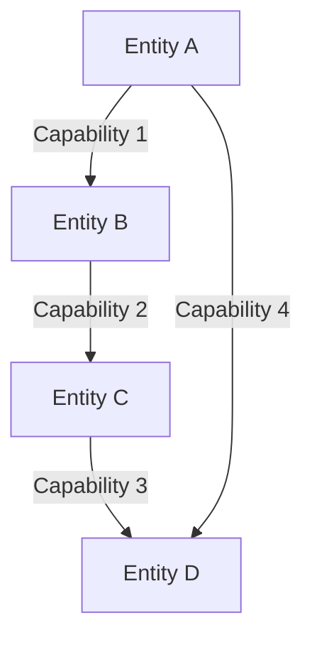

## 24.16. The Capability-Security Model in Rust

### Introduction

In the realm of software security, the capability-security model stands out as a powerful paradigm for controlling access and privileges within a system. By restricting what code can do, this model enhances security by limiting privileges to only what is necessary for a given task. In this section, we will explore how Rust, with its unique features and design philosophy, can effectively implement the capability-security model. We will delve into the principles of this model, discuss how Rust enforces or models capabilities, and provide examples of designing systems using capabilities. Additionally, we will highlight the advantages of this approach in terms of security and modularity, and discuss potential limitations and how to address them.

### Understanding the Capability-Security Model

The capability-security model is a security paradigm that focuses on granting specific capabilities to objects or entities within a system. A capability is essentially a communicable, unforgeable token of authority that references an object along with an associated set of access rights. This model contrasts with traditional access control models, such as role-based access control (RBAC), by emphasizing the principle of least privilege and minimizing the attack surface.

#### Key Principles

1. **Principle of Least Privilege**: Only grant the minimum set of capabilities necessary for an entity to perform its function.
2. **Encapsulation**: Capabilities are encapsulated within objects, ensuring that only authorized entities can access them.
3. **Unforgeability**: Capabilities cannot be forged or guessed, ensuring that only legitimate entities can possess them.
4. **Delegation**: Capabilities can be delegated to other entities, allowing for flexible and dynamic access control.

### How Rust Enforces Capabilities

Rust's design philosophy inherently supports the capability-security model through its ownership system, type safety, and module system. Let's explore how these features contribute to enforcing capabilities.

#### Ownership and Borrowing

Rust's ownership model ensures that resources are managed safely and efficiently. By enforcing strict rules on how memory is accessed and modified, Rust prevents unauthorized access to resources. This aligns with the capability-security model by ensuring that only entities with the appropriate ownership or borrowing rights can access a resource.

```rust
struct Resource {
    data: String,
}

fn access_resource(resource: &Resource) {
    println!("Accessing resource: {}", resource.data);
}

fn main() {
    let resource = Resource {
        data: String::from("Sensitive Data"),
    };
    access_resource(&resource);
}
```

In this example, the `access_resource` function can only access the `Resource` if it has a reference to it, demonstrating Rust's enforcement of access rights through borrowing.

#### Type Safety and Traits

Rust's type system and traits allow for fine-grained control over what operations can be performed on a type. By defining capabilities as traits, we can restrict what actions an entity can perform on an object.

```rust
trait ReadCapability {
    fn read(&self) -> String;
}

struct SecureResource {
    data: String,
}

impl ReadCapability for SecureResource {
    fn read(&self) -> String {
        self.data.clone()
    }
}

fn main() {
    let resource = SecureResource {
        data: String::from("Confidential Information"),
    };
    println!("Reading resource: {}", resource.read());
}
```

Here, the `ReadCapability` trait defines a capability to read data from a `SecureResource`. Only entities implementing this trait can perform the read operation, enforcing capability-based access control.

#### Module System

Rust's module system provides a way to encapsulate capabilities within specific modules, controlling their visibility and access. By organizing code into modules, we can restrict access to capabilities and ensure that only authorized entities can use them.

```rust
mod secure_module {
    pub struct Capability {
        pub data: String,
    }

    pub fn use_capability(cap: &Capability) {
        println!("Using capability: {}", cap.data);
    }
}

fn main() {
    let cap = secure_module::Capability {
        data: String::from("Module-Specific Capability"),
    };
    secure_module::use_capability(&cap);
}
```

In this example, the `Capability` struct and `use_capability` function are encapsulated within the `secure_module`, controlling their access and visibility.

### Designing Systems Using Capabilities

Designing systems using the capability-security model involves identifying the capabilities required by different entities and ensuring that they are granted only the necessary privileges. Let's explore some design patterns and strategies for implementing this model in Rust.

#### Capability-Based Interfaces

Define interfaces that represent specific capabilities and implement them for entities that require those capabilities. This approach ensures that entities can only perform actions they are explicitly authorized to do.

```rust
trait WriteCapability {
    fn write(&mut self, data: &str);
}

struct Logger {
    log: Vec<String>,
}

impl WriteCapability for Logger {
    fn write(&mut self, data: &str) {
        self.log.push(data.to_string());
    }
}

fn main() {
    let mut logger = Logger { log: Vec::new() };
    logger.write("Log entry 1");
    logger.write("Log entry 2");
    println!("Logger contents: {:?}", logger.log);
}
```

In this example, the `WriteCapability` trait defines a capability to write data, and the `Logger` struct implements this capability, allowing it to perform write operations.

#### Capability Delegation

Implement delegation mechanisms to allow entities to delegate their capabilities to other entities. This approach enables flexible and dynamic access control, allowing capabilities to be transferred as needed.

```rust
trait TransferCapability {
    fn transfer(&self) -> Self;
}

struct Token {
    value: String,
}

impl TransferCapability for Token {
    fn transfer(&self) -> Self {
        Token {
            value: self.value.clone(),
        }
    }
}

fn main() {
    let token = Token {
        value: String::from("Delegated Capability"),
    };
    let delegated_token = token.transfer();
    println!("Delegated token value: {}", delegated_token.value);
}
```

Here, the `TransferCapability` trait allows for the delegation of capabilities, enabling entities to transfer their capabilities to others.

### Advantages of the Capability-Security Model

Implementing the capability-security model in Rust offers several advantages in terms of security and modularity:

1. **Enhanced Security**: By restricting access to only the necessary capabilities, the attack surface is minimized, reducing the risk of unauthorized access or exploitation.
2. **Modularity**: Capabilities can be encapsulated within modules, promoting modular design and separation of concerns.
3. **Flexibility**: Capabilities can be dynamically delegated, allowing for flexible access control and adaptation to changing requirements.
4. **Scalability**: The model supports scalable systems by allowing capabilities to be distributed across different entities and components.

### Potential Limitations and Solutions

While the capability-security model offers significant benefits, it also presents some challenges and limitations:

1. **Complexity**: Designing systems with fine-grained capabilities can be complex and require careful planning. To address this, adopt a systematic approach to identify and define capabilities, and use Rust's type system and module system to enforce them.

2. **Performance Overhead**: Implementing capability checks can introduce performance overhead. To mitigate this, optimize capability checks and leverage Rust's zero-cost abstractions to minimize performance impact.

3. **Usability**: The model may require developers to adopt new design patterns and practices. Provide comprehensive documentation and examples to facilitate understanding and adoption.

### Conclusion

The capability-security model is a powerful paradigm for enhancing security and modularity in software systems. Rust's unique features, such as ownership, type safety, and module system, make it well-suited for implementing this model. By designing systems using capabilities, we can achieve fine-grained access control, minimize the attack surface, and promote modular and scalable design. While there are challenges to overcome, the benefits of adopting the capability-security model in Rust are substantial, making it a valuable approach for building secure and robust systems.

### Try It Yourself

To deepen your understanding of the capability-security model in Rust, try modifying the code examples provided. Experiment with defining new capabilities, implementing delegation mechanisms, and organizing capabilities within modules. Consider how these changes impact the security and modularity of your system.

### Visualizing the Capability-Security Model

To better understand the capability-security model, let's visualize the flow of capabilities within a system using a Mermaid.js diagram.



**Diagram Description**: This diagram illustrates the flow of capabilities between entities in a system. Entity A grants Capability 1 to Entity B, which in turn grants Capability 2 to Entity C. Entity C grants Capability 3 to Entity D, and Entity A directly grants Capability 4 to Entity D. This flow demonstrates the delegation and distribution of capabilities within the system.

### References and Further Reading

- [Capability-based security](https://en.wikipedia.org/wiki/Capability-based_security) on Wikipedia
- [Rust Programming Language](https://www.rust-lang.org/)
- [The Rust Book](https://doc.rust-lang.org/book/)
- [Rust by Example](https://doc.rust-lang.org/rust-by-example/)

### Knowledge Check

1. What is the primary goal of the capability-security model?
2. How does Rust's ownership model support the capability-security model?
3. What are some advantages of using the capability-security model in Rust?
4. How can capabilities be delegated in a Rust system?
5. What are some potential limitations of the capability-security model, and how can they be addressed?

### Embrace the Journey

Remember, this is just the beginning. As you explore the capability-security model in Rust, you'll discover new ways to enhance security and modularity in your systems. Keep experimenting, stay curious, and enjoy the journey!

## Quiz Time!



### What is a capability in the capability-security model?

- [x] A token of authority that references an object with access rights
- [ ] A role assigned to a user in a system
- [ ] A permission granted to a user group
- [ ] A security policy applied to a network

> **Explanation:** A capability is a communicable, unforgeable token of authority that references an object along with an associated set of access rights.

### How does Rust's ownership model support the capability-security model?

- [x] By enforcing strict rules on memory access and modification
- [ ] By allowing dynamic memory allocation
- [ ] By providing garbage collection
- [ ] By supporting multiple inheritance

> **Explanation:** Rust's ownership model enforces strict rules on how memory is accessed and modified, preventing unauthorized access to resources and aligning with the capability-security model.

### What is the principle of least privilege?

- [x] Granting the minimum set of capabilities necessary for an entity to perform its function
- [ ] Allowing all entities to access all resources
- [ ] Assigning roles based on seniority
- [ ] Providing maximum privileges to administrators

> **Explanation:** The principle of least privilege involves granting only the minimum set of capabilities necessary for an entity to perform its function, minimizing the attack surface.

### What is a potential limitation of the capability-security model?

- [x] Complexity in designing systems with fine-grained capabilities
- [ ] Lack of flexibility in access control
- [ ] Inability to support modular design
- [ ] Difficulty in implementing delegation mechanisms

> **Explanation:** Designing systems with fine-grained capabilities can be complex and require careful planning, which is a potential limitation of the capability-security model.

### How can capabilities be delegated in a Rust system?

- [x] By implementing delegation mechanisms using traits
- [ ] By using global variables
- [ ] By hardcoding access rights
- [ ] By relying on external libraries

> **Explanation:** Capabilities can be delegated in a Rust system by implementing delegation mechanisms using traits, allowing for flexible and dynamic access control.

### What is an advantage of using the capability-security model in Rust?

- [x] Enhanced security by minimizing the attack surface
- [ ] Increased complexity in code design
- [ ] Reduced performance due to capability checks
- [ ] Limited scalability in large systems

> **Explanation:** The capability-security model enhances security by restricting access to only the necessary capabilities, minimizing the attack surface.

### What is the role of Rust's module system in the capability-security model?

- [x] Encapsulating capabilities within modules to control access and visibility
- [ ] Allowing unrestricted access to all capabilities
- [ ] Providing dynamic memory allocation
- [ ] Supporting multiple inheritance

> **Explanation:** Rust's module system encapsulates capabilities within specific modules, controlling their access and visibility and supporting the capability-security model.

### What is a capability-based interface?

- [x] An interface that represents specific capabilities and is implemented by entities requiring those capabilities
- [ ] A user interface for managing capabilities
- [ ] A network interface for secure communication
- [ ] A graphical interface for visualizing capabilities

> **Explanation:** A capability-based interface is an interface that represents specific capabilities and is implemented by entities requiring those capabilities, ensuring authorized access.

### How does Rust's type system support the capability-security model?

- [x] By allowing fine-grained control over operations through traits
- [ ] By providing garbage collection
- [ ] By supporting dynamic typing
- [ ] By enabling multiple inheritance

> **Explanation:** Rust's type system and traits allow for fine-grained control over what operations can be performed on a type, supporting the capability-security model.

### True or False: Capabilities in Rust can be dynamically delegated to other entities.

- [x] True
- [ ] False

> **Explanation:** Capabilities in Rust can be dynamically delegated to other entities, allowing for flexible and dynamic access control.




