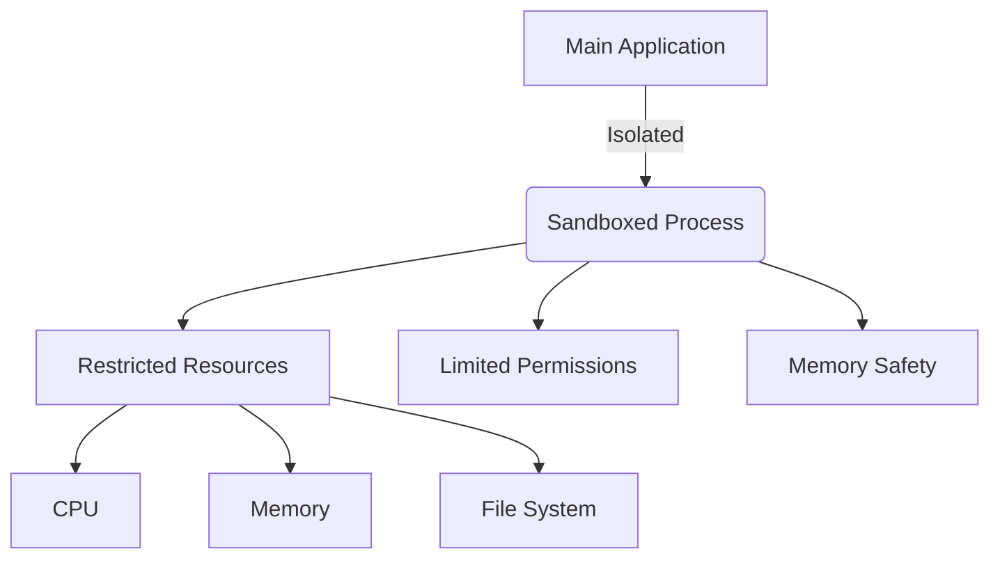

## 24.17. Sandboxing and Isolation Patterns

In the realm of software development, security is paramount. Sandboxing and isolation patterns are critical techniques used to enhance the security and reliability of applications by containing potential security breaches or faults. In this section, we will delve into the purpose and benefits of sandboxes, how to implement sandboxing at the code level in Rust, and explore examples of process isolation, memory safety, and permission control. We will also highlight the use of OS-level features and Rust libraries that assist in sandboxing, and discuss practical use cases such as plugin systems, untrusted code execution, or multi-tenant services.

### Purpose and Benefits of Sandboxes

**Explain the Purpose and Benefits of Sandboxes:**

Sandboxes are isolated environments where code can be executed without affecting the rest of the system. The primary purpose of a sandbox is to contain the execution of potentially harmful code, preventing it from accessing or modifying sensitive parts of the system. This isolation is crucial in scenarios where untrusted code is executed, such as running third-party plugins or handling user-generated scripts.

**Benefits of Sandboxing:**

- **Security**: By isolating code execution, sandboxes prevent malicious code from accessing sensitive data or system resources.
- **Fault Tolerance**: Sandboxes can contain faults within the isolated environment, preventing them from crashing the entire application.
- **Resource Management**: Sandboxes can limit the resources available to the code, such as CPU time and memory, preventing resource exhaustion attacks.
- **Testing and Debugging**: Sandboxes provide a controlled environment for testing and debugging code without affecting the production system.

### Implementing Sandboxing in Rust

**Discuss How to Implement Sandboxing at the Code Level in Rust:**

Rust, with its strong emphasis on safety and concurrency, provides several tools and libraries to implement sandboxing effectively. Here are some approaches to achieve sandboxing in Rust:

#### Process Isolation

Process isolation is a fundamental technique for sandboxing, where each process runs in its own isolated memory space. This prevents one process from interfering with another, enhancing security and stability.

**Example of Process Isolation:**

```rust
use std::process::{Command, Stdio};

fn run_isolated_command() {
    let output = Command::new("sandboxed_program")
        .arg("some_argument")
        .stdout(Stdio::piped())
        .spawn()
        .expect("Failed to start sandboxed process");

    // Handle the output of the sandboxed process
    let output = output.wait_with_output().expect("Failed to read output");
    println!("Sandboxed process output: {:?}", output);
}

fn main() {
    run_isolated_command();
}
```

In this example, we use Rust's `std::process::Command` to spawn a new process, effectively isolating it from the main application. This process can be further restricted using OS-level features such as chroot or namespaces.

#### Memory Safety

Rust's ownership model and borrow checker provide inherent memory safety, preventing common issues like buffer overflows and use-after-free errors. This safety is crucial for sandboxing, as it ensures that isolated code cannot corrupt memory outside its allocated space.

**Example of Memory Safety:**

```rust
fn safe_memory_access(data: &[u8]) {
    for byte in data {
        println!("Byte: {}", byte);
    }
}

fn main() {
    let data = vec![1, 2, 3, 4, 5];
    safe_memory_access(&data);
}
```

In this example, Rust's borrow checker ensures that the `safe_memory_access` function cannot modify the original data, maintaining memory safety.

#### Permission Control

Permission control is essential for sandboxing, as it restricts the actions that isolated code can perform. Rust provides several libraries and OS-level features to implement permission control.

**Example of Permission Control:**

```rust
use std::fs::File;
use std::io::{self, Read};

fn read_file_safely(file_path: &str) -> io::Result<String> {
    let mut file = File::open(file_path)?;
    let mut contents = String::new();
    file.read_to_string(&mut contents)?;
    Ok(contents)
}

fn main() {
    match read_file_safely("sandboxed_file.txt") {
        Ok(contents) => println!("File contents: {}", contents),
        Err(e) => println!("Error reading file: {}", e),
    }
}
```

In this example, we use Rust's `std::fs::File` to control file access, ensuring that only authorized files can be read.

### OS-Level Features and Rust Libraries

**Highlight the Use of OS-Level Features and Rust Libraries:**

Rust can leverage various OS-level features and libraries to enhance sandboxing and isolation:

- **Namespaces**: Linux namespaces provide isolation for processes, network, and file systems, allowing for effective sandboxing.
- **Chroot**: The chroot system call changes the root directory of a process, isolating its file system access.
- **Seccomp**: Seccomp (Secure Computing Mode) restricts the system calls that a process can make, reducing the attack surface.

**Rust Libraries for Sandboxing:**

- **`wasmtime` Crate**: The `wasmtime` crate is a WebAssembly runtime that provides a secure and efficient environment for running WebAssembly modules. It is ideal for sandboxing untrusted code.

```rust
use wasmtime::*;

fn run_wasm_module(wasm_bytes: &[u8]) -> Result<(), Box<dyn std::error::Error>> {
    // Create an engine and a store
    let engine = Engine::default();
    let store = Store::new(&engine);

    // Compile the WebAssembly module
    let module = Module::new(&engine, wasm_bytes)?;

    // Create an instance of the module
    let instance = Instance::new(&store, &module, &[])?;

    // Call a function from the module
    let func = instance.get_func("some_function").expect("Function not found");
    func.call(&[])?;

    Ok(())
}

fn main() {
    let wasm_bytes = include_bytes!("sandboxed_module.wasm");
    if let Err(e) = run_wasm_module(wasm_bytes) {
        println!("Error running WASM module: {}", e);
    }
}
```

In this example, we use the `wasmtime` crate to run a WebAssembly module in a sandboxed environment, ensuring that the module cannot access or modify the host system.

### Use Cases for Sandboxing

**Discuss Use Cases Such as Plugin Systems, Untrusted Code Execution, or Multi-Tenant Services:**

Sandboxing is particularly useful in scenarios where code from external sources is executed, or where multiple users share the same resources. Here are some common use cases:

- **Plugin Systems**: Sandboxing allows plugins to be executed safely without risking the stability or security of the host application.
- **Untrusted Code Execution**: Sandboxes provide a secure environment for running untrusted code, such as user-generated scripts or third-party libraries.
- **Multi-Tenant Services**: In multi-tenant environments, sandboxing ensures that one tenant's code cannot interfere with another's, maintaining isolation and security.

### Visualizing Sandboxing and Isolation

**Incorporate Diagrams to Enhance Understanding:**



**Description:** This diagram illustrates the isolation of a sandboxed process from the main application, highlighting restricted resources, limited permissions, and memory safety.

### Conclusion

Sandboxing and isolation patterns are essential for building secure and reliable applications in Rust. By leveraging Rust's memory safety features, process isolation techniques, and permission control mechanisms, developers can create robust sandboxes that protect against security breaches and faults. Whether you're building plugin systems, executing untrusted code, or developing multi-tenant services, sandboxing provides a powerful tool for maintaining security and stability.

### References and Further Reading

- [Rust Programming Language](https://www.rust-lang.org/)
- [Wasmtime Crate](https://crates.io/crates/wasmtime)
- [Linux Namespaces](https://man7.org/linux/man-pages/man7/namespaces.7.html)
- [Chroot System Call](https://man7.org/linux/man-pages/man2/chroot.2.html)
- [Seccomp](https://man7.org/linux/man-pages/man2/seccomp.2.html)

### Knowledge Check

**Pose Questions or Small Challenges:**

- How can process isolation enhance the security of an application?
- What are the benefits of using the `wasmtime` crate for sandboxing?
- How does Rust's memory safety model contribute to sandboxing?

**Include Exercises or Practice Problems:**

- Modify the process isolation example to restrict file system access using chroot.
- Experiment with the `wasmtime` crate by running a different WebAssembly module.

**Summarize Key Takeaways:**

- Sandboxing isolates code execution to enhance security and fault tolerance.
- Rust's memory safety features are crucial for effective sandboxing.
- OS-level features and Rust libraries provide powerful tools for implementing sandboxes.

**Embrace the Journey:**

Remember, this is just the beginning. As you progress, you'll discover more advanced techniques for sandboxing and isolation in Rust. Keep experimenting, stay curious, and enjoy the journey!

## Quiz Time!



### What is the primary purpose of a sandbox in software development?

- [x] To isolate code execution and enhance security
- [ ] To improve the performance of an application
- [ ] To simplify code maintenance
- [ ] To increase the complexity of the codebase

> **Explanation:** The primary purpose of a sandbox is to isolate code execution, enhancing security by preventing malicious code from accessing sensitive data or system resources.

### Which Rust feature is crucial for maintaining memory safety in sandboxing?

- [x] Ownership and Borrowing
- [ ] Pattern Matching
- [ ] Macros
- [ ] Traits

> **Explanation:** Rust's ownership and borrowing model is crucial for maintaining memory safety, preventing issues like buffer overflows and use-after-free errors.

### How does process isolation contribute to sandboxing?

- [x] By running each process in its own isolated memory space
- [ ] By sharing resources between processes
- [ ] By allowing processes to modify each other's memory
- [ ] By increasing the number of system calls a process can make

> **Explanation:** Process isolation contributes to sandboxing by running each process in its own isolated memory space, preventing interference between processes.

### What is the role of the `wasmtime` crate in Rust?

- [x] It provides a secure environment for running WebAssembly modules
- [ ] It is used for network programming
- [ ] It enhances file system operations
- [ ] It simplifies error handling

> **Explanation:** The `wasmtime` crate provides a secure environment for running WebAssembly modules, making it ideal for sandboxing untrusted code.

### Which OS-level feature can be used to restrict file system access in a sandbox?

- [x] Chroot
- [ ] Seccomp
- [ ] Namespaces
- [ ] System Calls

> **Explanation:** The chroot system call changes the root directory of a process, effectively restricting its file system access.

### What is a common use case for sandboxing in multi-tenant services?

- [x] Ensuring one tenant's code cannot interfere with another's
- [ ] Improving the performance of each tenant's code
- [ ] Allowing tenants to access each other's data
- [ ] Simplifying the deployment process

> **Explanation:** In multi-tenant services, sandboxing ensures that one tenant's code cannot interfere with another's, maintaining isolation and security.

### How can permission control enhance sandboxing?

- [x] By restricting the actions that isolated code can perform
- [ ] By allowing code to access all system resources
- [ ] By increasing the number of available system calls
- [ ] By sharing memory between processes

> **Explanation:** Permission control enhances sandboxing by restricting the actions that isolated code can perform, preventing unauthorized access to system resources.

### What is a benefit of using Rust's memory safety features in sandboxing?

- [x] Preventing buffer overflows and use-after-free errors
- [ ] Increasing the complexity of the code
- [ ] Allowing direct memory access
- [ ] Simplifying code maintenance

> **Explanation:** Rust's memory safety features prevent buffer overflows and use-after-free errors, which are crucial for maintaining the integrity of a sandboxed environment.

### Which of the following is NOT a benefit of sandboxing?

- [ ] Security
- [ ] Fault Tolerance
- [ ] Resource Management
- [x] Increased Code Complexity

> **Explanation:** Sandboxing provides security, fault tolerance, and resource management, but it does not inherently increase code complexity.

### True or False: Sandboxing can be used to test and debug code without affecting the production system.

- [x] True
- [ ] False

> **Explanation:** True. Sandboxing provides a controlled environment for testing and debugging code without affecting the production system.


