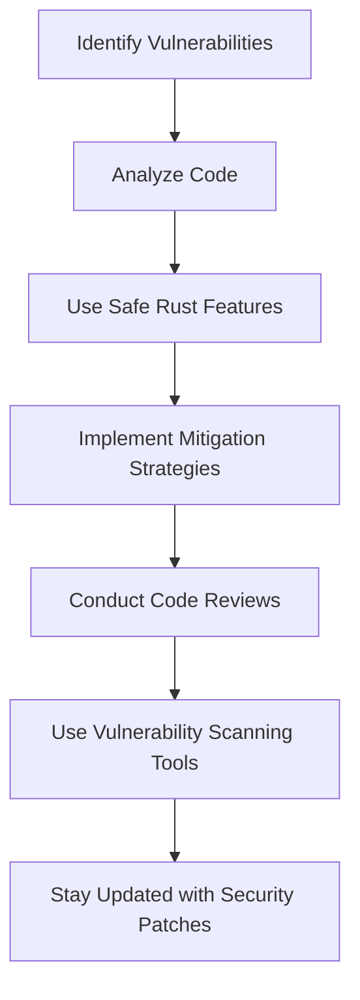

## 24.2. Protecting Against Common Vulnerabilities

In the world of software development, security is paramount. Rust, with its focus on safety and concurrency, offers a robust platform for building secure applications. However, no language is immune to vulnerabilities. In this section, we'll explore common security vulnerabilities that can affect Rust applications and discuss strategies to protect against them.

### Understanding Common Vulnerabilities

Before diving into specific vulnerabilities, let's understand what makes a system vulnerable. A vulnerability is a weakness in a system that can be exploited by an attacker to perform unauthorized actions. Common vulnerabilities include buffer overflows, injection attacks, and race conditions. Each of these can manifest in different ways, depending on the context and the code.

#### Buffer Overflows

A buffer overflow occurs when a program writes more data to a buffer than it can hold. This can lead to data corruption, crashes, or even arbitrary code execution. In languages like C and C++, buffer overflows are a common issue due to manual memory management. Rust's ownership model and memory safety features significantly reduce the risk of buffer overflows, but they can still occur in unsafe code.

**Example of a Buffer Overflow in Rust:**

```rust
fn unsafe_buffer_overflow() {
    let mut buffer = [0; 5];
    for i in 0..10 {
        // Unsafe block allows writing beyond the buffer's capacity
        unsafe {
            *buffer.get_unchecked_mut(i) = i;
        }
    }
}

fn main() {
    unsafe_buffer_overflow();
}
```

**Mitigation Strategies:**

- **Avoid Unsafe Code:** Use Rust's safe abstractions whenever possible. The Rust compiler enforces memory safety, preventing buffer overflows in safe code.
- **Use Safe APIs:** Prefer safe APIs that handle bounds checking automatically. For example, use `Vec` instead of raw arrays.
- **Code Reviews:** Conduct thorough code reviews to identify and eliminate unsafe code patterns.

#### Injection Attacks

Injection attacks occur when untrusted data is interpreted as code. This is common in web applications where user input is directly executed or queried against a database. Rust's type system and strong typing can help mitigate injection attacks, but developers must still be vigilant.

**Example of an Injection Vulnerability:**

```rust
fn execute_query(user_input: &str) {
    let query = format!("SELECT * FROM users WHERE name = '{}'", user_input);
    // Potential SQL injection if user_input is not sanitized
    println!("Executing query: {}", query);
}

fn main() {
    let user_input = "Alice'; DROP TABLE users; --";
    execute_query(user_input);
}
```

**Mitigation Strategies:**

- **Input Validation:** Always validate and sanitize user inputs. Use libraries like `serde` for deserialization and validation.
- **Parameterized Queries:** Use parameterized queries to prevent SQL injection. Libraries like `diesel` and `sqlx` support parameterized queries.
- **Escape User Input:** Ensure that user inputs are properly escaped before being used in commands or queries.

#### Race Conditions

Race conditions occur when the behavior of a program depends on the timing of uncontrollable events, such as thread scheduling. Rust's ownership model and concurrency primitives help prevent data races, but logical race conditions can still occur.

**Example of a Race Condition:**

```rust
use std::sync::{Arc, Mutex};
use std::thread;

fn main() {
    let counter = Arc::new(Mutex::new(0));
    let mut handles = vec![];

    for _ in 0..10 {
        let counter = Arc::clone(&counter);
        let handle = thread::spawn(move || {
            let mut num = counter.lock().unwrap();
            *num += 1;
        });
        handles.push(handle);
    }

    for handle in handles {
        handle.join().unwrap();
    }

    println!("Result: {}", *counter.lock().unwrap());
}
```

**Mitigation Strategies:**

- **Use Concurrency Primitives:** Use Rust's concurrency primitives like `Mutex`, `RwLock`, and `Arc` to manage shared state safely.
- **Avoid Shared State:** Design systems to minimize shared state. Use message passing and channels for communication between threads.
- **Test for Concurrency Issues:** Use tools like `loom` to test for concurrency issues and race conditions.

### Tools for Vulnerability Scanning and Code Analysis

Rust offers several tools to help identify and mitigate vulnerabilities in your code:

- **Clippy:** A linter that provides warnings about common mistakes and potential vulnerabilities in Rust code.
- **RustSec:** A security advisory database for Rust crates. It helps track vulnerabilities in third-party dependencies.
- **cargo-audit:** A tool that scans your project's dependencies for known vulnerabilities using the RustSec database.
- **Miri:** An interpreter for Rust's mid-level intermediate representation (MIR) that can detect undefined behavior in unsafe code.

### Staying Updated with Security Patches

Keeping your Rust applications secure involves staying updated with the latest security patches and advisories. Here are some best practices:

- **Regular Updates:** Regularly update your Rust toolchain and dependencies. Use `cargo update` to update dependencies to their latest versions.
- **Monitor Security Advisories:** Subscribe to security advisories for Rust and its ecosystem. The RustSec advisory database is a valuable resource.
- **Automate Updates:** Use tools like Dependabot or Renovate to automate dependency updates and receive notifications about security vulnerabilities.

### Visualizing Vulnerability Mitigation

To better understand how these strategies work together, let's visualize the process of identifying and mitigating vulnerabilities in a Rust application.



**Diagram Description:** This flowchart illustrates the process of protecting against common vulnerabilities in Rust applications. It starts with identifying vulnerabilities, analyzing code, using safe Rust features, implementing mitigation strategies, conducting code reviews, using vulnerability scanning tools, and staying updated with security patches.

### Knowledge Check

Let's reinforce what we've learned with a few questions:

- What is a buffer overflow, and how can it occur in Rust?
- How can injection attacks be mitigated in Rust applications?
- What are race conditions, and how can they be prevented in Rust?
- Name some tools that can help identify vulnerabilities in Rust code.

### Embrace the Journey

Remember, security is an ongoing process. As you continue to develop Rust applications, keep security at the forefront of your mind. Stay curious, keep learning, and enjoy the journey of building secure and robust applications with Rust!

## Quiz Time!



### What is a buffer overflow?

- [x] A condition where more data is written to a buffer than it can hold
- [ ] A condition where a buffer is read without initialization
- [ ] A condition where a buffer is used after it is freed
- [ ] A condition where a buffer is never used

> **Explanation:** A buffer overflow occurs when more data is written to a buffer than it can hold, leading to potential data corruption or code execution.

### How can injection attacks be mitigated in Rust?

- [x] Use parameterized queries
- [ ] Use raw SQL queries
- [ ] Ignore user input
- [ ] Use unsafe code

> **Explanation:** Injection attacks can be mitigated by using parameterized queries, which separate code from data.

### What is a race condition?

- [x] A condition where the behavior of a program depends on the timing of uncontrollable events
- [ ] A condition where a program runs out of memory
- [ ] A condition where a program crashes unexpectedly
- [ ] A condition where a program enters an infinite loop

> **Explanation:** A race condition occurs when the behavior of a program depends on the timing of uncontrollable events, such as thread scheduling.

### Which tool can help identify vulnerabilities in Rust dependencies?

- [x] cargo-audit
- [ ] cargo-clippy
- [ ] cargo-fmt
- [ ] cargo-run

> **Explanation:** `cargo-audit` is a tool that scans Rust dependencies for known vulnerabilities using the RustSec advisory database.

### What is the purpose of Clippy in Rust?

- [x] To provide warnings about common mistakes and potential vulnerabilities
- [ ] To compile Rust code
- [ ] To format Rust code
- [ ] To run Rust code

> **Explanation:** Clippy is a linter that provides warnings about common mistakes and potential vulnerabilities in Rust code.

### How can race conditions be prevented in Rust?

- [x] Use concurrency primitives like Mutex and Arc
- [ ] Use raw pointers
- [ ] Use global variables
- [ ] Use unsafe code

> **Explanation:** Race conditions can be prevented by using concurrency primitives like `Mutex` and `Arc` to manage shared state safely.

### What is the RustSec advisory database used for?

- [x] Tracking vulnerabilities in Rust crates
- [ ] Compiling Rust code
- [ ] Formatting Rust code
- [ ] Running Rust code

> **Explanation:** The RustSec advisory database is used for tracking vulnerabilities in Rust crates.

### Why is it important to stay updated with security patches?

- [x] To protect against newly discovered vulnerabilities
- [ ] To improve code readability
- [ ] To increase code execution speed
- [ ] To reduce code size

> **Explanation:** Staying updated with security patches is important to protect against newly discovered vulnerabilities.

### What is the role of Miri in Rust?

- [x] Detecting undefined behavior in unsafe code
- [ ] Compiling Rust code
- [ ] Formatting Rust code
- [ ] Running Rust code

> **Explanation:** Miri is an interpreter for Rust's MIR that can detect undefined behavior in unsafe code.

### True or False: Rust's ownership model completely eliminates all security vulnerabilities.

- [ ] True
- [x] False

> **Explanation:** While Rust's ownership model significantly reduces certain types of vulnerabilities, it does not eliminate all security vulnerabilities. Developers must still be vigilant and follow best practices.


