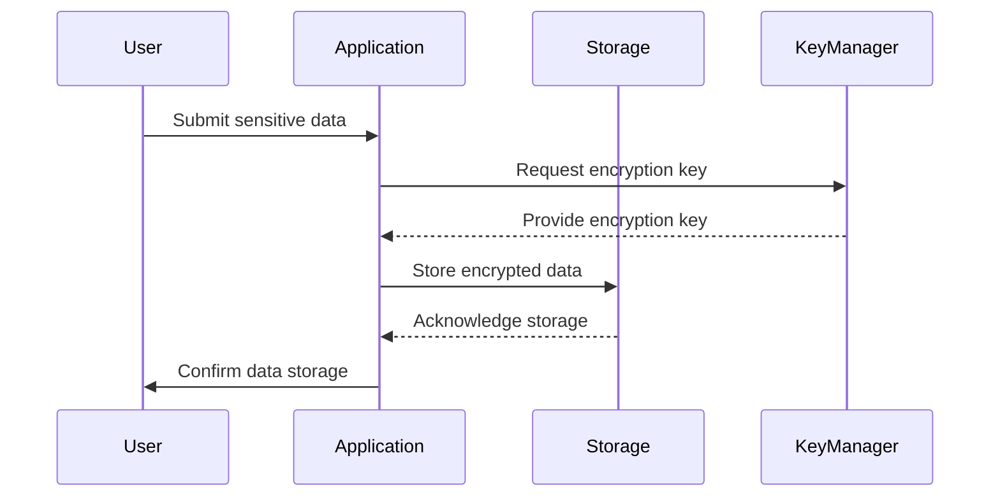

## 24.3. Handling Sensitive Data

In today's digital age, handling sensitive data securely is paramount. Whether you're dealing with personal information, financial records, or proprietary business data, ensuring confidentiality and integrity is crucial. Rust, with its strong emphasis on safety and performance, provides a robust platform for implementing secure data handling practices. In this section, we'll explore what constitutes sensitive data, delve into secure storage mechanisms, and discuss best practices for handling data in memory. We'll also highlight the use of secure programming constructs and discuss compliance considerations for handling personal or financial data.

### Understanding Sensitive Data

Sensitive data refers to any information that must be protected from unauthorized access to safeguard the privacy or security of an individual or organization. This includes:

- **Personally Identifiable Information (PII)**: Names, addresses, Social Security numbers, etc.
- **Financial Information**: Credit card numbers, bank account details, etc.
- **Health Information**: Medical records, health insurance details, etc.
- **Proprietary Business Information**: Trade secrets, intellectual property, etc.

Handling such data requires a comprehensive approach to security, encompassing storage, transmission, and processing.

### Secure Storage Mechanisms

One of the first steps in protecting sensitive data is ensuring it is securely stored. This involves encrypting data at rest, using secure storage solutions, and implementing access controls.

#### Encryption at Rest

Encrypting data at rest ensures that even if unauthorized access to storage occurs, the data remains unreadable without the appropriate decryption keys. Rust offers several libraries to facilitate encryption, such as `rust-crypto` and `ring`.

```rust
use ring::aead;
use ring::rand::{SecureRandom, SystemRandom};

// Function to encrypt data
fn encrypt_data(plaintext: &[u8], key: &[u8]) -> Result<Vec<u8>, aead::Unspecified> {
    let nonce = [0u8; 12]; // Example nonce, should be unique per encryption
    let mut in_out = plaintext.to_vec();
    let sealing_key = aead::SealingKey::new(&aead::AES_256_GCM, key)?;
    aead::seal_in_place(&sealing_key, &nonce, &[], &mut in_out, aead::AES_256_GCM.tag_len())?;
    Ok(in_out)
}
```

**Key Points:**
- **Use strong encryption algorithms**: AES-256 is a widely accepted standard.
- **Manage keys securely**: Store encryption keys separately from the encrypted data and use secure key management solutions.

#### Secure Storage Solutions

Consider using secure storage solutions that provide built-in encryption and access control features. Examples include:

- **Database Encryption**: Use databases that support encryption, such as PostgreSQL with TDE (Transparent Data Encryption).
- **File Encryption**: Encrypt files using tools like GnuPG or libraries that support file encryption.

### Handling Data in Memory

While encrypting data at rest is crucial, it's equally important to handle data securely in memory to prevent leaks and unauthorized access.

#### Avoiding Memory Leaks

Rust's ownership model and memory safety features help prevent common memory leaks. However, when dealing with sensitive data, additional precautions are necessary:

- **Zeroizing Memory**: Ensure that sensitive data is zeroed out from memory once it's no longer needed. The `zeroize` crate provides a simple way to achieve this.

```rust
use zeroize::Zeroize;

fn process_sensitive_data() {
    let mut sensitive_data = vec![1, 2, 3, 4, 5];
    // Process the data
    sensitive_data.zeroize(); // Zero out the data
}
```

- **Minimize Data Exposure**: Limit the scope and lifetime of sensitive data in memory. Use Rust's borrowing and lifetimes to ensure data is only accessible where necessary.

#### Secure Programming Constructs

Rust provides several constructs that can enhance the security of your applications:

- **Use `Option` and `Result`**: These types help manage errors and optional values safely, reducing the risk of unhandled exceptions that could expose sensitive data.
- **Leverage Rust's Type System**: Use strong typing to enforce data constraints and prevent invalid data states.

### Compliance Considerations

When handling sensitive data, it's essential to comply with relevant regulations and standards, such as GDPR, HIPAA, or PCI-DSS. These regulations often dictate how data should be stored, processed, and transmitted.

#### Key Compliance Strategies

- **Data Minimization**: Collect only the data necessary for your application and delete it when no longer needed.
- **Access Controls**: Implement strict access controls to ensure only authorized personnel can access sensitive data.
- **Audit and Monitoring**: Regularly audit data access and usage, and monitor for unauthorized access attempts.

### Visualizing Secure Data Handling

To better understand the flow of secure data handling, let's visualize the process using a sequence diagram.



**Diagram Explanation:**
- The user submits sensitive data to the application.
- The application requests an encryption key from the key manager.
- The application encrypts the data and stores it securely.
- The application confirms the secure storage to the user.

### Try It Yourself

Experiment with the code examples provided. Try modifying the encryption algorithm or implementing additional security measures, such as key rotation or multi-factor authentication.

### Knowledge Check

- What are the key components of handling sensitive data securely?
- How does Rust's ownership model contribute to memory safety?
- What are some common compliance considerations when handling sensitive data?

### Summary

Handling sensitive data securely is a critical aspect of modern software development. By leveraging Rust's safety features, secure storage mechanisms, and compliance strategies, you can protect sensitive data from unauthorized access and ensure its confidentiality and integrity. Remember, security is an ongoing process, and staying informed about the latest best practices and threats is essential.

## Quiz Time!



### What is considered sensitive data?

- [x] Personally Identifiable Information (PII)
- [x] Financial Information
- [x] Health Information
- [ ] Publicly available data

> **Explanation:** Sensitive data includes PII, financial, and health information, which require protection from unauthorized access.

### Which Rust crate can be used to zero out sensitive data in memory?

- [x] zeroize
- [ ] serde
- [ ] tokio
- [ ] hyper

> **Explanation:** The `zeroize` crate is used to securely zero out sensitive data in memory.

### What is a key benefit of encrypting data at rest?

- [x] Protects data from unauthorized access even if storage is compromised
- [ ] Increases data processing speed
- [ ] Reduces data storage requirements
- [ ] Simplifies data retrieval

> **Explanation:** Encrypting data at rest ensures that data remains unreadable without decryption keys, protecting it from unauthorized access.

### How does Rust's ownership model help in handling sensitive data?

- [x] Prevents memory leaks and ensures data is only accessible where necessary
- [ ] Automatically encrypts data
- [ ] Provides built-in compliance with regulations
- [ ] Increases data storage capacity

> **Explanation:** Rust's ownership model helps prevent memory leaks and ensures data is only accessible where necessary, enhancing security.

### What is a common compliance consideration when handling sensitive data?

- [x] Implementing strict access controls
- [ ] Using weak encryption algorithms
- [ ] Storing all data indefinitely
- [ ] Allowing unrestricted data access

> **Explanation:** Implementing strict access controls is a common compliance consideration to ensure only authorized personnel can access sensitive data.

### Which of the following is a secure storage solution for sensitive data?

- [x] Database with Transparent Data Encryption (TDE)
- [ ] Plain text files
- [ ] Unencrypted cloud storage
- [ ] Publicly accessible databases

> **Explanation:** A database with Transparent Data Encryption (TDE) is a secure storage solution for sensitive data.

### What is the purpose of using the `Option` and `Result` types in Rust?

- [x] Manage errors and optional values safely
- [ ] Increase data processing speed
- [ ] Encrypt data automatically
- [ ] Simplify data retrieval

> **Explanation:** The `Option` and `Result` types help manage errors and optional values safely, reducing the risk of unhandled exceptions.

### Why is data minimization important in handling sensitive data?

- [x] Reduces the risk of data breaches by limiting the amount of data collected
- [ ] Increases data processing speed
- [ ] Simplifies data retrieval
- [ ] Ensures compliance with all regulations

> **Explanation:** Data minimization reduces the risk of data breaches by limiting the amount of data collected and stored.

### What is a key feature of Rust that enhances memory safety?

- [x] Ownership model
- [ ] Automatic garbage collection
- [ ] Built-in encryption
- [ ] Unlimited data storage

> **Explanation:** Rust's ownership model enhances memory safety by preventing memory leaks and ensuring data is only accessible where necessary.

### True or False: Encrypting data at rest is sufficient to ensure complete data security.

- [ ] True
- [x] False

> **Explanation:** While encrypting data at rest is important, it is not sufficient on its own. Comprehensive security involves encryption, access controls, secure transmission, and compliance with regulations.



Remember, this is just the beginning. As you progress, you'll build more secure and robust applications. Keep experimenting, stay curious, and enjoy the journey!
