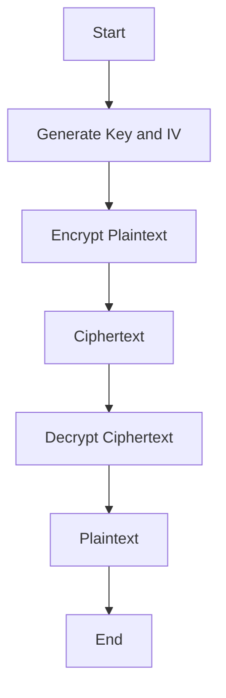

## 24.4. Data Encryption and Cryptography with `RustCrypto`

In today's digital age, securing data is paramount. Cryptography plays a crucial role in protecting sensitive information from unauthorized access and ensuring data integrity. Rust, known for its safety and performance, offers robust cryptographic capabilities through the `RustCrypto` project. This section will guide you through using `RustCrypto` to implement cryptographic functions securely in Rust applications.

### Introduction to `RustCrypto`

The `RustCrypto` project is a collection of cryptographic libraries written in Rust. It aims to provide safe, efficient, and easy-to-use cryptographic primitives and protocols. The project is community-driven and adheres to modern cryptographic standards, making it a reliable choice for developers looking to implement secure cryptographic operations in their Rust applications.

#### Key Offerings of `RustCrypto`

- **Hash Functions**: Secure hashing algorithms like SHA-2 and SHA-3.
- **Symmetric Encryption**: Algorithms such as AES for encrypting data.
- **Asymmetric Encryption**: Public-key cryptography using algorithms like RSA and ECC.
- **Message Authentication Codes (MACs)**: HMAC for ensuring data integrity and authenticity.
- **Key Derivation Functions (KDFs)**: PBKDF2 and Argon2 for deriving cryptographic keys from passwords.

### Common Cryptographic Operations

Let's explore some common cryptographic operations using `RustCrypto`, including hashing, encryption, and key management.

#### Hashing

Hashing is a one-way cryptographic operation that transforms input data into a fixed-size hash value. It's commonly used for data integrity checks and password storage.

```rust
use sha2::{Sha256, Digest};

fn main() {
    // Create a Sha256 object
    let mut hasher = Sha256::new();

    // Write input data
    hasher.update(b"hello world");

    // Read hash digest and consume hasher
    let result = hasher.finalize();

    println!("Hash: {:x}", result);
}
```

In this example, we use the SHA-256 algorithm to hash the string "hello world". The `RustCrypto` library provides a straightforward API for hashing operations.

#### Symmetric Encryption

Symmetric encryption uses the same key for both encryption and decryption. AES (Advanced Encryption Standard) is a widely used symmetric encryption algorithm.

```rust
use aes::Aes256;
use block_modes::{BlockMode, Cbc};
use block_modes::block_padding::Pkcs7;
use hex_literal::hex;

// Create an alias for convenience
type Aes256Cbc = Cbc<Aes256, Pkcs7>;

fn main() {
    let key = hex!("000102030405060708090a0b0c0d0e0f101112131415161718191a1b1c1d1e1f");
    let iv = hex!("1a1b1c1d1e1f20212223242526272829");

    let plaintext = b"Hello, world!";
    let cipher = Aes256Cbc::new_from_slices(&key, &iv).unwrap();

    // Encrypt the plaintext
    let ciphertext = cipher.encrypt_vec(plaintext);

    println!("Ciphertext: {:?}", ciphertext);

    // Decrypt the ciphertext
    let decrypted_ciphertext = cipher.decrypt_vec(&ciphertext).unwrap();

    println!("Decrypted: {:?}", String::from_utf8(decrypted_ciphertext).unwrap());
}
```

This example demonstrates AES-256 encryption in CBC mode with PKCS7 padding. We encrypt the plaintext "Hello, world!" and then decrypt it back to verify the operation.

#### Asymmetric Encryption

Asymmetric encryption uses a pair of keys: a public key for encryption and a private key for decryption. RSA is a popular asymmetric encryption algorithm.

```rust
use rsa::{RsaPrivateKey, RsaPublicKey, PaddingScheme};
use rand::rngs::OsRng;

fn main() {
    let mut rng = OsRng;
    let bits = 2048;
    let private_key = RsaPrivateKey::new(&mut rng, bits).expect("failed to generate a key");
    let public_key = RsaPublicKey::from(&private_key);

    let data = b"Hello, world!";
    let padding = PaddingScheme::new_pkcs1v15_encrypt();

    // Encrypt the data
    let encrypted_data = public_key.encrypt(&mut rng, padding, &data[..]).expect("failed to encrypt");

    println!("Encrypted: {:?}", encrypted_data);

    // Decrypt the data
    let decrypted_data = private_key.decrypt(padding, &encrypted_data).expect("failed to decrypt");

    println!("Decrypted: {:?}", String::from_utf8(decrypted_data).unwrap());
}
```

In this example, we generate an RSA key pair and use it to encrypt and decrypt the message "Hello, world!". The `RustCrypto` library makes it easy to perform asymmetric encryption operations.

### Best Practices in Cryptography

When implementing cryptographic functions, it's crucial to follow best practices to ensure security:

- **Use Well-Tested Libraries**: Always use well-tested libraries like `RustCrypto` instead of implementing cryptographic algorithms from scratch.
- **Adhere to Modern Standards**: Use algorithms and protocols that adhere to modern cryptographic standards. Avoid deprecated or weak algorithms.
- **Proper Key Management**: Ensure secure key generation, storage, and distribution. Use secure random number generators for key generation.
- **Avoid Hardcoding Keys**: Never hardcode cryptographic keys in your source code. Use secure storage solutions for key management.
- **Regularly Update Libraries**: Keep your cryptographic libraries up to date to benefit from security patches and improvements.

### Common Pitfalls

Despite the availability of robust cryptographic libraries, developers can still fall into common pitfalls:

- **Improper Key Management**: Failing to securely manage cryptographic keys can lead to data breaches.
- **Weak Algorithms**: Using outdated or weak algorithms can compromise security. Always choose strong, modern algorithms.
- **Ignoring Security Updates**: Failing to update cryptographic libraries can leave your application vulnerable to known exploits.
- **Misconfiguring Algorithms**: Incorrectly configuring cryptographic algorithms can weaken their security. Always follow recommended configurations.

### Adhering to Modern Cryptographic Standards

Modern cryptographic standards provide guidelines for secure cryptographic practices. Adhering to these standards ensures that your cryptographic implementations are robust and secure.

- **NIST Standards**: Follow the National Institute of Standards and Technology (NIST) guidelines for cryptographic algorithms and key management.
- **OWASP Recommendations**: The Open Web Application Security Project (OWASP) provides recommendations for secure cryptographic practices in web applications.
- **RFC Specifications**: Refer to relevant RFC specifications for cryptographic protocols and algorithms.

### Visualizing Cryptographic Operations

To better understand cryptographic operations, let's visualize the process of symmetric encryption using a flowchart.



**Figure 1**: This flowchart illustrates the process of symmetric encryption, starting with key and IV generation, followed by encryption and decryption operations.

### Try It Yourself

Experiment with the code examples provided in this section. Try modifying the plaintext, keys, or algorithms to see how the output changes. This hands-on approach will deepen your understanding of cryptographic operations in Rust.

### References and Further Reading

- [RustCrypto GitHub Repository](https://github.com/RustCrypto)
- [NIST Cryptographic Standards](https://csrc.nist.gov/publications)
- [OWASP Cryptographic Storage Cheat Sheet](https://cheatsheetseries.owasp.org/cheatsheets/Cryptographic_Storage_Cheat_Sheet.html)

### Knowledge Check

- What are the key offerings of the `RustCrypto` project?
- How does symmetric encryption differ from asymmetric encryption?
- Why is it important to use well-tested cryptographic libraries?
- What are some common pitfalls in cryptographic implementations?
- How can you ensure proper key management in your applications?

### Embrace the Journey

Remember, mastering cryptography is a journey. As you progress, you'll gain a deeper understanding of cryptographic principles and their applications. Keep experimenting, stay curious, and enjoy the journey!

## Quiz Time!



### What is the primary purpose of the `RustCrypto` project?

- [x] To provide safe and efficient cryptographic libraries for Rust
- [ ] To implement custom cryptographic algorithms
- [ ] To replace all existing cryptographic standards
- [ ] To offer a GUI for cryptographic operations

> **Explanation:** The `RustCrypto` project aims to provide safe, efficient, and easy-to-use cryptographic libraries for Rust developers.

### Which of the following is a symmetric encryption algorithm?

- [x] AES
- [ ] RSA
- [ ] ECC
- [ ] DSA

> **Explanation:** AES (Advanced Encryption Standard) is a symmetric encryption algorithm, meaning it uses the same key for both encryption and decryption.

### What is a common use case for hashing?

- [x] Data integrity checks
- [ ] Encrypting messages
- [ ] Generating random numbers
- [ ] Key exchange

> **Explanation:** Hashing is commonly used for data integrity checks, ensuring that data has not been altered.

### Why should cryptographic keys never be hardcoded in source code?

- [x] It poses a security risk
- [ ] It makes the code run slower
- [ ] It is against Rust's syntax rules
- [ ] It increases code complexity

> **Explanation:** Hardcoding cryptographic keys in source code poses a significant security risk, as it can lead to unauthorized access if the code is exposed.

### Which of the following is a best practice in cryptography?

- [x] Using well-tested libraries
- [ ] Implementing custom algorithms
- [ ] Hardcoding keys for convenience
- [ ] Ignoring library updates

> **Explanation:** Using well-tested libraries is a best practice in cryptography, as it ensures that the algorithms have been thoroughly vetted for security.

### What is the role of a Message Authentication Code (MAC)?

- [x] To ensure data integrity and authenticity
- [ ] To encrypt data
- [ ] To generate random numbers
- [ ] To compress data

> **Explanation:** A Message Authentication Code (MAC) ensures data integrity and authenticity by allowing the verification of both the data and the sender's identity.

### What does the acronym KDF stand for in cryptography?

- [x] Key Derivation Function
- [ ] Key Distribution Framework
- [ ] Known Data Format
- [ ] Kernel Data Function

> **Explanation:** KDF stands for Key Derivation Function, which is used to derive cryptographic keys from passwords or other data.

### What is a potential pitfall of using outdated cryptographic algorithms?

- [x] Compromised security
- [ ] Increased performance
- [ ] Reduced code complexity
- [ ] Improved compatibility

> **Explanation:** Using outdated cryptographic algorithms can compromise security, as they may have known vulnerabilities.

### True or False: Asymmetric encryption uses the same key for encryption and decryption.

- [ ] True
- [x] False

> **Explanation:** Asymmetric encryption uses a pair of keys: a public key for encryption and a private key for decryption.

### Which organization provides guidelines for cryptographic standards?

- [x] NIST
- [ ] NASA
- [ ] WHO
- [ ] IEEE

> **Explanation:** NIST (National Institute of Standards and Technology) provides guidelines for cryptographic standards.


