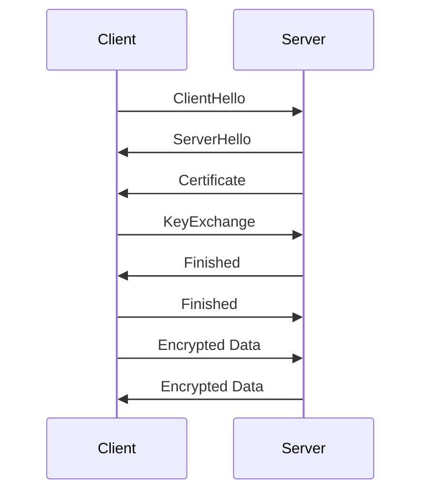

## 24.5. Secure Communication with TLS (Using `rustls`)

In today's digital landscape, secure communication is paramount. Whether you're building a web application, a microservice, or an IoT device, ensuring that data is transmitted securely over the network is crucial. This is where Transport Layer Security (TLS) comes into play. In this section, we will explore how to implement secure communication channels using TLS in Rust applications with the `rustls` crate.

### Understanding the Importance of Secure Communication and TLS

Secure communication ensures that data transmitted between a client and a server is encrypted, preventing unauthorized access and tampering. TLS is the most widely used protocol for securing internet communications. It provides:

- **Confidentiality**: Encrypts data to prevent eavesdropping.
- **Integrity**: Ensures data is not altered during transmission.
- **Authentication**: Verifies the identity of the communicating parties.

### Introducing the `rustls` Crate

`rustls` is a modern TLS library written in Rust. It is designed to be memory-safe, fast, and easy to use. Unlike OpenSSL, which is written in C and has a history of security vulnerabilities, `rustls` leverages Rust's safety guarantees to provide a more secure alternative.

#### Advantages of `rustls` over OpenSSL

- **Memory Safety**: Rust's ownership model prevents common memory safety issues.
- **Simplicity**: `rustls` has a simpler API compared to OpenSSL, making it easier to integrate.
- **Performance**: Optimized for performance with minimal overhead.
- **No System Dependencies**: `rustls` does not rely on system libraries, reducing potential compatibility issues.

### Setting Up a TLS Server with `rustls`

Let's start by setting up a simple TLS server using `rustls`. We'll walk through the process step by step.

#### Step 1: Add Dependencies

First, add the necessary dependencies to your `Cargo.toml` file:

```toml
[dependencies]
rustls = "0.20"
tokio = { version = "1", features = ["full"] }
tokio-rustls = "0.23"
```

#### Step 2: Create a TLS Configuration

Create a TLS configuration using `rustls`. You'll need a certificate and a private key. For development purposes, you can generate a self-signed certificate.

```rust
use rustls::{ServerConfig, NoClientAuth};
use std::sync::Arc;
use tokio_rustls::TlsAcceptor;
use tokio::net::TcpListener;
use tokio::prelude::*;

async fn run_tls_server() -> Result<(), Box<dyn std::error::Error>> {
    // Load certificate and private key
    let certs = load_certs("server.crt")?;
    let key = load_private_key("server.key")?;

    // Create a TLS configuration
    let config = ServerConfig::builder()
        .with_safe_defaults()
        .with_no_client_auth()
        .with_single_cert(certs, key)?;

    let acceptor = TlsAcceptor::from(Arc::new(config));

    // Bind to a TCP listener
    let listener = TcpListener::bind("127.0.0.1:4433").await?;

    loop {
        let (stream, _) = listener.accept().await?;
        let acceptor = acceptor.clone();

        tokio::spawn(async move {
            let tls_stream = acceptor.accept(stream).await;
            match tls_stream {
                Ok(mut stream) => {
                    // Handle the connection
                    let _ = stream.write_all(b"Hello, TLS!\n").await;
                }
                Err(e) => eprintln!("TLS error: {:?}", e),
            }
        });
    }
}
```

#### Step 3: Load Certificates and Keys

You'll need functions to load your certificates and private keys. Here's a simple implementation:

```rust
use rustls::{Certificate, PrivateKey};
use std::fs::File;
use std::io::{self, BufReader};
use std::path::Path;

fn load_certs(path: &str) -> io::Result<Vec<Certificate>> {
    let certfile = File::open(Path::new(path))?;
    let mut reader = BufReader::new(certfile);
    rustls_pemfile::certs(&mut reader)
        .map(|certs| certs.into_iter().map(Certificate).collect())
}

fn load_private_key(path: &str) -> io::Result<PrivateKey> {
    let keyfile = File::open(Path::new(path))?;
    let mut reader = BufReader::new(keyfile);
    let keys = rustls_pemfile::pkcs8_private_keys(&mut reader)
        .map_err(|_| io::Error::new(io::ErrorKind::InvalidInput, "invalid key"))?;
    Ok(PrivateKey(keys[0].clone()))
}
```

### Setting Up a TLS Client with `rustls`

Now, let's set up a TLS client to connect to our server.

#### Step 1: Create a TLS Client Configuration

Similar to the server, you'll need to create a TLS configuration for the client.

```rust
use rustls::{ClientConfig, RootCertStore};
use tokio_rustls::TlsConnector;
use webpki_roots::TLS_SERVER_ROOTS;

async fn run_tls_client() -> Result<(), Box<dyn std::error::Error>> {
    // Create a root certificate store
    let mut root_store = RootCertStore::empty();
    root_store.add_server_trust_anchors(&TLS_SERVER_ROOTS);

    // Create a TLS configuration
    let config = ClientConfig::builder()
        .with_safe_defaults()
        .with_root_certificates(root_store)
        .with_no_client_auth();

    let connector = TlsConnector::from(Arc::new(config));

    // Connect to the server
    let stream = TcpStream::connect("127.0.0.1:4433").await?;
    let domain = rustls::ServerName::try_from("localhost").unwrap();
    let mut tls_stream = connector.connect(domain, stream).await?;

    // Send a message
    tls_stream.write_all(b"Hello from client!\n").await?;
    Ok(())
}
```

### Certificate Management and Validation

Managing certificates is a critical aspect of TLS. Proper certificate management ensures that your application is secure and trusted.

#### Generating Self-Signed Certificates

For development purposes, you can generate self-signed certificates using tools like OpenSSL. However, for production, it's recommended to use certificates from a trusted Certificate Authority (CA).

#### Validating Certificates

`rustls` provides mechanisms to validate certificates. Ensure that your client verifies the server's certificate to prevent man-in-the-middle attacks.

### Best Practices for Configuring TLS Securely

- **Use Strong Cipher Suites**: Ensure that your TLS configuration uses strong, modern cipher suites.
- **Enable Perfect Forward Secrecy (PFS)**: Use key exchange algorithms that support PFS to protect past sessions.
- **Regularly Update Certificates**: Keep your certificates up to date and replace them before they expire.
- **Monitor for Vulnerabilities**: Stay informed about the latest security vulnerabilities and update your dependencies accordingly.

### Visualizing TLS Communication

To better understand the flow of TLS communication, let's visualize the process using a sequence diagram.



**Figure 1**: TLS Handshake Process

### Try It Yourself

Now that we've covered the basics, try modifying the code examples to experiment with different configurations. For instance, you can:

- Change the server's certificate and key.
- Experiment with different cipher suites.
- Implement client authentication.

### References and Further Reading

- [rustls GitHub Repository](https://github.com/ctz/rustls)
- [Tokio Documentation](https://tokio.rs/docs/)
- [WebPKI Roots](https://github.com/briansmith/webpki-roots)

### Knowledge Check

- What are the key benefits of using TLS for secure communication?
- How does `rustls` provide a safer alternative to OpenSSL?
- What are the steps involved in setting up a TLS server with `rustls`?
- Why is certificate validation important in TLS communication?

### Embrace the Journey

Remember, mastering secure communication is a journey. As you continue to explore and experiment with TLS in Rust, you'll gain a deeper understanding of network security. Keep learning, stay curious, and enjoy the process!

## Quiz Time!



### What is the primary purpose of TLS in secure communication?

- [x] To encrypt data and ensure confidentiality
- [ ] To speed up data transmission
- [ ] To compress data
- [ ] To authenticate users

> **Explanation:** TLS encrypts data to ensure confidentiality, preventing unauthorized access.

### Which crate is recommended for implementing TLS in Rust?

- [x] rustls
- [ ] OpenSSL
- [ ] hyper
- [ ] tokio

> **Explanation:** `rustls` is a modern TLS library in Rust, offering memory safety and simplicity.

### What is a key advantage of `rustls` over OpenSSL?

- [x] Memory safety
- [ ] Faster data compression
- [ ] Larger community support
- [ ] Built-in database integration

> **Explanation:** `rustls` leverages Rust's memory safety features, reducing vulnerabilities.

### What is the role of a certificate in TLS communication?

- [x] To verify the identity of the communicating parties
- [ ] To compress data
- [ ] To encrypt data
- [ ] To speed up data transmission

> **Explanation:** Certificates verify the identity of the parties, ensuring authenticity.

### Which of the following is a best practice for TLS configuration?

- [x] Use strong cipher suites
- [ ] Disable encryption for faster performance
- [ ] Use expired certificates
- [ ] Ignore certificate validation

> **Explanation:** Using strong cipher suites ensures secure communication.

### What does Perfect Forward Secrecy (PFS) provide?

- [x] Protection of past sessions
- [ ] Faster data transmission
- [ ] Data compression
- [ ] User authentication

> **Explanation:** PFS protects past sessions by using unique keys for each session.

### How can you generate certificates for development purposes?

- [x] Use self-signed certificates
- [ ] Use expired certificates
- [ ] Use certificates from untrusted sources
- [ ] Use certificates with weak encryption

> **Explanation:** Self-signed certificates are suitable for development but not for production.

### What is the purpose of the `TlsAcceptor` in the server setup?

- [x] To accept and handle incoming TLS connections
- [ ] To compress data
- [ ] To generate certificates
- [ ] To speed up data transmission

> **Explanation:** `TlsAcceptor` is used to accept and handle TLS connections on the server.

### Why is it important to regularly update certificates?

- [x] To ensure they remain valid and secure
- [ ] To compress data
- [ ] To speed up data transmission
- [ ] To authenticate users

> **Explanation:** Regular updates ensure certificates remain valid and secure.

### True or False: `rustls` relies on system libraries for its functionality.

- [ ] True
- [x] False

> **Explanation:** `rustls` does not rely on system libraries, reducing compatibility issues.




