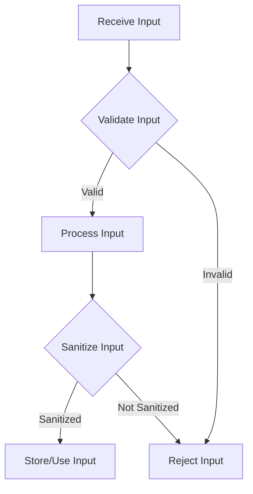

## 24.6. Input Validation and Sanitization

In the world of software development, input validation and sanitization are critical components of application security. Rust, with its emphasis on safety and performance, provides robust tools and patterns to implement these practices effectively. In this section, we will explore the risks associated with unvalidated input, strategies for validating and sanitizing data, and practical examples using Rust.

### Understanding the Risks of Unvalidated Input

Unvalidated input is a significant security risk that can lead to various types of attacks, including:

- **Injection Attacks**: These occur when an attacker is able to inject malicious code into a program. Common examples include SQL injection, command injection, and cross-site scripting (XSS).
- **Buffer Overflows**: Unchecked input can lead to buffer overflows, where data exceeds the allocated memory space, potentially allowing attackers to execute arbitrary code.
- **Data Corruption**: Invalid input can corrupt data, leading to incorrect application behavior or data loss.

To mitigate these risks, it is crucial to validate and sanitize all input data rigorously.

### Strategies for Input Validation

Input validation is the process of ensuring that input data conforms to expected formats and constraints. Here are some strategies to consider:

#### Whitelisting

Whitelisting involves defining a set of acceptable values or patterns for input data. This is often more secure than blacklisting, which attempts to block known bad inputs.

```rust
fn is_valid_username(username: &str) -> bool {
    // Allow only alphanumeric characters and underscores
    let re = regex::Regex::new(r"^\w+$").unwrap();
    re.is_match(username)
}

fn main() {
    let username = "user_123";
    if is_valid_username(username) {
        println!("Valid username");
    } else {
        println!("Invalid username");
    }
}
```

#### Length Checks

Ensure that input data does not exceed expected lengths to prevent buffer overflows and other issues.

```rust
fn is_valid_length(input: &str, max_length: usize) -> bool {
    input.len() <= max_length
}

fn main() {
    let input = "example";
    if is_valid_length(input, 10) {
        println!("Input length is valid");
    } else {
        println!("Input length is invalid");
    }
}
```

#### Type Checking

Ensure that input data is of the expected type. Rust's strong type system can help enforce this at compile time.

```rust
fn parse_integer(input: &str) -> Result<i32, std::num::ParseIntError> {
    input.parse::<i32>()
}

fn main() {
    match parse_integer("42") {
        Ok(num) => println!("Parsed number: {}", num),
        Err(_) => println!("Invalid number"),
    }
}
```

### Data Sanitization Techniques

Sanitization involves cleaning input data to remove or neutralize harmful content. This is particularly important for preventing injection attacks.

#### HTML Escaping

When dealing with web applications, ensure that any user-generated content is properly escaped to prevent XSS attacks.

```rust
fn escape_html(input: &str) -> String {
    htmlescape::encode_minimal(input)
}

fn main() {
    let user_input = "<script>alert('XSS');</script>";
    let safe_input = escape_html(user_input);
    println!("Escaped input: {}", safe_input);
}
```

#### Command Escaping

For command-line tools, ensure that input used in shell commands is properly escaped.

```rust
use std::process::Command;

fn run_command(input: &str) {
    let output = Command::new("echo")
        .arg(input)
        .output()
        .expect("Failed to execute command");

    println!("Command output: {:?}", output);
}

fn main() {
    let user_input = "Hello, world!";
    run_command(user_input);
}
```

### Validation Libraries and Tools

Rust offers several libraries to aid in input validation and sanitization:

- **Regex**: The `regex` crate provides powerful regular expression capabilities for pattern matching and validation.
- **Serde**: While primarily used for serialization, `serde` can also be used to enforce data structures and types.
- **Validator**: The `validator` crate offers a set of validation functions for common use cases.

### Example: Web Application Input Validation

Let's consider a simple web application using the `warp` framework to demonstrate input validation and sanitization.

```rust
use warp::Filter;

#[tokio::main]
async fn main() {
    let hello = warp::path!("hello" / String)
        .map(|name| {
            if is_valid_username(&name) {
                format!("Hello, {}!", name)
            } else {
                "Invalid username".to_string()
            }
        });

    warp::serve(hello).run(([127, 0, 0, 1], 3030)).await;
}

fn is_valid_username(username: &str) -> bool {
    let re = regex::Regex::new(r"^\w+$").unwrap();
    re.is_match(username)
}
```

### Try It Yourself

Experiment with the examples provided by modifying the input data and observing the results. Try adding additional validation rules or sanitization steps to enhance security.

### Visualizing Input Validation and Sanitization

To better understand the flow of input validation and sanitization, let's visualize the process using a flowchart.



**Figure 1**: The flowchart illustrates the process of receiving input, validating it, sanitizing it, and finally using or storing it.

### References and Further Reading

- [OWASP Input Validation Cheat Sheet](https://cheatsheetseries.owasp.org/cheatsheets/Input_Validation_Cheat_Sheet.html)
- [Rust Regex Documentation](https://docs.rs/regex/latest/regex/)
- [Warp Web Framework](https://docs.rs/warp/latest/warp/)

### Knowledge Check

- What are the risks associated with unvalidated input?
- How does whitelisting differ from blacklisting in input validation?
- Why is it important to sanitize data in web applications?
- What are some common libraries used for input validation in Rust?

### Embrace the Journey

Remember, input validation and sanitization are ongoing processes. As you develop more complex applications, continue to refine your validation strategies and stay informed about new security threats. Keep experimenting, stay curious, and enjoy the journey!

## Quiz Time!



### What is the primary risk of unvalidated input in applications?

- [x] Injection attacks
- [ ] Increased performance
- [ ] Improved user experience
- [ ] Faster development

> **Explanation:** Unvalidated input can lead to injection attacks, where malicious code is executed in the application.

### Which strategy involves defining acceptable input values?

- [x] Whitelisting
- [ ] Blacklisting
- [ ] Length checking
- [ ] Type checking

> **Explanation:** Whitelisting involves defining a set of acceptable values or patterns for input data.

### What is the purpose of data sanitization?

- [x] To remove or neutralize harmful content
- [ ] To increase data size
- [ ] To improve application speed
- [ ] To enhance user interface

> **Explanation:** Data sanitization involves cleaning input data to remove or neutralize harmful content.

### Which Rust crate provides regular expression capabilities?

- [x] regex
- [ ] serde
- [ ] warp
- [ ] htmlescape

> **Explanation:** The `regex` crate provides powerful regular expression capabilities for pattern matching and validation.

### What is a common use case for HTML escaping?

- [x] Preventing XSS attacks
- [ ] Improving SEO
- [ ] Enhancing page load speed
- [ ] Reducing server load

> **Explanation:** HTML escaping is used to prevent XSS attacks by ensuring user-generated content is properly escaped.

### Which library is primarily used for serialization in Rust?

- [x] Serde
- [ ] Regex
- [ ] Warp
- [ ] Validator

> **Explanation:** Serde is primarily used for serialization but can also enforce data structures and types.

### What is the role of the `warp` framework in Rust?

- [x] Building web applications
- [ ] Data serialization
- [ ] Regular expression matching
- [ ] Command-line parsing

> **Explanation:** The `warp` framework is used for building web applications in Rust.

### What does the `is_valid_length` function check for?

- [x] Input length
- [ ] Input type
- [ ] Input pattern
- [ ] Input value

> **Explanation:** The `is_valid_length` function checks if the input data does not exceed expected lengths.

### Which of the following is a benefit of using Rust's type system for validation?

- [x] Enforcing expected types at compile time
- [ ] Increasing runtime errors
- [ ] Reducing code readability
- [ ] Slowing down development

> **Explanation:** Rust's strong type system can enforce expected types at compile time, reducing runtime errors.

### True or False: Blacklisting is more secure than whitelisting.

- [ ] True
- [x] False

> **Explanation:** Whitelisting is generally more secure than blacklisting because it defines what is allowed rather than trying to block known bad inputs.


