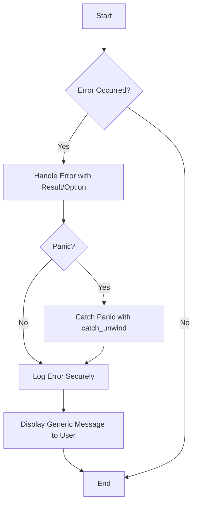

## 24.7. Error Handling and Avoiding Information Leakage

In the realm of software development, error handling is a critical aspect that ensures the robustness and reliability of applications. However, it is equally important to manage errors in a way that prevents sensitive information from being exposed. This section will guide you through the best practices for error handling in Rust, focusing on maintaining security while providing useful feedback.

### Balancing Informative Errors and Security

Error messages are essential for debugging and understanding what went wrong in an application. However, they can also be a source of information leakage if not handled properly. The key is to strike a balance between providing enough information to diagnose issues and not exposing sensitive data.

#### Guidelines for Error Messages

1. **Use Generic Messages for Users**: When displaying error messages to end-users, keep them generic. Avoid revealing internal details such as stack traces, database queries, or file paths. Instead, provide a simple message that indicates an error occurred and suggest contacting support if necessary.

2. **Log Detailed Errors Securely**: While user-facing messages should be generic, detailed error information should be logged securely for developers to diagnose issues. Ensure that logs are stored in a secure location with restricted access.

3. **Avoid Hardcoding Sensitive Information**: Never hardcode sensitive information such as passwords, API keys, or database credentials in error messages or logs.

4. **Use Error Codes**: Instead of descriptive messages, consider using error codes that can be looked up in a secure documentation system. This allows developers to understand the issue without exposing details to users.

5. **Sanitize Inputs**: Always sanitize user inputs before including them in error messages to prevent injection attacks.

### Handling Panics and Unexpected Failures

Rust provides a robust error handling mechanism through the `Result` and `Option` types. However, there are situations where a panic might occur, such as when accessing an out-of-bounds index in a vector. Handling these panics gracefully is crucial to prevent information leakage and ensure application stability.

#### Best Practices for Panic Handling

1. **Use `Result` and `Option` for Recoverable Errors**: For errors that can be anticipated and handled, use the `Result` and `Option` types. This allows you to gracefully handle errors without panicking.

2. **Catch Panics with `std::panic::catch_unwind`**: For scenarios where a panic might occur, use `std::panic::catch_unwind` to catch and handle the panic. This prevents the application from crashing and allows you to log the error securely.

3. **Avoid Panicking in Libraries**: If you're developing a library, avoid panicking in public APIs. Instead, return `Result` or `Option` types to allow the caller to handle errors.

4. **Use `unwrap` and `expect` Sparingly**: The `unwrap` and `expect` methods can cause a panic if called on an `Err` or `None` value. Use them sparingly and only when you're certain that an error cannot occur.

5. **Implement Custom Error Types**: Define custom error types for your application to provide more context about errors. This allows you to handle different error scenarios more effectively.

### Logging Sensitive Information

Logging is an essential part of error handling, but it must be done securely to prevent information leakage. Here are some best practices for logging sensitive information:

1. **Use Secure Logging Libraries**: Use logging libraries that support secure logging practices, such as log rotation and encryption.

2. **Mask Sensitive Data**: When logging sensitive information, such as credit card numbers or social security numbers, mask the data to prevent exposure.

3. **Restrict Log Access**: Ensure that logs are stored in a secure location with restricted access. Only authorized personnel should have access to logs.

4. **Regularly Review Logs**: Regularly review logs for any signs of unauthorized access or information leakage.

5. **Implement Log Retention Policies**: Define and implement log retention policies to ensure that logs are retained only for as long as necessary.

### Testing for Unintended Information Disclosure

Testing is a crucial step in ensuring that your application does not leak sensitive information through error messages or logs. Here are some strategies for testing:

1. **Conduct Security Audits**: Regularly conduct security audits to identify potential information leakage points in your application.

2. **Use Automated Testing Tools**: Use automated testing tools to scan your application for common vulnerabilities, such as SQL injection or cross-site scripting (XSS).

3. **Perform Penetration Testing**: Hire security experts to perform penetration testing on your application. This helps identify vulnerabilities that automated tools might miss.

4. **Review Error Messages**: Manually review error messages to ensure that they do not contain sensitive information.

5. **Test Log Outputs**: Test log outputs to ensure that sensitive information is not being logged.

### Visualizing Error Handling Workflow

To better understand the error handling workflow in Rust, let's visualize it using a flowchart. This diagram illustrates the process of handling errors, logging them securely, and displaying generic messages to users.



**Diagram Description**: This flowchart represents the error handling workflow in Rust. It starts with an error occurrence, followed by handling the error using `Result` or `Option`. If a panic occurs, it is caught using `catch_unwind`. The error is then logged securely, and a generic message is displayed to the user.

### Code Example: Secure Error Handling in Rust

Let's look at a code example that demonstrates secure error handling in Rust. This example uses the `Result` type to handle errors and logs them securely.

```rust
use std::fs::File;
use std::io::{self, Read};
use log::{error, info};

fn read_file_content(file_path: &str) -> Result<String, io::Error> {
    let mut file = File::open(file_path)?;
    let mut content = String::new();
    file.read_to_string(&mut content)?;
    Ok(content)
}

fn main() {
    env_logger::init(); // Initialize the logger

    match read_file_content("example.txt") {
        Ok(content) => info!("File content: {}", content),
        Err(e) => {
            error!("Failed to read file: {}", e);
            println!("An error occurred. Please contact support.");
        }
    }
}
```

**Code Explanation**: In this example, we define a function `read_file_content` that attempts to read the content of a file. If an error occurs, it is logged using the `log` crate, and a generic message is displayed to the user. This ensures that detailed error information is logged securely, while the user receives a simple message.

### Try It Yourself

To experiment with the code example, try modifying the file path to a non-existent file and observe how the error is handled. You can also try logging additional information, such as the timestamp or user ID, to see how it affects the logs.

### Key Takeaways

- **Balance Informative Errors and Security**: Provide enough information to diagnose issues without exposing sensitive data.
- **Handle Panics Gracefully**: Use `Result` and `Option` for recoverable errors and catch panics with `catch_unwind`.
- **Log Sensitive Information Securely**: Use secure logging practices to prevent information leakage.
- **Test for Information Disclosure**: Regularly test your application for unintended information disclosure.

### Embrace the Journey

Remember, error handling is not just about catching errors; it's about ensuring the security and reliability of your application. As you continue to develop your skills in Rust, keep experimenting with different error handling strategies, stay curious, and enjoy the journey!

## Quiz Time!



### What is the primary goal of error handling in Rust?

- [x] To manage errors while preventing sensitive information leakage
- [ ] To provide detailed error messages to users
- [ ] To ensure that all errors cause the application to panic
- [ ] To avoid using the `Result` and `Option` types

> **Explanation:** The primary goal of error handling in Rust is to manage errors while preventing sensitive information leakage, ensuring security and reliability.

### Which Rust types are used for handling recoverable errors?

- [x] `Result` and `Option`
- [ ] `String` and `Vec`
- [ ] `HashMap` and `BTreeMap`
- [ ] `Box` and `Rc`

> **Explanation:** `Result` and `Option` are the Rust types used for handling recoverable errors.

### What should be avoided in user-facing error messages?

- [x] Revealing internal details such as stack traces
- [ ] Providing a simple error message
- [ ] Suggesting contacting support
- [ ] Using error codes

> **Explanation:** User-facing error messages should avoid revealing internal details such as stack traces to prevent information leakage.

### How can panics be caught in Rust?

- [x] Using `std::panic::catch_unwind`
- [ ] Using `std::panic::resume_unwind`
- [ ] Using `std::panic::panic_any`
- [ ] Using `std::panic::set_hook`

> **Explanation:** Panics can be caught in Rust using `std::panic::catch_unwind`.

### What is a best practice for logging sensitive information?

- [x] Mask sensitive data before logging
- [ ] Log sensitive data in plain text
- [ ] Avoid logging any errors
- [ ] Use hardcoded sensitive information in logs

> **Explanation:** A best practice for logging sensitive information is to mask sensitive data before logging to prevent exposure.

### What is the purpose of using error codes?

- [x] To provide a way to look up detailed error information securely
- [ ] To confuse users with cryptic messages
- [ ] To avoid handling errors
- [ ] To replace the need for logging

> **Explanation:** Error codes provide a way to look up detailed error information securely without exposing details to users.

### Why should `unwrap` and `expect` be used sparingly?

- [x] They can cause a panic if called on an `Err` or `None` value
- [ ] They are difficult to use
- [ ] They are deprecated in Rust
- [ ] They are only for debugging purposes

> **Explanation:** `unwrap` and `expect` should be used sparingly because they can cause a panic if called on an `Err` or `None` value.

### What is a key takeaway for error handling?

- [x] Balance informative errors and security
- [ ] Always provide detailed stack traces to users
- [ ] Avoid using the `Result` type
- [ ] Use `unwrap` for all error handling

> **Explanation:** A key takeaway for error handling is to balance informative errors and security, ensuring that sensitive information is not exposed.

### What should be included in logs for security?

- [x] Timestamp and masked sensitive data
- [ ] User passwords in plain text
- [ ] Full stack traces
- [ ] Hardcoded API keys

> **Explanation:** Logs should include timestamps and masked sensitive data for security, avoiding exposure of sensitive information.

### True or False: Error handling in Rust is only about catching errors.

- [ ] True
- [x] False

> **Explanation:** Error handling in Rust is not only about catching errors; it's also about ensuring the security and reliability of the application.




