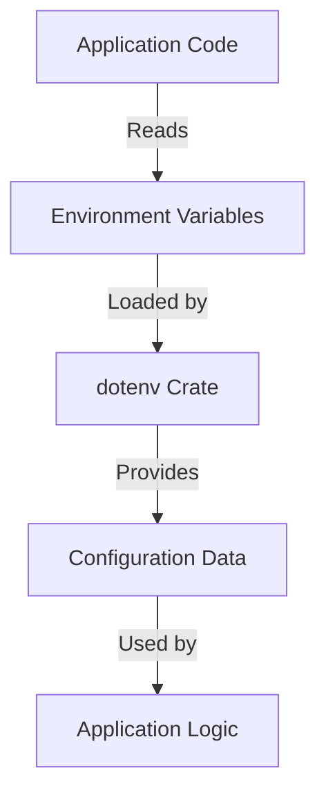

## 24.8. Secure Configuration Management

In the world of software development, managing application configurations securely is crucial. Configuration data often includes sensitive information such as API keys, database credentials, and other secrets that, if exposed, can lead to severe security breaches. In this section, we will explore secure configuration management in Rust, focusing on strategies to protect sensitive data, the use of environment variables, and secret management tools. We'll also highlight best practices for handling configuration files and discuss tools for secure configuration management in deployment environments.

### Understanding the Risks of Configuration Data

Before diving into strategies for secure configuration management, it's essential to understand the risks associated with configuration data. Configuration files often contain sensitive information that, if mishandled, can lead to:

- **Unauthorized Access**: Exposure of API keys or database credentials can allow unauthorized users to access your services or data.
- **Data Breaches**: Leaked secrets can lead to data breaches, compromising user data and damaging your organization's reputation.
- **Service Disruption**: Misconfigured settings can cause service outages or performance issues.

To mitigate these risks, it's crucial to implement secure configuration management practices.

### Strategies for Separating Configuration from Code

One of the fundamental principles of secure configuration management is separating configuration from code. This separation ensures that sensitive data is not hardcoded into your application's source code, reducing the risk of accidental exposure. Here are some strategies to achieve this:

1. **Use Configuration Files**: Store configuration data in separate files, such as JSON, YAML, or TOML, and load them at runtime. Ensure these files are not included in version control by adding them to your `.gitignore` file.

2. **Environment Variables**: Leverage environment variables to store sensitive information. This approach allows you to manage configurations outside of your codebase, making it easier to change settings without modifying the code.

3. **Secret Management Tools**: Use secret management tools like HashiCorp Vault or AWS Secrets Manager to store and retrieve sensitive data securely. These tools provide encryption and access control mechanisms to protect your secrets.

### Using Environment Variables for Configuration

Environment variables are a popular method for managing configuration data securely. They allow you to define settings outside of your application code, making it easier to manage different environments (e.g., development, testing, production) without changing the codebase.

#### Setting Environment Variables

To set environment variables in Rust, you can use the `std::env` module. Here's an example of how to read an environment variable:

```rust
use std::env;

fn main() {
    // Retrieve the value of the environment variable "API_KEY"
    let api_key = env::var("API_KEY").expect("API_KEY not set");

    println!("API Key: {}", api_key);
}
```

In this example, we use `env::var` to retrieve the value of the `API_KEY` environment variable. If the variable is not set, the program will panic with the message "API_KEY not set."

#### Using dotenv for Environment Variables

The [dotenv](https://crates.io/crates/dotenv) crate is a popular tool for managing environment variables in Rust. It allows you to load environment variables from a `.env` file, making it easier to manage configurations locally.

To use dotenv, add it to your `Cargo.toml`:

```toml
[dependencies]
dotenv = "0.15"
```

Here's an example of how to use dotenv in your Rust application:

```rust
use dotenv::dotenv;
use std::env;

fn main() {
    // Load environment variables from the .env file
    dotenv().ok();

    // Retrieve the value of the environment variable "API_KEY"
    let api_key = env::var("API_KEY").expect("API_KEY not set");

    println!("API Key: {}", api_key);
}
```

In this example, we call `dotenv().ok()` to load environment variables from the `.env` file. The rest of the code remains the same as the previous example.

### Best Practices for Configuration Files

When using configuration files, it's essential to follow best practices to ensure their security:

1. **Access Permissions**: Restrict access to configuration files to only those who need it. Use file permissions to limit read and write access.

2. **Encryption**: Encrypt sensitive data within configuration files. This adds an extra layer of security, ensuring that even if the file is accessed, the data remains protected.

3. **Version Control**: Avoid including configuration files with sensitive data in version control. Use `.gitignore` to exclude them from your repository.

4. **Environment-Specific Configurations**: Use different configuration files for different environments (e.g., `config.dev.toml`, `config.prod.toml`). This allows you to manage settings specific to each environment without modifying the code.

### Tools for Secure Configuration Management

Several tools can help you manage configurations securely in deployment environments:

- **HashiCorp Vault**: A tool for securely storing and accessing secrets. It provides encryption, access control, and auditing capabilities.

- **AWS Secrets Manager**: A service for managing secrets in AWS. It allows you to rotate, manage, and retrieve database credentials, API keys, and other secrets.

- **Azure Key Vault**: A cloud service for securely storing and accessing secrets, keys, and certificates.

- **Kubernetes Secrets**: A Kubernetes-native way to manage sensitive information. It allows you to store and manage secrets within your Kubernetes cluster.

### Implementing Secure Configuration Management in Rust

Let's walk through an example of implementing secure configuration management in a Rust application using environment variables and the dotenv crate.

#### Step 1: Create a `.env` File

Create a `.env` file in the root of your project with the following content:

```
API_KEY=your_api_key_here
DATABASE_URL=your_database_url_here
```

#### Step 2: Update `Cargo.toml`

Add the dotenv crate to your `Cargo.toml`:

```toml
[dependencies]
dotenv = "0.15"
```

#### Step 3: Load Environment Variables in Your Application

Update your `main.rs` to load environment variables using dotenv:

```rust
use dotenv::dotenv;
use std::env;

fn main() {
    // Load environment variables from the .env file
    dotenv().ok();

    // Retrieve the value of the environment variables
    let api_key = env::var("API_KEY").expect("API_KEY not set");
    let database_url = env::var("DATABASE_URL").expect("DATABASE_URL not set");

    println!("API Key: {}", api_key);
    println!("Database URL: {}", database_url);
}
```

#### Step 4: Run Your Application

Run your application using `cargo run`. The environment variables will be loaded from the `.env` file, and their values will be printed to the console.

### Try It Yourself

Experiment with the code example by adding additional environment variables to the `.env` file and retrieving their values in your application. Try changing the values in the `.env` file and observe how the application behavior changes.

### Visualizing Secure Configuration Management

To better understand the flow of secure configuration management, let's visualize the process using a Mermaid.js diagram.



**Diagram Description**: This diagram illustrates how the application code reads environment variables, which are loaded by the dotenv crate. The configuration data is then used by the application logic.

### External Resources

For further reading on secure configuration management, consider exploring the following resources:

- [dotenv crate documentation](https://crates.io/crates/dotenv)
- [HashiCorp Vault](https://www.vaultproject.io/)
- [AWS Secrets Manager](https://aws.amazon.com/secrets-manager/)
- [Azure Key Vault](https://azure.microsoft.com/en-us/services/key-vault/)
- [Kubernetes Secrets](https://kubernetes.io/docs/concepts/configuration/secret/)

### Knowledge Check

- What are the risks associated with configuration data?
- How can you separate configuration from code?
- What are the benefits of using environment variables for configuration?
- How does the dotenv crate help manage environment variables in Rust?
- What are some best practices for handling configuration files?

### Embrace the Journey

Remember, secure configuration management is a critical aspect of software development. By following best practices and leveraging tools like dotenv and secret management services, you can protect your application's sensitive data and ensure its security. Keep experimenting, stay curious, and enjoy the journey of building secure applications in Rust!

## Quiz Time!



### What is one of the main risks associated with configuration data?

- [x] Unauthorized access to sensitive information
- [ ] Increased application performance
- [ ] Simplified codebase
- [ ] Enhanced user interface

> **Explanation:** Configuration data often contains sensitive information like API keys and passwords, which, if exposed, can lead to unauthorized access.

### Which strategy helps separate configuration from code?

- [x] Using environment variables
- [ ] Hardcoding values in the source code
- [ ] Storing configurations in the database
- [ ] Embedding configurations in HTML files

> **Explanation:** Environment variables allow you to manage configurations outside of your codebase, separating configuration from code.

### What is the purpose of the dotenv crate in Rust?

- [x] To load environment variables from a `.env` file
- [ ] To encrypt configuration files
- [ ] To manage database connections
- [ ] To compile Rust code

> **Explanation:** The dotenv crate is used to load environment variables from a `.env` file, making it easier to manage configurations locally.

### Which of the following is a best practice for configuration files?

- [x] Restricting access permissions
- [ ] Including them in version control
- [ ] Hardcoding sensitive data
- [ ] Using plain text for all configurations

> **Explanation:** Restricting access permissions ensures that only authorized users can access configuration files, enhancing security.

### What tool can be used for securely storing and accessing secrets?

- [x] HashiCorp Vault
- [ ] GitHub
- [ ] Docker
- [ ] Jenkins

> **Explanation:** HashiCorp Vault is a tool for securely storing and accessing secrets, providing encryption and access control mechanisms.

### How can you set an environment variable in Rust?

- [x] Using the `std::env` module
- [ ] By modifying the source code directly
- [ ] Through the Rust compiler
- [ ] By editing the Cargo.toml file

> **Explanation:** The `std::env` module in Rust provides functions to set and retrieve environment variables.

### What is a benefit of using environment variables for configuration?

- [x] They allow for easy management of different environments
- [ ] They increase the size of the codebase
- [ ] They require recompilation of the application
- [ ] They make debugging more difficult

> **Explanation:** Environment variables allow you to manage configurations for different environments (e.g., development, production) without changing the codebase.

### Which of the following is NOT a secret management tool?

- [x] GitHub
- [ ] AWS Secrets Manager
- [ ] Azure Key Vault
- [ ] HashiCorp Vault

> **Explanation:** GitHub is a platform for version control and collaboration, not a secret management tool.

### What is the primary function of Kubernetes Secrets?

- [x] To manage sensitive information within a Kubernetes cluster
- [ ] To deploy applications
- [ ] To monitor application performance
- [ ] To create Docker images

> **Explanation:** Kubernetes Secrets is a Kubernetes-native way to manage sensitive information within a Kubernetes cluster.

### True or False: Including configuration files with sensitive data in version control is a best practice.

- [ ] True
- [x] False

> **Explanation:** Including configuration files with sensitive data in version control is not a best practice, as it can lead to unauthorized access to sensitive information.


