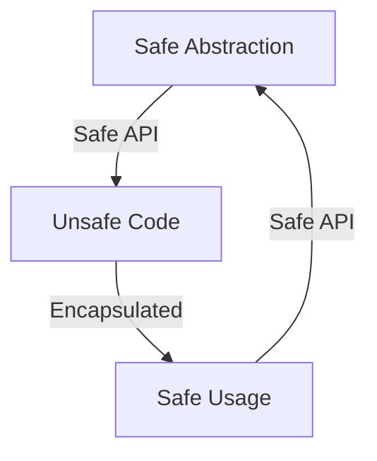

## 24.9. Understanding Unsafe Code and Its Risks

In the world of systems programming, Rust stands out for its commitment to safety and performance. One of the key features that enable Rust to achieve this is its strict ownership model, which ensures memory safety without the need for a garbage collector. However, there are scenarios where developers need to perform operations that the Rust compiler cannot guarantee as safe. This is where `unsafe` code comes into play.

### What is `unsafe` Code in Rust?

In Rust, the `unsafe` keyword allows developers to perform operations that are not checked by the compiler's safety guarantees. This includes:

- Dereferencing raw pointers.
- Calling functions or methods that are marked as `unsafe`.
- Accessing or modifying mutable static variables.
- Implementing unsafe traits.
- Accessing union fields.

While `unsafe` code can be powerful, it comes with significant risks. It bypasses Rust's safety checks, which can lead to undefined behavior if not handled correctly.

### Potential Vulnerabilities Associated with `unsafe`

Using `unsafe` code introduces several potential vulnerabilities:

1. **Memory Safety Violations**: `unsafe` code can lead to common memory safety issues such as buffer overflows, null pointer dereferencing, and use-after-free errors.

2. **Data Races**: In concurrent programming, `unsafe` code can introduce data races, which occur when two threads access the same memory location concurrently, and at least one of the accesses is a write.

3. **Undefined Behavior**: The most severe risk of `unsafe` code is undefined behavior, where the program may exhibit unpredictable behavior, including crashes or security vulnerabilities.

4. **Security Vulnerabilities**: `unsafe` code can inadvertently introduce security vulnerabilities, such as arbitrary code execution or information leakage.

### Guidelines for Minimizing and Isolating `unsafe` Code

To mitigate the risks associated with `unsafe` code, follow these guidelines:

1. **Minimize the Use of `unsafe`**: Use `unsafe` code only when absolutely necessary. Always prefer safe Rust constructs and abstractions whenever possible.

2. **Isolate `unsafe` Code**: Encapsulate `unsafe` code within small, well-defined modules or functions. This makes it easier to audit and test.

3. **Document `unsafe` Code**: Clearly document the rationale for using `unsafe` code, the invariants it relies on, and any potential risks.

4. **Use Safe Abstractions**: Whenever possible, encapsulate `unsafe` code behind safe abstractions. This allows the rest of the codebase to remain safe.

5. **Review and Audit**: Regularly review and audit `unsafe` code for potential vulnerabilities. Consider using tools like Miri to detect undefined behavior.

### Best Practices for Auditing and Testing `unsafe` Sections

1. **Code Reviews**: Conduct thorough code reviews for any `unsafe` code. Involve multiple developers to ensure a comprehensive review.

2. **Static Analysis Tools**: Use static analysis tools to identify potential issues in `unsafe` code. Tools like Clippy can help catch common mistakes.

3. **Testing**: Write extensive tests for `unsafe` code, including unit tests, integration tests, and fuzz tests. Ensure that edge cases are covered.

4. **Use Miri**: Miri is an interpreter for Rust's mid-level intermediate representation (MIR) that can detect undefined behavior in `unsafe` code.

5. **Continuous Integration**: Integrate testing and analysis tools into your continuous integration pipeline to catch issues early.

### Encapsulating `unsafe` Code Behind Safe Abstractions

Encapsulating `unsafe` code behind safe abstractions is a powerful technique to ensure that the rest of your codebase remains safe. Here are some strategies:

1. **Use Wrapper Functions**: Create safe wrapper functions around `unsafe` operations. Ensure that these functions enforce any necessary invariants.

2. **Leverage Rust's Type System**: Use Rust's type system to enforce safety guarantees. For example, use newtypes to prevent invalid states.

3. **Design for Safety**: When designing APIs that involve `unsafe` code, prioritize safety. Ensure that the API is difficult to misuse.

4. **Provide Comprehensive Documentation**: Document the safety guarantees and invariants of your abstractions. Include examples of correct usage.

### Code Example: Encapsulating `unsafe` Code

Let's look at an example of how to encapsulate `unsafe` code behind a safe abstraction.

```rust
struct SafeVec<T> {
    data: Vec<T>,
}

impl<T> SafeVec<T> {
    fn new() -> Self {
        SafeVec { data: Vec::new() }
    }

    fn push(&mut self, value: T) {
        self.data.push(value);
    }

    fn get(&self, index: usize) -> Option<&T> {
        if index < self.data.len() {
            // Safe abstraction over unsafe code
            Some(unsafe { self.data.get_unchecked(index) })
        } else {
            None
        }
    }
}

fn main() {
    let mut vec = SafeVec::new();
    vec.push(10);
    vec.push(20);

    if let Some(value) = vec.get(1) {
        println!("Value at index 1: {}", value);
    }
}
```

In this example, we encapsulate the `unsafe` operation `get_unchecked` within a safe method `get`. The method checks the index bounds before performing the `unsafe` operation, ensuring safety.

### Visualizing the Safety Boundary

To better understand the concept of encapsulating `unsafe` code, let's visualize the safety boundary using a Mermaid.js diagram.



**Diagram Description**: This diagram illustrates the relationship between safe abstractions and `unsafe` code. The `unsafe` code is encapsulated within a safe API, ensuring that the rest of the codebase interacts with it safely.

### References and Further Reading

- [Rustonomicon: The Dark Arts of Unsafe Rust](https://doc.rust-lang.org/nomicon/)
- [Miri: An interpreter for Rust's mid-level intermediate representation](https://github.com/rust-lang/miri)
- [Clippy: A collection of lints to catch common mistakes and improve your Rust code](https://github.com/rust-lang/rust-clippy)

### Knowledge Check

1. **What is the primary purpose of `unsafe` code in Rust?**
   - To perform operations that the Rust compiler cannot guarantee as safe.

2. **What are some potential vulnerabilities associated with `unsafe` code?**
   - Memory safety violations, data races, undefined behavior, and security vulnerabilities.

3. **What is a key strategy for mitigating the risks of `unsafe` code?**
   - Encapsulating `unsafe` code behind safe abstractions.

4. **What tool can be used to detect undefined behavior in `unsafe` code?**
   - Miri.

5. **Why is it important to document `unsafe` code?**
   - To provide rationale, invariants, and potential risks associated with the `unsafe` code.

### Embrace the Journey

Remember, mastering `unsafe` code is just one part of becoming a proficient Rust developer. As you continue to explore Rust's capabilities, you'll find that its safety features empower you to write robust and efficient code. Keep experimenting, stay curious, and enjoy the journey!

## Quiz Time!



### What is the primary purpose of `unsafe` code in Rust?

- [x] To perform operations that the Rust compiler cannot guarantee as safe.
- [ ] To improve the performance of Rust programs.
- [ ] To simplify the syntax of Rust code.
- [ ] To enable garbage collection in Rust.

> **Explanation:** `unsafe` code allows developers to perform operations that bypass Rust's safety checks, which the compiler cannot guarantee as safe.

### Which of the following is a potential risk of using `unsafe` code?

- [x] Memory safety violations
- [ ] Improved performance
- [ ] Enhanced readability
- [ ] Automatic memory management

> **Explanation:** `unsafe` code can lead to memory safety violations such as buffer overflows and use-after-free errors.

### How can `unsafe` code be encapsulated to ensure safety?

- [x] By using safe abstractions
- [ ] By increasing the use of raw pointers
- [ ] By avoiding documentation
- [ ] By disabling compiler warnings

> **Explanation:** Encapsulating `unsafe` code behind safe abstractions ensures that the rest of the codebase remains safe.

### What tool can be used to detect undefined behavior in `unsafe` code?

- [x] Miri
- [ ] Cargo
- [ ] Clippy
- [ ] Rustfmt

> **Explanation:** Miri is an interpreter for Rust's MIR that can detect undefined behavior in `unsafe` code.

### Why is it important to document `unsafe` code?

- [x] To provide rationale, invariants, and potential risks
- [ ] To increase the complexity of the code
- [ ] To make the code harder to understand
- [ ] To reduce the need for testing

> **Explanation:** Documenting `unsafe` code helps others understand the rationale, invariants, and potential risks associated with it.

### What is a common practice when using `unsafe` code?

- [x] Isolating it within small, well-defined modules
- [ ] Spreading it throughout the codebase
- [ ] Avoiding any form of testing
- [ ] Ignoring compiler warnings

> **Explanation:** Isolating `unsafe` code within small, well-defined modules makes it easier to audit and test.

### Which of the following is NOT a potential vulnerability of `unsafe` code?

- [ ] Memory safety violations
- [ ] Data races
- [ ] Undefined behavior
- [x] Automatic error handling

> **Explanation:** `unsafe` code does not provide automatic error handling; it can introduce vulnerabilities like memory safety violations, data races, and undefined behavior.

### What is a key benefit of using Rust's type system with `unsafe` code?

- [x] Enforcing safety guarantees
- [ ] Increasing code verbosity
- [ ] Simplifying syntax
- [ ] Disabling compiler checks

> **Explanation:** Rust's type system can be leveraged to enforce safety guarantees even when using `unsafe` code.

### What is the role of static analysis tools like Clippy in `unsafe` code?

- [x] Identifying potential issues
- [ ] Automatically fixing all errors
- [ ] Disabling compiler warnings
- [ ] Increasing code complexity

> **Explanation:** Static analysis tools like Clippy help identify potential issues in `unsafe` code.

### True or False: `unsafe` code in Rust is inherently insecure and should always be avoided.

- [ ] True
- [x] False

> **Explanation:** While `unsafe` code bypasses Rust's safety checks, it is not inherently insecure if used correctly and with proper precautions.


