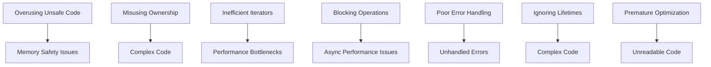

## 25.1. Recognizing Anti-Patterns in Rust

In the world of software development, anti-patterns are like the weeds in a garden. They are common solutions to recurring problems that are ineffective and counterproductive. Recognizing and avoiding these anti-patterns is crucial for writing efficient, maintainable, and error-free Rust code. In this section, we will explore the concept of anti-patterns, their impact on software development, and how Rust's unique features influence what constitutes an anti-pattern.

### What Are Anti-Patterns?

Anti-patterns are common responses to recurring problems that are ineffective and often counterproductive. They are the opposite of design patterns, which are proven solutions to common problems. Anti-patterns can lead to code that is difficult to understand, maintain, and extend. They can also introduce bugs and performance issues.

#### Impact on Software Development

Anti-patterns can have a significant impact on software development. They can lead to:

- **Increased Complexity**: Code becomes more complex and harder to understand.
- **Reduced Maintainability**: Code is difficult to modify and extend.
- **Increased Bug Risk**: Anti-patterns can introduce subtle bugs that are hard to detect.
- **Performance Issues**: Inefficient code can lead to performance bottlenecks.

### Importance of Recognizing and Refactoring Anti-Patterns

Recognizing anti-patterns is the first step towards refactoring them into more effective solutions. By identifying and addressing anti-patterns, developers can improve code quality, maintainability, and performance. This process involves:

- **Code Reviews**: Regular code reviews can help identify anti-patterns early.
- **Continuous Learning**: Staying updated with best practices and new language features can help avoid anti-patterns.
- **Proactive Refactoring**: Regularly refactoring code to improve its structure and readability.

### Prevalent Anti-Patterns in Rust

Let's explore some of the most common anti-patterns encountered in Rust projects and how to avoid them.

#### 1. Overusing `unsafe` Code

Rust is designed to provide memory safety without a garbage collector. However, it allows `unsafe` code blocks for operations that the compiler cannot guarantee to be safe. Overusing `unsafe` can lead to memory safety issues.

```rust
fn main() {
    let x: *const i32 = &10;
    unsafe {
        println!("Value: {}", *x); // Dereferencing a raw pointer
    }
}
```

**Avoidance Strategy**: Use `unsafe` only when absolutely necessary and ensure thorough testing and code reviews. Prefer safe abstractions provided by Rust whenever possible.

#### 2. Misusing Ownership and Borrowing

Rust's ownership model is one of its most powerful features, but it can be misused, leading to complex and error-prone code.

```rust
fn main() {
    let mut s = String::from("hello");
    let r1 = &s;
    let r2 = &s; // Multiple immutable borrows are fine
    println!("{}, {}", r1, r2);
    let r3 = &mut s; // Error: cannot borrow `s` as mutable because it is also borrowed as immutable
}
```

**Avoidance Strategy**: Understand and respect Rust's borrowing rules. Use references and lifetimes appropriately to avoid conflicts.

#### 3. Inefficient Use of Iterators

Iterators are a powerful feature in Rust, but they can be misused, leading to inefficient code.

```rust
fn main() {
    let v = vec![1, 2, 3, 4, 5];
    let sum: i32 = v.iter().map(|x| x * 2).sum(); // Efficient use of iterators
    println!("Sum: {}", sum);
}
```

**Avoidance Strategy**: Use iterators and iterator combinators effectively. Avoid unnecessary allocations and prefer lazy evaluation.

#### 4. Blocking Operations in Asynchronous Code

Rust's async/await model is designed for non-blocking operations. Blocking operations can lead to performance issues in asynchronous code.

```rust
use std::thread;
use std::time::Duration;

async fn async_function() {
    thread::sleep(Duration::from_secs(2)); // Blocking operation
    println!("Async function completed");
}
```

**Avoidance Strategy**: Use non-blocking alternatives like `tokio::time::sleep` for asynchronous code.

#### 5. Poor Error Handling Practices

Rust encourages explicit error handling using `Result` and `Option`. Poor error handling can lead to unhandled errors and panics.

```rust
fn divide(a: i32, b: i32) -> Result<i32, String> {
    if b == 0 {
        Err(String::from("Division by zero"))
    } else {
        Ok(a / b)
    }
}

fn main() {
    match divide(10, 0) {
        Ok(result) => println!("Result: {}", result),
        Err(e) => println!("Error: {}", e),
    }
}
```

**Avoidance Strategy**: Use `Result` and `Option` for error handling. Avoid using `unwrap` and `expect` unless you are certain the value is not `None` or `Err`.

#### 6. Ignoring Lifetime Annotations

Lifetimes are a key feature of Rust's borrowing system. Ignoring them can lead to complex and error-prone code.

```rust
fn longest<'a>(x: &'a str, y: &'a str) -> &'a str {
    if x.len() > y.len() {
        x
    } else {
        y
    }
}
```

**Avoidance Strategy**: Understand and use lifetimes to ensure references are valid for the required duration.

#### 7. Premature Optimization

Optimizing code before understanding the performance bottlenecks can lead to complex and unreadable code.

**Avoidance Strategy**: Focus on writing clear and maintainable code first. Use profiling tools to identify performance bottlenecks before optimizing.

#### 8. Code Smells in Rust

Code smells are indicators of potential issues in the code. Recognizing them can help identify anti-patterns.

**Avoidance Strategy**: Regularly review code for common code smells and refactor to improve code quality.

### Rust's Unique Features and Anti-Patterns

Rust's unique features, such as ownership, borrowing, and lifetimes, influence what constitutes an anti-pattern. Understanding these features is crucial for recognizing and avoiding anti-patterns.

#### Ownership and Borrowing

Rust's ownership model is designed to provide memory safety without a garbage collector. Misusing ownership and borrowing can lead to complex and error-prone code.

#### Lifetimes

Lifetimes are a key feature of Rust's borrowing system. Ignoring them can lead to complex and error-prone code.

#### Pattern Matching

Rust's pattern matching is a powerful feature, but it can be misused, leading to complex and error-prone code.

### Encouraging Proactive Code Reviews and Continuous Learning

Proactive code reviews and continuous learning are essential for identifying and correcting anti-patterns. By regularly reviewing code and staying updated with best practices, developers can improve code quality and avoid common pitfalls.

#### Code Reviews

Regular code reviews can help identify anti-patterns early and ensure code quality.

#### Continuous Learning

Staying updated with best practices and new language features can help avoid anti-patterns.

### Visualizing Anti-Patterns

Let's visualize some of the common anti-patterns in Rust using Mermaid.js diagrams.



**Figure 1**: Common Anti-Patterns in Rust and Their Consequences

### Conclusion

Recognizing and avoiding anti-patterns is crucial for writing efficient, maintainable, and error-free Rust code. By understanding Rust's unique features and idioms, developers can identify and refactor anti-patterns, improving code quality and performance. Remember, this is just the beginning. As you progress, you'll build more complex and efficient Rust applications. Keep experimenting, stay curious, and enjoy the journey!

## Quiz Time!



### What is an anti-pattern?

- [x] A common response to a recurring problem that is ineffective and counterproductive
- [ ] A proven solution to a common problem
- [ ] A design pattern that is used in Rust
- [ ] A type of error in Rust

> **Explanation:** An anti-pattern is a common response to a recurring problem that is ineffective and counterproductive.

### Why is it important to recognize anti-patterns in Rust?

- [x] To improve code quality, maintainability, and performance
- [ ] To increase code complexity
- [ ] To introduce more bugs
- [ ] To make code harder to understand

> **Explanation:** Recognizing anti-patterns helps improve code quality, maintainability, and performance.

### What is a common consequence of overusing `unsafe` code in Rust?

- [x] Memory safety issues
- [ ] Improved performance
- [ ] Easier code maintenance
- [ ] Better readability

> **Explanation:** Overusing `unsafe` code can lead to memory safety issues.

### How can you avoid misusing ownership and borrowing in Rust?

- [x] Understand and respect Rust's borrowing rules
- [ ] Use `unsafe` code
- [ ] Ignore lifetime annotations
- [ ] Use `unwrap` and `expect` frequently

> **Explanation:** Understanding and respecting Rust's borrowing rules helps avoid misuse.

### What is a common anti-pattern in asynchronous Rust code?

- [x] Blocking operations
- [ ] Using `async`/`await`
- [ ] Using non-blocking operations
- [ ] Using `tokio::time::sleep`

> **Explanation:** Blocking operations are a common anti-pattern in asynchronous Rust code.

### How can you handle errors effectively in Rust?

- [x] Use `Result` and `Option` for error handling
- [ ] Use `unwrap` and `expect` frequently
- [ ] Ignore errors
- [ ] Use `unsafe` code

> **Explanation:** Using `Result` and `Option` for error handling is effective in Rust.

### What is the impact of premature optimization in Rust code?

- [x] Complex and unreadable code
- [ ] Improved performance
- [ ] Easier code maintenance
- [ ] Better readability

> **Explanation:** Premature optimization can lead to complex and unreadable code.

### What is a code smell?

- [x] An indicator of potential issues in the code
- [ ] A type of error in Rust
- [ ] A design pattern in Rust
- [ ] A feature of Rust

> **Explanation:** A code smell is an indicator of potential issues in the code.

### How can you avoid inefficient use of iterators in Rust?

- [x] Use iterators and iterator combinators effectively
- [ ] Avoid using iterators
- [ ] Use `unsafe` code
- [ ] Ignore performance bottlenecks

> **Explanation:** Using iterators and iterator combinators effectively helps avoid inefficiencies.

### True or False: Lifetimes are not important in Rust.

- [ ] True
- [x] False

> **Explanation:** Lifetimes are a key feature of Rust's borrowing system and are important for ensuring references are valid.




