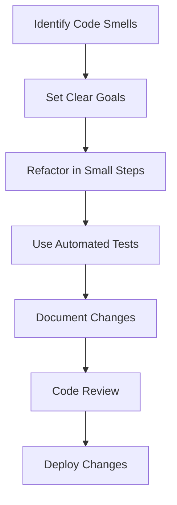

## 25.10. Strategies to Refactor and Avoid Pitfalls

Refactoring is a crucial aspect of software development that involves restructuring existing code without changing its external behavior. In Rust, refactoring is essential for maintaining code quality, enhancing readability, and preventing common pitfalls. This section delves into the importance of refactoring, strategies for effective refactoring, tools and techniques, and best practices to avoid pitfalls in Rust programming.

### The Importance of Refactoring

Refactoring should be a regular part of the development process. It helps in:

- **Improving Code Readability**: Clean code is easier to read and understand, which is vital for collaboration and maintenance.
- **Enhancing Maintainability**: Well-structured code is easier to modify and extend.
- **Reducing Complexity**: Simplifying complex code structures can prevent bugs and make the codebase more robust.
- **Facilitating Debugging**: Cleaner code makes it easier to identify and fix issues.
- **Optimizing Performance**: Refactoring can lead to more efficient code execution.

### Strategies for Incremental Refactoring

Refactoring should be done incrementally to minimize the risk of introducing bugs. Here are some strategies:

1. **Identify Code Smells**: Look for signs of poor design or implementation, such as duplicated code, long methods, and large classes.

2. **Set Clear Goals**: Define what you want to achieve with refactoring, such as improving performance or reducing complexity.

3. **Refactor in Small Steps**: Make small, incremental changes and test frequently to ensure that the code still works as expected.

4. **Use Automated Tests**: Ensure that you have a comprehensive suite of tests to verify that refactoring does not break existing functionality.

5. **Prioritize High-Impact Areas**: Focus on parts of the code that are most frequently modified or are critical to the application's functionality.

6. **Document Changes**: Keep track of what changes were made and why, to help future developers understand the codebase.

### Tools and Techniques for Refactoring

Several tools and techniques can aid in the refactoring process:

- **Rust Analyzer**: A language server that provides IDE features for Rust, including code navigation, refactoring, and more.
  
- **Clippy**: A Rust linter that provides suggestions for improving code quality and catching common mistakes.

- **Rustfmt**: An automatic code formatter that ensures consistent code style across the codebase.

- **Code Reviews**: Encourage peer reviews to catch potential issues and get feedback on refactoring efforts.

- **Version Control Systems**: Use Git or other version control systems to manage changes and revert if necessary.

### Prioritizing Refactoring Efforts

Not all code needs to be refactored immediately. Prioritize refactoring efforts based on:

- **Frequency of Change**: Code that changes often is more likely to benefit from refactoring.
- **Complexity**: More complex code is harder to maintain and should be simplified.
- **Performance Bottlenecks**: Identify and optimize areas that impact application performance.
- **Critical Functionality**: Focus on parts of the code that are essential to the application's core functionality.

### Best Practices and Continuous Learning

To prevent future pitfalls, adopt best practices and commit to continuous learning:

- **Follow Rust's Idioms**: Embrace Rust's ownership model, error handling, and concurrency features to write idiomatic code.
- **Stay Updated**: Keep up with the latest Rust developments and community best practices.
- **Participate in Code Reviews**: Regularly review code with peers to share knowledge and catch potential issues early.
- **Invest in Learning**: Attend workshops, read books, and engage with the Rust community to improve your skills.

### Code Example: Refactoring a Rust Function

Let's look at a simple example of refactoring a Rust function to improve readability and maintainability.

```rust
// Original function: calculates the factorial of a number
fn factorial(n: u32) -> u32 {
    if n == 0 {
        1
    } else {
        n * factorial(n - 1)
    }
}

// Refactored function: uses an iterative approach for better performance
fn factorial(n: u32) -> u32 {
    (1..=n).product()
}

fn main() {
    println!("Factorial of 5 is: {}", factorial(5));
}
```

In this example, the original recursive function was refactored to an iterative approach using Rust's range and `product` method, which is more efficient and easier to understand.

### Visualizing the Refactoring Process

Below is a flowchart illustrating the refactoring process:



**Figure 1**: The refactoring process involves identifying code smells, setting goals, making incremental changes, testing, documenting, reviewing, and deploying.

### Try It Yourself

Experiment with the refactoring example above by:

- Modifying the function to handle edge cases, such as negative numbers.
- Adding error handling to improve robustness.
- Implementing a test suite to verify the function's correctness.

### References and Further Reading

- [Rust Book](https://doc.rust-lang.org/book/)
- [Rust by Example](https://doc.rust-lang.org/rust-by-example/)
- [Clippy Documentation](https://rust-lang.github.io/rust-clippy/)

### Knowledge Check

- What are the benefits of refactoring code?
- How can you ensure that refactoring does not introduce new bugs?
- What tools can assist in the refactoring process in Rust?

### Embrace the Journey

Remember, refactoring is an ongoing process that requires diligence and patience. As you continue to refactor and improve your code, you'll gain a deeper understanding of Rust and become a more proficient developer. Keep experimenting, stay curious, and enjoy the journey!

## Quiz Time!



### What is the primary goal of refactoring?

- [x] To improve code readability and maintainability
- [ ] To add new features to the code
- [ ] To increase the code's complexity
- [ ] To remove all comments from the code

> **Explanation:** Refactoring aims to improve code readability and maintainability without changing its external behavior.

### Which tool is used for linting Rust code?

- [x] Clippy
- [ ] Rustfmt
- [ ] Cargo
- [ ] Git

> **Explanation:** Clippy is a Rust linter that provides suggestions for improving code quality.

### What is a code smell?

- [x] An indication of potential issues in the code
- [ ] A type of error in the code
- [ ] A feature of the Rust language
- [ ] A tool for refactoring

> **Explanation:** A code smell is a sign of potential issues in the code that may require refactoring.

### How should refactoring be approached?

- [x] Incrementally, with frequent testing
- [ ] All at once, without testing
- [ ] Only when new features are added
- [ ] Only when the code is complete

> **Explanation:** Refactoring should be done incrementally with frequent testing to minimize the risk of introducing bugs.

### Which of the following is a benefit of using automated tests during refactoring?

- [x] Ensures that refactoring does not break existing functionality
- [ ] Increases the complexity of the code
- [ ] Makes the code harder to read
- [ ] Eliminates the need for code reviews

> **Explanation:** Automated tests help ensure that refactoring does not break existing functionality.

### What is the role of code reviews in refactoring?

- [x] To catch potential issues and provide feedback
- [ ] To increase the complexity of the code
- [ ] To remove all comments from the code
- [ ] To add new features to the code

> **Explanation:** Code reviews help catch potential issues and provide feedback on refactoring efforts.

### Which tool is used for formatting Rust code?

- [x] Rustfmt
- [ ] Clippy
- [ ] Cargo
- [ ] Git

> **Explanation:** Rustfmt is used for formatting Rust code to ensure consistent style.

### What should be prioritized during refactoring?

- [x] High-impact areas of the code
- [ ] Areas of the code that are rarely used
- [ ] Areas of the code that are already well-optimized
- [ ] Areas of the code that are not critical to the application's functionality

> **Explanation:** High-impact areas of the code should be prioritized during refactoring.

### What is the benefit of documenting changes during refactoring?

- [x] Helps future developers understand the codebase
- [ ] Increases the complexity of the code
- [ ] Makes the code harder to read
- [ ] Eliminates the need for code reviews

> **Explanation:** Documenting changes helps future developers understand the codebase.

### True or False: Refactoring should only be done when new features are added.

- [ ] True
- [x] False

> **Explanation:** Refactoring should be a regular part of the development process, not just when new features are added.




