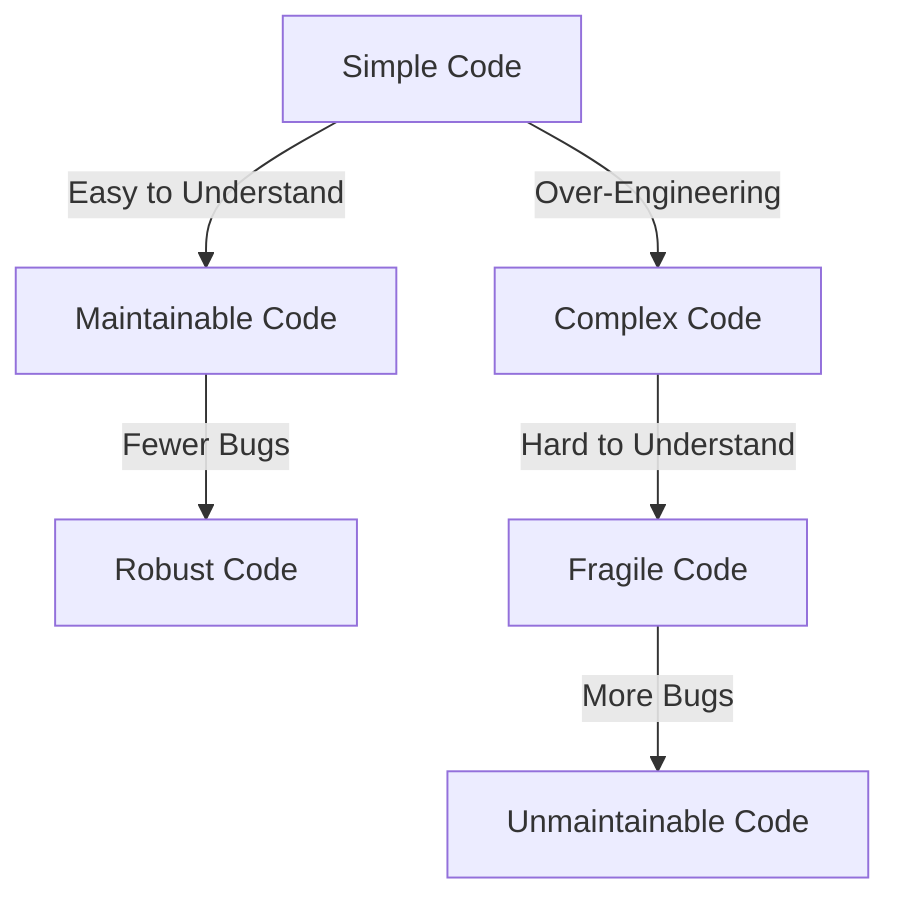

## 25.11. Overcomplicating with Unnecessary Abstractions

In the world of software development, abstraction is a powerful tool that allows us to manage complexity by hiding the intricate details of a system. However, when used excessively or inappropriately, abstractions can lead to over-engineering, making codebases difficult to understand and maintain. In this section, we'll explore the pitfalls of unnecessary abstractions in Rust, provide examples of over-engineering, and offer guidelines for achieving a balance between abstraction and simplicity.

### The Perils of Over-Engineering

Over-engineering occurs when developers introduce more complexity into a system than necessary. This often manifests as excessive layers of abstraction, which can obscure the core functionality of the code and make it harder to maintain. In Rust, this can take the form of too many traits, unnecessary indirection, or overly complex module hierarchies.

#### Example: Excessive Trait Usage

Traits in Rust are a powerful feature that allows for polymorphism and code reuse. However, creating too many traits can lead to a fragmented codebase that's difficult to navigate. Consider the following example:

```rust
trait Drawable {
    fn draw(&self);
}

trait Resizable {
    fn resize(&mut self, width: u32, height: u32);
}

trait Movable {
    fn move_to(&mut self, x: i32, y: i32);
}

struct Circle {
    radius: u32,
    x: i32,
    y: i32,
}

impl Drawable for Circle {
    fn draw(&self) {
        println!("Drawing a circle at ({}, {}) with radius {}", self.x, self.y, self.radius);
    }
}

impl Resizable for Circle {
    fn resize(&mut self, width: u32, height: u32) {
        self.radius = width.min(height) / 2;
    }
}

impl Movable for Circle {
    fn move_to(&mut self, x: i32, y: i32) {
        self.x = x;
        self.y = y;
    }
}
```

In this example, we have three separate traits for operations that could be combined into a single trait. This separation might seem like a good idea for flexibility, but it adds unnecessary complexity without providing significant benefits.

#### Example: Unnecessary Indirection

Indirection can be useful for decoupling components, but too much indirection can make code difficult to follow. Consider the following example:

```rust
struct Data {
    value: i32,
}

struct Processor {
    data: Box<Data>,
}

impl Processor {
    fn process(&self) {
        println!("Processing data: {}", self.data.value);
    }
}

fn main() {
    let data = Box::new(Data { value: 42 });
    let processor = Processor { data };
    processor.process();
}
```

Here, the use of `Box` introduces an unnecessary level of indirection. The `Processor` struct could simply own the `Data` directly, which would simplify the code.

### The Value of Simplicity

Simplicity in code design is not about writing less code; it's about writing code that is easy to understand, maintain, and modify. Simple code is often more robust and less prone to bugs. In Rust, simplicity can be achieved by leveraging the language's features, such as ownership and pattern matching, to write clear and concise code.

#### Guidelines for Appropriate Abstraction

1. **Understand the Problem Domain**: Before introducing abstractions, ensure you have a deep understanding of the problem you're solving. This will help you identify the right level of abstraction.

2. **Favor Composition Over Inheritance**: In Rust, composition is often more flexible and easier to manage than inheritance. Use traits to define behavior and compose them as needed.

3. **Keep It Simple**: Start with the simplest solution that works. Only introduce abstractions when they provide clear benefits, such as reducing code duplication or improving readability.

4. **Refactor When Necessary**: As your codebase evolves, revisit your abstractions. Refactor them if they become cumbersome or if the requirements change.

5. **Balance Flexibility and Complexity**: Strive to find a balance between flexibility and complexity. Too much flexibility can lead to over-engineering, while too little can make your code rigid and hard to extend.

### Rust's Unique Features for Simplicity

Rust's ownership model, pattern matching, and powerful type system provide unique opportunities to write simple and expressive code. By leveraging these features, you can often avoid unnecessary abstractions and keep your codebase clean and maintainable.

#### Example: Using Pattern Matching

Pattern matching in Rust allows you to handle complex data structures in a concise and readable way. Consider the following example:

```rust
enum Shape {
    Circle { radius: u32 },
    Rectangle { width: u32, height: u32 },
}

fn area(shape: &Shape) -> u32 {
    match shape {
        Shape::Circle { radius } => 3 * radius * radius,
        Shape::Rectangle { width, height } => width * height,
    }
}

fn main() {
    let circle = Shape::Circle { radius: 10 };
    let rectangle = Shape::Rectangle { width: 5, height: 10 };

    println!("Circle area: {}", area(&circle));
    println!("Rectangle area: {}", area(&rectangle));
}
```

In this example, pattern matching allows us to handle different shapes in a straightforward manner, without introducing unnecessary abstractions.

### Visualizing Abstraction Complexity

To better understand how unnecessary abstractions can complicate a codebase, let's visualize the relationship between simplicity and complexity using a diagram.



In this diagram, we see that simple code leads to maintainable and robust code, while over-engineering results in complex, fragile, and unmaintainable code.

### Knowledge Check

To reinforce your understanding of unnecessary abstractions, consider the following questions:

- What are the potential downsides of introducing too many traits in a Rust codebase?
- How can pattern matching help simplify code in Rust?
- Why is it important to balance flexibility and complexity in software design?

### Try It Yourself

Experiment with the code examples provided in this section. Try simplifying the `Circle` struct by combining the traits into a single trait. Consider removing the `Box` indirection in the `Processor` example and observe how it affects the code.

### Conclusion

In Rust, as in any programming language, it's important to strike a balance between abstraction and simplicity. By understanding the problem domain, leveraging Rust's unique features, and following best practices, you can avoid overcomplicating your code with unnecessary abstractions. Remember, simplicity is key to writing maintainable and robust software.

## Quiz Time!



### What is a potential downside of introducing too many traits in a Rust codebase?

- [x] It can lead to a fragmented codebase that's difficult to navigate.
- [ ] It makes the codebase more flexible and easier to maintain.
- [ ] It simplifies the code by reducing duplication.
- [ ] It improves performance by optimizing trait usage.

> **Explanation:** Introducing too many traits can fragment the codebase, making it difficult to navigate and understand.

### How can pattern matching help simplify code in Rust?

- [x] By allowing concise handling of complex data structures.
- [ ] By introducing additional layers of abstraction.
- [ ] By requiring more boilerplate code.
- [ ] By making the code less readable.

> **Explanation:** Pattern matching allows for concise and readable handling of complex data structures, simplifying the code.

### Why is it important to balance flexibility and complexity in software design?

- [x] To avoid over-engineering and maintain code simplicity.
- [ ] To ensure the code is as flexible as possible.
- [ ] To make the codebase more complex and feature-rich.
- [ ] To reduce the need for refactoring.

> **Explanation:** Balancing flexibility and complexity helps avoid over-engineering, maintaining code simplicity and readability.

### What is a benefit of starting with the simplest solution that works?

- [x] It allows for easier maintenance and understanding of the code.
- [ ] It ensures the code is highly flexible from the start.
- [ ] It requires more time and effort to implement.
- [ ] It leads to a more complex codebase.

> **Explanation:** Starting with the simplest solution makes the code easier to maintain and understand, reducing complexity.

### What is a key feature of Rust that helps avoid unnecessary abstractions?

- [x] Ownership model and pattern matching.
- [ ] Extensive use of inheritance.
- [ ] Dynamic typing.
- [ ] Lack of a type system.

> **Explanation:** Rust's ownership model and pattern matching help write simple and expressive code, avoiding unnecessary abstractions.

### What is the main goal of simplicity in code design?

- [x] To write code that is easy to understand, maintain, and modify.
- [ ] To write the least amount of code possible.
- [ ] To introduce as many abstractions as possible.
- [ ] To make the codebase highly flexible and complex.

> **Explanation:** Simplicity in code design aims to create code that is easy to understand, maintain, and modify.

### What should you do as your codebase evolves?

- [x] Revisit and refactor abstractions if they become cumbersome.
- [ ] Avoid making any changes to existing abstractions.
- [ ] Introduce more layers of abstraction to future-proof the code.
- [ ] Remove all abstractions to simplify the code.

> **Explanation:** As the codebase evolves, revisiting and refactoring abstractions helps maintain simplicity and clarity.

### What is an example of unnecessary indirection in Rust?

- [x] Using `Box` when direct ownership would suffice.
- [ ] Using pattern matching for complex data structures.
- [ ] Using traits to define behavior.
- [ ] Using enums for variant types.

> **Explanation:** Using `Box` for indirection when direct ownership would suffice is an example of unnecessary indirection.

### What is the relationship between simple code and maintainable code?

- [x] Simple code leads to maintainable and robust code.
- [ ] Simple code leads to complex and fragile code.
- [ ] Simple code makes the codebase more difficult to understand.
- [ ] Simple code increases the likelihood of bugs.

> **Explanation:** Simple code is easier to maintain and is often more robust, reducing the likelihood of bugs.

### True or False: Over-engineering always improves code flexibility.

- [ ] True
- [x] False

> **Explanation:** Over-engineering can lead to excessive complexity, making the code harder to understand and maintain, rather than improving flexibility.



Remember, this is just the beginning. As you progress, you'll build more complex and interactive Rust applications. Keep experimenting, stay curious, and enjoy the journey!
