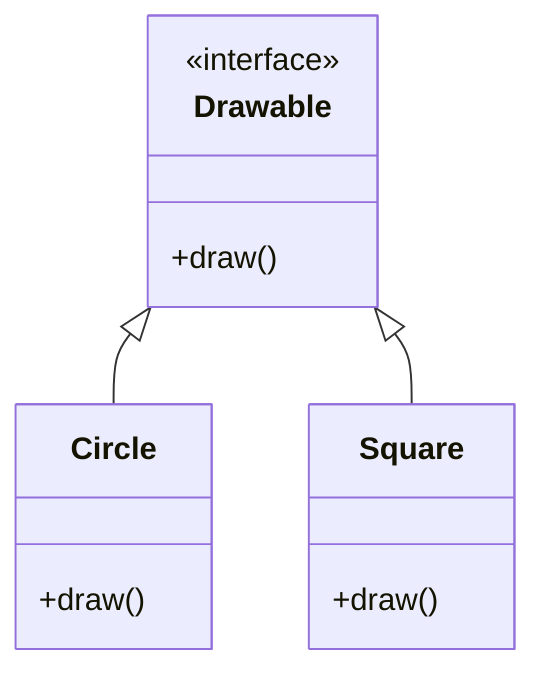

## 25.12. Misusing Traits and Generics

In Rust, traits and generics are powerful tools that enable developers to write flexible, reusable, and type-safe code. However, with great power comes the potential for misuse. In this section, we will explore common pitfalls associated with traits and generics, their consequences, and best practices to avoid these issues.

### Understanding Traits and Generics in Rust

Before diving into the pitfalls, let's reiterate the purpose of traits and generics in Rust:

- **Traits**: Traits in Rust are a way to define shared behavior. They allow you to define a set of methods that can be implemented by different types. Traits are similar to interfaces in other languages but are more powerful due to Rust's type system and the ability to use them as trait objects.

- **Generics**: Generics allow you to write code that can operate on different data types while maintaining type safety. They enable you to define functions, structs, enums, and traits that can work with any data type.

### Common Misuse Patterns

#### 1. Overly Complex Trait Bounds

One common mistake is using overly complex trait bounds, which can make code difficult to read and maintain. Trait bounds specify the capabilities a type must have to be used in a particular context. Overcomplicating these bounds can lead to confusing and verbose code.

**Example of Overly Complex Trait Bounds:**

```rust
// Overly complex trait bounds
fn process_items<T, U>(items: Vec<T>, processor: U)
where
    T: Display + Clone + PartialEq + Debug + Default,
    U: Fn(T) -> T,
{
    for item in items {
        println!("{:?}", item);
        let processed_item = processor(item.clone());
        println!("{:?}", processed_item);
    }
}
```

**Consequences:**

- **Readability**: The function signature becomes cluttered, making it hard to understand the function's purpose.
- **Maintainability**: Changes to the function's logic might require updating multiple trait bounds, increasing the risk of errors.

**Best Practice:**

- Simplify trait bounds by only including necessary traits. Consider breaking down complex functions into smaller, more manageable pieces.

#### 2. Unnecessary Generic Parameters

Another common pitfall is using unnecessary generic parameters, which can add complexity without providing any real benefit.

**Example of Unnecessary Generic Parameters:**

```rust
// Unnecessary generic parameter
fn print_value<T>(value: T)
where
    T: Display,
{
    println!("{}", value);
}
```

In this example, the generic parameter `T` is unnecessary because the function only requires the `Display` trait. A simpler approach would be:

```rust
// Simplified version
fn print_value(value: impl Display) {
    println!("{}", value);
}
```

**Consequences:**

- **Complexity**: Unnecessary generics can make the code more complex than it needs to be.
- **Compilation Time**: More generic parameters can lead to longer compilation times.

**Best Practice:**

- Use generics only when they provide a clear benefit, such as enabling code reuse across multiple types.

### Designing Clean and Effective Trait Interfaces

When designing trait interfaces, it's essential to focus on clarity and usability. Here are some best practices to consider:

#### 1. Define Clear and Concise Traits

Traits should have a clear purpose and define only the methods necessary for that purpose. Avoid adding unrelated methods to a single trait.

**Example of a Clear Trait:**

```rust
trait Drawable {
    fn draw(&self);
}
```

This trait has a single responsibility: to define a `draw` method for drawable objects.

#### 2. Use Default Implementations Wisely

Rust allows you to provide default implementations for trait methods. This can be useful for reducing code duplication, but it should be used judiciously.

**Example of Default Implementation:**

```rust
trait Greet {
    fn greet(&self) {
        println!("Hello!");
    }
}

struct Person;

impl Greet for Person {}
```

In this example, `Person` automatically gains the `greet` method without needing to implement it explicitly.

**Best Practice:**

- Use default implementations to provide common behavior, but ensure that they don't obscure the trait's purpose or make it difficult to override behavior when necessary.

#### 3. Avoid Trait Overuse

While traits are powerful, overusing them can lead to complex and hard-to-maintain code. Consider whether a trait is necessary or if a simpler solution would suffice.

**Example of Trait Overuse:**

```rust
trait Addable {
    fn add(&self, other: &Self) -> Self;
}

impl Addable for i32 {
    fn add(&self, other: &Self) -> Self {
        self + other
    }
}
```

In this case, the `Add` trait from the standard library could be used instead of defining a custom `Addable` trait.

**Best Practice:**

- Leverage existing traits from the standard library whenever possible to avoid reinventing the wheel.

### Leveraging Generics Without Introducing Complexity

Generics are a powerful feature, but they can introduce complexity if not used carefully. Here are some tips for using generics effectively:

#### 1. Limit the Scope of Generics

Use generics only when they provide a clear benefit, such as enabling code reuse or improving type safety.

**Example of Limited Scope Generics:**

```rust
fn sum<T: Add<Output = T> + Copy>(a: T, b: T) -> T {
    a + b
}
```

This function uses generics to work with any type that implements the `Add` trait, but it limits the scope to types that can be added together.

#### 2. Prefer `impl Trait` for Simplicity

In many cases, using `impl Trait` can simplify function signatures and improve readability.

**Example of `impl Trait`:**

```rust
fn print_all(items: impl Iterator<Item = impl Display>) {
    for item in items {
        println!("{}", item);
    }
}
```

This approach avoids the need for explicit generic parameters, making the function signature cleaner.

#### 3. Avoid Deeply Nested Generics

Deeply nested generics can make code difficult to read and understand. Strive for simplicity and clarity.

**Example of Nested Generics:**

```rust
struct Container<T>(Vec<T>);

fn process_container<T, U>(container: Container<T>, processor: U)
where
    U: Fn(T) -> T,
{
    // Processing logic
}
```

**Best Practice:**

- Flatten nested generics where possible, and consider using type aliases to improve readability.

### Visualizing Traits and Generics

To better understand the relationships between traits and generics, let's visualize a simple example using a class diagram.



**Diagram Description:**

This diagram illustrates a simple trait `Drawable` with two implementing types: `Circle` and `Square`. Both types provide their own implementation of the `draw` method.

### Knowledge Check

Let's reinforce what we've learned with a few questions:

1. What is the purpose of traits in Rust?
2. Why should you avoid overly complex trait bounds?
3. How can unnecessary generic parameters affect your code?
4. What is a best practice for designing trait interfaces?
5. How can `impl Trait` simplify function signatures?

### Embrace the Journey

Remember, mastering traits and generics in Rust is a journey. As you continue to explore and experiment, you'll gain a deeper understanding of how to use these features effectively. Keep practicing, stay curious, and enjoy the process!

### References and Further Reading

- [Rust Book: Traits](https://doc.rust-lang.org/book/ch10-02-traits.html)
- [Rust Book: Generics](https://doc.rust-lang.org/book/ch10-01-syntax.html)
- [Rust Reference: Traits](https://doc.rust-lang.org/reference/items/traits.html)
- [Rust Reference: Generics](https://doc.rust-lang.org/reference/items/generics.html)

## Quiz Time!



### What is the primary purpose of traits in Rust?

- [x] To define shared behavior across different types
- [ ] To enforce memory safety
- [ ] To manage concurrency
- [ ] To handle errors

> **Explanation:** Traits in Rust are used to define shared behavior, allowing different types to implement the same set of methods.

### Why should overly complex trait bounds be avoided?

- [x] They make code difficult to read and maintain
- [ ] They improve performance
- [ ] They simplify code
- [ ] They are necessary for all functions

> **Explanation:** Overly complex trait bounds can clutter function signatures, making code hard to read and maintain.

### What is a consequence of using unnecessary generic parameters?

- [x] Increased complexity and longer compilation times
- [ ] Improved readability
- [ ] Enhanced performance
- [ ] Simplified code

> **Explanation:** Unnecessary generic parameters add complexity without providing benefits, potentially increasing compilation times.

### What is a best practice for designing trait interfaces?

- [x] Define clear and concise traits with a single responsibility
- [ ] Include as many methods as possible
- [ ] Avoid using default implementations
- [ ] Use traits only for complex types

> **Explanation:** Traits should have a clear purpose and define only the necessary methods to maintain clarity and usability.

### How can `impl Trait` simplify function signatures?

- [x] By avoiding explicit generic parameters
- [ ] By adding more trait bounds
- [ ] By increasing complexity
- [ ] By requiring more code

> **Explanation:** `impl Trait` allows for cleaner function signatures by avoiding the need for explicit generic parameters.

### What is a potential issue with deeply nested generics?

- [x] They make code difficult to read and understand
- [ ] They improve performance
- [ ] They simplify code
- [ ] They are necessary for all functions

> **Explanation:** Deeply nested generics can make code hard to read and understand, so it's best to strive for simplicity.

### When should you use generics in Rust?

- [x] When they provide a clear benefit, such as code reuse or type safety
- [ ] Always, regardless of the situation
- [ ] Only for primitive types
- [ ] Never, as they add complexity

> **Explanation:** Generics should be used when they offer clear advantages, like enabling code reuse or improving type safety.

### What is a benefit of using default implementations in traits?

- [x] They reduce code duplication
- [ ] They make traits harder to understand
- [ ] They increase code complexity
- [ ] They are mandatory for all traits

> **Explanation:** Default implementations can reduce code duplication by providing common behavior across types.

### What is a common misuse of traits?

- [x] Defining custom traits when standard library traits suffice
- [ ] Using traits for shared behavior
- [ ] Implementing traits for multiple types
- [ ] Using traits with generics

> **Explanation:** It's common to misuse traits by defining custom ones when existing standard library traits could be used instead.

### True or False: Traits in Rust are similar to interfaces in other languages.

- [x] True
- [ ] False

> **Explanation:** Traits in Rust are similar to interfaces in other languages, as they define a set of methods that types can implement.


