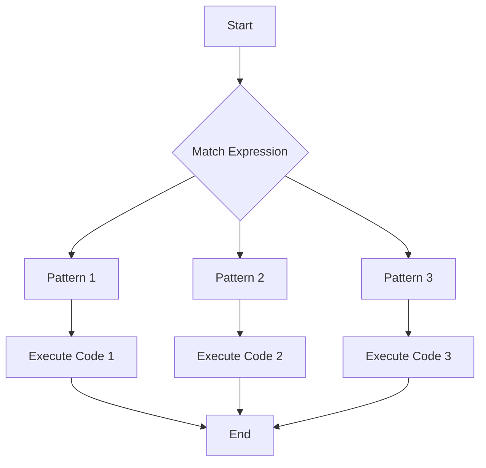

## 25.13. Common Mistakes with Pattern Matching

Pattern matching is a powerful feature in Rust that allows developers to destructure data types and control the flow of their programs with precision. However, like any powerful tool, it comes with its own set of pitfalls. In this section, we will explore common mistakes developers make when using pattern matching in Rust, and how to avoid them.

### Understanding Pattern Matching in Rust

Pattern matching in Rust is primarily done using the `match` expression, which allows you to compare a value against a series of patterns and execute code based on which pattern matches. This feature is not only syntactically elegant but also ensures that all possible cases are considered, making your code more robust and less error-prone.

#### Advantages of Pattern Matching

- **Exhaustiveness**: The Rust compiler checks that all possible cases are handled, reducing the risk of runtime errors.
- **Clarity**: Pattern matching provides a clear and concise way to handle different cases, improving code readability.
- **Destructuring**: It allows you to destructure complex data types, extracting values directly in the match arms.

### Common Mistakes in Pattern Matching

Despite its advantages, pattern matching can lead to errors if not used correctly. Let's explore some common mistakes and how to avoid them.

#### 1. Incomplete Matches

One of the most common mistakes is failing to cover all possible patterns, leading to runtime panics. Rust requires that match expressions be exhaustive, meaning every possible value must be accounted for.

**Example of Incomplete Match:**

```rust
enum Direction {
    North,
    South,
    East,
    West,
}

fn describe_direction(direction: Direction) {
    match direction {
        Direction::North => println!("Heading North"),
        Direction::South => println!("Heading South"),
        // Missing East and West cases
    }
}
```

**Solution:**

To avoid incomplete matches, ensure that all enum variants are covered. You can also use a wildcard pattern (`_`) to catch any remaining cases.

```rust
fn describe_direction(direction: Direction) {
    match direction {
        Direction::North => println!("Heading North"),
        Direction::South => println!("Heading South"),
        Direction::East => println!("Heading East"),
        Direction::West => println!("Heading West"),
    }
}
```

#### 2. Overly Broad Matches

Using overly broad patterns can lead to unintended behavior, as they may match more cases than intended.

**Example of Overly Broad Match:**

```rust
fn process_number(number: i32) {
    match number {
        1..=10 => println!("Number is between 1 and 10"),
        _ => println!("Number is something else"),
    }
}
```

In this example, the second arm matches any number not between 1 and 10, which might not be the desired behavior if specific numbers need special handling.

**Solution:**

Be specific with your patterns to ensure only the intended cases are matched.

```rust
fn process_number(number: i32) {
    match number {
        1..=10 => println!("Number is between 1 and 10"),
        11..=20 => println!("Number is between 11 and 20"),
        _ => println!("Number is something else"),
    }
}
```

#### 3. Ignoring Compiler Warnings

Rust's compiler is excellent at catching potential issues in pattern matching. Ignoring these warnings can lead to bugs.

**Example of Ignoring Warnings:**

```rust
fn check_value(value: Option<i32>) {
    match value {
        Some(_) => println!("Value is present"),
        // Compiler warning: non-exhaustive patterns
    }
}
```

**Solution:**

Always heed compiler warnings and ensure all possible patterns are covered.

```rust
fn check_value(value: Option<i32>) {
    match value {
        Some(_) => println!("Value is present"),
        None => println!("Value is absent"),
    }
}
```

#### 4. Misusing Pattern Guards

Pattern guards can add additional conditions to patterns, but misusing them can lead to logic errors.

**Example of Misusing Pattern Guards:**

```rust
fn check_number(number: i32) {
    match number {
        n if n > 0 => println!("Positive number"),
        n if n < 0 => println!("Negative number"),
        _ => println!("Zero"),
    }
}
```

In this example, the pattern guard `n if n > 0` will match any positive number, but the `_` pattern will match zero and any other number not explicitly handled.

**Solution:**

Ensure pattern guards are used correctly and that all cases are covered.

```rust
fn check_number(number: i32) {
    match number {
        n if n > 0 => println!("Positive number"),
        n if n < 0 => println!("Negative number"),
        0 => println!("Zero"),
    }
}
```

#### 5. Overlapping Patterns

Overlapping patterns can cause some patterns to never be matched, leading to unexpected behavior.

**Example of Overlapping Patterns:**

```rust
fn categorize_number(number: i32) {
    match number {
        0..=10 => println!("Low"),
        5..=15 => println!("Medium"),
        _ => println!("High"),
    }
}
```

In this example, numbers between 5 and 10 will always match the first pattern, making the second pattern redundant.

**Solution:**

Order patterns from most specific to least specific to avoid overlaps.

```rust
fn categorize_number(number: i32) {
    match number {
        0..=4 => println!("Low"),
        5..=10 => println!("Medium"),
        11..=15 => println!("High"),
        _ => println!("Very High"),
    }
}
```

### Writing Exhaustive and Precise Match Expressions

To write effective match expressions, follow these guidelines:

- **Use Enums Wisely**: Enums are a natural fit for pattern matching. Ensure all variants are covered.
- **Leverage Wildcards**: Use the `_` pattern to catch any remaining cases, but use it judiciously.
- **Utilize Compiler Warnings**: Pay attention to compiler warnings about non-exhaustive patterns.
- **Be Specific**: Avoid overly broad patterns that can lead to unintended matches.
- **Order Matters**: Arrange patterns from most specific to least specific to prevent overlaps.

### Tools and Compiler Warnings

Rust's compiler provides helpful warnings for non-exhaustive patterns. Additionally, tools like Clippy can offer suggestions for improving pattern matching.

**Example of Compiler Warning:**

```rust
fn main() {
    let value = Some(5);
    match value {
        Some(_) => println!("Value is present"),
        // Compiler warning: non-exhaustive patterns
    }
}
```

**Solution:**

```rust
fn main() {
    let value = Some(5);
    match value {
        Some(_) => println!("Value is present"),
        None => println!("Value is absent"),
    }
}
```

### Try It Yourself

Experiment with the following code snippets by modifying the patterns and observing the compiler's feedback:

```rust
enum Color {
    Red,
    Green,
    Blue,
    Yellow,
}

fn describe_color(color: Color) {
    match color {
        Color::Red => println!("The color is Red"),
        Color::Green => println!("The color is Green"),
        // Try adding more cases or using a wildcard
    }
}
```

### Visualizing Pattern Matching

To better understand pattern matching, let's visualize a simple match expression using a flowchart.



**Description**: This flowchart represents a match expression with three patterns. The flow proceeds from the start, evaluates the match expression, and executes the corresponding code block based on the matched pattern.

### Knowledge Check

- **What is the purpose of the wildcard pattern `_` in match expressions?**
- **How can you ensure that a match expression is exhaustive?**
- **What are the risks of using overly broad patterns?**
- **How can compiler warnings help in writing better match expressions?**

### Embrace the Journey

Remember, mastering pattern matching in Rust is a journey. As you practice and experiment, you'll become more adept at writing precise and robust match expressions. Keep exploring, stay curious, and enjoy the process of learning and improving your Rust skills!

## Quiz Time!



### What is a common mistake when using pattern matching in Rust?

- [x] Incomplete matches
- [ ] Using enums
- [ ] Using structs
- [ ] Using functions

> **Explanation:** Incomplete matches occur when not all possible patterns are covered, leading to runtime errors.


### How can you avoid incomplete matches in Rust?

- [x] By covering all possible patterns
- [ ] By using functions
- [ ] By using structs
- [ ] By using enums

> **Explanation:** Covering all possible patterns ensures that the match expression is exhaustive.


### What is the purpose of the wildcard pattern `_` in match expressions?

- [x] To catch any remaining cases
- [ ] To match specific values
- [ ] To define functions
- [ ] To create enums

> **Explanation:** The wildcard pattern `_` is used to catch any remaining cases not explicitly matched.


### How can compiler warnings help in writing better match expressions?

- [x] By indicating non-exhaustive patterns
- [ ] By defining functions
- [ ] By creating enums
- [ ] By using structs

> **Explanation:** Compiler warnings indicate non-exhaustive patterns, helping developers ensure all cases are covered.


### What is a risk of using overly broad patterns in match expressions?

- [x] Unintended matches
- [ ] Improved performance
- [ ] Better readability
- [ ] Increased complexity

> **Explanation:** Overly broad patterns can lead to unintended matches, causing logic errors.


### How can you ensure patterns do not overlap in match expressions?

- [x] Order patterns from most specific to least specific
- [ ] Use functions
- [ ] Use structs
- [ ] Use enums

> **Explanation:** Ordering patterns from most specific to least specific prevents overlaps and ensures correct matching.


### What is a benefit of using enums with pattern matching?

- [x] They naturally fit pattern matching
- [ ] They improve performance
- [ ] They reduce code size
- [ ] They increase complexity

> **Explanation:** Enums naturally fit pattern matching, making it easier to handle different cases.


### How can you handle missing patterns in a match expression?

- [x] Use a wildcard pattern `_`
- [ ] Use functions
- [ ] Use structs
- [ ] Use enums

> **Explanation:** A wildcard pattern `_` can be used to handle any missing patterns.


### What is the role of pattern guards in match expressions?

- [x] To add additional conditions to patterns
- [ ] To define functions
- [ ] To create enums
- [ ] To use structs

> **Explanation:** Pattern guards add additional conditions to patterns, allowing for more precise matching.


### True or False: Ignoring compiler warnings about pattern matching can lead to bugs.

- [x] True
- [ ] False

> **Explanation:** Ignoring compiler warnings can lead to bugs, as they often indicate issues like non-exhaustive patterns.


