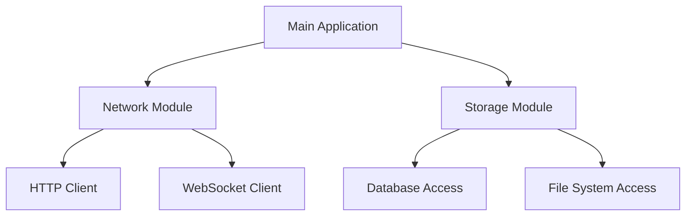

## 25.14. Avoiding Monolithic Crate Structures

In the world of Rust programming, organizing your code effectively is crucial for maintainability, scalability, and collaboration. One common pitfall developers encounter is the monolithic crate structure. This section will explore what a monolithic crate structure is, why it can be problematic, and how to avoid it by embracing modularization and leveraging Cargo workspaces.

### Understanding Monolithic Crate Structures

A **monolithic crate structure** refers to a single, large Rust crate that contains all the code for a project. This approach might seem convenient initially, especially for small projects, but it can lead to several issues as the project grows:

- **Complexity**: As the codebase expands, it becomes increasingly difficult to navigate and understand.
- **Build Times**: Large crates can lead to longer build times, slowing down development.
- **Limited Reusability**: Code tightly coupled within a monolithic structure is harder to reuse in other projects.
- **Collaboration Challenges**: Multiple developers working on the same crate can lead to merge conflicts and coordination issues.
- **Testing Difficulties**: Isolating and testing individual components becomes challenging.

### Benefits of Modularization

Modularization involves breaking down a large codebase into smaller, more manageable pieces. In Rust, this can be achieved by splitting code into multiple crates or modules. Here are some benefits of this approach:

- **Improved Maintainability**: Smaller, focused modules are easier to understand and maintain.
- **Faster Build Times**: Changes in one module don't require recompiling the entire codebase.
- **Enhanced Reusability**: Modules can be reused across different projects, promoting code reuse.
- **Better Collaboration**: Teams can work on different modules simultaneously without stepping on each other's toes.
- **Simplified Testing**: Testing individual modules is more straightforward, leading to better test coverage.

### Organizing Code for Modularity

To achieve modularity, consider the following strategies:

#### 1. Use Modules and Submodules

Rust's module system allows you to organize code hierarchically. Here's a simple example:

```rust
// src/lib.rs
pub mod network;
pub mod storage;

// src/network/mod.rs
pub fn connect() {
    println!("Connecting to network...");
}

// src/storage/mod.rs
pub fn save() {
    println!("Saving data...");
}
```

In this example, the `network` and `storage` modules are separate, making it easier to manage and extend each component independently.

#### 2. Split Code into Multiple Crates

For larger projects, consider splitting the code into multiple crates. This approach is particularly useful when different parts of the project can function independently. Here's how you can set up a multi-crate project using Cargo workspaces:

```toml
# Cargo.toml at the root of the workspace
[workspace]
members = [
    "network",
    "storage",
]

// network/Cargo.toml
[package]
name = "network"
version = "0.1.0"
edition = "2021"

// storage/Cargo.toml
[package]
name = "storage"
version = "0.1.0"
edition = "2021"
```

Each crate can have its own dependencies and build settings, allowing for greater flexibility and modularity.

#### 3. Leverage Cargo Workspaces

Cargo workspaces are a powerful feature for managing multi-crate projects. They allow you to group related crates together, sharing dependencies and build settings. This setup reduces duplication and simplifies dependency management.

```toml
# Cargo.toml at the root of the workspace
[workspace]
members = [
    "network",
    "storage",
]
```

With this configuration, you can build all crates in the workspace with a single command:

```bash
cargo build
```

### Planning Project Architecture

Thoughtful planning of your project's architecture is essential for avoiding monolithic structures. Here are some tips:

- **Define Clear Boundaries**: Identify distinct components or features in your project and encapsulate them in separate modules or crates.
- **Adopt a Layered Architecture**: Consider using a layered architecture where each layer has a specific responsibility, such as presentation, business logic, and data access.
- **Use Interfaces and Traits**: Define clear interfaces using Rust's trait system to decouple components and promote flexibility.
- **Regularly Refactor**: As your project evolves, regularly refactor the code to maintain modularity and address any emerging monolithic tendencies.

### Visualizing Modular Project Structure

To better understand how a modular project structure can be organized, let's visualize it using a diagram:



**Diagram Description**: This diagram illustrates a modular project structure where the main application depends on separate network and storage modules. Each module further contains specific components, such as an HTTP client and database access.

### Rust Unique Features

Rust's unique features, such as its powerful type system and ownership model, naturally encourage modularity. The language's emphasis on safety and concurrency makes it well-suited for building modular, maintainable systems.

### Differences and Similarities with Other Languages

While modularization is a common practice in many programming languages, Rust's approach is distinct due to its ownership model and strict compile-time checks. These features provide additional safety guarantees, reducing the likelihood of runtime errors.

### Try It Yourself

To solidify your understanding, try the following exercise:

1. Create a new Rust project with Cargo.
2. Split the project into multiple modules or crates, each responsible for a specific feature.
3. Use Cargo workspaces to manage the project.
4. Experiment with adding dependencies to individual crates and observe how Cargo handles them.

### Knowledge Check

- What are the drawbacks of a monolithic crate structure?
- How can modularization improve code maintainability?
- What are Cargo workspaces, and how do they aid in managing multi-crate projects?

### Embrace the Journey

Remember, modularization is a journey, not a destination. As your project grows, continue to evaluate and refine its structure. Embrace the flexibility and power of Rust's module system and Cargo workspaces to build robust, maintainable software.

## Quiz Time!



### What is a monolithic crate structure?

- [x] A single, large Rust crate containing all the code for a project
- [ ] A project with multiple small crates
- [ ] A crate that uses Cargo workspaces
- [ ] A crate with no dependencies

> **Explanation:** A monolithic crate structure refers to a single, large Rust crate that contains all the code for a project, which can lead to complexity and maintainability issues.

### What is one benefit of splitting code into multiple crates?

- [x] Improved maintainability
- [ ] Increased build times
- [ ] More complex dependency management
- [ ] Harder to test individual components

> **Explanation:** Splitting code into multiple crates improves maintainability by making the codebase easier to understand and manage.

### How do Cargo workspaces help in managing multi-crate projects?

- [x] They allow grouping related crates together, sharing dependencies and build settings
- [ ] They increase build times
- [ ] They make dependency management more complex
- [ ] They require each crate to have its own Cargo.toml file

> **Explanation:** Cargo workspaces allow you to group related crates together, sharing dependencies and build settings, which simplifies project management.

### Which of the following is a strategy for achieving modularity in Rust?

- [x] Use modules and submodules
- [ ] Use a single, large crate
- [ ] Avoid using Cargo workspaces
- [ ] Keep all code in the main.rs file

> **Explanation:** Using modules and submodules is a strategy for achieving modularity in Rust, allowing for better code organization.

### What is a benefit of using Rust's trait system in modular projects?

- [x] It helps define clear interfaces and decouple components
- [ ] It increases code complexity
- [ ] It makes testing more difficult
- [ ] It requires more boilerplate code

> **Explanation:** Rust's trait system helps define clear interfaces and decouple components, promoting flexibility and modularity.

### What is one drawback of a monolithic crate structure?

- [x] Longer build times
- [ ] Easier code navigation
- [ ] Simplified testing
- [ ] Better collaboration

> **Explanation:** One drawback of a monolithic crate structure is longer build times, as changes in one part of the codebase can require recompiling the entire crate.

### How can modularization enhance collaboration in a project?

- [x] By allowing teams to work on different modules simultaneously
- [ ] By requiring all developers to work on the same module
- [ ] By increasing merge conflicts
- [ ] By making code harder to understand

> **Explanation:** Modularization enhances collaboration by allowing teams to work on different modules simultaneously, reducing the likelihood of merge conflicts.

### What is a key feature of Rust that encourages modularity?

- [x] Its powerful type system and ownership model
- [ ] Its lack of a module system
- [ ] Its requirement for monolithic crate structures
- [ ] Its limited support for concurrency

> **Explanation:** Rust's powerful type system and ownership model naturally encourage modularity, promoting safety and maintainability.

### What is the purpose of a layered architecture?

- [x] To assign specific responsibilities to different layers, such as presentation, business logic, and data access
- [ ] To combine all code into a single layer
- [ ] To increase code complexity
- [ ] To make testing more difficult

> **Explanation:** A layered architecture assigns specific responsibilities to different layers, such as presentation, business logic, and data access, promoting modularity and separation of concerns.

### True or False: Modularization can lead to faster build times.

- [x] True
- [ ] False

> **Explanation:** Modularization can lead to faster build times because changes in one module don't require recompiling the entire codebase.



By following these guidelines and embracing modularization, you'll be well on your way to building robust, maintainable Rust projects. Keep experimenting, stay curious, and enjoy the journey!
