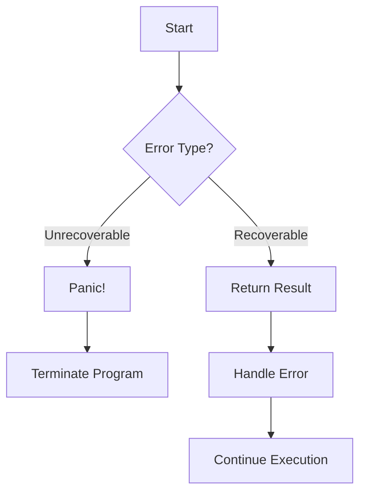

## 25.15. Panic vs. Result: When to Use Each

In Rust, error handling is a crucial aspect of writing robust and reliable software. Rust provides two primary mechanisms for dealing with errors: `panic!` and the `Result` type. Understanding when to use each is essential for developing applications that are both safe and efficient. In this section, we will explore the differences between `panic!` and `Result`, discuss scenarios where each is appropriate, and provide guidelines for their use.

### Understanding `panic!` and `Result`

Before diving into when to use each mechanism, let's clarify what `panic!` and `Result` are and how they function in Rust.

#### `panic!`

`panic!` is a macro in Rust that causes the current thread to terminate and unwind the stack. It is used to indicate that a program has encountered an unrecoverable error. When a `panic!` occurs, Rust will print an error message and terminate the program, unless the panic is caught and handled.

**Example of `panic!`:**

```rust
fn divide(dividend: i32, divisor: i32) -> i32 {
    if divisor == 0 {
        panic!("Division by zero is not allowed!");
    }
    dividend / divisor
}

fn main() {
    let result = divide(10, 0); // This will cause a panic
    println!("Result: {}", result);
}
```

In this example, attempting to divide by zero triggers a `panic!`, terminating the program with an error message.

#### `Result`

`Result` is an enum in Rust that represents either a success (`Ok`) or an error (`Err`). It is used for functions that can fail and allows the caller to handle errors gracefully.

**Example of `Result`:**

```rust
fn divide(dividend: i32, divisor: i32) -> Result<i32, String> {
    if divisor == 0 {
        return Err(String::from("Division by zero is not allowed!"));
    }
    Ok(dividend / divisor)
}

fn main() {
    match divide(10, 0) {
        Ok(result) => println!("Result: {}", result),
        Err(e) => println!("Error: {}", e),
    }
}
```

Here, the `divide` function returns a `Result`, allowing the caller to handle the error instead of panicking.

### When to Use `panic!`

`panic!` should be used sparingly and only in situations where the program cannot continue safely. These are typically cases of unrecoverable errors, such as:

- **Invariant Violations**: When an internal invariant is broken, and the program cannot proceed without risking corruption or undefined behavior.
- **Development and Debugging**: During development, `panic!` can be useful for catching bugs and unexpected states.
- **Critical Failures**: When a failure is so severe that continuing execution would lead to more significant issues.

**Guidelines for Using `panic!`:**

- Use `panic!` for errors that are truly unrecoverable and indicate a bug in the program.
- Avoid using `panic!` for errors that can be anticipated and handled gracefully.
- Consider the impact of a `panic!` on the user experience and system stability.

### When to Use `Result`

`Result` should be used for errors that can be anticipated and handled by the caller. This approach promotes robust error handling and allows the program to recover from failures gracefully.

**Scenarios for Using `Result`:**

- **I/O Operations**: File operations, network requests, and other I/O tasks that can fail due to external factors.
- **User Input**: Parsing and validating user input, where errors are expected and should be handled.
- **Business Logic**: Operations that depend on external conditions or data that might not be met.

**Guidelines for Using `Result`:**

- Use `Result` for recoverable errors where the caller can take corrective action.
- Provide meaningful error messages to help the caller understand and handle the error.
- Use combinators like `map`, `and_then`, and `unwrap_or` to work with `Result` in a concise and expressive manner.

### Code Examples and Best Practices

Let's explore some examples to illustrate the proper usage of `panic!` and `Result`.

#### Example: File Reading

**Using `Result`:**

```rust
use std::fs::File;
use std::io::{self, Read};

fn read_file(filename: &str) -> Result<String, io::Error> {
    let mut file = File::open(filename)?;
    let mut contents = String::new();
    file.read_to_string(&mut contents)?;
    Ok(contents)
}

fn main() {
    match read_file("example.txt") {
        Ok(contents) => println!("File contents: {}", contents),
        Err(e) => println!("Failed to read file: {}", e),
    }
}
```

In this example, the `read_file` function returns a `Result`, allowing the caller to handle file reading errors gracefully.

#### Example: Configuration Parsing

**Using `panic!`:**

```rust
fn parse_config(config: &str) -> i32 {
    match config.parse::<i32>() {
        Ok(value) => value,
        Err(_) => panic!("Invalid configuration value!"),
    }
}

fn main() {
    let config = "not_a_number";
    let value = parse_config(config); // This will cause a panic
    println!("Config value: {}", value);
}
```

Here, `panic!` is used because an invalid configuration value is considered a critical error that should not occur in a well-formed program.

### Visualizing Error Handling in Rust

To better understand the flow of error handling in Rust, let's visualize the decision-making process when choosing between `panic!` and `Result`.



**Diagram Explanation:**

- **Unrecoverable Errors**: Lead to a `panic!`, terminating the program.
- **Recoverable Errors**: Use `Result`, allowing the caller to handle the error and continue execution.

### Consistent Error Handling Strategies

Consistency in error handling is crucial for maintaining code quality and reliability. Here are some best practices to consider:

- **Document Error Handling**: Clearly document the error handling strategy for your project, including when to use `panic!` and `Result`.
- **Use Custom Error Types**: Define custom error types to provide more context and improve error handling.
- **Leverage Rust's Type System**: Use Rust's type system to enforce error handling, ensuring that errors are not ignored.
- **Test Error Scenarios**: Write tests to cover error scenarios and ensure that errors are handled as expected.

### Try It Yourself

To deepen your understanding, try modifying the code examples provided:

- Change the `divide` function to return a `Result` instead of using `panic!`.
- Implement a custom error type for the file reading example to provide more detailed error messages.
- Experiment with different error handling strategies and observe their impact on program behavior.

### Conclusion

In Rust, choosing between `panic!` and `Result` is a critical decision that impacts the robustness and reliability of your software. By understanding the differences and following best practices, you can develop applications that handle errors gracefully and maintain high standards of quality.

Remember, this is just the beginning. As you progress, you'll build more complex and interactive applications. Keep experimenting, stay curious, and enjoy the journey!

## Quiz Time!



### What is the primary purpose of `panic!` in Rust?

- [x] To indicate an unrecoverable error and terminate the program
- [ ] To handle recoverable errors gracefully
- [ ] To log errors without terminating the program
- [ ] To suppress error messages

> **Explanation:** `panic!` is used to indicate an unrecoverable error, causing the program to terminate.

### When should you use `Result` in Rust?

- [x] For recoverable errors where the caller can handle the error
- [ ] For unrecoverable errors that require program termination
- [ ] For logging purposes only
- [ ] For suppressing error messages

> **Explanation:** `Result` is used for recoverable errors, allowing the caller to handle them.

### What does the `unwrap` method do on a `Result`?

- [x] Returns the value if `Ok`, panics if `Err`
- [ ] Always returns the value without checking
- [ ] Suppresses the error message
- [ ] Converts `Err` to `Ok`

> **Explanation:** `unwrap` returns the value if `Ok`, but panics if the `Result` is `Err`.

### Which of the following is a scenario where `panic!` is appropriate?

- [x] When an internal invariant is broken
- [ ] When reading a file that might not exist
- [ ] When parsing user input
- [ ] When handling network requests

> **Explanation:** `panic!` is appropriate for internal invariant violations, which are considered unrecoverable errors.

### How can you handle a `Result` in Rust?

- [x] Using match statements
- [x] Using combinators like `map` and `and_then`
- [ ] Ignoring it
- [ ] Using `panic!`

> **Explanation:** `Result` can be handled using match statements or combinators like `map` and `and_then`.

### What is a key advantage of using `Result` over `panic!`?

- [x] Allows the caller to handle errors gracefully
- [ ] Terminates the program immediately
- [ ] Suppresses error messages
- [ ] Ignores errors

> **Explanation:** `Result` allows the caller to handle errors gracefully, unlike `panic!` which terminates the program.

### What is the effect of using `panic!` in a Rust program?

- [x] Terminates the current thread and unwinds the stack
- [ ] Suppresses error messages
- [ ] Converts errors to warnings
- [ ] Continues execution without interruption

> **Explanation:** `panic!` terminates the current thread and unwinds the stack.

### Which method can be used to provide a default value for a `Result`?

- [x] `unwrap_or`
- [ ] `unwrap`
- [ ] `expect`
- [ ] `panic!`

> **Explanation:** `unwrap_or` provides a default value if the `Result` is `Err`.

### What is the purpose of custom error types in Rust?

- [x] To provide more context and improve error handling
- [ ] To suppress error messages
- [ ] To terminate the program
- [ ] To ignore errors

> **Explanation:** Custom error types provide more context and improve error handling.

### True or False: `panic!` should be used for all errors in Rust.

- [ ] True
- [x] False

> **Explanation:** `panic!` should only be used for unrecoverable errors, not all errors.


